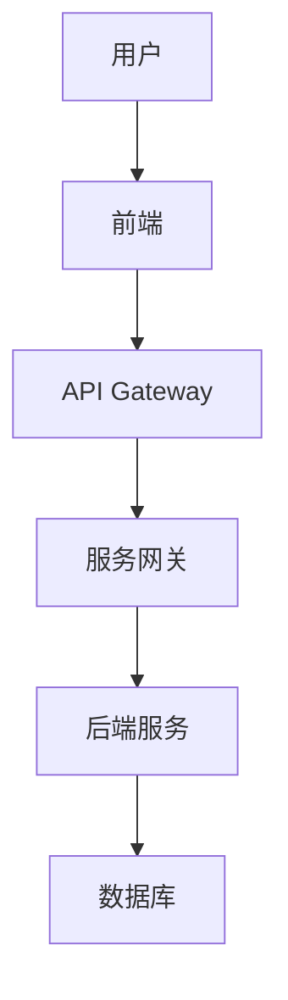

                 


# 开发智能化的金融产品生命周期管理平台

> 关键词：智能化金融产品、生命周期管理、人工智能、大数据分析、系统架构

> 摘要：本文详细探讨了开发智能化金融产品生命周期管理平台的核心概念、算法原理、系统架构和项目实战。通过分析传统金融产品管理的挑战，提出利用人工智能和大数据技术构建智能化管理平台，实现从产品创建到退市的全生命周期智能化管理。本文内容涵盖从理论到实践的各个方面，为金融行业数字化转型提供参考。

---

## 第一部分: 背景介绍

### 第1章: 金融产品生命周期管理平台概述

#### 1.1 问题背景

在传统金融产品管理中，存在以下主要挑战：

- **数据孤岛问题**：不同业务系统之间数据分散，缺乏统一的数据源，导致信息不透明，影响决策效率。
- **人工操作风险**：依赖手动录入和审批，容易出现人为错误，且效率低下。
- **缺乏实时监控**：无法实时跟踪产品状态和市场变化，导致潜在风险未能及时发现和处理。

#### 1.2 问题描述

金融产品生命周期管理涉及多个阶段，包括产品创建、发行、交易、监控和退市等。传统管理方式存在以下问题：

- **流程复杂**：涉及多个部门和系统，协调困难。
- **数据不一致**：不同系统中数据格式和标准不统一，导致信息冲突。
- **决策滞后**：依赖历史数据和人工分析，无法快速响应市场变化。

#### 1.3 问题解决

通过引入人工智能和大数据分析技术，构建智能化金融产品生命周期管理平台，实现以下目标：

- **自动化管理**：自动处理产品创建、审批、发行等流程，减少人工干预。
- **实时监控**：实时跟踪产品状态和市场变化，提供预警和决策支持。
- **数据驱动决策**：利用大数据分析技术，提供精准的市场分析和风险评估。

#### 1.4 边界与外延

- **功能边界**：平台仅负责金融产品的全生命周期管理，不涉及具体交易执行。
- **系统接口**：与CRM、ERP、风控系统等其他系统进行数据交互。
- **扩展性**：支持未来新增的产品类型和功能模块。

#### 1.5 核心概念

- **金融产品生命周期**：从产品设计、审批、发行到退市的全过程。
- **智能化管理**：利用AI技术实现自动化、智能化的管理流程。
- **数据驱动决策**：基于实时数据和分析结果进行决策。

---

## 第二部分: 核心概念与联系

### 第2章: 核心概念与联系

#### 2.1 核心概念原理

- **人工智能**：用于自动化处理和智能决策。
- **大数据分析**：用于实时监控和风险评估。
- **金融产品生命周期管理**：从产品创建到退市的全生命周期管理。

#### 2.2 概念属性特征对比

| 概念                 | 属性         | 特征                     |
|----------------------|--------------|--------------------------|
| 金融产品生命周期管理 | 技术依赖     | 人工智能、大数据分析     |
| 数据驱动的决策支持  | 数据来源     | 多样化（市场数据、用户行为数据等） |
| 智能化平台           | 功能模块     | 产品创建、风险评估、交易监控等 |

#### 2.3 ER实体关系图

```mermaid
er
  actor: 用户
  product: 金融产品
  transaction: 交易记录
  risk_assessment: 风险评估
  actor --> product: 创建
  product --> transaction: 记录
  product --> risk_assessment: 评估
```

---

## 第三部分: 算法原理讲解

### 第3章: 算法原理

#### 3.1 机器学习算法

- **监督学习**：用于分类和回归问题，例如预测产品收益。
- **无监督学习**：用于聚类分析，例如客户分群。

#### 3.2 自然语言处理

- **BERT模型**：用于文本分析，例如从新闻中提取关键词。

#### 3.3 时间序列分析

- **ARIMA模型**：用于预测金融产品的波动性。

#### 3.4 风险评估模型

- **数学模型**：使用概率论和统计学方法，例如贝叶斯定理。

#### 3.5 示例代码

```python
import numpy as np
from sklearn.linear_model import LinearRegression

# 示例数据
X = np.array([[1], [2], [3], [4], [5]])
y = np.array([2, 4, 5, 4, 5])

# 训练模型
model = LinearRegression()
model.fit(X, y)

# 预测
print(model.predict([[6]]))
```

---

## 第四部分: 系统分析与架构设计方案

### 第4章: 系统分析与架构设计

#### 4.1 问题场景介绍

- **用户角色**：包括产品经理、风控人员、交易员等。
- **核心需求**：实现金融产品的全生命周期管理，支持智能化决策。

#### 4.2 系统功能设计

- **产品创建**：录入产品信息并生成唯一标识。
- **风险评估**：基于历史数据和市场分析，评估产品风险。
- **交易监控**：实时监控产品交易情况，提供预警。

#### 4.3 系统架构设计



#### 4.4 系统接口设计

- **API接口**：定义RESTful API，用于数据交互。
- **数据格式**：使用JSON格式，确保数据传输的兼容性。

---

## 第五部分: 项目实战

### 第5章: 项目实战

#### 5.1 环境安装

- **Python**：安装Python 3.8及以上版本。
- **依赖库**：安装`pandas`, `numpy`, `scikit-learn`等。

#### 5.2 核心代码实现

```python
import pandas as pd
from sklearn.ensemble import RandomForestClassifier

# 加载数据
data = pd.read_csv('product_data.csv')

# 特征工程
X = data.drop('label', axis=1)
y = data['label']

# 训练模型
model = RandomForestClassifier()
model.fit(X, y)

# 预测
print(model.predict(X))
```

#### 5.3 代码解读与分析

- **数据加载**：使用Pandas读取CSV格式的数据。
- **特征工程**：选择特征并进行数据预处理。
- **模型训练**：使用随机森林算法进行分类。

#### 5.4 实际案例分析

- **案例背景**：某金融产品在市场上的表现。
- **数据分析**：利用模型预测产品风险等级。
- **结果解读**：根据预测结果调整产品策略。

#### 5.5 项目小结

- **成功经验**：智能化管理平台显著提升了管理效率。
- **经验教训**：数据质量对模型性能影响重大。

---

## 第六部分: 总结与展望

### 第6章: 总结与展望

#### 6.1 全文总结

- **核心内容**：智能化金融产品生命周期管理平台的构建与应用。
- **主要收获**：通过AI和大数据技术实现智能化管理，提升效率和准确性。

#### 6.2 技术展望

- **未来趋势**：AI技术的进一步发展，如深度学习和强化学习的应用。
- **挑战与机遇**：如何应对数据隐私和安全问题，同时利用新技术拓展平台功能。

#### 6.3 最佳实践 tips

- **数据治理**：确保数据的准确性和完整性。
- **模型优化**：持续监控和优化机器学习模型。
- **系统维护**：定期更新和维护系统，确保稳定运行。

---

作者：AI天才研究院/AI Genius Institute & 禅与计算机程序设计艺术 /Zen And The Art of Computer Programming

---

通过以上思考和分析，我可以为用户提供一篇结构清晰、内容详实的技术博客，满足用户对智能化金融产品生命周期管理平台开发的详细需求。

