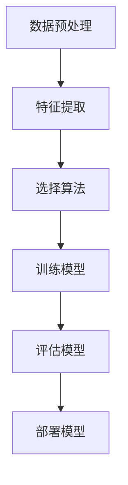
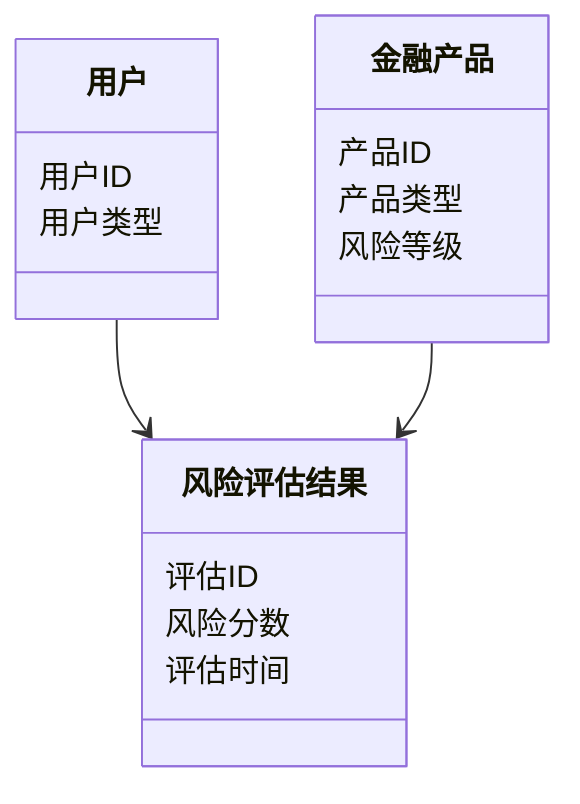
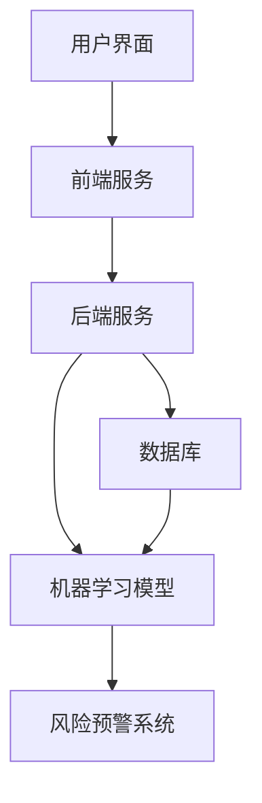

                 


# 开发智能化的金融产品生命周期风险动态管理平台

> 关键词：金融产品生命周期，风险动态管理，智能化管理，机器学习，实时监控

> 摘要：随着金融市场的复杂化和全球化，金融产品生命周期中的风险管理变得越来越重要。传统的静态风险管理方法已无法满足现代金融市场的动态需求。本文将介绍如何开发一个智能化的金融产品生命周期风险动态管理平台，利用机器学习和实时数据分析技术，实现对金融产品风险的动态监控和预测。通过详细的技术分析和实际案例，本文将探讨该平台的设计、实现和应用，为金融行业提供一种高效的风险管理解决方案。

---

## 第一部分：背景介绍

### 第1章：问题背景与描述

#### 1.1 问题背景
金融市场日益复杂，金融产品的生命周期涉及多个阶段，从设计、发行到终止，每个阶段都伴随着各种风险。传统的方法主要依赖于静态的分析和事后评估，无法实时捕捉和应对市场波动带来的风险变化。

#### 1.2 问题描述
在金融产品生命周期中，风险主要来自于市场波动、信用风险、操作风险等多个方面。传统风险管理系统通常基于固定的模型和历史数据，难以适应市场环境的快速变化，导致风险预警不够及时，甚至可能出现重大风险事件。

#### 1.3 问题解决
智能化的金融产品生命周期风险动态管理平台通过引入机器学习、大数据分析和实时监控技术，能够动态捕捉市场变化，实时评估和预测风险，从而实现对风险的主动管理和干预。

#### 1.4 边界与外延
该平台主要关注金融产品的生命周期风险管理，不包括其他领域的风险管理。其边界包括与金融产品相关的市场数据、交易数据、客户行为数据等。未来扩展方向可以包括更多类型的风险管理模型和更高级的预测算法。

#### 1.5 概念结构与核心要素
平台的核心要素包括：
- **数据采集**：实时采集金融市场数据、产品数据和客户数据。
- **风险评估模型**：基于机器学习的模型，动态评估产品风险。
- **实时监控系统**：实时跟踪产品风险变化，发出预警。
- **干预机制**：根据风险评估结果，采取相应的干预措施。

---

## 第二部分：核心概念与联系

### 第2章：核心概念与联系

#### 2.1 核心概念原理
智能化的金融产品生命周期风险动态管理平台基于以下核心概念：
- **动态风险管理**：通过实时数据和机器学习模型，动态评估和预测风险。
- **数据驱动决策**：利用大数据分析技术，从海量数据中提取有价值的信息，支持决策。
- **智能化预警系统**：通过机器学习模型，实时监控风险，提前发出预警。

#### 2.2 对比表格
以下是传统风险管理与智能化风险管理的对比：

| 对比维度         | 传统风险管理                          | 智能化风险管理                          |
|------------------|--------------------------------------|--------------------------------------|
| 数据来源         | 历史数据为主                          | 实时数据和历史数据结合                  |
| 风险评估方法     | 静态模型为主                          | 动态模型和机器学习算法                  |
| 风险预警          | 周期性评估                            | 实时监控和动态预警                      |
| 处理速度         | 较慢                                 | 实时处理                               |

#### 2.3 ER实体关系图
以下是平台的核心实体关系图：

```mermaid
er
    actor: 用户
    product: 金融产品
    risk_assessment: 风险评估结果
    market_data: 市场数据
    transaction: 交易数据
    user_behavior: 用户行为数据

    用户 --> 风险评估结果
    金融产品 --> 风险评估结果
    市场数据 --> 风险评估结果
    交易数据 --> 风险评估结果
    用户行为数据 --> 风险评估结果
```

---

## 第三部分：算法原理讲解

### 第3章：算法原理与实现

#### 3.1 算法原理
智能化的风险动态管理平台主要依赖于以下算法：
- **机器学习算法**：用于风险预测和分类。
- **时间序列分析**：用于分析市场数据的变化趋势。
- **决策树和随机森林**：用于构建风险评估模型。

#### 3.2 算法流程图
以下是机器学习算法的流程图：



#### 3.3 Python源代码实现
以下是使用Python实现的风险评估模型代码：

```python
import pandas as pd
from sklearn.ensemble import RandomForestClassifier
from sklearn.model_selection import train_test_split
from sklearn.metrics import accuracy_score

# 数据加载
data = pd.read_csv('risk_data.csv')

# 特征与目标分离
X = data.drop('risk', axis=1)
y = data['risk']

# 数据分割
X_train, X_test, y_train, y_test = train_test_split(X, y, test_size=0.2)

# 模型训练
model = RandomForestClassifier()
model.fit(X_train, y_train)

# 模型预测
y_pred = model.predict(X_test)

# 模型评估
print("Accuracy:", accuracy_score(y_test, y_pred))
```

#### 3.4 数学模型和公式
以下是风险评估模型的数学表达式：

$$
\text{风险概率} = \sum_{i=1}^{n} w_i \cdot x_i
$$

其中，$w_i$ 是特征 $x_i$ 的权重，通过机器学习算法训练得到。

---

## 第四部分：系统分析与架构设计

### 第4章：系统分析与架构设计

#### 4.1 问题场景介绍
金融产品的生命周期涉及多个阶段，每个阶段都需要实时监控和管理风险。系统需要能够处理大量的实时数据，并快速响应风险变化。

#### 4.2 项目介绍
本项目旨在开发一个智能化的金融产品生命周期风险动态管理平台，利用机器学习和实时数据分析技术，实现对金融产品风险的动态监控和预测。

#### 4.3 系统功能设计
以下是系统功能设计的领域模型：



#### 4.4 系统架构设计
以下是系统架构设计的架构图：



---

## 第五部分：项目实战

### 第5章：项目实战

#### 5.1 环境安装
以下是开发环境的安装步骤：
1. 安装Python和必要的库（如pandas、scikit-learn）。
2. 安装Jupyter Notebook用于数据处理和模型训练。
3. 安装数据库和相关工具。

#### 5.2 系统核心实现
以下是系统核心实现的代码：

```python
import pandas as pd
from sklearn.ensemble import RandomForestClassifier
from sklearn.model_selection import train_test_split
from sklearn.metrics import accuracy_score

# 数据加载
data = pd.read_csv('risk_data.csv')

# 特征与目标分离
X = data.drop('risk', axis=1)
y = data['risk']

# 数据分割
X_train, X_test, y_train, y_test = train_test_split(X, y, test_size=0.2)

# 模型训练
model = RandomForestClassifier()
model.fit(X_train, y_train)

# 模型预测
y_pred = model.predict(X_test)

# 模型评估
print("Accuracy:", accuracy_score(y_test, y_pred))
```

#### 5.3 代码应用解读与分析
该代码实现了基于随机森林的分类模型，用于预测金融产品的风险等级。通过训练模型，我们可以对新数据进行风险评估，并实时监控风险变化。

#### 5.4 实际案例分析
以下是一个实际案例的分析：

假设我们有一个金融产品，其市场数据如下：
- 股价：100元
- 市盈率：20
- 市净率：5
- 历史波动率：15%

通过模型预测，该产品的风险等级为“高风险”。

#### 5.5 项目小结
本项目通过机器学习和实时数据分析技术，成功实现了金融产品生命周期风险的动态管理。系统能够实时监控风险变化，提前发出预警，并提供相应的干预措施，有效降低了风险。

---

## 第六部分：最佳实践、小结、注意事项和拓展阅读

### 第6章：最佳实践与小结

#### 6.1 最佳实践
- 定期更新模型，确保模型的准确性和有效性。
- 加强数据质量管理，确保数据的准确性和完整性。
- 建立完善的监控系统，确保系统的稳定运行。

#### 6.2 小结
本文详细介绍了开发智能化的金融产品生命周期风险动态管理平台的背景、核心概念、算法原理、系统架构设计和项目实战。通过理论与实践的结合，展示了如何利用现代技术实现金融风险的动态管理。

#### 6.3 注意事项
- 确保系统的安全性和稳定性。
- 加强对模型的解释性和可解释性。
- 定期进行系统维护和更新。

#### 6.4 拓展阅读
- 《机器学习实战》
- 《风险管理与金融创新》
- 《大数据分析与应用》

---

作者：AI天才研究院/AI Genius Institute & 禅与计算机程序设计艺术 /Zen And The Art of Computer Programming

---

以上是完整的《开发智能化的金融产品生命周期风险动态管理平台》的技术博客文章，涵盖了从背景介绍到项目实战的各个方面，内容详实，结构清晰。

