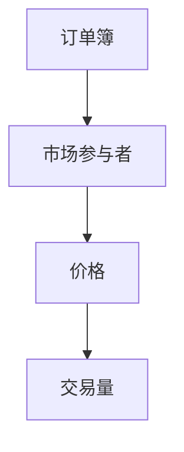
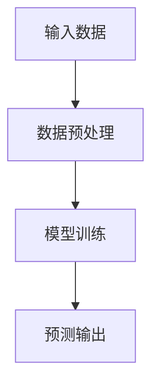
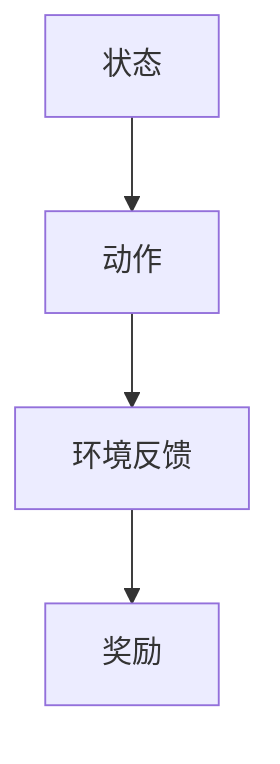
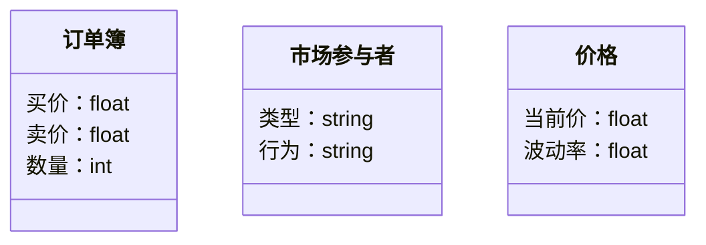
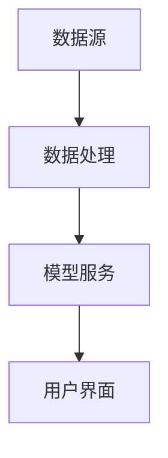
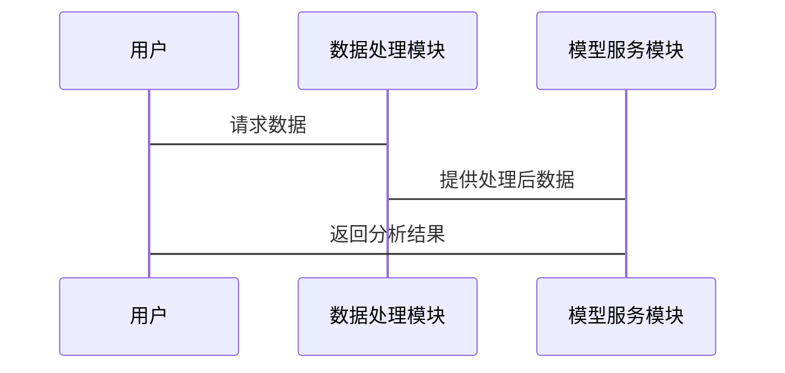

                 


# 开发智能化的金融市场微观结构分析工具

> 关键词：金融市场微观结构，人工智能，时间序列分析，强化学习，订单簿分析

> 摘要：本文详细探讨了开发智能化金融市场微观结构分析工具的背景、核心概念、算法原理、系统架构及项目实现。通过结合AI技术，分析市场参与者行为、价格形成机制等关键因素，提供高效的金融数据分析工具，帮助交易者优化策略。

---

# 第一部分: 金融市场微观结构分析工具开发背景

## 第1章: 问题背景与目标

### 1.1 问题背景
#### 1.1.1 金融市场微观结构分析的定义
金融市场微观结构研究市场参与者的交易行为及其对价格形成的影响，涉及订单簿分析、市场参与者建模等。

#### 1.1.2 微观结构分析在金融交易中的作用
帮助交易者理解市场流动性、价格波动，优化交易策略，降低交易成本。

#### 1.1.3 当前金融市场的智能化需求
随着数据量的激增，传统方法难以实时分析海量数据，AI技术成为提升分析效率的关键。

### 1.2 问题描述
#### 1.2.1 微观结构分析中的关键问题
- 订单簿解读困难
- 市场参与者行为复杂
- 价格预测不准

#### 1.2.2 智能化工具在金融分析中的必要性
AI能够快速处理复杂数据，提供实时分析支持，帮助交易者捕捉市场机会。

#### 1.2.3 工具开发的目标与边界
目标：提供高效的金融数据分析工具；边界：专注于微观结构分析，不涉及宏观因素。

### 1.3 问题解决思路
#### 1.3.1 使用AI技术优化金融分析
利用机器学习模型分析订单簿数据，预测价格波动。

#### 1.3.2 微观结构分析工具的核心功能
订单簿解读、市场参与者行为分析、价格预测。

#### 1.3.3 工具开发的技术路线
结合时间序列分析、强化学习等AI算法，构建实时分析系统。

### 1.4 本章小结
本章介绍了金融市场微观结构分析的背景，明确了工具开发的目标和思路，为后续章节打下基础。

---

# 第二部分: 金融市场微观结构分析的核心概念

## 第2章: 微观结构分析的核心概念与联系

### 2.1 核心概念原理
#### 2.1.1 订单簿模型
订单簿记录市场上的所有订单信息，包括买价、卖价、数量等。

#### 2.1.2 市场参与者角色
参与者包括做市商、投资者、高频交易者等，不同角色行为影响市场价格。

#### 2.1.3 价格形成机制
价格由买方需求和卖方供给决定，受市场参与者行为影响。

### 2.2 核心概念对比表
| 概念       | 属性         | 描述                                   |
|------------|--------------|----------------------------------------|
| 订单簿     | 数据结构     | 记录买价、卖价、数量等信息             |
| 市场参与者 | 类型         | 包括做市商、投资者等                   |
| 价格形成   | 机制         | 受供需关系影响                         |

### 2.3 实体关系图


### 2.4 本章小结
本章详细讲解了微观结构分析的核心概念，通过对比和图表帮助读者理解各概念之间的关系。

---

# 第三部分: 基于AI的微观结构分析算法原理

## 第3章: 算法原理与实现

### 3.1 时间序列分析算法
#### 3.1.1 算法流程


#### 3.1.2 Python实现
```python
import numpy as np
from sklearn.linear_model import LinearRegression

# 示例数据
X = np.array([1, 2, 3, 4]).reshape(-1, 1)
y = np.array([2, 3, 4, 5])

# 模型训练
model = LinearRegression()
model.fit(X, y)

# 预测
print(model.predict([[5]]))
```

#### 3.1.3 数学模型
时间序列分析的数学模型包括自回归（AR）模型和移动平均（MA）模型，常用的ARIMA模型结合了两者。

### 3.2 强化学习算法
#### 3.2.1 算法流程


#### 3.2.2 Python实现
```python
import gym
env = gym.make('CartPole-v0')
env.observation_space.shape
```

#### 3.2.3 数学模型
强化学习涉及状态、动作、奖励等概念，使用Q-learning算法进行策略优化。

### 3.3 算法对比分析
通过对比时间序列分析和强化学习的优缺点，选择适合特定场景的算法。

### 3.4 本章小结
本章详细讲解了时间序列分析和强化学习算法的原理及实现，为工具开发提供了算法基础。

---

# 第四部分: 系统架构与设计

## 第4章: 系统架构设计

### 4.1 问题场景介绍
系统需要实时处理金融市场数据，提供订单簿分析、价格预测等服务。

### 4.2 项目介绍
开发一个基于AI的金融分析工具，支持实时数据处理和自动化交易策略优化。

### 4.3 系统功能设计
#### 4.3.1 领域模型


#### 4.3.2 系统架构


### 4.4 系统接口设计
定义API接口，支持数据获取、模型调用等功能。

### 4.5 系统交互设计


### 4.6 本章小结
本章通过系统架构设计，展示了工具的模块化结构和交互流程。

---

# 第五部分: 项目实战与分析

## 第5章: 项目实战

### 5.1 环境配置
安装必要的库，如Python的numpy、pandas、scikit-learn等。

### 5.2 核心实现
#### 5.2.1 数据预处理
```python
import pandas as pd

data = pd.read_csv('market_data.csv')
data.head()
```

#### 5.2.2 模型训练
```python
from sklearn.

