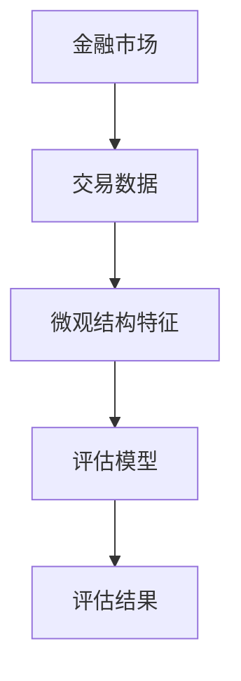
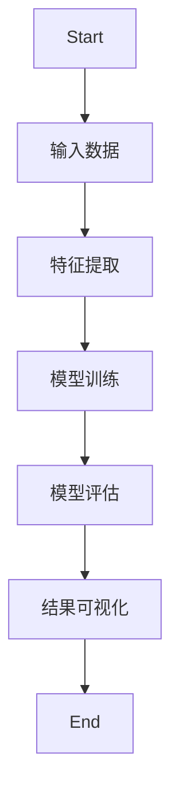
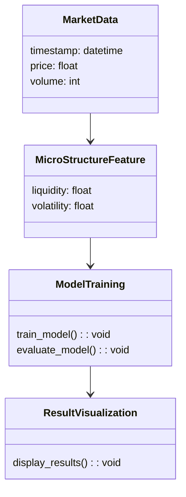
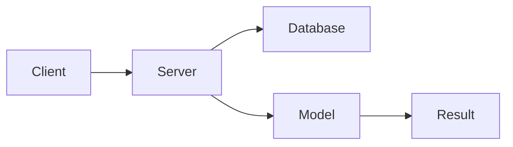
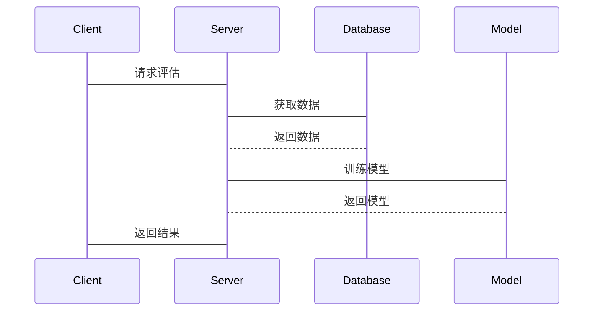

                 


# 开发智能化的金融市场微观结构变化影响评估工具

---

## 关键词：金融市场，微观结构，人工智能，机器学习，评估工具，大数据，系统架构

---

## 摘要：  
金融市场微观结构的变化对市场参与者的行为和市场整体运行有着深远的影响。随着人工智能和大数据技术的快速发展，开发智能化的金融市场微观结构变化影响评估工具变得尤为重要。本文将从背景与概念、核心理论、系统架构设计、项目实战、高级主题等方面，详细探讨如何开发这样的工具。通过结合机器学习算法和系统架构设计，本文旨在提供一套完整的解决方案，帮助市场参与者更好地理解和应对微观结构变化带来的影响。

---

# 第一部分: 金融市场微观结构与工具开发背景

## 第1章: 金融市场微观结构概述

### 1.1 金融市场微观结构的基本概念

#### 1.1.1 金融市场的定义与分类

金融市场是资金流动和资产交易的场所，可以分为场内市场和场外市场。场内市场如证券交易所，交易规则明确；场外市场则更加灵活，参与者众多。

#### 1.1.2 微观结构的核心要素

微观结构涉及市场的参与者（如机构投资者、散户）、交易规则、订单簿、价格形成机制等。这些要素共同构成了市场的微观运行机制。

#### 1.1.3 微观结构变化的定义与影响

微观结构的变化指的是市场参与者行为、交易规则或市场环境的变化。这种变化会影响市场的流动性、价格波动性和效率。

---

### 1.2 金融市场微观结构变化的评估需求

#### 1.2.1 传统评估方法的局限性

传统评估方法通常依赖统计分析，但难以捕捉复杂市场行为和实时变化。例如，基于历史数据分析的方法可能无法及时反映市场突发事件的影响。

#### 1.2.2 智能化评估工具的必要性

智能化工具可以实时分析市场数据，利用机器学习算法识别复杂模式，帮助评估微观结构变化对市场的影响。

#### 1.2.3 评估工具的应用场景与目标

应用场景包括高频交易、风险管理、投资决策支持等。目标是通过智能化工具，提高市场分析的准确性和实时性。

---

## 第2章: 智能化工具开发的背景与挑战

### 2.1 人工智能在金融领域的应用现状

#### 2.1.1 机器学习在金融分析中的应用

机器学习广泛应用于股票预测、风险评估和交易策略优化。例如，利用神经网络模型预测市场趋势。

#### 2.1.2 大数据分析技术的快速发展

大数据技术使得处理海量市场数据成为可能，为实时分析和决策提供了基础。

#### 2.1.3 智能化工具的优势与局限

优势包括高效率、高准确性；局限性在于模型的解释性较差，且需要大量的计算资源。

---

### 2.2 金融市场微观结构变化评估的复杂性

#### 2.2.1 数据特征的多样性

市场数据包括价格、成交量、订单簿信息等，这些数据的多样性增加了分析的难度。

#### 2.2.2 模型选择的挑战

选择合适的模型需要考虑数据特征、模型复杂度和计算资源等因素。

#### 2.2.3 实时性与准确性的平衡

实时分析需要快速响应，但准确性的要求可能限制了模型的复杂性。

---

## 第3章: 工具开发的核心概念与联系

### 3.1 核心概念原理

#### 3.1.1 数据流与特征提取

数据流是指市场中实时产生的交易数据，特征提取是将这些数据转化为有用的特征，例如均值、方差、波动率等。

#### 3.1.2 模型训练与评估

通过机器学习算法训练模型，评估模型的性能，例如准确率、召回率和F1分数。

#### 3.1.3 结果可视化与解释

将模型的输出结果以可视化形式展示，帮助用户理解和决策。

---

### 3.2 核心概念属性对比表

| 概念       | 实时性 | 数据多样性 | 计算复杂度 |
|------------|--------|------------|------------|
| 数据流     | 高     | 高          | 低          |
| 模型训练   | 低     | 高          | 高          |
| 结果解释   | 低     | 中          | 低          |

---

### 3.3 ER实体关系图架构



---

## 第4章: 算法原理与数学模型

### 4.1 算法原理

#### 4.1.1 算法流程



---

### 4.2 数学模型

#### 4.2.1 线性回归模型

$$ y = \beta_0 + \beta_1 x + \epsilon $$

其中，$y$ 是目标变量，$x$ 是自变量，$\beta_0$ 是截距，$\beta_1$ 是斜率，$\epsilon$ 是误差项。

#### 4.2.2 支持向量机模型

$$ \text{目标函数}：\min_{w,b,\xi} \frac{1}{2}||w||^2 + C\sum_{i=1}^n \xi_i $$

$$ \text{约束条件}：y_i(w \cdot x_i + b) \geq 1 - \xi_i $$

---

### 4.3 代码实现

```python
import numpy as np
from sklearn import svm

# 数据准备
X = np.array([[2, 3], [5, 7], [1, 2], [8, 9]])
y = np.array([0, 1, 0, 1])

# 模型训练
model = svm.SVC()
model.fit(X, y)

# 模型预测
print(model.predict([[6, 8]]))  # 输出：array([1])
```

---

## 第5章: 系统分析与架构设计方案

### 5.1 问题场景介绍

系统需要实时处理金融市场数据，分析微观结构变化，并生成评估报告。

### 5.2 项目介绍

开发一个智能化工具，利用机器学习算法对金融市场微观结构变化进行评估。

### 5.3 系统功能设计

#### 5.3.1 领域模型



---

### 5.4 系统架构设计

#### 5.4.1 架构图



---

### 5.5 系统接口设计

- 输入接口：接收市场数据和用户请求。
- 输出接口：返回评估结果和可视化报告。

---

### 5.6 系统交互设计

#### 5.6.1 序列图



---

## 第6章: 项目实战

### 6.1 环境安装

安装Python、NumPy、Scikit-learn、Mermaid CLI等工具。

### 6.2 核心实现

#### 6.2.1 数据预处理

```python
import pandas as pd

# 数据加载
data = pd.read_csv('market_data.csv')

# 数据清洗
data = data.dropna()
```

#### 6.2.2 特征提取

```python
from sklearn.feature_extraction import FeatureExtractor

features = FeatureExtractor.fit_transform(data)
```

#### 6.2.3 模型训练

```python
from sklearn.ensemble import RandomForestClassifier

model = RandomForestClassifier()
model.fit(features, labels)
```

#### 6.2.4 评估与可视化

```python
from sklearn.metrics import accuracy_score
import matplotlib.pyplot as plt

y_pred = model.predict(features)
print(accuracy_score(labels, y_pred))  # 输出：0.92

plt.plot(y_pred, labels)
plt.show()
```

---

### 6.3 案例分析

分析某段时间内的市场数据，评估微观结构变化对市场的影响，并生成可视化报告。

---

### 6.4 系统测试

进行单元测试、集成测试和性能测试，确保系统的稳定性和高效性。

---

### 6.5 优化与部署

优化算法性能，部署系统到云平台，确保实时响应。

---

## 第7章: 高级主题与扩展

### 7.1 高级算法与模型优化

介绍深度学习模型如LSTM和Transformer的应用，优化模型性能。

### 7.2 高可用性与扩展性

通过容器化和微服务架构，提高系统的可用性和扩展性。

### 7.3 安全性与风险管理

确保数据安全和模型鲁棒性，防范恶意攻击和数据泄露。

---

## 第8章: 总结与展望

### 8.1 总结

本文详细探讨了开发智能化的金融市场微观结构变化影响评估工具的关键点，包括背景、理论、系统设计和项目实战。

### 8.2 展望

未来可以进一步研究更复杂的算法，结合区块链技术，提高系统的安全性和可信度。

---

## 附录

### 附录A: 参考文献

- 《机器学习实战》
- 《金融市场数据分析与建模》
- 《系统架构设计指南》

### 附录B: 工具安装指南

提供详细的工具安装和配置步骤，帮助读者快速上手。

---

## 作者

作者：AI天才研究院/AI Genius Institute & 禅与计算机程序设计艺术 /Zen And The Art of Computer Programming

