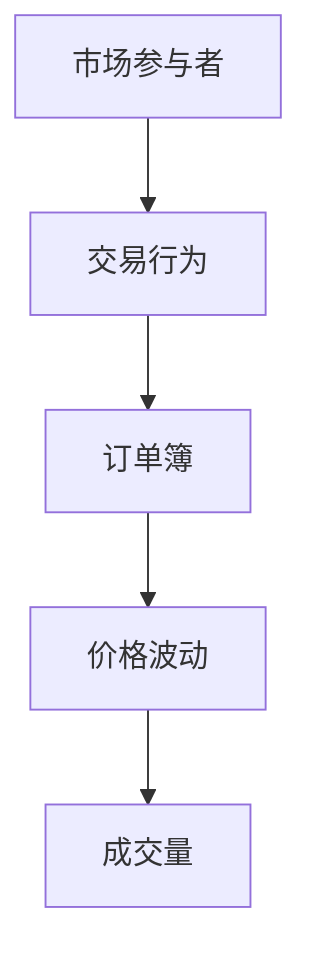
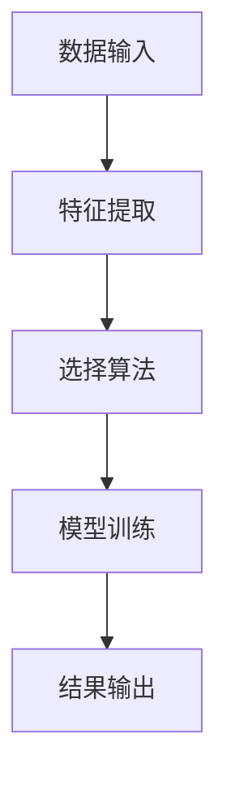
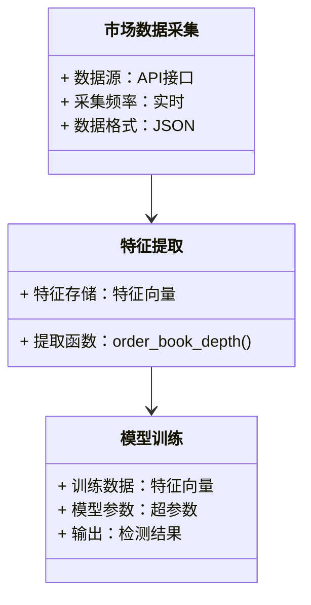
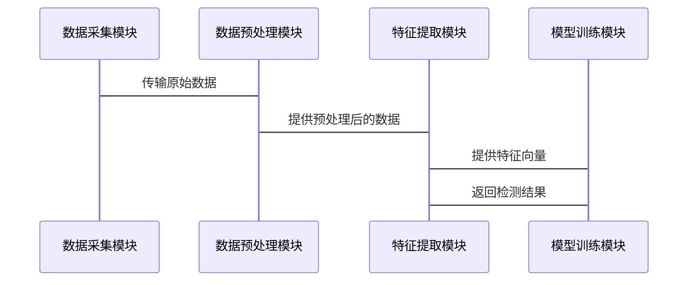

                 


# 开发智能化的金融市场微观结构变化检测工具

> 关键词：金融市场，微观结构变化，检测工具，算法实现，系统架构

> 摘要：本文详细探讨了开发智能化的金融市场微观结构变化检测工具的全过程，涵盖数据采集、特征提取、算法选择、系统架构设计以及项目实战等内容。通过结合金融知识和计算机技术，提出了一套高效的解决方案，为金融机构和监管机构提供了有力工具。

---

# 第一部分: 金融市场微观结构变化检测工具开发基础

## 第1章: 金融市场微观结构变化检测概述

### 1.1 问题背景与目标

金融市场是一个复杂且高度动态的环境，微观结构的变化直接影响市场的流动性和价格走势。传统的交易分析方法难以捕捉这些细微的变化，因此开发智能化的检测工具变得尤为重要。

#### 1.1.1 金融市场微观结构的定义

金融市场微观结构指的是市场参与者的交易行为及其对市场价格和成交量的影响。主要包括订单簿、买卖价差、交易频率等关键因素。

#### 1.1.2 微观结构变化对市场的影响

微观结构变化可能导致价格波动加剧、流动性下降或市场操纵等现象。及时检测这些变化有助于监管机构和交易者采取相应措施。

#### 1.1.3 检测工具的目标与意义

开发工具旨在实时监控市场微观结构的变化，帮助识别异常交易行为，优化交易策略。

### 1.2 问题描述与解决思路

#### 1.2.1 微观结构变化的典型场景

包括订单簿深度骤减、买卖价差异常波动、成交量突增等情况。

#### 1.2.2 问题解决的必要性

金融机构和监管机构需要实时了解市场动态，防范风险。

#### 1.2.3 解决方案的初步思路

采用机器学习算法，结合实时数据流处理技术，构建高效的检测系统。

### 1.3 现有方法与工具分析

#### 1.3.1 常用金融数据分析工具

如 Bloomberg、Reuters 等，但它们更多是数据提供工具，缺乏专门的检测功能。

#### 1.3.2 微观结构变化检测的现有算法

统计分析和机器学习方法各有利弊，统计方法简单但不够灵活，机器学习方法需要大量数据训练。

---

## 第2章: 微观结构变化检测的核心概念

### 2.1 微观结构变化的定义与特征

#### 2.1.1 微观结构变化的定义

指市场参与者行为导致的订单簿、买卖价差等微观因素的变化。

#### 2.1.2 相关特征的提取方法

包括订单簿深度、买卖价差、交易速度等特征的提取。

#### 2.1.3 特征之间的关系分析

通过对比分析，找出哪些特征对检测变化最为敏感。

### 2.2 检测方法与原理

#### 2.2.1 统计分析方法

适用于简单场景，如均值、方差分析。

#### 2.2.2 时间序列分析

用于捕捉时间相关的变化，如自相关性分析。

#### 2.2.3 机器学习方法

如支持向量机（SVM）和随机森林（Random Forest）等。

### 2.3 核心概念与联系

#### 2.3.1 核心概念的属性特征对比表

| 概念       | 属性特征           |
|------------|--------------------|
| 订单簿深度   | 数据量大，时间相关 |
| 买卖价差     | 易受市场操纵影响   |

#### 2.3.2 ER实体关系图架构



---

## 第3章: 微观结构变化检测算法原理

### 3.1 算法原理概述

结合统计分析和机器学习方法，构建多模态检测模型。

### 3.2 基于统计分析的算法

#### 3.2.1 均值与方差分析

用于检测数据分布的变化，如 $$\mu$$ 和 $$\sigma^2$$ 的变化。

### 3.3 基于机器学习的算法

#### 3.3.1 支持向量机（SVM）

适用于分类任务，通过训练数据学习特征空间的决策边界。

#### 3.3.2 随机森林（Random Forest）

通过集成学习提高模型的泛化能力。

### 3.4 算法流程图



### 3.5 算法实现代码示例

```python
import numpy as np
from sklearn.svm import SVC

# 示例数据
X = np.array([[1, 2], [3, 4], [5, 6]])
y = np.array([0, 1, 0])

# 创建SVM模型
model = SVC()

# 训练模型
model.fit(X, y)

# 预测
print(model.predict([[4, 5]]))
```

---

## 第4章: 系统架构设计

### 4.1 系统功能设计

#### 4.1.1 领域模型



### 4.2 系统架构设计


### 4.3 系统接口设计

- 数据采集模块：提供API接口，接收实时市场数据。
- 特征提取模块：输出特征向量，供模型训练使用。
- 模型训练模块：接受特征向量，输出检测结果。

### 4.4 系统交互流程



---

## 第5章: 项目实战

### 5.1 环境安装

安装必要的库，如Pandas、NumPy、Scikit-learn、TensorFlow。

### 5.2 核心代码实现

```python
import pandas as pd
from sklearn.ensemble import RandomForestClassifier

# 数据加载
data = pd.read_csv('market_data.csv')

# 特征提取
features = data[['order_book_depth', 'bid_ask_spread', 'volume']]
target = data['is_anomaly']

# 模型训练
model = RandomForestClassifier()
model.fit(features, target)

# 预测
new_data = pd.read_csv('new_market_data.csv')
new_features = new_data[['order_book_depth', 'bid_ask_spread', 'volume']]
predictions = model.predict(new_features)

print(predictions)
```

### 5.3 案例分析

以某股票为例，展示如何通过订单簿深度和买卖价差的变化，检测市场微观结构的变化。

### 5.4 结果解读

模型输出的结果指示是否存在异常交易行为，帮助交易者和监管机构采取相应措施。

---

## 第6章: 总结与展望

### 6.1 总结

本文详细探讨了开发智能化的金融市场微观结构变化检测工具的过程，涵盖了数据处理、算法选择、系统设计和项目实现等方面。

### 6.2 应用前景

该工具在金融监管、高频交易等领域有广泛的应用前景。

### 6.3 注意事项

在实际应用中，需注意数据隐私、模型可解释性等问题。

### 6.4 拓展阅读

推荐阅读相关领域的书籍和论文，深入学习金融市场分析和人工智能技术。

---

# 作者：AI天才研究院

作者简介：AI天才研究院，专注于人工智能与金融市场的交叉研究，致力于开发创新的金融分析工具和技术解决方案。

