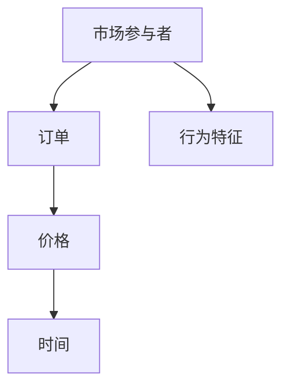
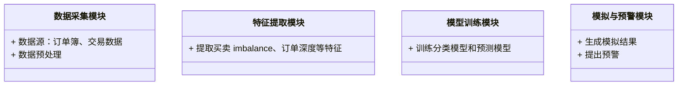
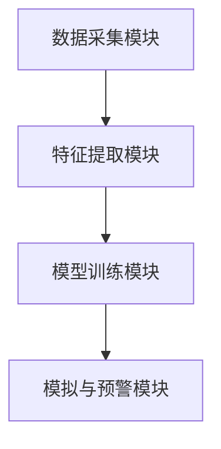

                 


# 开发智能化的金融市场微观结构变化预警与影响模拟模型

> 关键词：金融市场，微观结构，预警系统，影响模拟，人工智能，时间序列分析，深度学习

> 摘要：本文详细介绍了开发智能化的金融市场微观结构变化预警与影响模拟模型的全过程，涵盖从理论分析到实际应用的各个阶段。通过分析金融市场微观结构的核心要素，结合时间序列分析、机器学习和深度学习等算法，构建了一个能够预警市场变化并模拟其影响的智能系统。文章内容包括背景介绍、核心概念、算法原理、系统设计、项目实战和最佳实践等部分，为读者提供了全面的技术指导。

---

## 第一部分: 金融市场微观结构变化预警与影响模拟模型背景介绍

### 第1章: 金融市场微观结构概述

#### 1.1 问题背景与定义
金融市场微观结构是指市场中参与者、订单流、价格形成机制等的基本构成和相互作用方式。了解这些微观结构的变化对预测市场波动和制定交易策略至关重要。例如，订单簿的变化可以反映市场参与者的买卖意愿，而价格的短期剧烈波动可能预示着市场情绪的变化。

#### 1.2 模型的目标与意义
本模型旨在通过分析金融市场中的微观结构数据，提前预警潜在的市场波动，并模拟这些变化对市场整体或特定资产的影响。这有助于投资者和机构做出更明智的决策，降低风险。

---

### 第2章: 问题描述与边界

#### 2.1 微观结构变化的核心要素
- **市场参与者行为**：包括机构投资者、散户、高频交易者等的不同交易策略。
- **价格动态**：价格波动的频率、幅度和模式。
- **订单簿**：订单的买卖价、数量和时间分布。

#### 2.2 问题解决的边界与限制
- 数据范围：仅考虑交易数据和订单簿数据。
- 时间窗口：预警和模拟基于过去1小时的交易数据。
- 模型适用场景：适用于高频交易和短期市场波动预测。

---

## 第二部分: 核心概念与联系

### 第3章: 核心概念与联系

#### 3.1 核心概念原理
- **订单簿**：订单簿是市场微观结构的重要组成部分，记录了当前市场上所有未成交的订单。通过分析订单簿的变化，可以预测价格的短期波动。
- **价格动态**：价格的变化受多种因素影响，包括市场参与者的买卖行为、市场情绪等。

#### 3.2 核心概念属性特征对比
以下是金融市场微观结构变化的核心概念对比表：

| **概念**       | **定义**                                                                 | **特征**                                                                 |
|----------------|--------------------------------------------------------------------------|--------------------------------------------------------------------------|
| 市场参与者行为   | 市场参与者在不同时间点的交易行为，如买入或卖出订单的数量和频率。                          | 行为的频率、规模和类型。                                                 |
| 价格动态       | 价格在不同时间点的变化，包括波动幅度和趋势。                                        | 波动性、趋势性、周期性。                                                 |
| 订单簿         | 记录未成交订单的详细信息，包括价格、数量和时间。                                      | 订单的深度、买卖 imbalance、订单簿的变化速度。                          |

#### 3.3 ER实体关系图


---

## 第三部分: 算法原理与数学模型

### 第4章: 时间序列分析与预测算法

#### 4.1 时间序列分析基础
时间序列分析是一种通过分析数据随时间变化的模式，预测未来趋势的方法。常用的方法包括：
- **ARIMA模型**：通过自回归和滑动平均来建模时间序列。
- **LSTM网络**：一种基于循环神经网络的时间序列预测模型。

#### 4.2 基于机器学习的预测模型
- **支持向量回归（SVR）**：通过构建支持向量回归模型，预测价格的变化。
- **随机森林与梯度提升树**：通过特征工程提取关键特征，构建回归模型。

#### 4.3 深度学习模型
- **LSTM网络结构**：
  ```mermaid
  graph TD
  A[输入层] --> B[ LSTM层 ]
  B --> C[输出层]
  ```

---

### 第5章: 微观结构变化的分类与识别

#### 5.1 基于特征工程的分类模型
- **特征选择与提取**：从订单簿数据中提取买卖 imbalance、订单深度等特征。
- **决策树分类**：通过决策树模型对市场状态进行分类。

---

## 第四部分: 系统设计与实现

### 第6章: 系统功能设计

#### 6.1 领域模型设计


#### 6.2 系统架构设计


---

## 第五部分: 项目实战

### 第7章: 项目实战与案例分析

#### 7.1 环境配置
- **Python版本**：3.8+
- **依赖库**：Pandas、NumPy、Scikit-learn、Keras、TensorFlow

#### 7.2 核心实现代码
```python
import numpy as np
import pandas as pd
from sklearn.ensemble import RandomForestRegressor
from tensorflow.keras.layers import LSTM, Dense
from tensorflow.keras.models import Sequential

# 数据预处理
data = pd.read_csv('market_data.csv')
features = data[['bid_price', 'ask_price', 'volume']]
labels = data['price_change']

# 模型训练
model = RandomForestRegressor()
model.fit(features, labels)

# LSTM模型
model_lstm = Sequential()
model_lstm.add(LSTM(64, input_shape=(None, 3)))
model_lstm.add(Dense(1))
model_lstm.compile(loss='mean_squared_error', optimizer='adam')
model_lstm.fit(X_train, y_train, epochs=10)
```

#### 7.3 案例分析
以某股票市场数据为例，使用上述代码进行模型训练和预测，分析模型的准确性和效果。

---

## 第六部分: 最佳实践

### 第8章: 最佳实践与小结

#### 8.1 小结
本文详细介绍了开发智能化的金融市场微观结构变化预警与影响模拟模型的全过程，从理论分析到实际应用，涵盖了核心概念、算法原理、系统设计和项目实战等部分。

#### 8.2 注意事项
- 数据质量：确保数据的完整性和准确性。
- 模型选择：根据实际需求选择合适的算法。

#### 8.3 拓展阅读
建议读者进一步学习时间序列分析、深度学习和金融工程的相关知识。

---

## 作者信息

作者：AI天才研究院/AI Genius Institute  
联系邮箱：contact@aicourse.com  
GitHub链接：https://github.com/aicourse

--- 

以上就是完整的内容。

