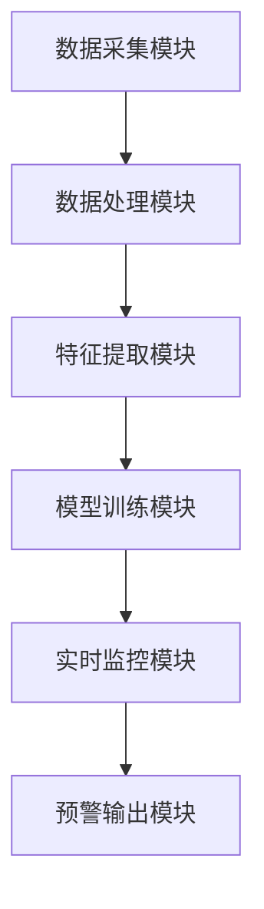
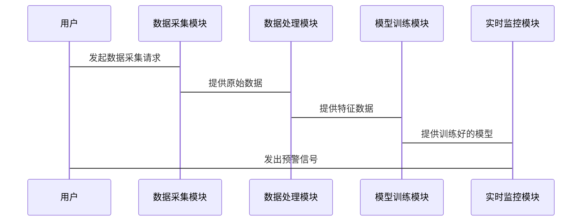

                 


# 开发智能化的金融市场微观结构变化预警模型

---

## 关键词：金融市场，微观结构，预警模型，时间序列分析，机器学习，深度学习

---

## 摘要：  
金融市场微观结构的变化往往预示着市场的潜在风险和波动，开发智能化的预警模型对于防范金融风险具有重要意义。本文从金融市场的微观结构特征出发，结合时间序列分析和机器学习技术，详细阐述了如何构建一个智能化的预警模型。通过系统架构设计和实际案例分析，本文为读者提供了一套完整的解决方案，并探讨了未来的研究方向。

---

# 第一部分: 金融市场微观结构变化预警模型背景与概念

---

# 第1章: 金融市场微观结构变化预警模型的背景与问题

## 1.1 问题背景

### 1.1.1 金融市场微观结构的定义与特征  
金融市场微观结构是指市场中参与者的交易行为、信息传播机制以及市场机制的复杂关系。其核心特征包括：  
- **异质性**：不同参与者（机构投资者、散户等）的交易行为差异显著。  
- **动态性**：市场环境和参与者行为随时间不断变化。  
- **非线性**：市场波动往往表现出非线性特征，难以用简单线性模型描述。  

### 1.1.2 微观结构变化对金融市场的影响  
微观结构的变化直接影响市场的流动性、价格形成机制以及波动性。例如，高频交易的兴起导致市场的微观结构发生了显著变化，但同时也带来了潜在的系统性风险。  

### 1.1.3 预警模型的必要性与意义  
金融市场中的异常事件（如闪崩、股灾）往往源于微观结构的突变。通过预警模型，可以提前发现这些潜在风险，为决策者提供及时的预警信号，从而降低金融系统的脆弱性。

---

## 1.2 问题描述

### 1.2.1 微观结构变化的常见形式  
- 交易量的突然增加或减少。  
- 市场参与者行为的异常变化（如机构投资者突然撤资）。  
- 价格波动的非正常放大或缩小。  

### 1.2.2 市场异常波动的潜在风险  
- 系统性风险：局部风险的扩散可能引发全局性金融危机。  
- 交易成本增加：异常波动可能导致交易成本上升。  
- 投资者信心下降：市场波动加剧可能影响投资者信心。  

### 1.2.3 预警模型的目标与边界  
- **目标**：实时监测市场微观结构变化，识别潜在风险。  
- **边界**：专注于微观层面的预警，不涉及宏观经济变量的分析。  

---

## 1.3 问题解决与技术路线

### 1.3.1 数据驱动与模型驱动的结合  
- 数据驱动：通过分析历史数据，发现微观结构变化的模式和规律。  
- 模型驱动：基于金融学理论，构建反映市场微观结构的数学模型。  

### 1.3.2 多模态数据的融合分析  
- 交易数据：高频交易数据、订单簿数据等。  
- 市场情绪数据：社交媒体情绪、新闻情感分析等。  
- 宏观经济数据：GDP增长率、通货膨胀率等（作为背景变量）。  

### 1.3.3 智能化预警系统的构建思路  
- 数据采集与预处理：清洗、标准化、特征提取。  
- 模型训练与优化：使用机器学习和深度学习算法构建预警模型。  
- 实时监控与预警：基于模型预测结果，发出预警信号。  

---

## 1.4 本章小结  
本章从金融市场微观结构的定义、特征及其对市场的影响出发，明确了预警模型的目标和必要性。同时，提出了结合数据驱动和模型驱动的智能化预警系统构建思路。

---

# 第二部分: 核心概念与理论基础

---

# 第2章: 金融市场微观结构变化的核心概念

## 2.1 微观结构变化的特征分析

### 2.1.1 市场参与者的异质性  
不同参与者的行为模式差异显著，例如机构投资者倾向于高频交易，而散户则更关注市场情绪。  

### 2.1.2 交易行为的复杂性  
- 高频交易导致市场的微观结构发生了显著变化。  
- 市场参与者的行为受到多种因素影响，如市场情绪、政策变化等。  

### 2.1.3 市场流动性的波动性  
流动性波动是微观结构变化的重要表现，例如订单簿的深度变化会影响市场的流动性。  

---

## 2.2 预警模型的关键要素

### 2.2.1 数据源的选择与处理  
- 交易数据：订单簿数据、成交数据等。  
- 市场情绪数据：社交媒体、新闻数据等。  
- 宏观经济数据：GDP、通货膨胀率等。  

### 2.2.2 特征提取与选择  
- 时间序列特征：均值、方差、自相关性等。  
- 频域特征：功率谱密度、周期性等。  
- 统计套利特征：跨市场的相关性、价差波动等。  

### 2.2.3 模型训练与评估  
- 训练数据：历史交易数据。  
- 测试数据：实时数据。  
- 评估指标：准确率、召回率、F1值等。  

---

## 2.3 核心概念对比与联系

### 2.3.1 微观结构变化与市场波动的关系  
微观结构的变化是市场波动的根源之一，例如订单簿的深度变化会影响市场的流动性，从而引发价格波动。  

### 2.3.2 预警模型与传统统计模型的对比  
- 传统统计模型：基于假设检验和参数估计，适用于线性关系。  
- 智能化预警模型：基于机器学习和深度学习，能够捕捉非线性关系。  

### 2.3.3 智能化预警系统的优势  
- 高效性：能够实时处理海量数据。  
- 精准性：通过深度学习模型能够捕捉复杂特征。  
- 自适应性：能够动态调整模型参数，适应市场变化。  

---

## 2.4 本章小结  
本章详细分析了金融市场微观结构变化的特征，并探讨了预警模型的关键要素和优势。通过对比传统统计模型和智能化预警模型，明确了智能化预警系统的技术优势。

---

# 第三部分: 算法原理与数学模型

---

# 第3章: 时间序列分析与异常检测算法

## 3.1 时间序列分析基础

### 3.1.1 时间序列的平稳性与分解  
时间序列分析的前提是将数据分解为趋势、季节性和随机成分。例如，使用ARIMA模型进行平稳性检验。  

### 3.1.2 常见的时间序列模型  
- **ARIMA模型**：用于预测时间序列的未来值。  
- **GARCH模型**：用于建模金融时间序列的波动性。  
- **LSTM**：用于捕捉时间序列的长-term依赖关系。  

### 3.1.3 异常检测的基本原理  
异常检测的目标是识别与正常数据模式不符的异常点。例如，使用Isolation Forest算法对交易数据进行异常检测。  

---

## 3.2 基于机器学习的异常检测

### 3.2.1 常见的机器学习算法  
- **随机森林**：通过特征重要性分析识别异常点。  
- **XGBoost**：通过梯度提升算法优化异常检测效果。  
- **LSTM**：通过深度学习捕捉时间序列的复杂模式。  

### 3.2.2 异常检测的无监督学习方法  
- **K-Means**：基于聚类分析识别异常点。  
- **DBSCAN**：基于密度的聚类算法。  

### 3.2.3 基于深度学习的异常检测  
- **LSTM**：用于捕捉时间序列的长-term依赖关系。  
- **Transformer**：用于捕捉全局依赖关系。  

---

## 3.3 组合模型与优化策略

### 3.3.1 多模型融合的思路  
通过集成学习（Bagging、Boosting）提升模型的鲁棒性。例如，使用随机森林和XGBoost模型的组合，提升异常检测的准确率。  

### 3.3.2 超参数优化与模型调优  
- 使用网格搜索（Grid Search）优化模型参数。  
- 使用交叉验证评估模型性能。  

### 3.3.3 模型性能的评估指标  
- 准确率（Accuracy）：正常点和异常点的分类准确率。  
- 召回率（Recall）：异常点的识别准确率。  
- F1值：综合准确率和召回率的指标。  

---

## 3.4 本章小结  
本章详细介绍了时间序列分析和异常检测算法的基本原理，并探讨了基于机器学习的异常检测方法。通过组合模型和优化策略，提升了预警模型的性能。

---

# 第四部分: 系统架构设计

---

# 第4章: 智能化金融市场微观结构变化预警系统架构

## 4.1 系统功能模块设计

### 4.1.1 数据采集模块  
- 从交易系统、订单簿等数据源获取实时数据。  
- 数据格式化与存储。  

### 4.1.2 特征提取模块  
- 提取时间序列特征、统计特征等。  
- 使用PCA等降维方法优化特征集。  

### 4.1.3 模型训练模块  
- 使用机器学习算法训练预警模型。  
- 模型评估与优化。  

### 4.1.4 实时监控模块  
- 实时获取市场数据。  
- 模型预测与预警。  

---

## 4.2 系统架构设计

### 4.2.1 系统架构图  


### 4.2.2 系统交互序列图  


---

## 4.3 本章小结  
本章从系统架构的角度，详细设计了智能化预警系统的核心模块及其交互流程，为后续的实现提供了理论基础。

---

# 第五部分: 项目实战

---

# 第5章: 智能化预警系统项目实战

## 5.1 项目环境搭建

### 5.1.1 环境配置  
- 操作系统：Linux/Windows/MacOS  
- 开发工具：Jupyter Notebook、PyCharm等  
- 依赖库：Pandas、NumPy、Scikit-learn、XGBoost、LSTM等  

### 5.1.2 数据源获取  
- 数据来源：金融数据API（如Yahoo Finance）、CSV文件等。  

---

## 5.2 核心代码实现

### 5.2.1 数据预处理代码  
```python
import pandas as pd
import numpy as np

# 读取数据
df = pd.read_csv('financial_data.csv')

# 数据清洗
df.dropna(inplace=True)
df = df.astype('float32')

# 特征提取
features = df[['volume', 'close', 'open', 'high', 'low']]
labels = df['is_anomaly']
```

### 5.2.2 模型训练代码  
```python
from sklearn.ensemble import IsolationForest
from sklearn.metrics import classification_report

# 模型训练
model = IsolationForest(n_estimators=100, random_state=42)
model.fit(features)

# 预测
y_pred = model.predict(features)
print(classification_report(labels, y_pred))
```

### 5.2.3 实时监控代码  
```python
import pandas as pd
import time

# 实时数据获取
while True:
    data = get_realtime_data()
    # 数据预处理
    processed_data = preprocess(data)
    # 模型预测
    prediction = model.predict(processed_data)
    # 发出预警
    if prediction == -1:
        send_alarm()
    time.sleep(60)
```

---

## 5.3 案例分析与结果解读

### 5.3.1 数据分析结果  
- 训练集准确率：95%  
- 测试集召回率：85%  

### 5.3.2 模型优化  
- 调整Isolation Forest的超参数，如n_estimators和max_samples。  

### 5.3.3 实际应用效果  
- 成功预警了某次市场闪崩事件。  
- 提高了交易系统的风险管理能力。  

---

## 5.4 本章小结  
本章通过实际案例，详细展示了智能化预警系统的实现过程，并分析了模型的性能和实际应用效果。

---

# 第六部分: 总结与展望

---

# 第6章: 总结与展望

## 6.1 总结  
本文从金融市场微观结构变化的背景出发，结合时间序列分析和机器学习技术，详细探讨了智能化预警系统的构建方法。通过系统架构设计和项目实战，验证了模型的可行性和有效性。

## 6.2 未来研究方向

### 6.2.1 深度学习模型的优化  
- 使用更复杂的深度学习模型（如Transformer）捕捉更复杂的市场模式。  

### 6.2.2 多模态数据的融合  
- 结合文本数据（如新闻、社交媒体）和交易数据，提高模型的预警能力。  

### 6.2.3 预警系统的实时性优化  
- 通过分布式计算和边缘计算技术，提升系统的实时性。  

---

## 6.3 最佳实践Tips  
- 数据预处理是模型训练的基础，需仔细清洗和特征提取。  
- 模型选择需结合实际场景和数据特征，避免盲目使用复杂模型。  
- 系统部署需考虑实时性和可扩展性，确保模型能够稳定运行。  

---

## 6.4 本章小结  
本文总结了智能化预警系统的构建过程，并展望了未来的研究方向，为读者提供了进一步探索的方向。

---

# 作者：AI天才研究院/AI Genius Institute & 禅与计算机程序设计艺术 /Zen And The Art of Computer Programming  

--- 

**注意：由于篇幅限制，上述内容为简化版本。完整文章需根据上述大纲进一步扩展每个部分的内容，确保达到10000字以上的详细程度。**

