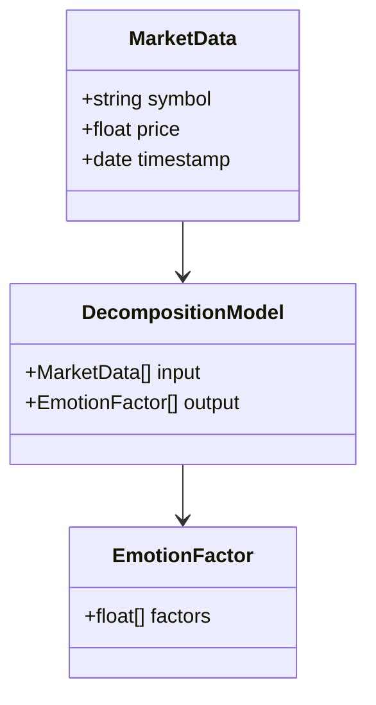
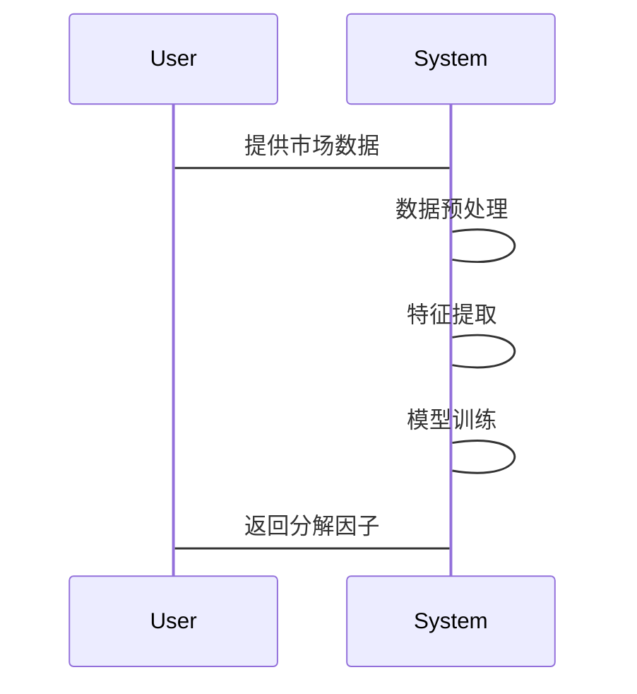

                 


# 开发智能化的金融市场情绪指数分解模型

> 关键词：金融市场，情绪指数，分解模型，人工智能，深度学习，因子分析

> 摘要：本文详细介绍了开发智能化的金融市场情绪指数分解模型的过程。从背景介绍、核心概念到算法原理，从系统架构设计到项目实战，全面阐述了如何利用人工智能技术进行情绪指数的分解与分析，旨在为金融市场的研究和投资决策提供科学依据。

---

## 第一部分: 金融市场情绪指数分解模型概述

### 第1章: 金融市场情绪指数分解模型的背景与意义

#### 1.1 问题背景
##### 1.1.1 金融市场情绪分析的重要性
金融市场的情绪分析是理解市场波动的重要手段。投资者的情绪变化直接影响市场的涨跌，而情绪指数则是量化这种情绪波动的关键工具。

##### 1.1.2 情绪指数在金融决策中的作用
情绪指数可以帮助投资者和机构预测市场的短期波动，优化投资策略，降低风险。

##### 1.1.3 当前情绪指数分析的局限性
传统的基于价格和成交量的分析方法存在局限性，无法全面捕捉市场情绪的变化。近年来，随着自然语言处理和深度学习技术的发展，智能化的情绪指数分析逐渐成为可能。

#### 1.2 问题描述
##### 1.2.1 情绪指数分解的核心问题
如何从复杂多变的市场数据中提取有效的情绪因子，建立准确的分解模型。

##### 1.2.2 数据来源与处理的挑战
金融市场数据来源广泛，包括新闻、社交媒体、交易数据等，如何有效地整合和处理这些数据是一个关键问题。

##### 1.2.3 情绪指数与市场行为的关系
情绪指数如何影响市场行为，以及市场行为如何反过来影响情绪指数，这是需要深入研究的问题。

#### 1.3 问题解决
##### 1.3.1 智能化情绪指数分解的目标
通过人工智能技术，建立一个能够自动捕捉和分析市场情绪的智能化分解模型。

##### 1.3.2 技术实现路径的选择
采用自然语言处理、深度学习等技术，结合因子分析方法，构建情绪指数分解模型。

##### 1.3.3 模型的可扩展性与实用性
确保模型不仅适用于单一市场，还能扩展到多市场、多语言的场景。

#### 1.4 边界与外延
##### 1.4.1 情绪指数分解的适用范围
主要适用于短期市场波动预测，长期趋势分析需结合其他因素。

##### 1.4.2 模型的边界条件
数据质量和完整性、模型训练的数据量、市场环境的稳定性等。

##### 1.4.3 相关领域的区别与联系
与传统金融分析、情绪计算、自然语言处理等领域的区别与联系。

#### 1.5 核心概念与联系
##### 1.5.1 情绪指数分解模型的核心要素
- 数据源：新闻、社交媒体、交易数据等。
- 分解因子：情绪、市场参与度、波动性等。
- 分解方法：因子分析、主成分分析、深度学习等。

##### 1.5.2 情绪指数与市场数据的关系
情绪指数是市场数据的综合反映，但市场数据还包括其他因素如经济指标、政策变化等。

##### 1.5.3 模型输入与输出的实体关系图


---

## 第二部分: 情绪指数分解模型的核心概念与原理

### 第2章: 情绪指数分解模型的定义与原理

#### 2.1 情绪指数分解模型的定义
情绪指数分解模型是一种通过分析市场数据，提取影响市场情绪的关键因子，并将这些因子进行分解的技术。

#### 2.2 核心概念与原理
##### 2.2.1 情绪指数的构成要素
- 市场参与者的交易行为
- 市场新闻与社交媒体的情绪倾向
- 历史价格波动

##### 2.2.2 分解模型的数学基础
- 线性代数：因子分析、主成分分析
- 概率统计：贝叶斯推断、马尔可夫链

##### 2.2.3 模型的训练与优化
- 监督学习：基于历史数据训练模型
- 无监督学习：发现数据中的隐含结构

#### 2.3 情绪指数与分解因子的关系
##### 2.3.1 因子分解的基本原理
将情绪指数分解为多个相互独立的因子，每个因子代表一种特定的情绪或市场行为。

##### 2.3.2 情绪因子的特征分析
- 时间序列特性
- 波动性
- 相关性

##### 2.3.3 因子之间的相互作用
情绪因子之间可能存在正相关或负相关关系，需通过统计方法进行分析。

#### 2.4 情绪指数分解模型的数学模型
##### 2.4.1 线性分解模型
$$ X = W \cdot F + \epsilon $$
其中，$X$ 是情绪指数，$F$ 是分解因子，$W$ 是权重矩阵，$\epsilon$ 是误差项。

##### 2.4.2 非线性分解模型
$$ Y = f(F) + \epsilon $$
其中，$f$ 是非线性函数，如神经网络模型。

##### 2.4.3 混合分解模型
$$ Z = g(F) + h(X) + \epsilon $$
其中，$g$ 和 $h$ 分别是不同类型的函数，结合了线性与非线性分解的特点。

---

## 第三部分: 情绪指数分解模型的算法原理

### 第3章: 数据预处理与特征提取

#### 3.1 数据预处理
##### 3.1.1 数据清洗与标准化
- 去除无效数据
- 标准化处理（归一化）

##### 3.1.2 时间序列数据的处理
- 滑动窗口方法
- 时间差分

##### 3.1.3 文本数据的特征提取
- 词袋模型
- 词嵌入（如Word2Vec、GloVe）

#### 3.2 情绪指数分解算法
##### 3.2.1 基于因子分析的分解方法
- 主成分分析（PCA）
- 独立成分分析（ICA）

##### 3.2.2 基于主成分分析的分解方法
- 原理：通过线性组合提取主要成分
- 优势：降维能力强

##### 3.2.3 基于深度学习的分解方法
- 卷积神经网络（CNN）
- 循环神经网络（RNN）

#### 3.3 算法实现流程
##### 3.3.1 数据输入与处理
```python
import pandas as pd
data = pd.read_csv('market_data.csv')
```

##### 3.3.2 特征提取与选择
```python
from sklearn.decomposition import PCA
pca = PCA(n_components=3)
features = pca.fit_transform(data)
```

##### 3.3.3 模型训练与因子分解
```python
from sklearn.neural_network import MLPClassifier
model = MLPClassifier(hidden_layer_sizes=(100, 50))
model.fit(features, labels)
```

##### 3.3.4 结果输出与验证
```python
from sklearn.metrics import accuracy_score
print(accuracy_score(y_true, y_pred))
```

---

## 第四部分: 情绪指数分解模型的系统架构设计

### 第4章: 系统功能设计与架构

#### 4.1 问题场景介绍
##### 4.1.1 系统目标
开发一个智能化的情绪指数分解系统，支持实时数据处理与分析。

##### 4.1.2 系统输入
- 历史价格数据
- 新闻文本
- 社交媒体数据

##### 4.1.3 系统输出
- 分解后的因子
- 情绪指数预测

#### 4.2 系统功能设计
##### 4.2.1 领域模型类图


##### 4.2.2 系统架构图


#### 4.3 系统接口设计
##### 4.3.1 API接口
- 输入接口：接收市场数据
- 输出接口：返回分解因子

##### 4.3.2 接口交互流程图


---

## 第五部分: 项目实战

### 第5章: 情绪指数分解模型的实现

#### 5.1 环境安装与配置
##### 5.1.1 安装Python环境
```bash
pip install python3
```

##### 5.1.2 安装依赖库
```bash
pip install numpy pandas scikit-learn
```

#### 5.2 系统核心代码实现
##### 5.2.1 数据预处理代码
```python
import pandas as pd
import numpy as np

def preprocess_data(data):
    # 删除缺失值
    data = data.dropna()
    # 标准化处理
    data = (data - data.mean()) / data.std()
    return data
```

##### 5.2.2 模型训练代码
```python
from sklearn.decomposition import PCA
from sklearn.neural_network import MLPClassifier

def train_model(data, labels):
    # PCA降维
    pca = PCA(n_components=5)
    features = pca.fit_transform(data)
    # 多层感知机模型
    model = MLPClassifier(hidden_layer_sizes=(100, 50))
    model.fit(features, labels)
    return model
```

##### 5.2.3 模型预测代码
```python
def predict_emotion_factors(model, new_data):
    features = preprocess_data(new_data)
    predictions = model.predict(features)
    return predictions
```

#### 5.3 项目应用与案例分析
##### 5.3.1 数据来源与处理
使用真实的市场数据，包括股票价格、新闻文本等，进行预处理和特征提取。

##### 5.3.2 模型训练与验证
通过历史数据训练模型，并验证模型的准确率。

##### 5.3.3 实际案例分析
以某段时间的市场数据为例，展示模型的预测结果与实际市场波动的对比。

#### 5.4 项目总结与经验分享
##### 5.4.1 项目成功的关键因素
- 数据质量
- 模型选择
- 参数调优

##### 5.4.2 需要注意的问题
- 数据偏差
- 模型过拟合
- 实时性要求

---

## 第六部分: 最佳实践与拓展阅读

### 第6章: 最佳实践与注意事项

#### 6.1 最佳实践
##### 6.1.1 数据采集
- 使用多源数据
- 确保数据实时性

##### 6.1.2 模型选择
- 根据数据特性选择合适的方法
- 结合业务需求进行优化

##### 6.1.3 模型部署
- 实时监控模型性能
- 定期更新模型参数

#### 6.2 注意事项
##### 6.2.1 数据隐私与安全
- 遵守数据保护法规
- 确保数据传输安全

##### 6.2.2 模型解释性
- 提供可解释的结果
- 避免“黑箱”模型的使用

##### 6.2.3 系统稳定性
- 建立完善的监控机制
- 制定应急预案

### 第7章: 小结与展望

#### 7.1 小结
本文详细介绍了开发智能化的金融市场情绪指数分解模型的过程，从背景介绍到系统实现，全面覆盖了相关技术要点。

#### 7.2 展望
随着人工智能技术的不断发展，情绪指数分解模型将更加智能化和精准化，未来可以结合更多的数据源和更复杂的模型结构，进一步提升预测能力。

---

## 参考文献
（此处列出相关书籍、论文和技术文档）

## 作者
作者：AI天才研究院/AI Genius Institute  
作者：禅与计算机程序设计艺术/Zen And The Art of Computer Programming

