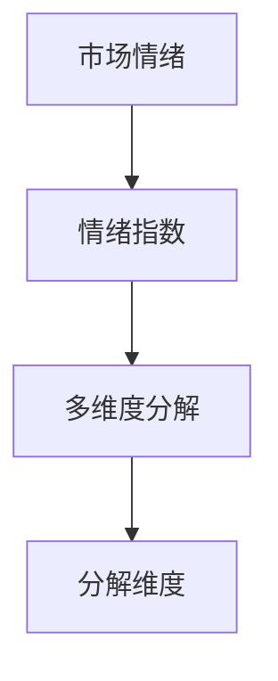
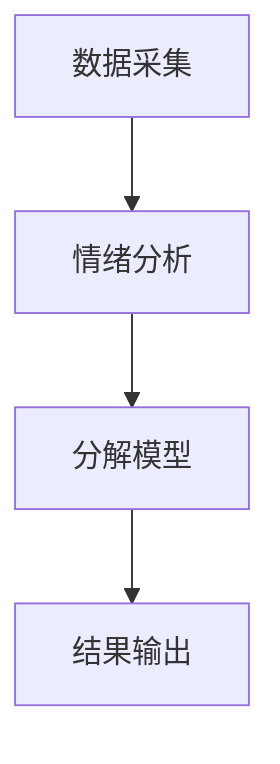

                 


# 开发智能化的金融市场情绪指数多维度分解模型

> 关键词：金融市场情绪指数，多维度分解模型，智能化开发，机器学习，自然语言处理，时间序列分析

> 摘要：本文详细探讨了开发智能化的金融市场情绪指数多维度分解模型的全过程。首先，从背景介绍出发，阐述了情绪指数在金融投资中的重要性，以及现有模型的局限性。接着，深入分析了多维度分解模型的核心概念与联系，包括情绪指数的定义、特征，以及如何构建有效的分解模型。随后，详细讲解了算法的原理，包括数据预处理、特征提取、降维方法等，并通过具体的数学公式和流程图进行了直观展示。在系统分析与架构设计部分，详细介绍了系统的整体架构、功能模块划分，以及接口和交互设计。最后，通过项目实战部分，展示了如何从环境安装到代码实现，再到案例分析，最终完成模型的开发。本文还总结了开发过程中的最佳实践，提出了注意事项，并展望了未来的发展方向。

---

## 第一部分: 金融市场情绪指数多维度分解模型背景介绍

### 第1章: 问题背景与描述

#### 1.1 问题背景
金融市场情绪指数是衡量市场参与者情绪的重要工具，能够反映投资者对市场的乐观或悲观态度。然而，现有的情绪指数模型通常仅依赖于单一指标或简单的统计方法，难以捕捉市场的复杂性和多维度特征。

#### 1.2 问题描述
市场情绪受多种因素影响，如新闻、社交媒体、经济数据等。传统的单一指标难以全面反映这些因素，导致情绪指数的准确性和实时性不足。

#### 1.3 问题解决
通过构建多维度分解模型，可以将市场情绪分解为多个相关维度，如市场波动性、投资者信心、市场参与度等，从而更全面地反映市场情绪。

#### 1.4 边界与外延
模型适用于股票、期货等金融市场，但需注意数据质量和模型参数的选择，避免过拟合。

#### 1.5 概念结构与核心要素
情绪指数分解模型由数据源、特征提取、分解算法和结果输出四个部分组成，核心要素包括多维度数据、分解算法和实时性要求。

### 第2章: 核心概念与联系

#### 2.1 情绪指数的定义与特征
情绪指数是反映市场参与者情绪的综合指标，具有动态性、多维性和可量化的特征。

#### 2.2 多维度分解模型的构建
模型将市场情绪分解为多个维度，如市场波动、投资者信心等，通过因子分析方法提取关键特征。

#### 2.3 情绪指数分解模型的实体关系分析


---

## 第二部分: 情绪指数多维度分解模型的算法原理

### 第3章: 数据预处理与特征提取

#### 3.1 数据预处理
对金融市场数据进行清洗、标准化和归一化处理，确保数据质量。

#### 3.2 特征提取
从文本、价格和交易数据中提取关键词、波动率等特征。

#### 3.3 数据降维
使用主成分分析（PCA）等方法降低数据维度，提取关键特征。

### 第4章: 分解模型算法实现

#### 4.1 分解算法
采用因子分析方法，将情绪指数分解为多个维度，每个维度对应特定的市场特征。

#### 4.2 算法实现
通过Python代码实现因子分析，具体步骤如下：
1. 数据标准化。
2. 计算协方差矩阵。
3. 提取特征向量和特征值。
4. 选择主成分。
5. 计算因子得分。

#### 4.3 分解模型的数学表达
情绪指数分解模型的数学公式为：
$$ X = T \cdot P^T $$
其中，X为数据矩阵，T为因子载荷矩阵，P为因子得分矩阵。

---

## 第三部分: 系统分析与架构设计

### 第5章: 系统架构设计

#### 5.1 系统架构
系统由数据采集模块、情绪分析模块、分解模型模块组成，各模块通过接口交互。

#### 5.2 系统功能模块
- 数据采集模块：采集金融市场数据。
- 情绪分析模块：提取情绪特征。
- 分解模型模块：进行多维度分解。

#### 5.3 系统架构图


### 第6章: 接口设计与交互流程

#### 6.1 接口设计
- 数据接口：提供数据采集功能。
- 分解接口：提供分解模型调用功能。

#### 6.2 交互流程
1. 数据采集模块获取数据。
2. 情绪分析模块提取特征。
3. 分解模型模块进行分解。
4. 输出结果。

---

## 第四部分: 项目实战

### 第7章: 项目环境安装

#### 7.1 环境要求
安装Python、NumPy、Scikit-learn等库。

### 第8章: 核心代码实现

#### 8.1 数据预处理代码
```python
import numpy as np
import pandas as pd

# 数据预处理
data = pd.read_csv('market_data.csv')
data = data.dropna()
data = (data - data.mean()) / data.std()
```

#### 8.2 分解模型实现
```python
from sklearn.decomposition import PCA

# 分解模型实现
pca = PCA(n_components=3)
pca.fit(data)
components = pca.components_
```

### 第9章: 案例分析与解读

#### 9.1 案例分析
分析某段时间的市场情绪，验证模型的有效性。

#### 9.2 模型结果解读
分解后的各维度特征及其对整体情绪的影响。

---

## 第五部分: 最佳实践与总结

### 第10章: 最佳实践

#### 10.1 开发经验总结
- 数据质量至关重要。
- 模型选择需结合实际场景。

#### 10.2 注意事项
- 避免过拟合。
- 定期更新模型参数。

### 第11章: 未来展望

#### 11.1 模型优化方向
引入深度学习技术，提高分解精度。

#### 11.2 应用场景扩展
应用于更多金融产品的情绪分析。

---

## 结语

开发智能化的金融市场情绪指数多维度分解模型是一项复杂但具有挑战性的任务。通过本文的系统介绍，读者可以深入了解模型的构建过程，并在实际项目中应用相关技术。

作者：AI天才研究院 & 禅与计算机程序设计艺术

