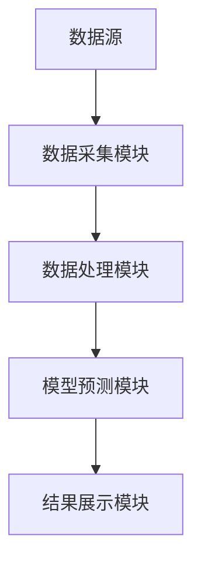

                 

# 开发智能化的金融市场情绪指数预测模型

> 关键词：金融市场情绪指数，自然语言处理，情感分析，深度学习，LSTM，量化交易

> 摘要：本文详细探讨了开发智能化的金融市场情绪指数预测模型的全过程，从理论基础到实际应用，结合自然语言处理技术，利用深度学习算法，构建高效的情绪分析模型，为金融市场预测提供科学依据。

---

## 第1章: 金融市场情绪指数的背景与意义

### 1.1 情绪指数的定义与作用

#### 1.1.1 什么是金融市场情绪指数
金融市场情绪指数是用来衡量市场参与者情绪的量化指标。它反映了投资者对市场的乐观或悲观程度，是预测市场走势的重要参考因素。

#### 1.1.2 情绪指数的作用
- **预测市场趋势**：情绪指数可以帮助预测市场波动和趋势。
- **辅助投资决策**：投资者可以根据情绪指数调整投资策略。
- **风险管理**：情绪指数有助于识别市场风险，提前采取措施。

#### 1.1.3 情绪指数的分类
- **投资者情绪指数**：如恐慌指数（VIX）。
- **市场情绪指数**：如媒体情绪指数。
- **交易情绪指数**：如交易量和订单流分析。

---

### 1.2 金融市场情绪指数的核心概念

#### 1.2.1 情绪指数的构成要素
- **市场参与者**：包括个人投资者、机构投资者等。
- **信息来源**：如新闻、社交媒体、市场评论等。
- **时间维度**：情绪指数具有时间序列特性。

#### 1.2.2 情绪指数的时间序列特征
- **趋势性**：情绪指数可能呈现趋势性变化。
- **周期性**：情绪指数可能与市场周期相关。
- **波动性**：情绪指数受突发事件影响较大。

#### 1.2.3 情绪指数的应用场景
- **预测市场波动**：情绪指数可以预测市场的短期波动。
- **辅助投资决策**：投资者可以根据情绪指数调整投资策略。
- **风险监控**：情绪指数可以帮助监控市场风险。

---

## 第2章: 金融市场情绪指数预测模型的必要性

### 2.1 传统金融分析的局限性

#### 2.1.1 传统金融分析方法的不足
- **依赖历史数据**：传统方法主要依赖历史数据，忽视了市场参与者的实时情绪。
- **忽略非结构化数据**：传统方法难以处理社交媒体等非结构化数据。
- **计算复杂性**：传统方法计算复杂，难以实时分析。

#### 2.1.2 情感分析在金融预测中的优势
- **实时性**：情感分析可以实时捕捉市场情绪。
- **数据丰富性**：社交媒体等来源提供了丰富的数据。
- **预测准确性**：情感分析可以提高市场预测的准确性。

### 2.2 AI技术在金融情绪分析中的应用前景

#### 2.2.1 自然语言处理技术的快速发展
- **NLP技术的进步**：如BERT等预训练模型的出现，提高了情感分析的准确性。
- **深度学习的应用**：深度学习在情感分析中的应用越来越广泛。

#### 2.2.2 情感分析在金融领域的潜力
- **实时市场监控**：通过分析社交媒体和新闻，实时监控市场情绪。
- **投资策略优化**：基于情绪指数优化投资策略。
- **风险管理**：利用情绪指数识别市场风险。

#### 2.2.3 智能化情绪指数预测模型的市场需求
- **投资者需求**：投资者需要实时的情绪指数来辅助决策。
- **金融机构需求**：金融机构需要情绪指数来优化投资组合。
- **监管需求**：监管机构需要情绪指数来监控市场风险。

---

## 第3章: 自然语言处理技术在情绪分析中的应用

### 3.1 自然语言处理基础

#### 3.1.1 什么是自然语言处理
自然语言处理（NLP）是计算机科学、人工智能、语言学的交叉领域，研究如何处理和理解人类语言。

#### 3.1.2 NLP的核心技术与工具
- **分词**：将文本分割成词语或短语。
- **词嵌入**：将词语映射为向量，如Word2Vec、GloVe。
- **情感分析**：判断文本的情感倾向，如正面、负面、中性。

#### 3.1.3 NLP在情感分析中的应用
- **文本分类**：将文本分为正面、负面、中性。
- **情感强度分析**：判断情感的强烈程度。
- **方面分析**：分析情感针对的具体方面。

### 3.2 情感分析的实现方法

#### 3.2.1 基于词袋模型的情感分析
词袋模型将文本表示为词袋，不考虑词序，适用于简单的文本分类。

#### 3.2.2 基于词嵌入的情感分析
词嵌入模型（如Word2Vec）将词语映射为低维向量，捕捉词语之间的语义关系。

#### 3.2.3 基于深度学习的情感分析
深度学习模型（如LSTM、BERT）在情感分析中表现出色，能够捕捉复杂的语义信息。

---

## 第4章: 情绪指数预测模型的算法原理

### 4.1 基于LSTM的情绪指数预测模型

#### 4.1.1 LSTM的原理
长短时记忆网络（LSTM）是一种特殊的RNN，能够有效捕捉时间序列中的长程依赖关系。

#### 4.1.2 LSTM的结构
LSTM由记忆单元、输入门、遗忘门和输出门组成。

#### 4.1.3 LSTM在情绪指数预测中的应用
- **捕捉情绪变化**：LSTM能够捕捉情绪指数的波动和趋势。
- **时间序列预测**：LSTM适合处理时间序列数据，预测未来的情绪指数。

### 4.2 情绪指数预测模型的数学模型

#### 4.2.1 LSTM的数学公式
$$
f_t = \sigma(W_f \cdot [h_{t-1}, x_t] + b_f)
$$
$$
i_t = \sigma(W_i \cdot [h_{t-1}, x_t] + b_i)
$$
$$
o_t = \sigma(W_o \cdot [h_{t-1}, x_t] + b_o)
$$
$$
g_t = \tanh(W_g \cdot [h_{t-1}, x_t] + b_g)
$$
$$
h_t = f_t \cdot c_{t-1} + i_t \cdot g_t
$$
$$
c_t = h_t
$$

---

## 第5章: 情绪指数预测模型的实现与优化

### 5.1 模型的实现步骤

#### 5.1.1 数据预处理
- **清洗数据**：去除噪声，提取有用信息。
- **特征提取**：提取文本特征，如词袋模型、词嵌入。
- **数据标注**：标注情绪类别，如正面、负面、中性。

#### 5.1.2 模型训练
- **选择模型**：选择合适的模型，如LSTM。
- **训练数据**：使用训练数据训练模型。
- **模型调优**：调整超参数，如学习率、批量大小。

#### 5.1.3 模型评估
- **评估指标**：使用准确率、召回率、F1分数等评估模型性能。
- **结果分析**：分析模型的优缺点，优化模型。

### 5.2 模型的优化方法

#### 5.2.1 超参数调优
- **学习率**：选择合适的学习率，避免过快或过慢的收敛。
- **批量大小**：选择合适的数据批量大小，平衡训练速度和稳定性。
- **正则化**：使用正则化技术，如L2正则化，防止过拟合。

#### 5.2.2 模型融合
- **集成学习**：结合多个模型的结果，提高预测准确性。
- **投票法**：使用投票法进行分类，减少错误率。

#### 5.2.3 模型部署
- **API开发**：将模型封装成API，方便调用。
- **实时监控**：监控模型的性能，及时调整和优化。

---

## 第6章: 项目实战——情绪指数预测模型的实现

### 6.1 项目背景介绍

#### 6.1.1 项目目标
开发一个基于LSTM的情绪指数预测模型，用于预测金融市场的情绪指数。

#### 6.1.2 数据来源
- **社交媒体数据**：如Twitter、微博等。
- **新闻数据**：如金融新闻网站。
- **交易数据**：如股票价格、成交量等。

### 6.2 项目实现步骤

#### 6.2.1 数据预处理
- **清洗数据**：去除噪声，提取有用信息。
- **特征提取**：使用词嵌入模型提取文本特征。
- **数据标注**：标注情绪类别。

#### 6.2.2 模型训练
- **选择模型**：选择LSTM模型。
- **训练数据**：使用训练数据训练模型。
- **模型调优**：调整超参数，优化模型性能。

#### 6.2.3 模型部署
- **API开发**：将模型封装成API，提供接口。
- **实时监控**：监控模型的性能，及时调整和优化。

### 6.3 项目总结

#### 6.3.1 项目成果
- **模型性能**：模型准确率、召回率等指标。
- **项目经验**：总结项目中的经验和教训。

#### 6.3.2 未来展望
- **模型优化**：进一步优化模型，提高预测准确性。
- **应用场景**：探索更多的情绪指数预测应用场景。

---

## 第7章: 系统实现与部署

### 7.1 系统架构设计

#### 7.1.1 系统功能模块
- **数据采集模块**：采集社交媒体、新闻等数据。
- **数据处理模块**：清洗、特征提取。
- **模型预测模块**：训练模型，预测情绪指数。
- **结果展示模块**：展示预测结果，提供可视化界面。

#### 7.1.2 系统架构图

### 7.2 系统实现细节

#### 7.2.1 数据采集模块
- **社交媒体数据采集**：使用API从Twitter、微博等平台获取数据。
- **新闻数据采集**：爬取新闻网站的数据。

#### 7.2.2 数据处理模块
- **清洗数据**：去除无关信息，提取有用内容。
- **特征提取**：使用词嵌入模型提取文本特征。
- **数据标注**：标注情绪类别，如正面、负面、中性。

#### 7.2.3 模型预测模块
- **训练模型**：使用LSTM模型训练情绪指数预测模型。
- **预测情绪指数**：基于模型预测未来的情绪指数。

#### 7.2.4 结果展示模块
- **可视化界面**：展示预测结果，提供图表形式。
- **数据导出**：提供数据导出功能，方便用户分析。

---

## 第8章: 总结与展望

### 8.1 项目总结

#### 8.1.1 项目成果
- **模型性能**：模型准确率、召回率等指标。
- **项目经验**：总结项目中的经验和教训。

#### 8.1.2 项目意义
- **理论意义**：丰富了金融市场情绪指数预测的理论体系。
- **实践意义**：为投资者和金融机构提供了有效的工具。

### 8.2 未来展望

#### 8.2.1 模型优化
- **模型改进**：进一步优化模型结构，提高预测准确性。
- **算法创新**：探索新的算法，如图神经网络。

#### 8.2.2 应用场景拓展
- **多市场应用**：将模型应用于不同金融市场，如外汇、加密货币。
- **多语言支持**：支持多种语言的文本分析，拓展国际市场。

---

## 作者：AI天才研究院 & 禅与计算机程序设计艺术

---

以上是《开发智能化的金融市场情绪指数预测模型》的完整目录大纲及文章内容。如需进一步调整或补充，请随时告知！

