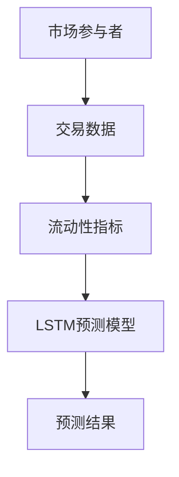
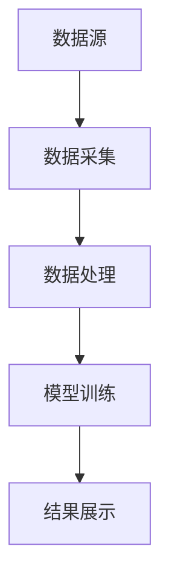

                 


# 开发智能化的金融市场流动性预测工具

> **关键词**: 金融市场, 流动性预测, 人工智能, LSTM, 时间序列, 系统架构

> **摘要**: 本文详细探讨了开发智能化金融市场流动性预测工具的关键步骤，包括背景分析、核心概念、算法原理、系统架构设计、项目实战以及最佳实践。通过结合人工智能技术，特别是LSTM模型，我们展示了如何构建高效准确的流动性预测系统，帮助投资者和机构做出更明智的决策。

---

## 第1章：金融市场流动性预测工具开发背景

### 1.1 金融市场流动性预测的背景与意义

#### 1.1.1 问题背景
金融市场流动性预测是金融工程中的核心问题之一。流动性反映了市场资产的买卖难度和交易活跃度，直接影响资产价格和市场稳定性。传统的流动性预测方法依赖于统计模型，但在复杂多变的市场环境中，这些方法往往难以捕捉非线性关系和高频数据中的隐含信息。

#### 1.1.2 问题描述
流动性预测的目标是基于历史数据和市场信息，预测未来某一时刻市场的流动性状况。这包括预测买卖价差、深度、交易量等关键指标。流动性预测在高频交易、资产配置和风险管理中具有重要应用。

#### 1.1.3 问题解决方法
近年来，人工智能技术，特别是深度学习模型（如LSTM）在时间序列预测中表现出色。通过构建基于LSTM的预测模型，可以有效捕捉市场中的复杂模式，提升预测精度。

#### 1.1.4 边界与外延
流动性预测的边界包括数据质量和完整性、模型训练时间窗口、预测时间跨度等。外延则涉及将模型应用于不同市场环境、资产类型以及与其他金融指标的联动预测。

---

### 1.2 核心概念与联系

#### 1.2.1 核心概念
- **市场流动性**：指资产在短时间内以合理价格买卖的能力。
- **时间序列预测**：基于历史数据预测未来值的数学方法。
- **LSTM模型**：一种特殊的RNN，擅长处理长期依赖关系。

#### 1.2.2 实体关系图
通过Mermaid图，我们可以清晰地展示流动性预测中的实体关系：



#### 1.2.3 数据特征与模型关系
流动性预测依赖于多个数据特征，包括：
- 交易量（Volume）
- 开盘价和收盘价（Open, Close）
- 最高和最低价（High, Low）
- 成交量加权平均价格（VWAP）
- 时间戳（Timestamp）

这些特征通过LSTM模型进行处理，生成预测结果。

---

## 第2章：流动性预测的核心算法原理

### 2.1 LSTM网络原理

#### 2.1.1 LSTM基本结构
LSTM由三个门控机制组成：
1. **输入门（Input Gate）**：决定当前输入的信息是否存储在细胞状态中。
2. **遗忘门（Forget Gate）**：控制细胞状态中信息的保留或遗忘。
3. **输出门（Output Gate）**：决定当前细胞状态的信息如何输出到隐藏层。

#### 2.1.2 LSTM单元公式
- 输入门：$$ f_t = \sigma(W_{ft}x_t + W_{ft}h_{t-1} + b_f) $$
- 遗忘门：$$ i_t = \sigma(W_{it}x_t + W_{it}h_{t-1} + b_i) $$
- 细胞状态更新：$$ c_t = f_t \cdot c_{t-1} + i_t \cdot g_t $$
  其中，$$ g_t = \tanh(W_{gt}x_t + W_{gt}h_{t-1} + b_g) $$
- 输出门：$$ o_t = \sigma(W_{ot}x_t + W_{ot}h_{t-1} + b_o) $$
- 隐藏层输出：$$ h_t = o_t \cdot \tanh(c_t) $$

#### 2.1.3 LSTM在时间序列预测中的应用
LSTM能够捕捉时间序列中的长期依赖关系，非常适合处理金融市场数据中的非线性模式。

---

### 2.2 算法实现步骤

#### 2.2.1 数据预处理
```python
import pandas as pd
data = pd.read_csv('market_data.csv')
# 标准化处理
from sklearn.preprocessing import StandardScaler
scaler = StandardScaler()
data_scaled = scaler.fit_transform(data[['open', 'high', 'low', 'close', 'volume']])
```

#### 2.2.2 构建LSTM模型
```python
from tensorflow.keras.models import Sequential
from tensorflow.keras.layers import LSTM, Dense, Dropout

model = Sequential()
model.add(LSTM(units=64, return_sequences=True, input_shape=(timesteps, features)))
model.add(Dropout(0.2))
model.add(LSTM(units=32, return_sequences=False))
model.add(Dense(1, activation='linear'))
model.compile(loss='mean_squared_error', optimizer='adam')
```

#### 2.2.3 模型训练与预测
```python
model.fit(X_train, y_train, epochs=50, batch_size=32, validation_split=0.2)
predicted = model.predict(X_test)
```

---

## 第3章：系统架构与设计

### 3.1 系统架构设计

#### 3.1.1 分层架构
系统采用分层架构，包括数据采集层、数据处理层、模型训练层和结果展示层。

#### 3.1.2 组件交互


#### 3.1.3 系统可扩展性
通过模块化设计，系统支持多种数据源和预测模型的扩展。

---

### 3.2 系统功能设计

#### 3.2.1 数据采集模块
负责从金融市场数据源获取实时或历史数据。

#### 3.2.2 数据处理模块
对数据进行清洗、标准化和特征提取。

#### 3.2.3 模型训练模块
构建并训练LSTM模型，保存最优模型。

#### 3.2.4 结果展示模块
将预测结果可视化，提供交互式界面。

---

## 第4章：项目实战与实现

### 4.1 环境安装与配置

#### 4.1.1 安装Python环境
使用Anaconda或虚拟环境管理依赖包。

#### 4.1.2 安装必要库
```bash
pip install numpy pandas tensorflow keras matplotlib
```

---

### 4.2 核心代码实现

#### 4.2.1 数据预处理
```python
import pandas as pd
import numpy as np
from sklearn.preprocessing import StandardScaler
from tensorflow.keras.models import Sequential
from tensorflow.keras.layers import LSTM, Dense, Dropout

# 加载数据
data = pd.read_csv('market_data.csv')

# 分割训练集和测试集
train_size = int(len(data) * 0.8)
train_data = data[:train_size]
test_data = data[train_size:]

# 标准化处理
scaler = StandardScaler()
train_scaled = scaler.fit_transform(train_data[['open', 'high', 'low', 'close', 'volume']])
test_scaled = scaler.transform(test_data[['open', 'high', 'low', 'close', 'volume']])
```

#### 4.2.2 构建LSTM模型
```python
timesteps = 30
features = 5
model = Sequential()
model.add(LSTM(units=64, return_sequences=True, input_shape=(timesteps, features)))
model.add(Dropout(0.2))
model.add(LSTM(units=32, return_sequences=False))
model.add(Dense(1, activation='linear'))
model.compile(loss='mean_squared_error', optimizer='adam')
```

#### 4.2.3 训练与预测
```python
history = model.fit(train_scaled, epochs=50, batch_size=32, validation_split=0.2, verbose=1)
predicted = model.predict(test_scaled)
```

---

### 4.3 实际案例分析

#### 4.3.1 数据准备
使用某股票的历史交易数据进行预测，数据包括开盘价、收盘价、最高价、最低价和交易量。

#### 4.3.2 模型训练
通过训练数据，模型学习历史数据中的模式和趋势。

#### 4.3.3 结果验证
将预测结果与实际数据进行对比，评估模型的准确性。

---

## 第5章：最佳实践与注意事项

### 5.1 最佳实践

#### 5.1.1 数据质量
确保数据的完整性和准确性，避免噪声干扰。

#### 5.1.2 模型调优
通过网格搜索优化超参数，提升预测精度。

#### 5.1.3 模型解释性
使用可视化工具（如SHAP值）解释模型决策过程。

### 5.2 注意事项

#### 5.2.1 模型泛化能力
避免过拟合，确保模型在不同市场环境下的表现稳定。

#### 5.2.2 实时预测
优化模型推理速度，支持高频交易场景。

#### 5.2.3 风险控制
结合预测结果制定合理的风险管理策略。

---

## 第6章：总结与展望

### 6.1 小结
本文详细介绍了开发智能化金融市场流动性预测工具的关键步骤，从背景分析到系统实现，全面探讨了基于LSTM模型的预测方法。

### 6.2 未来展望
随着AI技术的进步，未来可以进一步优化模型结构，引入多模态数据，提升预测精度。同时，结合区块链和分布式计算，构建更高效的预测系统。

---

## 作者

**作者：AI天才研究院 & 禅与计算机程序设计艺术**

---

以上是完整的文章内容，涵盖从背景到实现的全过程，详细讲解了开发智能化金融市场流动性预测工具的各个关键点。

