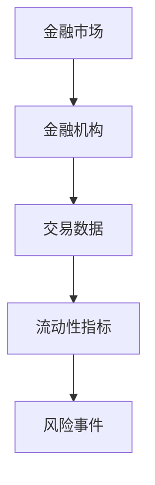

                 

# 开发智能化的金融市场流动性风险传导预警模型

## 关键词：金融市场、流动性风险、预警模型、机器学习、金融监管

## 摘要：
金融市场中的流动性风险是影响金融机构和整个金融体系稳定的重要因素。开发智能化的流动性风险传导预警模型，能够帮助监管机构和金融机构提前识别潜在风险，采取有效措施进行干预，从而维护金融市场的稳定。本文从背景介绍、核心概念、算法原理、系统架构、项目实战等多个方面详细讲解了如何开发这样一个智能化预警模型，旨在为金融从业者和技术开发者提供理论和实践的指导。

---

# 第一部分: 金融市场流动性风险传导预警模型背景介绍

## 第1章: 金融市场流动性风险概述

### 1.1 问题背景

#### 1.1.1 金融市场流动性风险的定义
流动性风险是指在金融市场中，资产无法以合理价格迅速变现而导致的损失风险。这种风险通常与市场参与者的交易行为、市场结构的复杂性以及外部经济环境的变化密切相关。

#### 1.1.2 流动性风险的来源与特征
流动性风险的主要来源包括：
1. **市场波动性**：市场的剧烈波动可能导致资产价格快速变化，影响资产的变现能力。
2. **交易行为**：投资者的集中买卖行为可能导致流动性不足。
3. **信息不对称**：市场参与者掌握的信息不一致可能导致价格偏离实际价值。
4. **制度性因素**：如交易规则、结算制度等可能影响市场的流动性。

流动性风险的特征包括：
- **隐蔽性**：风险往往在平静的市场中逐渐积累。
- **突发性**：风险可能在短时间内迅速爆发。
- **传染性**：流动性风险可能从一家机构传导到整个金融系统。

#### 1.1.3 流动性风险对金融市场的危害
流动性风险可能导致以下后果：
- 金融机构的损失，进而引发系统性风险。
- 市场参与者信心下降，导致市场进一步萎缩。
- 影响金融市场的稳定，甚至引发金融危机。

### 1.2 问题描述

#### 1.2.1 流动性风险传导的机制
流动性风险的传导机制包括以下几个步骤：
1. **触发事件**：如市场下跌、机构破产等。
2. **市场反应**：投资者抛售资产，导致资产价格下跌。
3. **流动性枯竭**：市场参与者减少交易，导致流动性进一步下降。
4. **风险扩散**：流动性问题从一家机构或市场传导至整个金融系统。

#### 1.2.2 金融市场中的典型流动性风险事件
- **2008年全球金融危机**：雷曼兄弟破产导致全球流动性危机。
- **2010年“闪电崩盘”**：美国股市因程序化交易引发的短期剧烈下跌。
- **2020年新冠疫情冲击**：全球市场流动性迅速枯竭。

#### 1.2.3 流动性风险传导的复杂性
流动性风险的传导过程涉及多个因素，包括市场结构、参与者行为、信息传播等，具有高度的复杂性和不确定性。

### 1.3 问题解决

#### 1.3.1 流动性风险预警模型的目标
- 提前识别潜在的流动性风险。
- 量化风险的严重程度，为决策提供依据。
- 提供风险缓解的策略建议。

#### 1.3.2 智能化预警模型的优势
- **数据驱动**：利用大数据和机器学习技术，捕捉复杂市场中的潜在风险。
- **实时监测**：模型可以实时监控市场动态，提供及时预警。
- **预测准确性**：通过历史数据训练模型，提高预测的准确性。

#### 1.3.3 模型的边界与外延
- **边界**：模型主要关注市场流动性风险，不涉及信用风险和市场风险的直接计算。
- **外延**：模型可以扩展到其他类型的金融风险，如操作风险和系统性风险。

### 1.4 概念结构与核心要素

#### 1.4.1 流动性风险的核心要素
- **交易量**：市场的交易活跃度。
- **价格波动性**：资产价格的波动情况。
- **订单深度**：市场深度和订单簿情况。

#### 1.4.2 智能化预警模型的关键组成部分
- **数据采集模块**：收集市场数据。
- **特征提取模块**：提取与流动性相关的特征。
- **模型训练模块**：训练机器学习模型。
- **预警模块**：根据模型输出生成预警信号。

#### 1.4.3 模型的输入与输出关系
- **输入**：市场数据、交易数据、宏观经济指标。
- **输出**：流动性风险评分、风险事件预警信号。

---

## 第2章: 智能化预警模型的核心概念与联系

### 2.1 核心概念原理

#### 2.1.1 数据驱动与知识驱动的结合
- 数据驱动：通过大量数据训练模型，提取潜在规律。
- 知识驱动：结合领域知识，优化模型结构和特征选择。

#### 2.1.2 多因子模型与机器学习算法的融合
- 多因子模型：基于多个因子（如市值、价值、动量等）构建预测模型。
- 机器学习算法：如XGBoost、LSTM等，用于非线性关系的建模。

#### 2.1.3 流动性风险传导的网络结构
- **网络结构**：将金融市场中的机构、资产、交易行为等视为网络节点，分析风险的传播路径。

### 2.2 核心概念对比分析

#### 2.2.1 不同算法的特征对比
| 算法类型 | 优势 | 劣势 |
|---------|------|------|
| XGBoost | 高准确性，易于实现 | 易过拟合 |
| LSTM    | 能捕捉时间序列中的长期依赖 | 训练时间较长 |

#### 2.2.2 多因子模型与传统统计模型的差异
- **多因子模型**：基于多个因子构建模型，适合复杂市场环境。
- **传统统计模型**：基于单一因子或简单统计关系，适合简单市场环境。

#### 2.2.3 数据特征与模型性能的关系
- 特征选择：关键的流动性特征（如订单深度、买卖价差）对模型性能影响较大。
- 数据质量：高质量数据能够显著提高模型的预测精度。

### 2.3 ER实体关系图架构

---

## 总结

本文从金融市场流动性风险的背景出发，详细讲解了智能化预警模型的核心概念、算法原理、系统架构和项目实战。通过结合数据驱动和知识驱动的方法，利用机器学习算法，模型能够有效识别和预警流动性风险，为金融监管和市场稳定提供了有力支持。

