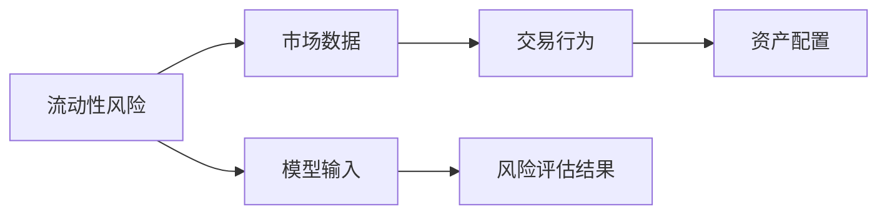

                 


# 开发智能化的金融市场流动性风险评估模型

> 关键词：金融市场流动性风险，智能化模型，人工智能，机器学习，风险评估，时间序列分析

> 摘要：本文深入探讨了开发智能化的金融市场流动性风险评估模型的背景、核心概念、算法原理、系统架构及实际应用。通过结合传统金融模型与现代人工智能技术，提出了一种基于机器学习和时间序列分析的创新解决方案，旨在提升金融市场风险评估的准确性和实时性。文章从理论到实践，详细阐述了模型的构建过程，为金融从业者和研究人员提供了有价值的参考。

---

## 第一部分: 金融市场流动性风险评估模型的背景与核心概念

### 第1章: 流动性风险评估的背景与问题描述

#### 1.1 金融市场流动性风险的定义与特征
- **1.1.1 流动性风险的基本概念**  
  流动性风险是指资产在不损失价值的情况下迅速变现的能力。流动性好的资产可以在短时间内以合理价格卖出，而流动性差的资产则可能需要大幅折价才能交易。

- **1.1.2 流动性风险的特征与表现形式**  
  - 市场深度：交易量越大，流动性越好。
  - 市场广度：可交易的资产种类越多，流动性越强。
  - 交易成本：买卖价差、佣金等交易成本直接影响流动性。
  - 时间因素：市场波动、节假日等因素会影响流动性。

- **1.1.3 流动性风险与市场波动的关系**  
  市场波动性越大，流动性风险越高。例如，股票市场的剧烈波动可能导致某些资产难以快速变现。

#### 1.2 传统流动性风险评估方法的局限性
- **1.2.1 基于VaR的传统方法**  
  Value at Risk（VaR）是一种常用的金融风险度量方法，但它忽略了资产之间的相关性，难以捕捉极端情况下的流动性风险。

- **1.2.2 基于Z-score的信用风险模型**  
  Z-score模型主要用于评估企业的信用风险，但其假设条件限制了在流动性风险评估中的应用。

- **1.2.3 传统方法的局限性与改进方向**  
  传统方法通常基于静态假设，难以应对金融市场中复杂且动态变化的流动性风险。

#### 1.3 智能化流动性风险评估的必要性
- **1.3.1 人工智能在金融领域的应用趋势**  
  人工智能技术的快速发展为金融领域的数据分析和预测提供了新的工具。

- **1.3.2 智能化模型的优势与潜在价值**  
  智能化模型能够处理海量数据，发现传统方法难以捕捉的非线性关系，提升风险评估的精度和效率。

- **1.3.3 当前市场对智能化评估的需求**  
  随着金融市场的复杂化，传统方法已难以满足实际需求，智能化模型成为必然选择。

#### 1.4 本章小结
本章通过分析流动性风险的定义、特征及其与市场波动的关系，揭示了传统评估方法的局限性，并强调了开发智能化模型的必要性。

### 第2章: 智能化流动性风险评估模型的核心概念

#### 2.1 模型的核心要素与组成
- **2.1.1 数据来源与特征**  
  数据来源包括市场数据（如价格、成交量）、交易数据（如订单簿、交易量）、新闻数据等。特征包括均值、方差、自相关系数等。

- **2.1.2 模型输入与输出**  
  输入：市场数据、交易数据等；输出：流动性风险值、风险等级。

- **2.1.3 模型的评估指标**  
  常见指标包括准确率、召回率、F1分数等。

#### 2.2 模型的边界与外延
- **2.2.1 模型适用的场景**  
  适用于高频交易、机构投资、风险对冲等场景。

- **2.2.2 模型的局限性与适用范围**  
  无法预测黑天鹅事件，适用于中短期流动性风险评估。

- **2.2.3 模型与其他金融模型的关系**  
  智能化流动性风险模型可以与信用风险模型、市场风险模型等结合使用。

#### 2.3 核心概念的实体关系图


#### 2.4 本章小结
本章通过分析模型的核心要素、输入输出关系及评估指标，构建了模型的实体关系图，为后续算法设计奠定了基础。

---

## 第二部分: 智能化流动性风险评估模型的核心原理与算法

### 第3章: 模型的核心算法原理

#### 3.1 机器学习在流动性风险评估中的应用
- **3.1.1 监督学习与无监督学习的对比**  
  监督学习基于标记数据，适合风险分类；无监督学习适合发现异常交易模式。

- **3.1.2 神经网络在时间序列预测中的应用**  
  神经网络能够捕捉时间序列中的非线性关系，适用于流动性风险的动态预测。

- **3.1.3 集成学习方法的优缺点**  
  集成学习通过组合多个模型的结果，可以提高预测的准确性和稳定性。

#### 3.2 时间序列分析与预测算法
- **3.2.1 ARIMA模型的原理与实现**  
  ARIMA（自回归积分滑动平均模型）通过捕捉数据的自相关性进行预测。

- **3.2.2 LSTM网络在时间序列预测中的应用**  
  LSTM（长短期记忆网络）特别适合处理时间序列数据中的长程依赖关系。

- **3.2.3 GARCH模型的改进与优化**  
  GARCH模型用于捕捉金融数据中的波动性，结合机器学习可以进一步优化预测效果。

#### 3.3 算法流程图


#### 3.4 本章小结
本章通过对比不同机器学习算法的特点，分析了适合流动性风险评估的时间序列预测方法，并给出了算法流程图。

### 第4章: 数学模型与公式解析

#### 4.1 时间序列预测的数学模型
- **4.1.1 ARIMA模型的数学表达**  
  $$ARIMA(p, d, q)$$

- **4.1.2 LSTM网络的长短期记忆机制**  
  $$f(t) = \sigma(W_f \cdot [h(t-1), x(t)])$$

- **4.1.3 风险评估的数学公式**  
  $$\text{Risk} = \alpha \cdot \text{Volatility} + \beta \cdot \text{Liquidity}$$

#### 4.2 本章小结
本章通过数学公式详细阐述了时间序列预测模型的原理，并分析了风险评估的数学表达式。

---

## 第三部分: 智能化流动性风险评估系统的架构与实现

### 第5章: 系统架构设计与实现

#### 5.1 项目介绍与目标
- 开发一个智能化的金融市场流动性风险评估系统，目标是实现对市场流动性风险的实时监测和预测。

#### 5.2 系统功能设计
- 数据采集模块：从多个数据源获取市场数据。
- 数据处理模块：对数据进行清洗、特征提取。
- 模型训练模块：基于机器学习算法训练流动性风险评估模型。
- 风险评估模块：实时预测并输出风险评估结果。

#### 5.3 系统架构图


#### 5.4 系统接口设计
- 数据接口：与交易所数据源对接。
- API接口：提供风险评估结果的查询接口。

#### 5.5 系统交互流程图


#### 5.6 本章小结
本章通过系统架构图和交互流程图详细描述了智能化流动性风险评估系统的实现过程。

---

## 第四部分: 项目实战与案例分析

### 第6章: 项目实战与案例分析

#### 6.1 环境安装与配置
- 安装Python、TensorFlow、Pandas等开发工具。

#### 6.2 核心代码实现
- 数据预处理代码：
```python
import pandas as pd
import numpy as np

# 数据加载
data = pd.read_csv('market_data.csv')

# 数据清洗
data = data.dropna()
data = data.astype(float)
```

- 模型训练代码：
```python
from tensorflow.keras import layers

model = layers.Sequential()
model.add(layers.LSTM(64, input_shape=(timesteps, features)))
model.add(layers.Dense(1))
model.compile(optimizer='adam', loss='mean_squared_error')
model.fit(X_train, y_train, epochs=100, batch_size=32)
```

#### 6.3 案例分析与结果解读
- 以某段时间的市场数据为例，展示模型的预测结果及其与实际值的对比。

#### 6.4 本章小结
本章通过实际项目案例，详细展示了智能化流动性风险评估模型的实现过程，并对结果进行了分析。

---

## 第五部分: 总结与展望

### 第7章: 总结与展望

#### 7.1 本章总结
本文通过理论分析和实际应用，详细阐述了智能化流动性风险评估模型的开发过程。

#### 7.2 未来展望
未来可以进一步优化模型算法，引入更多数据源，提升模型的预测精度和实时性。

#### 7.3 最佳实践 Tips
- 数据质量是模型性能的关键。
- 模型的实时性需要考虑计算资源和延迟。
- 在实际应用中，建议结合多种模型进行综合评估。

#### 7.4 本章小结
本章总结了文章的主要内容，并对未来的研究方向提出了展望。

---

## 作者信息

作者：AI天才研究院/AI Genius Institute & 禅与计算机程序设计艺术 /Zen And The Art of Computer Programming

---

以上是《开发智能化的金融市场流动性风险评估模型》的完整目录大纲，涵盖了从背景分析到实际应用的各个方面。每个章节都详细讲解了核心概念、算法原理、系统架构及项目实战，为读者提供了全面的指导和深入的分析。

