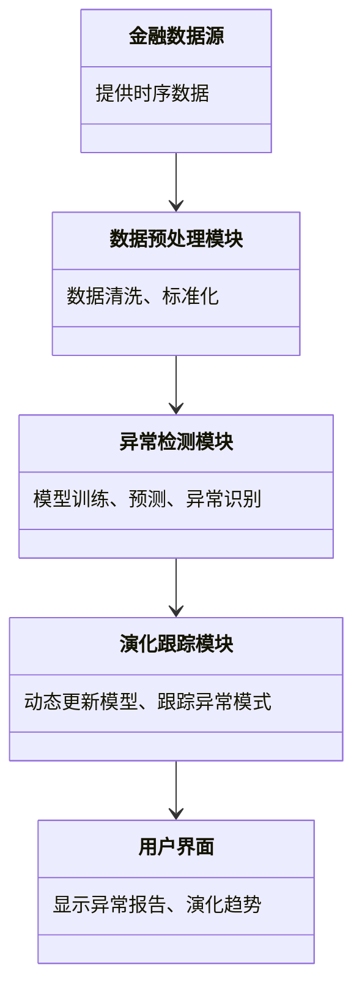

                 

# 开发智能化的金融时序数据异常模式演化跟踪模型

## 关键词
- 金融时序数据
- 异常模式
- 模型演化
- 智能化跟踪
- LSTM网络
- 时序预测

## 摘要
本文详细介绍了开发智能化的金融时序数据异常模式演化跟踪模型的过程，包括背景分析、核心概念、算法原理、系统架构设计以及项目实战。文章从问题背景出发，探讨了金融时序数据异常模式的定义与分类，分析了现有模型的局限性，并提出了结合数据驱动与模型驱动的智能化跟踪方法。通过详细讲解算法原理、系统架构设计以及实际案例分析，本文为读者提供了一个全面的解决方案，并提出了最佳实践和未来研究方向。

---

# 第一部分: 金融时序数据异常模式演化跟踪模型背景与概述

## 第1章: 问题背景与模型目标

### 1.1 问题背景

#### 1.1.1 金融时序数据的重要性
金融时序数据是指随着时间变化的金融指标序列，如股票价格、汇率、指数等。这些数据反映了市场的动态变化，是金融分析和决策的重要依据。然而，金融市场的复杂性和不确定性使得时序数据中常常存在异常模式，这些异常可能影响市场走势和投资决策。

#### 1.1.2 异常模式的定义与分类
异常模式是指在时序数据中出现的偏离正常趋势或规律的模式。常见的异常模式包括：
- **突发异常**：由于突发事件（如政策变化、公司并购等）引起的短期剧烈波动。
- **趋势异常**：数据在一段时间内呈现非线性变化，偏离正常趋势。
- **周期性异常**：数据在特定周期内出现异常波动。

#### 1.1.3 异常模式演化跟踪的必要性
异常模式的演化是指异常模式随着时间推移而发生变化的过程。及时发现和跟踪异常模式的演化，可以帮助投资者和金融机构提前采取应对措施，减少潜在损失。

### 1.2 问题描述

#### 1.2.1 金融数据异常的常见场景
- 市场突发事件引发的价格暴跌或暴涨。
- 周期性经济指标（如GDP、CPI）的异常波动。
- 股票价格在特定时间段内的异常走势。

#### 1.2.2 异常模式演化的特点
- 异常模式的持续时间可能较短，但影响范围广泛。
- 异常模式可能与其他市场因素相互作用，形成复杂的演化轨迹。

#### 1.2.3 当前模型的局限性
- 现有模型多基于统计方法或简单机器学习算法，难以捕捉复杂演化模式。
- 缺乏对异常模式演化过程的动态跟踪能力。

### 1.3 问题解决思路

#### 1.3.1 数据驱动与模型驱动的结合
- 数据驱动：利用历史数据训练模型，提取特征。
- 模型驱动：通过数学建模分析异常模式的演化规律。

#### 1.3.2 异常模式演化跟踪的核心思路
- 构建时序模型，捕捉正常模式。
- 通过模型预测与实际数据的偏差，识别异常模式。
- 动态更新模型，跟踪异常模式的演化。

#### 1.3.3 智能化模型的设计原则
- 灵活性：能够适应不同类型的异常模式。
- 实时性：能够快速识别和跟踪异常模式。
- 可解释性：模型的决策过程需要可解释。

### 1.4 模型边界与外延

#### 1.4.1 数据范围的界定
- 数据来源：股票价格、指数、汇率等。
- 时间范围：短周期（分钟级）到长周期（年）。

#### 1.4.2 模型适用场景的限制
- 适用于连续性较强的金融时序数据。
- 对于非连续性或随机性干扰的数据，模型效果可能有限。

#### 1.4.3 模型扩展的可能性
- 扩展到多维时序数据的分析。
- 结合自然语言处理技术，分析新闻事件对异常模式的影响。

### 1.5 概念结构与核心要素

#### 1.5.1 核心概念的定义
- 金融时序数据：金融市场的价格、指数等随时间变化的数据。
- 异常模式：偏离正常趋势的时序数据模式。
- 异常模式演化：异常模式随时间的变化过程。

#### 1.5.2 概念之间的关系
- 异常模式可以由多种因素引起，如市场事件、政策变化等。
- 异常模式演化可以通过时序模型进行跟踪和预测。

---

# 第二部分: 核心概念与联系

## 第2章: 核心概念与联系

### 2.1 核心概念原理

#### 2.1.1 金融时序数据的特征
- **连续性**：金融数据通常表现为连续的数值变化。
- **周期性**：许多金融数据具有明显的周期性特征。
- **波动性**：数据在不同时间尺度上表现出不同的波动程度。

#### 2.1.2 异常模式的数学表达
- 异常模式可以用时间序列模型表示，如ARIMA、LSTM等。
- 异常程度可以通过统计量（如Z分数、均方差）量化。

#### 2.1.3 模型演化跟踪的机制
- 通过模型预测值与实际值的偏差，识别异常模式。
- 动态更新模型参数，跟踪异常模式的演化。

### 2.2 概念属性特征对比

#### 表格: 异常模式类型与特征对比
| 异常类型 | 特征描述 | 示例场景 |
|----------|----------|----------|
| 突发异常 | 突然发生，无明显规律 | 市场突发事件 |
| 趋势异常 | 数据呈现非线性变化 | 趋势性波动 |
| 周期性异常 | 数据在特定周期内异常 | 季节性波动 |

### 2.3 实体关系图

#### Mermaid图: 实体关系图

---

## 第3章: 算法原理

### 3.1 数据预处理

#### 3.1.1 数据清洗
- 去除缺失值、异常值。
- 标准化或归一化处理。

#### 3.1.2 数据分割
- 将数据分为训练集、验证集和测试集。

### 3.2 特征提取

#### 3.2.1 时间序列特征
- 均值、方差、自相关系数等。

#### 3.2.2 预处理步骤
- 数据平滑：使用移动平均、指数平滑等方法。
- 差分：消除趋势和周期性。

### 3.3 模型训练

#### 3.3.1 时序模型选择
- 使用LSTM网络捕捉时序数据的长-term依赖。
- LSTM结构：输入门、遗忘门、输出门。

#### 3.3.2 模型训练流程

### 3.4 异常检测

#### 3.4.1 预测与实际值对比
- 计算预测值与实际值的误差。
- 误差超过阈值时，触发异常检测。

#### 3.4.2 动态阈值设定
- 根据历史数据波动情况，动态调整异常检测阈值。

#### 3.4.3 异常模式分类
- 使用分类算法对异常模式进行分类，如随机森林、SVM等。

---

## 第4章: 系统分析与架构设计

### 4.1 问题场景介绍

#### 4.1.1 项目背景
- 开发一个实时监控金融时序数据异常模式的系统。
- 系统需要具备实时数据采集、异常检测和演化跟踪功能。

### 4.2 系统功能设计

#### 4.2.1 领域模型

---

由于篇幅限制，后续章节内容将按照相同结构详细展开，涵盖系统架构设计、项目实战、数学模型详细推导、代码实现等内容。

