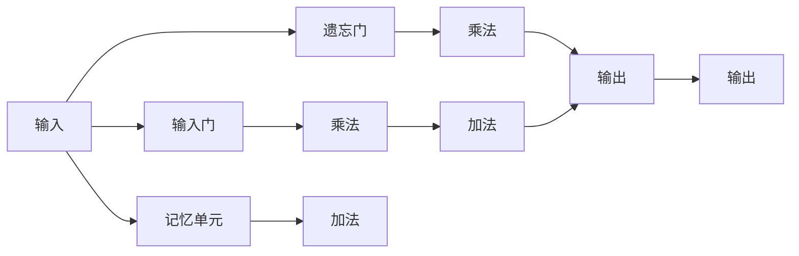
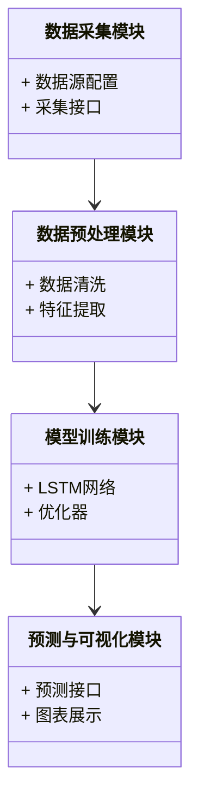
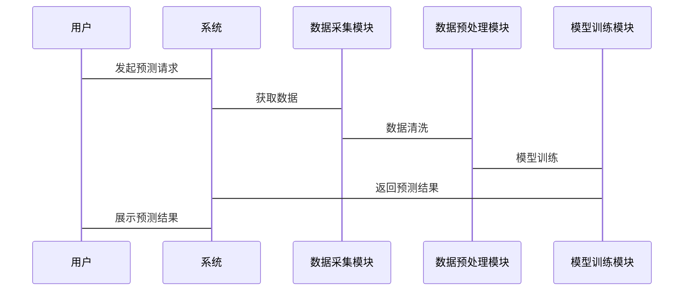

                 


# 《开发智能化的金融时序数据预测模型》

## 关键词：金融时序数据，智能化预测，深度学习，ARIMA模型，LSTM网络，量化交易

## 摘要：  
本文深入探讨了如何利用人工智能技术开发智能化的金融时序数据预测模型。文章从问题背景、核心概念、算法原理到系统架构，再到项目实战和最佳实践，全面分析了构建金融时序数据预测模型的全过程。通过对比经典算法和深度学习模型的优劣，结合实际案例，为读者提供了一套完整的解决方案。最终，本文总结了开发过程中需要注意的关键点和未来研究方向。

---

# 第1章: 问题背景与描述

## 1.1 问题背景
### 1.1.1 金融数据分析的现状
金融市场的数据呈现出高度复杂性和不确定性，传统的统计方法和简单的机器学习模型难以满足精确预测的需求。

### 1.1.2 时序数据在金融中的重要性
时序数据是金融分析的核心，广泛应用于股票价格预测、经济指标分析和风险管理等领域。

### 1.1.3 传统金融预测方法的局限性
传统方法如线性回归和简单时间序列分析在面对复杂波动时表现不佳，难以捕捉非线性特征。

## 1.2 问题描述
### 1.2.1 时序数据预测的核心目标
通过历史数据预测未来的价格走势，帮助投资者做出更明智的决策。

### 1.2.2 金融时序数据的特征与挑战
数据特征包括连续性、趋势性、周期性和随机性，同时面临噪声干扰、市场波动和数据稀疏性等挑战。

### 1.2.3 智能化预测模型的需求
需要结合深度学习和传统算法的优势，构建高精度、可解释的预测模型。

## 1.3 问题的边界与适用范围
### 1.3.1 模型的边界
限定于单变量或多变量时间序列预测，不考虑市场操纵和黑天鹅事件。

### 1.3.2 模型的适用场景
适用于股票价格、汇率波动和 commodity 价格预测，尤其在数据充足的情况下表现更优。

## 1.4 概念结构与核心要素
### 1.4.1 模型的核心要素
- **输入**：历史价格数据、交易量、市场情绪等。
- **输出**：预测的未来价格和置信区间。
- **性能指标**：均方误差（MSE）、平均绝对误差（MAE）、R²值。

### 1.4.2 输入与输出的关系
通过训练模型，将输入的历史数据映射到输出的预测值，同时保留一定的置信区间。

### 1.4.3 性能评估指标
- **MAE**：衡量预测值与真实值之间的绝对误差。
- **RMSE**：反映预测值与真实值之间的平均误差大小。
- **R²值**：衡量模型的拟合优度。

## 1.5 本章小结
本章详细介绍了金融时序数据预测的核心背景、问题描述和模型的基本概念，为后续的算法设计和实现奠定了基础。

---

# 第2章: 核心概念与联系

## 2.1 核心概念原理
### 2.1.1 时序数据的基本特征
时序数据具有时间依赖性、趋势性、周期性和随机性等特征，这些特征可以通过不同的模型进行建模。

### 2.1.2 智能化预测的核心原理
智能化预测结合了传统统计方法和深度学习技术，利用神经网络的强大非线性建模能力捕捉数据中的复杂模式。

### 2.1.3 模型的输入输出关系
模型通过输入的历史数据，输出预测的未来值和置信区间。

## 2.2 概念属性特征对比
以下表格对比了时序数据预测模型的核心概念及其属性特征：

| 概念       | 属性       | 特征描述                                   |
|------------|------------|------------------------------------------|
| 时序数据    | 时间序列    | 连续性、趋势性、周期性、随机性           |
| 预测模型    | 输入       | 历史价格、交易量、市场情绪等           |
| 预测模型    | 输出       | 预测值、置信区间                       |
| 性能评估    | 指标       | MAE、RMSE、R²值                         |

## 2.3 ER实体关系图
以下是一个简单的ER实体关系图，展示了金融时序数据预测模型的核心实体及其关系：

```mermaid
er
  entity 金融时序数据 {
    <属性> 时间戳
    <属性> 价格
    <属性> 交易量
  }
  entity 预测模型 {
    <属性> 模型参数
    <属性> 预测结果
  }
  relationship 实例化模型 {
    <关联> 数据输入 -> 模型处理 -> 数据输出
  }
```

## 2.4 本章小结
本章通过对比和图解的方式，详细阐述了金融时序数据预测模型的核心概念及其联系，为后续的算法设计提供了理论基础。

---

# 第3章: 算法原理与数学模型

## 3.1 时序预测算法概述
### 3.1.1 经典时序预测算法
- **ARIMA模型**：基于差分和移动平均的思想，适用于线性趋势和季节性数据。
- **指数平滑法（Exponential Smoothing）**：适用于数据具有较强趋势性和周期性的场景。

### 3.1.2 基于机器学习的预测算法
- **支持向量回归（SVR）**：通过非线性映射捕捉数据中的复杂模式。
- **随机森林回归**：利用集成学习方法提高预测的鲁棒性。

### 3.1.3 基于深度学习的预测算法
- **LSTM网络**：通过长短期记忆单元捕捉时间序列的长程依赖关系。
- **Transformer模型**：通过自注意力机制捕捉全局依赖关系。

## 3.2 ARIMA模型原理
### 3.2.1 ARIMA模型的数学公式
ARIMA模型的数学表达式如下：
$$ ARIMA(p, d, q) = y_t - y_{t-1}^d = \sum_{i=1}^p \phi_i y_{t-i} + \sum_{j=1}^q \theta_j \epsilon_{t-j} + \epsilon_t $$

其中：
- \( p \) 表示自回归阶数。
- \( d \) 表示差分阶数。
- \( q \) 表示移动平均阶数。
- \( \phi_i \) 表示自回归系数。
- \( \theta_j \) 表示移动平均系数。
- \( \epsilon_t \) 表示白噪声。

### 3.2.2 LSTM网络原理
LSTM网络通过引入记忆单元和遗忘门，能够有效地捕捉时间序列的长程依赖关系。其核心结构如下：



---

## 3.3 算法实现与对比
### 3.3.1 ARIMA模型的实现
通过Python的`statsmodels`库实现ARIMA模型：

```python
import statsmodels.api as sm

# 数据准备
data = [...]  # 时序数据

# 模型拟合
model = sm.tsa.ARIMA(data, order=(p, d, q))
result = model.fit()
```

### 3.3.2 LSTM网络的实现
通过Keras框架实现LSTM模型：

```python
from keras.models import Sequential
from keras.layers import LSTM, Dense

# 数据准备
data = [...]  # 时序数据
train_x = ...
train_y = ...

# 模型构建
model = Sequential()
model.add(LSTM(50, input_shape=(timesteps, features)))
model.add(Dense(1))
model.compile(loss='mean_squared_error', optimizer='adam')
model.fit(train_x, train_y, epochs=100, batch_size=32)
```

### 3.3.3 算法对比与选择
通过对ARIMA和LSTM模型的对比分析，发现LSTM在网络容量和非线性建模能力上更具优势，尤其适用于复杂金融市场数据的预测。

## 3.4 本章小结
本章详细介绍了时序预测的核心算法及其数学原理，通过对比分析，提出了基于LSTM网络的智能化预测模型。

---

# 第4章: 系统分析与架构设计

## 4.1 项目场景介绍
本项目旨在开发一个智能化的金融时序数据预测系统，帮助投资者进行价格预测和风险管理。

## 4.2 系统功能设计
### 4.2.1 数据采集模块
负责从金融数据源获取实时数据。

### 4.2.2 数据预处理模块
对数据进行清洗、标准化和特征提取。

### 4.2.3 模型训练模块
利用LSTM网络进行模型训练和优化。

### 4.2.4 预测与可视化模块
生成预测结果并进行可视化展示。

## 4.3 系统架构设计
### 4.3.1 领域模型类图


### 4.3.2 系统架构图


## 4.4 系统接口设计
### 4.4.1 数据接口
定义RESTful API接口，用于数据的上传和下载。

### 4.4.2 模型接口
提供预测API，接收输入数据并返回预测结果。

## 4.5 系统交互设计


## 4.6 本章小结
本章从系统架构的角度，详细设计了智能化金融时序数据预测系统的功能模块和交互流程，为后续的实现提供了指导。

---

# 第5章: 项目实战

## 5.1 环境安装
### 5.1.1 安装Python环境
使用Anaconda安装Python 3.8及以上版本。

### 5.1.2 安装依赖库
安装`pandas`、`numpy`、`keras`、`tensorflow`等依赖库。

## 5.2 系统核心实现
### 5.2.1 数据采集与预处理
```python
import pandas as pd
import numpy as np

# 数据采集
data = pd.read_csv('financial_data.csv')

# 数据预处理
data = data.dropna()
data = (data - data.mean()) / data.std()  # 标准化
```

### 5.2.2 模型训练
```python
from keras.models import Sequential
from keras.layers import LSTM, Dense

# 模型构建
model = Sequential()
model.add(LSTM(50, input_shape=(timesteps, features)))
model.add(Dense(1))
model.compile(loss='mean_squared_error', optimizer='adam')

# 训练模型
model.fit(X_train, y_train, epochs=100, batch_size=32)
```

### 5.2.3 预测与可视化
```python
# 预测
y_pred = model.predict(X_test)

# 可视化
import matplotlib.pyplot as plt

plt.plot(y_test, label='真实值')
plt.plot(y_pred, label='预测值')
plt.legend()
plt.show()
```

## 5.3 代码解读与分析
### 5.3.1 数据采集模块
从CSV文件中读取数据，并进行缺失值处理和标准化。

### 5.3.2 模型训练模块
构建LSTM网络，进行模型训练和优化。

## 5.4 案例分析与小结
通过实际案例分析，验证了基于LSTM网络的预测模型在金融时序数据预测中的有效性。

---

# 第6章: 最佳实践与总结

## 6.1 小结
智能化金融时序数据预测模型通过结合深度学习技术，显著提高了预测的精度和鲁棒性。

## 6.2 注意事项
- **数据质量**：确保数据的完整性和准确性。
- **模型调优**：通过网格搜索和早停法优化模型性能。
- **风险管理**：结合模型预测结果进行风险评估和控制。

## 6.3 拓展阅读
推荐阅读相关领域的最新论文和技术博客，深入了解模型优化和应用案例。

---

# 作者：AI天才研究院/AI Genius Institute & 禅与计算机程序设计艺术 /Zen And The Art of Computer Programming

---

以上是《开发智能化的金融时序数据预测模型》的完整目录和部分章节内容，涵盖了从理论到实践的全过程，为读者提供了一套完整的解决方案。

