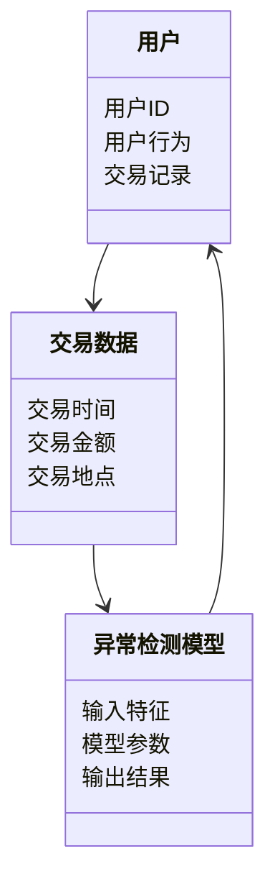
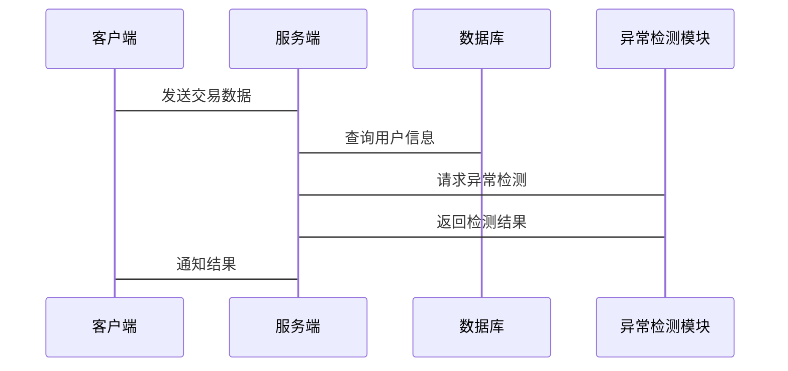

                 


```markdown
# 异常检测算法在金融欺诈识别中的应用

> 关键词：异常检测、金融欺诈、机器学习、深度学习、数据挖掘

> 摘要：本文系统地探讨了异常检测算法在金融欺诈识别中的应用，从基本概念到具体实现，结合实际案例，详细分析了多种异常检测算法的原理、优缺点以及在金融欺诈识别中的应用场景。通过深入的理论分析和实践案例，本文旨在为读者提供一个全面的理解框架，帮助他们在实际应用中更好地利用异常检测技术来识别和预防金融欺诈行为。

---

## 第1章: 异常检测与金融欺诈识别的背景

### 1.1 异常检测的基本概念
#### 1.1.1 异常检测的定义
异常检测（Anomaly Detection）是一种通过分析数据，识别出与正常数据模式不一致的异常样本的技术。在金融领域，异常检测常用于识别潜在的欺诈行为，帮助金融机构降低风险。

#### 1.1.2 异常检测的核心目标
- 识别异常交易行为
- 发现潜在的欺诈模式
- 提供实时监控和预警

#### 1.1.3 异常检测在金融领域的应用价值
- 保护金融机构免受财务损失
- 提升客户信任度
- 提高金融交易的安全性

### 1.2 金融欺诈识别的背景
#### 1.2.1 金融欺诈的主要形式
- 账户欺诈
- 信用卡欺诈
- 投资欺诈

#### 1.2.2 金融欺诈的经济损失与社会影响
- 金融机构的直接经济损失
- 客户信任度的下降
- 社会经济秩序的混乱

#### 1.2.3 传统金融欺诈识别的局限性
- 人工识别效率低
- 规则-based方法难以应对复杂欺诈手段
- 数据量大，难以处理

### 1.3 异常检测在金融欺诈识别中的作用
#### 1.3.1 异常检测技术的核心优势
- 数据驱动，自动化识别
- 高度可扩展性
- 实时监控能力

#### 1.3.2 异常检测在金融欺诈识别中的应用场景
- 信用卡交易监控
- 网上支付行为分析
- 账户异常登录检测

#### 1.3.3 异常检测技术的未来发展趋势
- 结合深度学习的异常检测
- 多模态数据融合
- 实时性与高效性优化

---

## 第2章: 异常检测的核心概念与原理

### 2.1 异常检测的核心概念
#### 2.1.1 异常检测的定义与分类
- 异常检测的定义
- 异常的分类：点异常、集体异常、上下文异常

#### 2.1.2 异常检测的关键特征
- 异常检测的特征提取
- 异常检测的模型选择
- 异常检测的评价指标

#### 2.1.3 异常检测在金融欺诈识别中的作用
- 异常检测在金融欺诈识别中的核心作用
- 异常检测与其他欺诈识别技术的结合

### 2.2 异常检测的主要方法
#### 2.2.1 基于统计的方法
- 高斯分布模型
- 算术平均数和标准差方法
- 箱线图方法

#### 2.2.2 基于机器学习的方法
- 支持向量机(SVM)
- 随机森林
- K-近邻算法(KNN)

#### 2.2.3 基于深度学习的方法
- 卷积神经网络(CNN)
- 循环神经网络(RNN)
- 自注意力机制模型

### 2.3 异常检测算法的优缺点对比
#### 2.3.1 统计方法的优缺点
- 高斯分布模型：优点是简单高效，缺点是假设数据服从正态分布，可能不适用于复杂场景。

#### 2.3.2 机器学习方法的优缺点
- SVM：优点是分类能力强，缺点是参数选择敏感。
- 随机森林：优点是鲁棒性好，缺点是计算复杂度高。
- KNN：优点是简单易用，缺点是适用于小数据集。

#### 2.3.3 深度学习方法的优缺点
- CNN：优点是特征提取能力强，缺点是需要大量数据训练。
- RNN：优点是适合时间序列数据，缺点是训练过程复杂。
- 自注意力机制模型：优点是捕捉长距离依赖，缺点是计算资源消耗大。

---

## 第3章: 金融欺诈识别中的异常检测特征

### 3.1 金融欺诈的主要类型
#### 3.1.1 账户欺诈
- 账户盗用
- 账户洗钱

#### 3.1.2 信用卡欺诈
- 伪卡交易
- 无卡交易

#### 3.1.3 投资欺诈
- 内幕交易
- 操纵市场

### 3.2 金融欺诈识别中的异常特征
#### 3.2.1 交易时间特征
- 交易频率异常
- 交易时间分布异常

#### 3.2.2 交易金额特征
- 交易金额突变
- 交易金额与用户行为模式不符

#### 3.2.3 用户行为特征
- 用户登录异常
- 用户交易行为模式突变

### 3.3 异常检测在金融欺诈识别中的挑战
#### 3.3.1 数据稀疏性问题
- 小样本数据难以训练有效的模型

#### 3.3.2 数据不平衡问题
- 正常样本多，异常样本少，导致模型难以有效学习

#### 3.3.3 高维数据处理问题
- 数据维度高，特征提取困难

---

## 第4章: 异常检测算法的数学模型与公式

### 4.1 统计方法的数学模型
#### 4.1.1 高斯分布模型
$$ P(x) = \frac{1}{\sqrt{2\pi\sigma^2}} e^{-\frac{(x-\mu)^2}{2\sigma^2}} $$

#### 4.1.2 算术平均数和标准差方法
$$ \mu = \frac{1}{n}\sum_{i=1}^{n}x_i $$
$$ \sigma = \sqrt{\frac{1}{n}\sum_{i=1}^{n}(x_i - \mu)^2} $$

#### 4.1.3 箱线图方法
$$ Q1 = 25\% \text{分位数} $$
$$ Q3 = 75\% \text{分位数} $$
$$ IQR = Q3 - Q1 $$
$$ \text{异常值判断：} x < Q1 - 1.5IQR \text{ 或 } x > Q3 + 1.5IQR $$

### 4.2 机器学习方法的数学模型
#### 4.2.1 支持向量机(SVM)
$$ \text{目标函数：} \min_{w, b, \xi} \frac{1}{2}||w||^2 + C\sum_{i=1}^{n}\xi_i $$
$$ \text{约束条件：} y_i(w \cdot x_i + b) \geq 1 - \xi_i $$
$$ \xi_i \geq 0 $$

#### 4.2.2 随机森林
随机森林通过集成多个决策树模型，提高分类的准确性和鲁棒性。

#### 4.2.3 K-近邻算法(KNN)
$$ \text{分类决策：} \text{投票法或距离加权法} $$

### 4.3 深度学习方法的数学模型
#### 4.3.1 卷积神经网络(CNN)
$$ \text{卷积层：} f(x) = \sigma(W \ast x + b) $$
$$ \text{池化层：} f(x) = \max(x_1, x_2) $$

#### 4.3.2 循环神经网络(RNN)
$$ \text{递推公式：} h_t = \sigma(W_{hh}h_{t-1} + W_{xh}x_t) $$
$$ \text{输出层：} y_t = W_{hy}h_t + b_y $$

#### 4.3.3 自注意力机制模型
$$ \text{注意力机制：} \alpha_i = \frac{\exp(s_i)}{\sum_{j} \exp(s_j)} $$
$$ s_i = q \cdot k_i $$

---

## 第5章: 金融欺诈识别系统的设计与实现

### 5.1 系统功能设计
#### 5.1.1 领域模型


#### 5.1.2 系统架构设计


#### 5.1.3 接口设计
- API接口：RESTful API
- 数据格式：JSON
- 接口功能：数据采集、模型训练、异常检测、结果输出

#### 5.1.4 交互流程


### 5.2 系统实现
#### 5.2.1 环境配置
- Python 3.8+
- scikit-learn、TensorFlow、PyTorch
- 数据库：MySQL、MongoDB

#### 5.2.2 核心代码实现
```python
# 异常检测模型训练代码
from sklearn.ensemble import IsolationForest
import numpy as np

# 数据预处理
X = np.array(data).astype(float)

# 训练模型
model = IsolationForest(n_estimators=100, random_state=42)
model.fit(X)

# 预测异常值
y_pred = model.predict(X)
# y_pred为-1表示异常值
```

### 5.3 项目实战
#### 5.3.1 数据准备
- 数据来源：信用卡交易记录
- 数据清洗：处理缺失值、异常值
- 特征工程：提取交易时间、金额、地点等特征

#### 5.3.2 模型训练与测试
- 训练模型：使用随机森林或深度学习模型
- 模型评估：准确率、召回率、F1分数

#### 5.3.3 案例分析
- 某客户信用卡交易异常检测
- 模型识别出的异常交易分析

### 5.4 系统优化与部署
- 模型优化：参数调优、特征选择
- 系统部署：Docker容器化部署
- 监控与维护：实时监控模型性能

---

## 第6章: 异常检测在金融欺诈识别中的最佳实践

### 6.1 最佳实践 tips
- 数据预处理是关键
- 选择合适的算法和模型
- 定期更新模型
- 结合规则和模型结果

### 6.2 小结
- 异常检测在金融欺诈识别中的重要性
- 选择合适的算法和模型
- 系统设计与实现的关键点

### 6.3 注意事项
- 数据隐私保护
- 模型的可解释性
- 实时性与效率的平衡

### 6.4 拓展阅读
- 异常检测的最新研究
- 深度学习在金融领域的应用
- 多模态数据融合技术

---

## 第7章: 作者总结

### 7.1 作者观点
异常检测技术在金融欺诈识别中的应用前景广阔，随着人工智能技术的不断进步，异常检测算法将更加智能化和高效化。金融机构需要结合自身业务特点，选择合适的异常检测技术，构建完善的金融欺诈识别系统。

### 7.2 未来展望
- 结合生成对抗网络（GAN）的异常检测
- 多模态数据融合技术的应用
- 自动化异常检测系统的发展

---

## 第8章: 作者信息

作者：AI天才研究院/AI Genius Institute & 禅与计算机程序设计艺术 /Zen And The Art of Computer Programming

---

感谢您的阅读！希望本文对您理解异常检测算法在金融欺诈识别中的应用有所帮助。如果需要进一步探讨或获取代码示例，请随时联系我。
```

