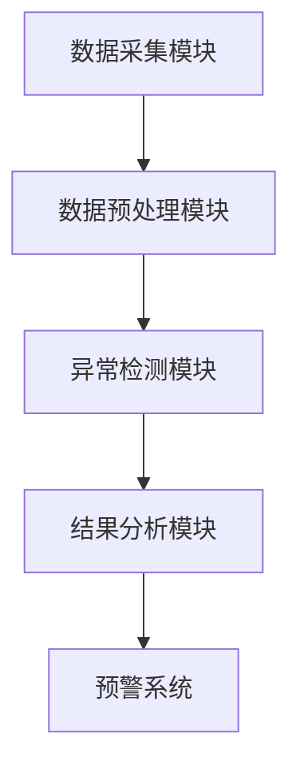

                 


# 异常检测：识别AI Agent的非正常行为

## 关键词：异常检测，AI Agent，机器学习，深度学习，系统架构

## 摘要：  
在AI Agent的广泛应用背景下，异常检测技术成为识别非正常行为的关键手段。本文系统性地介绍了异常检测的核心概念、算法原理、系统架构设计及项目实战，帮助读者全面理解并掌握如何在AI Agent中识别异常行为。

---

## 第一部分：背景介绍

### 第1章：异常检测的基本概念

#### 1.1 异常检测的定义与背景
- **什么是异常检测？**  
  异常检测是指通过分析数据，识别出与预期模式或行为显著不同的数据点或事件。在AI Agent中，这可以帮助识别潜在的安全威胁、系统故障或异常操作。

- **异常检测的重要性**  
  在金融、医疗、网络安全等领域，异常检测能够及时发现异常行为，避免重大损失。AI Agent作为智能化系统，其异常检测能力直接影响系统的可靠性和用户体验。

- **AI Agent中的异常检测**  
  AI Agent通常通过与环境交互，执行复杂任务。异常检测在这些任务中起到关键作用，例如识别异常的用户输入或系统响应。

#### 1.2 问题背景与描述
- **问题背景**  
  AI Agent在运行过程中可能因为数据污染、系统故障或恶意攻击而产生异常行为。及时发现这些异常行为，可以避免系统崩溃或数据泄露。

- **问题描述**  
  异常行为可能表现为数据分布的突变、行为模式的改变或时间序列中的异常波动。识别这些行为需要结合数据特征和上下文信息。

- **问题解决思路**  
  异常检测通常采用数据驱动的方法，利用统计分析或机器学习技术，识别数据中的异常点。同时，结合领域知识可以提高检测的准确性。

---

### 第2章：异常检测的核心概念

#### 2.1 异常检测的分类
- **基于统计的方法**  
  使用统计学模型，如正态分布、箱线图等，识别偏离期望分布的数据点。

- **基于机器学习的方法**  
  使用无监督学习算法，如LOF、Isolation Forest，识别数据中的异常点。

- **基于深度学习的方法**  
  利用神经网络模型，如Autoencoder和GAN，捕捉数据中的异常特征。

| 方法类型 | 优势 | 劣势 |
|----------|------|------|
| 统计方法 | 实现简单，计算高效 | 依赖数据分布假设 |
| 机器学习 | 高准确性，适合复杂数据 | 对噪声敏感 |
| 深度学习 | 强大学习能力 | 训练时间长，需要大量数据 |

#### 2.2 异常检测的关键特征
- **数据分布的偏离**  
  异常点通常位于数据分布的尾部区域，远离大部分数据点。

- **时间序列中的突变**  
  在时间序列数据中，异常点可能表现为突然的数值跳跃或趋势变化。

- **行为模式的改变**  
  异常行为可能表现为与正常行为模式显著不同的行为序列。

#### 2.3 异常检测与监督学习的对比
- **监督学习**  
  需要标记的训练数据，适用于已知异常类别的情况。

- **无监督学习**  
  无需标记数据，适用于未知异常模式的情况。

- **半监督学习**  
  结合少量标记数据和大量未标记数据，适用于部分已知异常的情况。

---

### 第3章：基于机器学习的异常检测算法

#### 3.1 LOF算法
- **原理**  
  LOF（局部 outlier factor）通过计算数据点的局部密度来评估其异常程度。密度越低的区域，异常点的可能性越高。

- **实现步骤**
  1. 计算每个数据点的局部密度。
  2. 根据密度比值确定异常分数。
  3. 根据阈值筛选出异常点。

- **优缺点**
  - 优点：能够捕捉局部异常，适用于数据分布复杂的情况。
  - 缺点：计算复杂度较高，适合中小规模数据集。

#### 3.2 Isolation Forest算法
- **原理**  
  Isolation Forest通过构建隔离树，将数据点分离到叶子节点。异常点通常需要较少的划分步骤被隔离。

- **实现步骤**
  1. 构建随机划分的决策树。
  2. 计算每个数据点的异常分数。
  3. 根据阈值筛选出异常点。

- **优缺点**
  - 优点：计算效率高，适合大规模数据集。
  - 缺点：对噪声数据敏感，可能误判正常数据为异常。

#### 3.3 算法比较与选择
- **LOF与Isolation Forest的比较**
  - LOF更适合局部异常检测，Isolation Forest适合全局异常检测。
  - Isolation Forest计算效率更高，但对噪声更敏感。

- **算法选择的依据**
  - 数据规模：Isolation Forest适合大数据集，LOF适合小数据集。
  - 异常类型：LOF适合局部异常，Isolation Forest适合全局异常。

---

### 第4章：异常检测的数学模型

#### 4.1 基于统计的异常检测
- **正态分布模型**  
  假设数据服从正态分布，计算每个数据点的Z分数，超过阈值的点被视为异常。

  $$ Z = \frac{x - \mu}{\sigma} $$
  
  其中，$\mu$为均值，$\sigma$为标准差。

- **箱线图模型**  
  根据四分位数定义异常点，数据点超过上下四分位数的一定倍数范围即为异常。

- **马氏距离模型**  
  考虑多维数据的协方差矩阵，计算每个数据点的马氏距离，超过阈值的点被视为异常。

  $$ D = (x - \mu)^T \Sigma^{-1} (x - \mu) $$

  其中，$\Sigma$为协方差矩阵。

#### 4.2 基于机器学习的异常检测
- **无监督学习模型**  
  使用聚类算法（如K-Means）或密度估计算法（如DBSCAN）识别异常点。

- **半监督学习模型**  
  使用少量标记数据进行预训练，再利用无监督算法检测异常。

---

### 第5章：系统分析与架构设计

#### 5.1 问题场景介绍
- **用户行为分析**  
  在金融交易中，检测异常交易行为，防止欺诈。

#### 5.2 系统功能设计
- **数据采集模块**  
  采集实时数据，包括用户行为、系统日志等。

- **数据预处理模块**  
  对数据进行清洗、标准化处理，确保数据质量。

- **异常检测模块**  
  使用机器学习模型，识别异常数据点或行为序列。

- **结果分析模块**  
  对检测结果进行分析，生成报告或触发预警机制。

#### 5.3 系统架构设计



---

### 第6章：项目实战

#### 6.1 环境安装
- **安装Python**：确保安装Python 3.8及以上版本。
- **安装依赖库**：使用pip安装numpy、scikit-learn、tensorflow等库。

#### 6.2 核心实现
- **数据预处理**  
  使用Pandas进行数据清洗和特征提取。

  ```python
  import pandas as pd
  df = pd.read_csv('data.csv')
  df.dropna(inplace=True)
  ```

- **模型训练**  
  使用Isolation Forest算法训练模型。

  ```python
  from sklearn.ensemble import IsolationForest
  model = IsolationForest(random_state=42)
  model.fit(X_train)
  ```

- **结果分析**  
  对异常点进行可视化分析，使用Matplotlib或Seaborn。

  ```python
  import matplotlib.pyplot as plt
  plt.scatter(X_train, y_train, c=model.predict(X_train), cmap='viridis')
  plt.show()
  ```

#### 6.3 案例分析
- **异常行为检测**  
  在用户行为数据中，检测出异常交易行为，及时阻止欺诈交易。

#### 6.4 项目小结
- **代码实现**  
  提供完整的Python代码，包括数据处理、模型训练和结果分析。

---

### 第7章：最佳实践与小结

#### 7.1 最佳实践
- **数据质量**  
  确保数据的完整性和准确性，避免噪声干扰。

- **模型调优**  
  根据具体场景调整模型参数，提高检测准确率。

- **实时检测**  
  在流数据中实现实时异常检测，减少延迟。

#### 7.2 小结
异常检测是识别AI Agent非正常行为的重要技术，结合统计方法、机器学习和深度学习，可以有效提升检测精度。实际应用中，需注重数据质量、模型调优和实时性要求。

---

## 总结

通过本文的系统介绍，读者可以全面理解异常检测的核心概念、算法原理和系统架构。结合实际项目案例，掌握如何在AI Agent中识别非正常行为，提升系统的安全性和可靠性。

---

## 作者

作者：AI天才研究院/AI Genius Institute & 禅与计算机程序设计艺术 /Zen And The Art of Computer Programming

