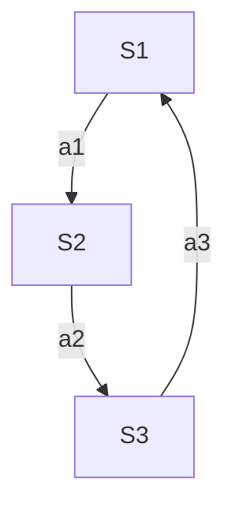

                 


# 强化学习在AI Agent个性化推荐中的应用

## 关键词：强化学习、AI Agent、个性化推荐、推荐系统、机器学习

## 摘要：
本文深入探讨了强化学习在AI Agent个性化推荐中的应用，系统地介绍了强化学习的基本概念、算法原理及其在推荐系统中的应用。文章从强化学习与推荐系统的结合出发，分析了AI Agent在个性化推荐中的角色与价值，详细讲解了强化学习算法的数学模型和应用场景，结合实际案例展示了如何通过强化学习提升推荐系统的个性化和实时性。最后，文章总结了强化学习在推荐系统中的优势与挑战，并展望了未来的发展方向。

---

# 第3章: 强化学习算法原理

## 3.1 马尔可夫决策过程（MDP）

### 3.1.1 MDP的定义与数学模型
马尔可夫决策过程（MDP）是强化学习的基础模型，描述了智能体在环境中的决策过程。其核心要素包括：

- **状态（State）**：环境的当前情况，表示为 $s$。
- **动作（Action）**：智能体可执行的操作，表示为 $a$。
- **奖励（Reward）**：智能体执行动作后获得的反馈，表示为 $r$。
- **策略（Policy）**：决定智能体在状态 $s$ 下选择动作 $a$ 的概率分布，表示为 $\pi(a|s)$。
- **值函数（Value Function）**：衡量一个状态或动作的长期价值，包括状态值函数 $V(s)$ 和动作值函数 $Q(s,a)$。

### 3.1.2 MDP的数学模型
MDP可以用五元组 $(S, A, P, R, \gamma)$ 表示，其中：
- $S$：状态集合。
- $A$：动作集合。
- $P(s'|s,a)$：从状态 $s$ 执行动作 $a$ 后转移到状态 $s'$ 的概率。
- $R(s,a,s')$：执行动作 $a$ 后从状态 $s$ 转移到状态 $s'$ 所获得的奖励。
- $\gamma$：折扣因子，表示未来奖励的当前价值，$0 \leq \gamma \leq 1$。

### 3.1.3 MDP的状态转移图
以下是一个简单的MDP示例，展示状态之间的转移关系：



每个状态通过执行不同的动作转移到其他状态，并获得相应的奖励。

## 3.2 基于值函数的强化学习算法

### 3.2.1 值函数的定义
- **状态值函数 $V(s)$**：在状态 $s$ 下，按照策略 $\pi$ 执行的所有动作的期望奖励总和。
  $$ V(s) = E[R_t | s_t = s, \pi] $$
- **动作值函数 $Q(s,a)$**：在状态 $s$ 下执行动作 $a$ 后的期望奖励总和。
  $$ Q(s,a) = E[R_t | s_t = s, a_t = a, \pi] $$

### 3.2.2 Q-learning算法
Q-learning是一种经典的值迭代算法，适用于离线环境。其算法流程如下：

```mermaid
graph TD
    S -->|a| S'
    S -->|r| R
    S -->|Q更新| Q[s][a] = Q[s][a] + α*(r + γ*max_{a'} Q[s'][a'] - Q[s][a])
```

数学公式为：
$$ Q(s,a) = Q(s,a) + \alpha \left( r + \gamma \max_{a'} Q(s',a') - Q(s,a) \right) $$

其中，$\alpha$ 是学习率，$\gamma$ 是折扣因子。

### 3.2.3 策略评估与改善
- **策略评估**：通过动态规划计算策略 $\pi$ 的值函数 $V_\pi(s)$。
  $$ V_\pi(s) = r(s, a, s') + \gamma V_\pi(s') $$
- **策略改善**：通过值函数提升策略，确保每次改善都能增加值函数。

### 3.2.4 动态规划算法
动态规划（DP）通过迭代更新值函数来优化策略。其算法流程如下：

```mermaid
graph TD
    S -->|V更新| V_new
    V_new -->|策略改善| π_new
    π_new -->|循环直到收敛|
```

## 3.3 策略搜索方法

### 3.3.1 策略评估与搜索
- **策略评估**：计算策略 $\pi$ 的值函数。
- **策略搜索**：直接优化策略，常用梯度上升方法。

### 3.3.2 策略梯度法
策略梯度法通过优化策略的参数 $\theta$ 来最大化奖励。其数学公式为：
$$ \nabla J(\theta) = E[\nabla \log \pi(a|s) Q(s,a)] $$

### 3.3.3 策略迭代流程
策略迭代包括评估和改进两个步骤，确保每次迭代都能提高策略的质量。

### 3.3.4 策略梯度法的优缺点
- **优点**：无需值函数，直接优化策略。
- **缺点**：计算复杂，需要多次迭代。

---

通过以上章节，我们详细讲解了强化学习算法的原理和应用，为后续在AI Agent个性化推荐中的实践奠定了理论基础。

