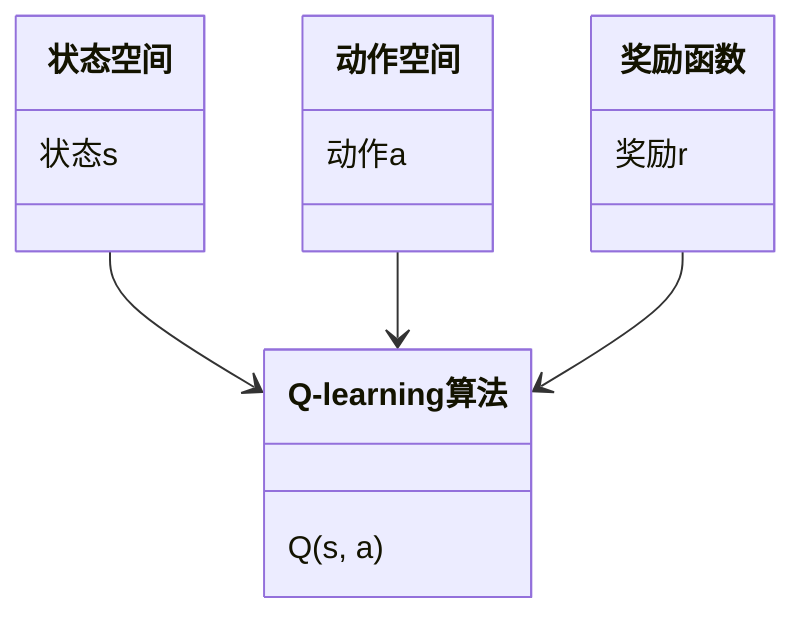
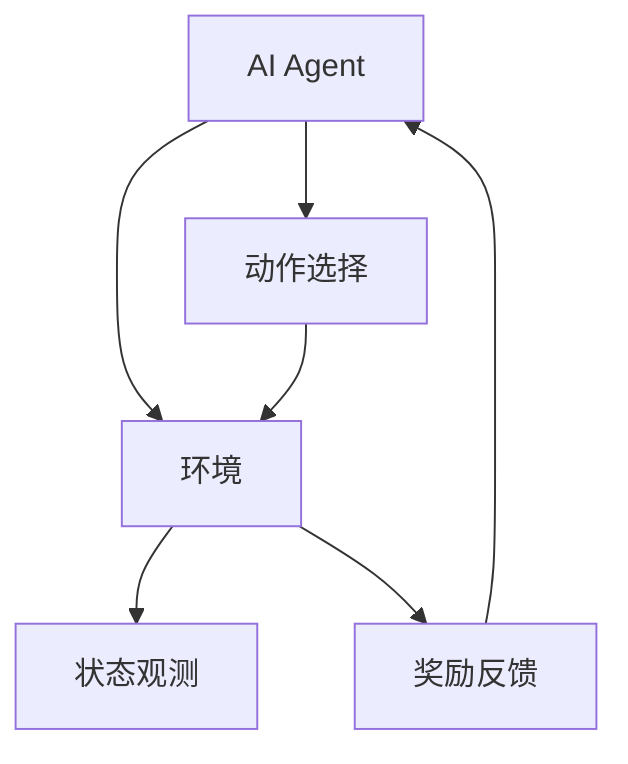

                 


# 《强化学习在AI Agent中的应用：优化LLM的决策》

---

## 关键词：
强化学习, AI Agent, 大语言模型, 决策优化, 算法实现, 系统架构, 应用案例

---

## 摘要：
本文探讨了强化学习在AI Agent中的应用，特别是在优化大语言模型（LLM）决策方面的作用。通过分析强化学习的核心原理、算法实现和系统架构，结合实际案例，本文展示了如何通过强化学习提升AI Agent的决策能力，从而优化LLM的表现。

---

# 第1章: 强化学习与AI Agent概述

## 1.1 强化学习的基本概念
### 1.1.1 强化学习的定义与特点
强化学习是一种机器学习范式，通过智能体与环境的交互，学习如何做出决策以最大化累计奖励。其特点包括：探索与利用的平衡、基于奖励的反馈机制、以及策略的逐步优化。

### 1.1.2 AI Agent的定义与分类
AI Agent是能够感知环境并采取行动以实现目标的智能体。分类包括基于规则的Agent、基于模型的Agent、强化学习Agent等。

### 1.1.3 强化学习在AI Agent中的作用
强化学习为AI Agent提供了自适应决策的能力，使其能够在动态环境中不断优化行为策略。

## 1.2 强化学习的核心概念
### 1.2.1 状态、动作、奖励的定义
- **状态**：环境中的当前情况。
- **动作**：智能体采取的行为。
- **奖励**：对智能体行为的反馈。

### 1.2.2 马尔可夫决策过程（MDP）
MDP定义了一个完整的决策环境，包括状态、动作、转移概率和奖励函数。

### 1.2.3 策略与价值函数的定义
- **策略**：决定动作选择的规则。
- **价值函数**：评估状态或动作的价值。

## 1.3 AI Agent中的强化学习应用
### 1.3.1 强化学习在游戏AI中的应用
通过强化学习训练游戏AI，使其能够在复杂环境中做出最优决策。

### 1.3.2 强化学习在机器人控制中的应用
强化学习用于优化机器人的运动控制，使其在动态环境中灵活应对。

### 1.3.3 强化学习在自然语言处理中的应用
强化学习用于优化LLM的决策过程，提升其生成结果的质量和相关性。

## 1.4 本章小结
本章介绍了强化学习的基本概念和AI Agent的分类，探讨了强化学习在AI Agent中的应用，为后续章节奠定了基础。

---

# 第2章: 强化学习的核心原理与数学模型

## 2.1 马尔可夫决策过程（MDP）的数学模型
### 2.1.1 状态空间的定义
状态空间是所有可能状态的集合，用S表示。

### 2.1.2 动作空间的定义
动作空间是所有可能动作的集合，用A表示。

### 2.1.3 奖励函数的定义
奖励函数r(s, a)定义了在状态s采取动作a后获得的奖励。

## 2.2 Q-learning算法的数学推导
### 2.2.1 Q-learning的基本公式
Q-learning的目标是学习Q(s, a)，即在状态s采取动作a后的期望奖励。

$$ Q(s, a) = Q(s, a) + \alpha [r + \gamma \max Q(s', a') - Q(s, a)] $$

### 2.2.2 Q-learning的更新规则
Q-learning通过更新Q表来逼近最优策略。

## 2.3 策略梯度方法的数学推导
### 2.3.1 策略梯度的基本公式
策略梯度方法通过梯度上升优化策略函数。

$$ \theta \leftarrow \theta + \alpha \nabla_\theta J(\theta) $$

## 2.4 本章小结
本章详细推导了Q-learning和策略梯度的核心数学模型，为后续算法实现提供了理论基础。

---

# 第3章: 强化学习算法的实现与优化

## 3.1 Q-learning算法的实现
### 3.1.1 Q-learning算法的伪代码实现
```python
初始化Q表为全零
while True:
    状态s = 环境观测
    动作a = 选择动作（探索与利用）
    状态s' = 执行动作a后的新状态
    奖励r = 环境反馈
    Q(s, a) = Q(s, a) + α( r + γ max Q(s', a') - Q(s, a) )
```

### 3.1.2 Q-learning算法的参数设置
- 学习率α：通常在0.01到0.1之间。
- 折扣率γ：通常在0.9到0.99之间。

## 3.2 Deep Q-Networks（DQN）的实现
### 3.2.1 DQN的基本结构
DQN由一个神经网络近似Q函数，使用经验回放和目标网络优化。

### 3.2.2 DQN的伪代码实现
```python
初始化经验回放池
初始化目标网络和评估网络
while True:
    状态s = 环境观测
    动作a = 选择动作（探索与利用）
    状态s' = 执行动作a后的新状态
    奖励r = 环境反馈
    经验回放池.add((s, a, r, s'))
    从经验回放池中采样小批量数据
    训练评估网络
    更新目标网络
```

## 3.3 本章小结
本章详细讲解了Q-learning和DQN的实现，介绍了优化方法和参数设置。

---

# 第4章: AI Agent中的强化学习系统架构设计

## 4.1 问题场景介绍
设计一个AI Agent，通过强化学习优化LLM的决策过程。

## 4.2 系统功能设计
### 4.2.1 领域模型设计
使用Mermaid绘制领域模型类图，展示各组件之间的关系。



## 4.3 系统架构设计
### 4.3.1 系统架构设计
使用Mermaid绘制系统架构图，展示各模块的交互。



## 4.4 本章小结
本章通过系统架构设计，展示了强化学习在AI Agent中的实现过程。

---

# 第5章: 强化学习优化LLM的项目实战

## 5.1 环境安装
安装必要的库，如TensorFlow、Keras和OpenAI Gym。

## 5.2 系统核心实现源代码
### 5.2.1 Q-learning实现代码
```python
import numpy as np

class QLearning:
    def __init__(self, state_space, action_space):
        self.q_table = np.zeros((state_space, action_space))
        self.alpha = 0.1
        self.gamma = 0.9

    def choose_action(self, state):
        return np.random.argmax(self.q_table[state])

    def learn(self, state, action, reward, next_state):
        self.q_table[state, action] += self.alpha * (reward + self.gamma * np.max(self.q_table[next_state]) - self.q_table[state, action])
```

### 5.2.2 DQN实现代码
```python
import numpy as np
import tensorflow as tf

class DQN:
    def __init__(self, input_dim, output_dim):
        self.model = self.build_model()
        self.target_model = self.build_model()
        self.model.compile(optimizer='adam', loss='mse')
        self.target_model.compile(optimizer='adam', loss='mse')
        self.memory = []
        self.batch_size = 32
        self.gamma = 0.99
        self.epsilon = 1.0

    def build_model(self):
        model = tf.keras.Sequential()
        model.add(tf.keras.layers.Dense(64, activation='relu', input_dim=input_dim))
        model.add(tf.keras.layers.Dense(output_dim))
        return model

    def remember(self, state, action, reward, next_state):
        self.memory.append((state, action, reward, next_state))

    def epsilon_greedy_policy(self, state):
        if np.random.random() < self.epsilon:
            return np.random.randint(action_space)
        else:
            return np.argmax(self.model.predict(state.reshape(1, -1))[0])

    def train(self):
        if len(self.memory) < self.batch_size:
            return
        minibatch = np.random.choice(len(self.memory), self.batch_size)
        X = []
        y = []
        for i in minibatch:
            state, action, reward, next_state = self.memory[i]
            target = reward + self.gamma * np.max(self.target_model.predict(next_state.reshape(1, -1))[0])
            target = target if np.random.random() < 0.5 else reward
            X.append(state)
            y.append(target)
        self.model.fit(np.array(X), np.array(y), epochs=1, verbose=0)
        self.epsilon = max(0.01, self.epsilon * 0.99)
```

## 5.3 代码应用解读与分析
解释代码实现，分析优化效果和训练过程。

## 5.4 实际案例分析
通过具体案例展示强化学习优化LLM决策的效果。

## 5.5 本章小结
本章通过实际项目展示了强化学习在优化LLM决策中的应用，验证了理论的有效性。

---

# 第6章: 强化学习优化LLM的实践与展望

## 6.1 最佳实践 tips
总结强化学习优化LLM的实践经验，包括算法选择、参数调整和性能优化。

## 6.2 小结
回顾全文，总结强化学习在AI Agent中的应用及其对LLM决策优化的重要作用。

## 6.3 注意事项
提醒读者注意训练中的过拟合、梯度爆炸等问题，并提出解决方案。

## 6.4 拓展阅读
推荐进一步学习的资源，如强化学习的最新研究和应用案例。

---

# 作者：AI天才研究院/AI Genius Institute & 禅与计算机程序设计艺术 /Zen And The Art of Computer Programming

---

希望这篇博客文章能够为读者提供清晰、全面的强化学习在AI Agent中优化LLM决策的知识。

