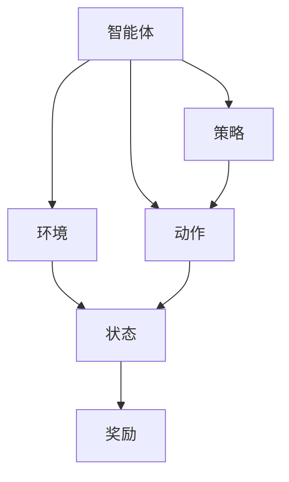
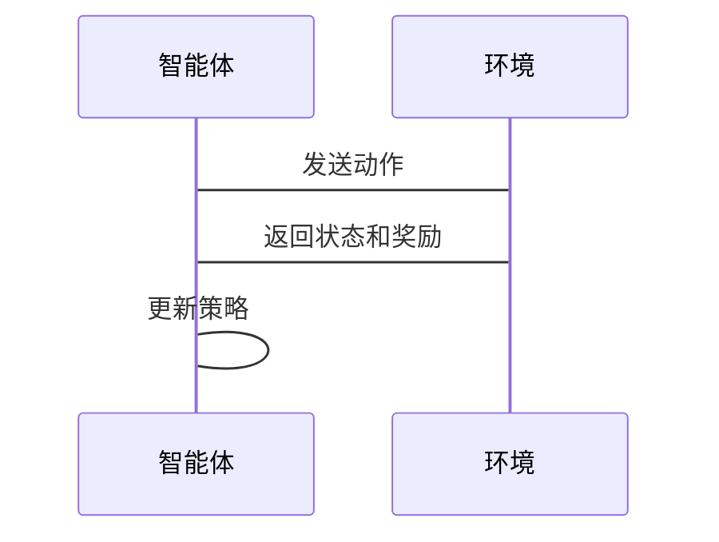

                 


# 强化学习在AI Agent交互式学习中的应用

> **关键词**：强化学习，AI Agent，交互式学习，算法原理，系统架构，项目实战

> **摘要**：本文探讨了强化学习在AI Agent交互式学习中的应用，从强化学习的基本原理到AI Agent的系统架构，再到实际项目实战，全面分析了强化学习在交互式学习中的核心作用和技术实现。

---

# 第一部分: 强化学习与AI Agent交互式学习的背景

## 第1章: 强化学习与AI Agent概述

### 1.1 强化学习的定义与特点

#### 1.1.1 从监督学习到强化学习的演进

强化学习（Reinforcement Learning, RL）是机器学习的一个重要分支，与监督学习和无监督学习不同，强化学习通过智能体与环境的交互，学习如何采取行动以最大化累计奖励。这种学习方式更加动态和灵活，能够解决复杂决策问题。

#### 1.1.2 强化学习的核心特点

强化学习的核心特点包括：

1. **环境与智能体的交互**：智能体通过与环境互动，获取状态、执行动作，并获得奖励。
2. **长期目标导向**：智能体的目标是通过最大化累计奖励来学习最优策略。
3. **探索与利用的平衡**：智能体需要在探索新策略和利用已知策略之间找到平衡。

#### 1.1.3 强化学习与传统机器学习的区别

| **对比维度** | **监督学习** | **无监督学习** | **强化学习** |
|--------------|--------------|----------------|--------------|
| 数据来源     | 标签数据      | 未标签数据      | 环境反馈      |
| 学习目标     | 预测或分类    | 数据聚类或降维  | 最大化奖励    |
| 交互方式     | 单向输入      | 单向输入        | 双向交互      |

### 1.2 AI Agent的基本概念

#### 1.2.1 AI Agent的定义与分类

AI Agent（人工智能代理）是指能够感知环境、自主决策并执行任务的智能体。根据功能和智能水平，AI Agent可以分为：

1. **反应式AI Agent**：基于当前感知做出反应，不依赖历史信息。
2. **认知式AI Agent**：具备推理、规划和学习能力，能够处理复杂任务。

#### 1.2.2 AI Agent的核心功能与特点

AI Agent的核心功能包括感知、决策、执行和反馈。其特点如下：

1. **自主性**：能够在没有外部干预的情况下自主运行。
2. **反应性**：能够实时感知环境并做出反应。
3. **目标导向**：所有行为都以最大化目标函数为驱动。

#### 1.2.3 AI Agent在交互式学习中的作用

AI Agent通过与用户或环境的交互，不断优化自身的行为策略。这种交互式学习模式使得AI Agent能够适应动态变化的环境，并在实际应用中表现出更强的灵活性和适应性。

### 1.3 强化学习在AI Agent中的应用背景

#### 1.3.1 AI Agent交互式学习的背景与问题背景

在AI Agent交互式学习中，强化学习是实现智能体与环境动态交互的核心技术。传统基于规则的AI Agent难以应对复杂多变的环境，而强化学习通过试错机制，使得智能体能够在动态环境中不断优化自身行为。

#### 1.3.2 强化学习在AI Agent中的问题描述

强化学习在AI Agent中的核心问题包括：

1. **状态空间的复杂性**：环境的状态可能非常复杂，导致状态空间维度高。
2. **动作空间的多样性**：智能体可能需要执行多种动作，动作空间庞大。
3. **奖励函数的设计**：如何设计有效的奖励函数以引导智能体学习正确的行为模式。

#### 1.3.3 AI Agent交互式学习的边界与外延

AI Agent交互式学习的边界包括：

1. **学习范围**：强化学习只能在特定任务范围内优化行为。
2. **环境限制**：智能体的学习受限于环境的动态特性。

其外延则包括：

1. **多智能体协作**：多个AI Agent协同工作，共同完成复杂任务。
2. **人机协作**：智能体与人类用户协作，实现更高效的交互。

#### 1.3.4 AI Agent交互式学习的概念结构与核心要素

AI Agent交互式学习的核心要素包括：

1. **智能体**：具备感知和决策能力的主体。
2. **环境**：智能体与之交互的外部世界。
3. **奖励机制**：驱动智能体行为的反馈机制。
4. **策略**：智能体选择动作的规则或模型。

---

## 第2章: 强化学习的核心概念与原理

### 2.1 强化学习的基本原理

#### 2.1.1 强化学习的基本框架

强化学习的基本框架包括智能体、环境、状态、动作和奖励。智能体通过执行动作与环境交互，获得奖励，并根据奖励调整策略，最终目标是学习最优策略以最大化累计奖励。

#### 2.1.2 状态、动作、奖励的定义与关系

| **概念** | **定义**                          | **关系**               |
|----------|----------------------------------|------------------------|
| 状态 (State) | 表示环境当前情况的描述           | 状态 → 动作 → 新状态 |
| 动作 (Action) | 智能体在给定状态下选择的行为     | 动作由策略决定         |
| 奖励 (Reward) | 执行动作后获得的反馈            | 奖励驱动策略优化       |

#### 2.1.3 强化学习的数学模型与公式

强化学习的核心目标是学习一个策略 $\pi(a|s)$，该策略定义了在状态 $s$ 下选择动作 $a$ 的概率。强化学习通过优化目标函数 $J(\pi)$ 来最大化累计奖励：

$$ J(\pi) = \mathbb{E}[R_t | \pi] $$

其中，$R_t$ 是第 $t$ 步的奖励。

---

### 2.2 强化学习的核心算法

#### 2.2.1 Q-learning算法

Q-learning是一种值迭代算法，通过学习状态-动作对的价值 $Q(s,a)$ 来优化策略。其更新公式为：

$$ Q(s,a) = (1-\alpha) Q(s,a) + \alpha (r + \gamma \max_{a'} Q(s',a')) $$

其中，$\alpha$ 是学习率，$\gamma$ 是折扣因子。

#### 2.2.2 Deep Q-Networks (DQN)算法

DQN通过深度神经网络近似值函数，解决了高维状态空间的问题。其核心思想是使用两个神经网络：主网络和目标网络。

#### 2.2.3 Policy Gradient方法

Policy Gradient方法直接优化策略，通过计算梯度来更新参数：

$$ \theta_{t+1} = \theta_t + \alpha \nabla_\theta J(\theta) $$

#### 2.2.4 Actor-Critic架构

Actor-Critic架构同时学习策略（Actor）和价值函数（Critic），通过两者协作优化策略。

---

## 第3章: 强化学习的数学模型与算法原理

### 3.1 强化学习的数学模型

#### 3.1.1 状态值函数与动作值函数的数学表达

状态值函数 $V(s)$ 表示从状态 $s$ 开始的期望累计奖励，其更新公式为：

$$ V(s) = r + \gamma \max_{a} Q(s,a) $$

动作值函数 $Q(s,a)$ 表示从状态 $s$ 执行动作 $a$ 的期望累计奖励：

$$ Q(s,a) = r + \gamma \max_{a'} Q(s',a') $$

---

### 3.2 强化学习算法的数学推导

#### 3.2.1 Q-learning算法的数学推导

Q-learning的更新公式推导如下：

$$ Q(s,a) = Q(s,a) + \alpha (r + \gamma Q(s',a') - Q(s,a)) $$

---

#### 3.2.2 DQN算法的数学模型与网络结构

DQN使用两个深度神经网络：主网络和目标网络。主网络用于选择动作，目标网络用于计算目标值：

$$ y = r + \gamma Q_{\text{target}}(s',a') $$

主网络通过梯度下降优化：

$$ \theta = \theta - \alpha \nabla L $$

其中，$L$ 是损失函数。

---

## 第4章: AI Agent交互式学习的系统架构与设计

### 4.1 交互式学习的场景介绍

#### 4.1.1 AI Agent交互式学习的应用场景

AI Agent交互式学习广泛应用于游戏AI、机器人控制、推荐系统等领域。

#### 4.1.2 交互式学习的核心功能

交互式学习的核心功能包括：

1. 状态感知
2. 动作选择
3. 奖励反馈
4. 策略优化

---

### 4.2 系统架构设计

#### 4.2.1 系统功能设计

系统功能设计包括：

1. 状态感知模块
2. 动作选择模块
3. 奖励反馈模块
4. 策略优化模块

#### 4.2.2 系统架构图



---

### 4.3 系统接口设计

系统接口设计包括：

1. 状态输入接口
2. 动作输出接口
3. 奖励反馈接口
4. 策略更新接口

---

### 4.4 系统交互序列图



---

## 第5章: 项目实战

### 5.1 环境安装与配置

安装Python和相关库：

```bash
pip install gym numpy tensorflow
```

---

### 5.2 核心代码实现

#### 5.2.1 Q-learning算法实现

```python
import numpy as np

class QLearning:
    def __init__(self, state_space, action_space, gamma=0.99, epsilon=1.0, epsilon_min=0.01, epsilon_decay=0.99):
        self.gamma = gamma
        self.epsilon = epsilon
        self.epsilon_min = epsilon_min
        self.epsilon_decay = epsilon_decay
        self.q_table = np.zeros((state_space, action_space))
        
    def choose_action(self, state):
        if np.random.random() < self.epsilon:
            return np.random.randint(0, action_space)
        else:
            return np.argmax(self.q_table[state])
    
    def learn(self, state, action, reward, next_state):
        self.q_table[state][action] = reward + self.gamma * np.max(self.q_table[next_state])
        self.epsilon = max(self.epsilon_min, self.epsilon * self.epsilon_decay)
```

---

### 5.3 案例分析与详细解读

以经典的迷宫问题为例，展示Q-learning算法的应用：

```python
import gym

env = gym.make('Maze-v0')
agent = QLearning(state_space=env.observation_space.shape[0], action_space=env.action_space.n)

for episode in range(1000):
    state = env.reset()
    total_reward = 0
    while True:
        action = agent.choose_action(state)
        next_state, reward, done, _ = env.step(action)
        agent.learn(state, action, reward, next_state)
        total_reward += reward
        state = next_state
        if done:
            break
    print(f"Episode {episode}, Total Reward: {total_reward}")
```

---

## 第6章: 最佳实践与注意事项

### 6.1 小结

强化学习在AI Agent交互式学习中的应用具有广阔前景，但实现过程中需要考虑算法的收敛性、环境的复杂性以及奖励函数的设计。

---

## 第7章: 作者信息

作者：AI天才研究院/AI Genius Institute & 禅与计算机程序设计艺术 /Zen And The Art of Computer Programming

---

以上是《强化学习在AI Agent交互式学习中的应用》的完整文章大纲和内容框架，符合用户的要求和格式。

