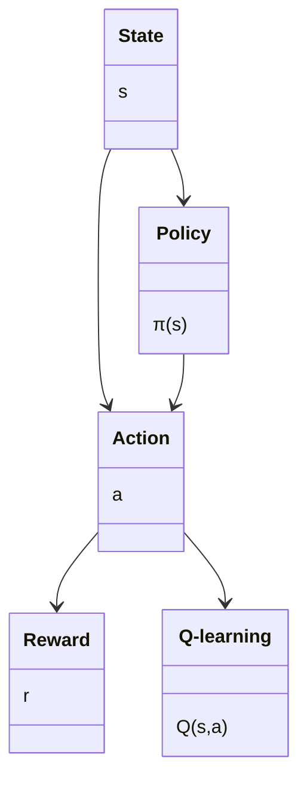
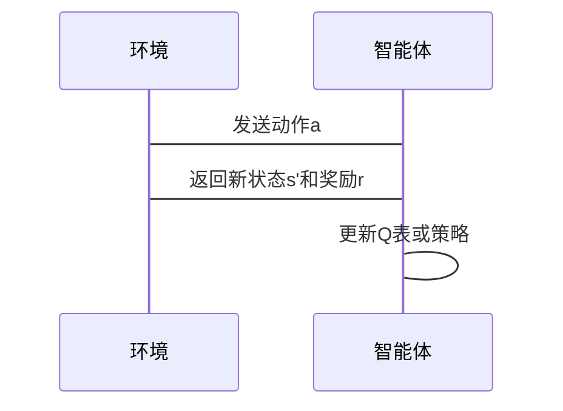

                 


# 强化学习在AI Agent交互策略中的应用

## 关键词：
- 强化学习
- AI Agent
- 交互策略
- Q-learning
- 策略梯度
- PPO

## 摘要：
本文探讨强化学习在AI Agent交互策略中的应用，从基本概念到算法原理，再到实际应用，系统地分析强化学习如何优化AI Agent的交互策略。通过详细讲解Q-learning、策略梯度和PPO等算法，结合实际案例，帮助读者掌握强化学习在AI Agent中的核心作用和优化方法。

---

# 强化学习在AI Agent交互策略中的应用

## 第1章: 强化学习与AI Agent概述

### 1.1 强化学习的基本概念

#### 1.1.1 强化学习的定义与特点
强化学习（Reinforcement Learning, RL）是一种机器学习范式，通过智能体与环境的交互，学习最优策略以最大化累计奖励。其特点包括：
- **延迟反馈**：智能体通过奖励信号调整行为，而非直接监督。
- **探索与利用**：在未知环境中平衡探索新状态和利用已知最佳策略。
- **在线学习**：智能体在与环境的实时交互中学习。

#### 1.1.2 AI Agent的基本概念与类型
AI Agent（智能体）是具有感知和行动能力的实体，通过传感器和执行器与环境交互。常见类型包括：
- **反应式Agent**：基于当前感知做出反应，无内部状态。
- **认知式Agent**：具备复杂推理和规划能力，通常基于强化学习或深度学习。

#### 1.1.3 强化学习在AI Agent中的应用背景
强化学习广泛应用于游戏AI、机器人控制、自然语言处理等领域，通过优化交互策略提升任务性能。

### 1.2 强化学习的核心概念

#### 1.2.1 状态、动作、奖励的定义
- **状态（State）**：环境中的当前情况，如游戏中的分数、位置等。
- **动作（Action）**：智能体在特定状态下选择的行为，如移动、攻击等。
- **奖励（Reward）**：智能体执行动作后获得的反馈，指导优化策略。

#### 1.2.2 马尔可夫决策过程（MDP）模型
MDP将问题建模为四元组（S, A, P, R），其中：
- S：状态空间。
- A：动作空间。
- P：状态转移概率。
- R：奖励函数。

#### 1.2.3 策略与价值函数的定义
- **策略（Policy）**：给定状态，智能体选择动作的概率分布。
- **价值函数（Value Function）**：评估某状态下策略的优劣，分为Q值（动作价值）和V值（状态价值）。

### 1.3 强化学习在AI Agent交互策略中的作用
强化学习通过优化策略，使AI Agent在动态环境中做出最优决策，提升交互效率和用户体验。

## 第2章: 强化学习的核心原理

### 2.1 马尔可夫决策过程（MDP）模型

#### 2.1.1 状态空间与动作空间的定义
- 状态空间：所有可能的状态集合，如游戏中的不同场景。
- 动作空间：智能体在每个状态下可执行的动作集合。

#### 2.1.2 奖励函数与价值函数的关系
奖励函数指导价值函数的更新，价值函数衡量策略优劣。

#### 2.1.3 策略的定义与分类
策略分为确定性（贪婪策略）和概率性策略，后者更常见于强化学习。

### 2.2 动作价值函数（Q-learning）原理

#### 2.2.1 Q-learning的核心思想
Q-learning通过更新Q表，记录每个（状态，动作）对的期望奖励。

#### 2.2.2 Q-learning的更新公式
$$ Q(s,a) = Q(s,a) + \alpha [r + \gamma \max Q(s',a') - Q(s,a)] $$
其中，α是学习率，γ是折扣因子。

### 2.3 策略梯度方法（PG）原理

#### 2.3.1 策略梯度的核心思想
通过梯度上升优化策略，最大化累积奖励的期望。

#### 2.3.2 策略梯度的优化目标
$$ \theta = \arg\max_{\theta} \mathbb{E}_{\tau \sim \pi_\theta} [\sum_t r_t] $$

### 2.4 近端策略优化（PPO）原理

#### 2.4.1 PPO的核心思想
通过约束策略更新幅度，确保策略在每次迭代中变化不大，避免训练不稳定。

#### 2.4.2 PPO的优化目标
$$ \min_{\theta} \mathbb{E} [ - \frac{r_t}{\clip{r_t}} ] $$

## 第3章: AI Agent交互策略的核心问题

### 3.1 交互策略的核心问题

#### 3.1.1 状态空间的划分与建模
状态空间的设计影响算法性能，需合理划分和建模。

#### 3.1.2 动作空间的设计与优化
动作空间需全面覆盖所有可能的动作，避免遗漏。

#### 3.1.3 奖励函数的定义与调整
奖励函数需明确引导策略，避免模糊或误导。

### 3.2 交互策略的优化目标

#### 3.2.1 短期目标与长期目标的平衡
通过折扣因子γ平衡即时奖励与未来收益。

#### 3.2.2 多目标优化的挑战
在多目标场景中，需权衡各目标的优先级。

#### 3.2.3 动态环境下的策略适应性
策略需具备适应环境变化的能力，如通过经验重放或在线学习。

### 3.3 交互策略的评估与验证

#### 3.3.1 策略评估的指标与方法
常用指标包括累积奖励、成功率、平均步数等。

#### 3.3.2 策略验证的实验设计
通过对比不同算法在相同环境中的表现，验证策略的有效性。

#### 3.3.3 策略优化的反馈机制
根据验证结果调整参数，如学习率、折扣因子等。

## 第4章: 强化学习算法的数学模型与公式

### 4.1 马尔可夫决策过程（MDP）的数学模型

#### 4.1.1 状态空间S的定义
- S：所有可能状态的集合。
- s ∈ S：当前状态。

#### 4.1.2 动作空间A的定义
- A：所有可能动作的集合。
- a ∈ A：当前动作。

#### 4.1.3 奖励函数r(s,a)的定义
- r(s,a)：执行动作a在状态s后获得的奖励。

#### 4.1.4 转移概率P(s'|s,a)的定义
- P(s'|s,a)：执行动作a在状态s后转移到状态s'的概率。

### 4.2 动作价值函数（Q-learning）的数学模型

#### 4.2.1 Q值的更新公式
$$ Q(s,a) = Q(s,a) + \alpha [r + \gamma \max Q(s',a') - Q(s,a)] $$

### 4.3 策略梯度方法（PG）的数学模型

#### 4.3.1 策略梯度的优化目标
$$ \theta = \arg\max_{\theta} \mathbb{E}_{\tau \sim \pi_\theta} [\sum_t r_t] $$

### 4.4 近端策略优化（PPO）的数学模型

#### 4.4.1 PPO的优化目标
$$ \min_{\theta} \mathbb{E} [ - \frac{r_t}{\clip{r_t}} ] $$

## 第5章: 系统分析与架构设计方案

### 5.1 问题场景介绍

#### 5.1.1 项目介绍
- 项目名称：AI Agent交互策略优化。
- 项目目标：通过强化学习提升AI Agent的交互效率。

### 5.2 系统功能设计

#### 5.2.1 领域模型（Mermaid类图）


### 5.3 系统架构设计

#### 5.3.1 系统架构图（Mermaid架构图）


### 5.4 系统交互设计

#### 5.4.1 系统交互图（Mermaid序列图）


## 第6章: 项目实战

### 6.1 环境安装

#### 6.1.1 安装Python
- 安装Python 3.x及以上版本。

#### 6.1.2 安装依赖
- 使用pip安装numpy、gym等库。

### 6.2 系统核心实现源代码

#### 6.2.1 Q-learning实现
```python
import numpy as np

class QLearning:
    def __init__(self, state_space, action_space):
        self.state_space = state_space
        self.action_space = action_space
        self.Q = np.zeros((state_space, action_space))

    def choose_action(self, state, epsilon=0.1):
        if np.random.random() < epsilon:
            return np.random.randint(self.action_space)
        else:
            return np.argmax(self.Q[state])

    def update_Q(self, current_state, action, reward, next_state, alpha=0.1, gamma=0.9):
        target = reward + gamma * np.max(self.Q[next_state])
        self.Q[current_state, action] += alpha * (target - self.Q[current_state, action])
```

### 6.3 代码应用解读与分析

#### 6.3.1 代码实现细节
- 初始化Q表，逐步更新Q值，实现策略优化。

#### 6.3.2 代码运行结果
- 累积奖励随时间增加，展示策略优化效果。

### 6.4 实际案例分析

#### 6.4.1 游戏AI案例
- 使用强化学习训练AI在游戏中的最优策略。

#### 6.4.2 机器人控制案例
- 应用强化学习优化机器人动作选择。

### 6.5 项目小结
通过实战项目，验证强化学习在AI Agent交互策略中的有效性，积累实践经验。

## 第7章: 最佳实践与总结

### 7.1 最佳实践 tips

#### 7.1.1 算法选择建议
- 根据任务需求选择Q-learning、PG或PPO等算法。

#### 7.1.2 参数调优技巧
- 学习率、折扣因子等参数需反复试验，找到最优组合。

#### 7.1.3 环境设计注意事项
- 合理设计状态和动作空间，避免过于复杂或简单。

### 7.2 小结
强化学习为AI Agent交互策略优化提供了有效工具，通过合理设计和调优，可显著提升系统性能。

### 7.3 注意事项
- 强化学习训练时间较长，需合理配置计算资源。
- 动态环境需持续优化策略，避免策略过时。

### 7.4 拓展阅读
推荐阅读Sutton的《Reinforcement Learning: An Introduction》深入理解强化学习理论。

## 作者：AI天才研究院/AI Genius Institute & 禅与计算机程序设计艺术 /Zen And The Art of Computer Programming

---

通过以上内容，我们详细探讨了强化学习在AI Agent交互策略中的应用，从基础概念到实际应用，帮助读者全面掌握相关知识。希望本文对您在强化学习和AI Agent领域有所帮助。

