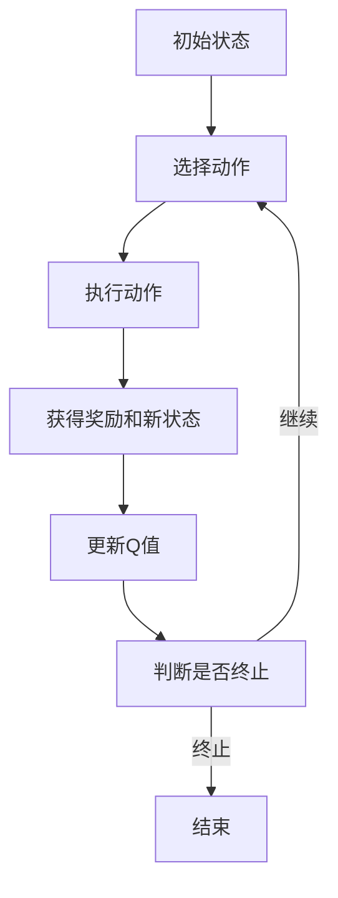
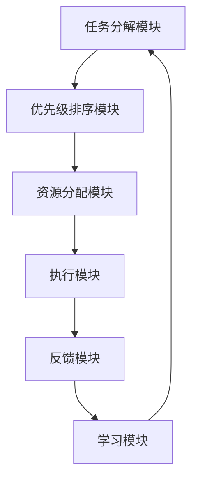
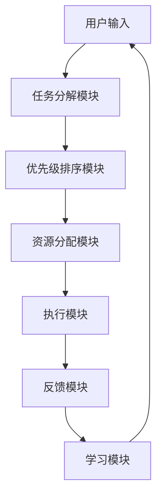

                 


# 强化学习在AI Agent任务规划中的应用

> 关键词：强化学习，AI Agent，任务规划，马尔可夫决策过程，深度强化学习

> 摘要：本文深入探讨了强化学习在AI Agent任务规划中的应用，从理论基础到系统架构，再到项目实战，全面分析了强化学习如何帮助AI Agent实现高效的任务规划。通过具体案例和数学模型，详细讲解了强化学习算法及其在实际系统中的应用。

---

## 第1章：强化学习与AI Agent概述

### 1.1 强化学习的基本概念

#### 1.1.1 什么是强化学习
强化学习是一种机器学习范式，通过智能体与环境的交互，学习如何做出决策以最大化累积奖励。与监督学习不同，强化学习不需要标记数据，而是通过试错和奖励机制进行学习。

#### 1.1.2 强化学习的核心要素
- **状态（State）**：智能体所处的环境状况。
- **动作（Action）**：智能体在状态下的行为。
- **奖励（Reward）**：智能体行为后获得的反馈，用于指导学习。
- **策略（Policy）**：决定智能体在某一状态下采取什么动作的规则。
- **价值函数（Value Function）**：评估某状态下采取某种动作的长期收益。

#### 1.1.3 强化学习与监督学习的区别
| 对比点       | 监督学习                     | 强化学习                     |
|--------------|------------------------------|------------------------------|
| 数据类型     | 标签数据                     | 环境反馈（奖励）              |
| 目标函数     | 最小化预测误差                | 最大化累积奖励                |
| 交互方式     | 非交互式                    | 交互式                      |

### 1.2 AI Agent的基本概念

#### 1.2.1 什么是AI Agent
AI Agent是指能够感知环境并自主决策的智能体，用于完成特定任务。例如，自动驾驶汽车、智能助手等。

#### 1.2.2 AI Agent的分类与特点
- **简单反射型Agent**：基于当前状态做出反应。
- **基于模型的反射型Agent**：维护环境模型，用于决策。
- **目标驱动型Agent**：根据目标选择行动。
- **效用驱动型Agent**：通过最大化效用来决策。

#### 1.2.3 AI Agent的任务规划问题
任务规划是AI Agent的核心问题，涉及任务分解、优先级排序和资源分配等。

### 1.3 强化学习在AI Agent任务规划中的应用

#### 1.3.1 强化学习在任务规划中的作用
强化学习通过试错和奖励机制，帮助AI Agent学习最优任务规划策略。

#### 1.3.2 任务规划的核心问题与挑战
- **任务分解**：将复杂任务分解为简单子任务。
- **任务优先级**：确定子任务的执行顺序。
- **多任务协调**：在多个任务间分配资源。

#### 1.3.3 强化学习在任务规划中的优势
- **自主学习**：无需大量标注数据。
- **适应性**：能适应动态变化的环境。

---

## 第2章：强化学习的理论基础

### 2.1 马尔可夫决策过程（MDP）

#### 2.1.1 MDP的定义与组成部分
MDP由状态空间、动作空间、转移概率和奖励函数组成。

#### 2.1.2 MDP的分类与特点
- **有限动作空间**：动作有限。
- **无限状态空间**：状态可能无限。

#### 2.1.3 MDP与任务规划的关系
任务规划可以看作是一个MDP问题，智能体在状态空间中选择动作以最大化累积奖励。

### 2.2 Q-learning算法

#### 2.2.1 Q-learning的基本原理
Q-learning通过更新Q值函数，学习状态-动作对的最优价值。

#### 2.2.2 Q-learning的算法流程


#### 2.2.3 Q-learning在任务规划中的应用
例如，智能体在迷宫中导航，通过Q-learning学习最优路径。

### 2.3 深度强化学习

#### 2.3.1 深度强化学习的定义与特点
深度强化学习结合深度学习和强化学习，用于处理高维状态空间。

#### 2.3.2 DQN算法的基本原理
DQN使用双神经网络，一个用于评估当前策略，另一个用于目标网络。

#### 2.3.3 深度强化学习在任务规划中的优势
适用于复杂环境，如多智能体协作和动态任务分配。

---

## 第3章：任务规划问题的强化学习建模

### 3.1 任务规划的核心问题

#### 3.1.1 任务分解与调度
将复杂任务分解为子任务，并确定执行顺序。

#### 3.1.2 任务优先级的确定
根据任务的重要性和紧迫性排序。

#### 3.1.3 多任务协调与优化
在多个任务间分配资源，确保整体效率最大化。

### 3.2 强化学习在任务规划中的建模方法

#### 3.2.1 状态空间的定义
状态空间可以是任务剩余时间、资源可用性等。

#### 3.2.2 动作空间的定义
动作可以是分配资源、执行任务或调整优先级。

#### 3.2.3 奖励函数的设计
奖励函数应反映任务完成的进度和资源消耗。

### 3.3 任务规划的强化学习模型

#### 3.3.1 基于状态的强化学习模型
基于当前状态直接选择动作。

#### 3.3.2 基于动作的强化学习模型
通过动作空间选择最优动作。

#### 3.3.3 基于策略的强化学习模型
直接生成最优策略。

---

## 第4章：AI Agent的体系结构与强化学习

### 4.1 AI Agent的体系结构

#### 4.1.1 基于状态的AI Agent结构
感知环境，根据状态选择动作。

#### 4.1.2 基于动作的AI Agent结构
通过动作空间进行决策。

#### 4.1.3 基于策略的AI Agent结构
直接生成策略。

### 4.2 强化学习在AI Agent中的应用

#### 4.2.1 基于Q-learning的AI Agent
适用于简单任务规划。

#### 4.2.2 基于DQN的AI Agent
适用于复杂任务，如多任务协调。

#### 4.2.3 基于策略梯度的AI Agent
适用于高维状态空间。

---

## 第5章：系统架构与接口设计

### 5.1 系统架构设计

#### 5.1.1 系统功能设计
包括任务分解、优先级排序和资源分配模块。

#### 5.1.2 系统架构图


### 5.2 系统接口设计

#### 5.2.1 系统内部接口
定义模块之间的数据交互接口。

#### 5.2.2 系统外部接口
定义与外部环境交互的接口。

### 5.3 系统交互图

#### 5.3.1 交互流程


---

## 第6章：项目实战

### 6.1 项目介绍

#### 6.1.1 项目目标
实现一个AI Agent，能够在动态环境中进行任务规划。

#### 6.1.2 技术选型
使用Q-learning算法，基于Python实现。

### 6.2 核心实现

#### 6.2.1 代码实现
```python
import random

class QLearningAgent:
    def __init__(self, state_space_size, action_space_size):
        self.q_table = [[0 for _ in range(action_space_size)] for _ in range(state_space_size)]
    
    def choose_action(self, state, epsilon=0.1):
        if random.random() < epsilon:
            return random.randint(0, len(self.q_table[state]) - 1)
        max_val = max(self.q_table[state])
        actions = [i for i, val in enumerate(self.q_table[state]) if val == max_val]
        return random.choice(actions)
    
    def update_q_value(self, state, action, reward, next_state, alpha=0.1):
        self.q_table[state][action] = (1 - alpha) * self.q_table[state][action] + alpha * reward
```

#### 6.2.2 代码解读
上述代码实现了一个Q-learning智能体，包括选择动作和更新Q值函数的方法。

### 6.3 案例分析

#### 6.3.1 项目环境
在一个模拟环境中，智能体需要完成任务分解和优先级排序。

#### 6.3.2 实验结果
通过实验，智能体能够逐步学习最优任务规划策略。

### 6.4 项目小结
项目成功实现了AI Agent的任务规划，验证了强化学习的有效性。

---

## 第7章：总结与展望

### 7.1 全文总结
本文系统介绍了强化学习在AI Agent任务规划中的应用，从理论到实践进行了详细分析。

### 7.2 未来展望
未来，强化学习将在多智能体协作和复杂任务规划中发挥更大作用。

---

## 附录：数学公式与算法代码

### 附录A：数学公式

- Q-learning更新公式：
  $$ Q(s,a) = (1-\alpha) Q(s,a) + \alpha R(s,a) $$

### 附录B：算法代码

- Q-learning代码示例：
  ```python
  def update_q_value(self, state, action, reward, next_state, alpha=0.1):
      self.q_table[state][action] = (1 - alpha) * self.q_table[state][action] + alpha * reward
  ```

---

## 作者信息

作者：AI天才研究院 & 禅与计算机程序设计艺术

---

通过本文，读者可以系统了解强化学习在AI Agent任务规划中的应用，掌握相关算法和系统设计方法，并通过实际案例加深理解。

