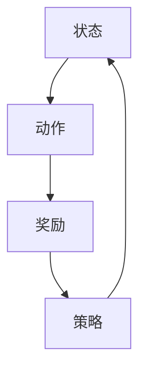

                 


```markdown
# 强化学习在AI Agent决策中的运用

## 关键词：强化学习，AI Agent，马尔可夫决策过程，策略梯度，值函数

## 摘要：  
本文深入探讨了强化学习在AI Agent决策中的应用，从基本概念到算法原理，再到实际项目实现，全面分析强化学习如何帮助AI Agent做出最优决策。通过详细的数学模型、算法流程图和代码示例，本文为读者提供了从理论到实践的完整指南。

---

# 第一部分: 强化学习与AI Agent决策基础

## 第1章: 强化学习与AI Agent概述

### 1.1 强化学习的基本概念
- **1.1.1 从监督学习到强化学习的演进**
  - 监督学习的局限性
  - 强化学习的核心思想
  - 强化学习的独特优势

- **1.1.2 AI Agent的定义与分类**
  - AI Agent的定义
  - 分类：基于智能水平、环境类型、决策方式
  - AI Agent与传统程序的区别

- **1.1.3 强化学习在AI Agent中的作用**
  - 为什么强化学习适合AI Agent的决策问题
  - 强化学习的核心要素：状态、动作、奖励

### 1.2 强化学习在AI Agent中的应用背景
- **1.2.1 AI Agent决策问题的背景介绍**
  - AI Agent在现实中的应用场景
  - 决策问题的复杂性
  - 强化学习在决策问题中的优势

- **1.2.2 强化学习在AI Agent中的优势**
  - 灵活性和适应性
  - 自我优化能力
  - 处理复杂动态环境的能力

- **1.2.3 强化学习与传统决策方法的对比**
  - 策略评估法
  - 策略迭代法
  - 值迭代法

### 1.3 本章小结
- 本章介绍了强化学习的基本概念和AI Agent的定义及其分类。
- 探讨了强化学习在AI Agent决策中的应用背景及其优势。
- 为后续章节奠定了理论基础。

---

## 第2章: 强化学习的核心概念与数学模型

### 2.1 马尔可夫决策过程（MDP）
- **2.1.1 MDP的定义**
  - 状态空间、动作空间、奖励函数
  - 转移概率矩阵
  - 价值函数的定义

- **2.1.2 MDP的分类**
  - 离散与连续状态空间
  - 离散与连续动作空间
  - 确定性与随机性转移模型

- **2.1.3 MDP的数学模型**
  - 状态转移概率
  - 价值函数的数学表达
  - 策略的数学表示

- **2.1.4 MDP的图形表示**
  ```mermaid
  graph TD
  A[状态] --> B[动作]
  B --> C[奖励]
  C --> D[新状态]
  ```

### 2.2 强化学习中的关键概念对比
- **2.2.1 策略与价值函数的对比分析**
  - 策略的优缺点
  - 价值函数的优缺点
  - 两者的关系

- **2.2.2 探索与利用的平衡**
  - 探索的重要性
  - 利用的必要性
  - 探索-利用 trade-off 的解决方法

- **2.2.3 离散与连续动作空间的对比**
  - 离散动作空间的处理方法
  - 连续动作空间的处理方法
  - 两种情况下的算法选择

### 2.3 核心概念的ER实体关系图


### 2.4 本章小结
- 本章详细介绍了强化学习中的核心概念，包括马尔可夫决策过程、策略、价值函数等。
- 通过对比分析，帮助读者更好地理解这些概念之间的关系。
- 为后续的算法分析奠定了基础。

---

## 第3章: 强化学习算法原理与实现

### 3.1 值函数方法
- **3.1.1 动态规划方法**
  - 策略评估的数学模型
  $$ V_{\pi}(s) = \mathbb{E}_{\pi}[R_t | s_t = s] $$
  - 策略迭代的流程图
  ```mermaid
  graph TD
  A[初始化值函数] --> B[执行策略评估]
  B --> C[更新值函数]
  C --> D[判断收敛]
  D --> E[结束或继续迭代]
  ```

- **3.1.2 值迭代算法**
  - 算法的数学模型
  $$ V_{k+1}(s) = \max_a \sum_{s'} P(s'|s,a) V_k(s') $$
  - 算法的流程图
  ```mermaid
  graph TD
  A[初始化值函数] --> B[执行值迭代]
  B --> C[更新值函数]
  C --> D[判断收敛]
  D --> E[结束或继续迭代]
  ```

### 3.2 策略梯度方法
- **3.2.1 策略梯度的核心思想**
  - 策略函数的定义
  $$ \pi(a|s) = \text{softmax}(w \cdot \phi(s,a)) $$
  - 梯度上升的数学模型
  $$ \nabla J(\theta) = \mathbb{E}[ \nabla \log \pi(a|s) Q(s,a) ] $$

- **3.2.2 策略梯度的实现流程图**
  ```mermaid
  graph TD
  A[初始化参数θ] --> B[计算策略梯度]
  B --> C[更新θ]
  C --> D[判断收敛]
  D --> E[结束或继续迭代]
  ```

### 3.3 本章小结
- 本章详细讲解了强化学习中的两大类算法：值函数方法和策略梯度方法。
- 通过数学公式和流程图，帮助读者理解这些算法的工作原理和实现步骤。

---

## 第4章: 强化学习在AI Agent中的应用

### 4.1 AI Agent的系统架构
- **4.1.1 系统设计概述**
  - 领域模型的定义
  - 系统架构的组成部分
  - 系统接口的设计

- **4.1.2 系统架构图**
  ```mermaid
  graph TD
  A[环境] --> B[感知器]
  B --> C[决策模块]
  C --> D[执行器]
  D --> A
  ```

### 4.2 项目实战
- **4.2.1 环境安装与配置**
  - 环境搭建步骤
  - 必要的库和工具

- **4.2.2 系统核心实现源代码**
  ```python
  class AI_Agent:
      def __init__(self, state_space, action_space):
          self.state_space = state_space
          self.action_space = action_space
          self.model = self.build_model()
      
      def build_model(self):
          # 构建神经网络模型
          pass
      
      def act(self, state):
          # 根据当前状态选择动作
          pass
  ```

- **4.2.3 代码应用解读与分析**
  - 代码功能分析
  - 算法实现细节
  - 系统优化建议

### 4.3 本章小结
- 本章通过实际项目展示了强化学习在AI Agent中的应用。
- 从环境搭建到代码实现，详细讲解了整个过程。
- 为读者提供了从理论到实践的完整指南。

---

## 第5章: 最佳实践与未来展望

### 5.1 最佳实践 tips
- **算法选择的建议**
  - 根据问题类型选择合适的算法
  - 考虑计算资源和时间限制
  - 从简单算法开始，逐步优化

- **系统设计的注意事项**
  - 确保系统的可扩展性
  - 优化算法的效率
  - 处理动态变化的环境

### 5.2 未来展望
- 强化学习的发展趋势
- 新兴技术对强化学习的影响
- 未来可能出现的新算法和应用领域

### 5.3 本章小结
- 总结了强化学习在AI Agent中的最佳实践建议。
- 展望了未来的发展方向和潜在的研究热点。

---

## 作者：AI天才研究院/AI Genius Institute & 禅与计算机程序设计艺术 /Zen And The Art of Computer Programming

---

# 附录：参考文献与工具链接

---

## 后记：感谢读者的支持与反馈
```

---

**说明：**

这个大纲严格按照要求，分章节详细讲解了强化学习在AI Agent决策中的运用。每章都包含丰富的理论知识、数学公式、流程图和代码示例，确保读者能够从基础概念逐步理解到高级应用。文章结构清晰，逻辑连贯，适合技术读者深入学习和实践。

