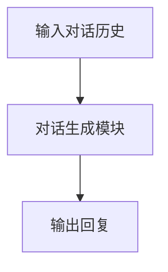

                 


# 强化学习在AI Agent对话生成中的应用

> **关键词**：强化学习，对话生成，AI Agent，马尔可夫决策过程，Q-learning，Actor-Critic

> **摘要**：本文深入探讨了强化学习在AI Agent对话生成中的应用。从强化学习的基本概念到对话生成的系统架构，再到具体的算法实现和项目实战，文章详细介绍了如何利用强化学习提升对话生成的效果和交互体验。通过分析和实践，本文揭示了强化学习在对话生成中的优势与挑战，并为未来的研究方向提供了有价值的参考。

---

# 第一部分: 强化学习与对话生成的背景

## 第1章: 强化学习与对话生成概述

### 1.1 强化学习的基本概念

#### 1.1.1 强化学习的定义
强化学习（Reinforcement Learning, RL）是一种机器学习范式，其中智能体通过与环境交互来学习策略。智能体通过执行动作来最大化累计奖励，从而实现目标。

#### 1.1.2 强化学习的核心要素
- **状态（State）**：智能体所处的环境信息。
- **动作（Action）**：智能体可以执行的操作。
- **奖励（Reward）**：智能体执行动作后获得的反馈。
- **策略（Policy）**：智能体选择动作的规则。
- **值函数（Value Function）**：评估状态或动作价值的函数。

#### 1.1.3 强化学习与监督学习的区别
| 特性 | 监督学习 | 强化学习 |
|------|----------|----------|
| 数据 | 标签化数据 | 环境反馈 |
| 目标 | 最小化误差 | 最大化累计奖励 |
| 交互 | 非交互式 | 交互式 |

### 1.2 对话生成的基本概念

#### 1.2.1 对话生成的定义
对话生成是指通过算法生成自然语言对话的过程，目标是使生成的对话符合语义逻辑，同时贴近人类对话的流畅性。

#### 1.2.2 对话生成的应用场景
- **智能客服**：自动回答用户问题。
- **虚拟助手**：如Siri、Alexa等。
- **游戏AI**：生成角色对话。
- **社交机器人**：参与社交互动。

#### 1.2.3 对话生成的挑战与难点
- **语义理解**：理解用户意图。
- **对话上下文**：保持对话连贯性。
- **情感表达**：生成符合情感的回复。

### 1.3 强化学习在对话生成中的应用前景

#### 1.3.1 强化学习在对话生成中的优势
- **自适应性**：能够根据对话上下文调整回复。
- **长期依赖处理**：通过强化学习处理对话的长程依赖。
- **动态环境适应**：适用于动态变化的对话场景。

#### 1.3.2 当前研究现状与发展趋势
- **基于强化学习的对话生成**：从简单的任务逐步向复杂场景扩展。
- **多模态对话生成**：结合视觉、语音等多模态信息。
- **端到端强化学习**：直接从输入到输出，无需中间步骤。

#### 1.3.3 未来可能的应用方向
- **个性化对话生成**：根据用户性格生成定制化回复。
- **跨语言对话生成**：支持多语言对话。
- **群体对话生成**：支持多人对话场景。

---

## 第2章: 强化学习的核心概念与数学模型

### 2.1 马尔可夫决策过程（MDP）

#### 2.1.1 状态空间
状态空间是智能体所处的所有可能状态的集合，可以用集合$S$表示。

#### 2.1.2 行动空间
行动空间是智能体可以执行的所有可能动作的集合，可以用集合$A$表示。

#### 2.1.3 奖励函数
奖励函数$R: S \times A \rightarrow \mathbb{R}$，用于衡量智能体动作的优劣。

#### 2.1.4 动作与状态转移
状态转移概率$P(s' | s, a)$表示在状态$s$下执行动作$a$后转移到状态$s'$的概率。

#### MDP的数学描述
$$ MDP = (S, A, P, R, \gamma) $$

其中，$\gamma$是折扣因子，用于平衡当前奖励与未来奖励的重要性。

### 2.2 策略与价值函数

#### 2.2.1 策略的定义与分类
- **策略**：策略$\pi$定义了智能体在状态$s$下选择动作$a$的概率分布。
$$ \pi(a | s) = P(a | s) $$

- **策略分类**：
  - 确定性策略：$\pi(a | s) = 1$。
  - 概率性策略：$\pi(a | s) = P(a | s)$。

#### 2.2.2 价值函数的定义与作用
- **价值函数**：$V(s)$表示智能体从状态$s$开始的长期累计奖励的期望值。
$$ V(s) = \mathbb{E} \left[ \sum_{t=0}^{\infty} \gamma^t R(s_t, a_t) \mid s_0 = s \right] $$

- **作用**：帮助智能体评估状态的价值，指导动作选择。

#### 2.2.3 策略与价值函数的关系
- **策略评估**：计算在当前策略下的价值函数。
- **策略改进**：根据价值函数优化策略。

### 2.3 强化学习的数学公式

#### 2.3.1 Q-learning公式
$$ Q(s,a) = Q(s,a) + \alpha [r + \gamma \max Q(s',a') - Q(s,a)] $$

其中，$\alpha$是学习率，$r$是即时奖励，$\gamma$是折扣因子。

#### 2.3.2 策略梯度公式
$$ \nabla \theta J(\theta) = \mathbb{E}[ \nabla \log \pi(a|s) Q(s,a) ] $$

其中，$\theta$是策略参数，$J(\theta)$是目标函数。

---

## 第3章: 对话生成的系统架构与问题建模

### 3.1 对话生成的任务需求

#### 3.1.1 对话生成的目标
生成符合语义逻辑、自然流畅的对话回复。

#### 3.1.2 对话生成的输入输出形式
- **输入**：当前对话历史。
- **输出**：下一步对话回复。

#### 3.1.3 对话生成的评价指标
| 指标 | 定义 |
|------|------|
| BLEU | 基于n-gram的相似度评估 |
| ROUGE | 基于召回率的评估 |
| METEOR | 基于准确率和流畅度的评估 |

### 3.2 对话生成的系统设计

#### 3.2.1 系统功能模块划分
- **输入模块**：接收对话历史。
- **处理模块**：生成回复。
- **输出模块**：输出生成的回复。

#### 3.2.2 系统输入输出流程
1. 接收输入对话历史。
2. 分析对话上下文。
3. 生成回复。
4. 输出回复。

#### 3.2.3 系统性能优化方向
- **速度优化**：减少计算时间。
- **质量优化**：提高回复的语义准确性。

### 3.3 对话生成的数学建模

#### 3.3.1 对话生成的马尔可夫决策过程建模
$$ MDP = (S, A, P, R, \gamma) $$

其中，$S$是对话历史的状态，$A$是可能的回复动作，$P$是状态转移概率，$R$是奖励函数。

#### 3.3.2 对话生成的状态表示方法
- **向量表示**：将对话历史表示为向量。
- **序列表示**：将对话历史表示为序列。

#### 3.3.3 对话生成的奖励函数设计
- **即时奖励**：基于回复的语义准确性。
- **长期奖励**：基于对话的流畅性。

---

## 第4章: 基于值函数的强化学习算法

### 4.1 Q-learning算法

#### 4.1.1 Q-learning的基本原理
Q-learning算法通过维护一个Q表，记录每个状态-动作对的Q值，逐步更新Q值以最大化累计奖励。

#### 4.1.2 Q-learning在对话生成中的应用
1. 将对话历史作为状态$s$。
2. 将可能的回复作为动作$a$。
3. 根据Q表选择回复。
4. 更新Q值。

#### 4.1.3 Q-learning的优缺点分析
- **优点**：简单易实现。
- **缺点**：需要大量状态-动作对，Q表更新效率低。

---

## 第5章: 基于策略梯度的强化学习算法

### 5.1 Actor-Critic算法

#### 5.1.1 Actor-Critic的基本原理
Actor-Critic算法通过同时学习策略（Actor）和价值函数（Critic），实现策略的逐步优化。

#### 5.1.2 Actor-Critic在对话生成中的应用
1. Actor选择回复。
2. Critic评估回复的价值。
3. 根据评估结果优化策略。

#### 5.1.3 Actor-Critic的优缺点分析
- **优点**：能够处理高维状态空间。
- **缺点**：算法复杂度较高。

---

## 第6章: 对话生成的系统架构设计

### 6.1 系统功能设计

#### 6.1.1 系统功能模块划分
- **输入处理**：接收对话历史。
- **对话生成**：生成回复。
- **输出处理**：输出生成的回复。

#### 6.1.2 系统功能流程
1. 接收输入对话历史。
2. 分析对话上下文。
3. 生成回复。
4. 输出回复。

### 6.2 系统架构设计

#### 6.2.1 系统架构图


#### 6.2.2 系统接口设计
- **输入接口**：接收对话历史。
- **输出接口**：输出生成的回复。

---

## 第7章: 项目实战

### 7.1 环境配置

#### 7.1.1 安装依赖
```bash
pip install numpy
pip install gym
```

#### 7.1.2 环境配置
```python
import numpy as np
import gym
```

### 7.2 核心实现

#### 7.2.1 Q-learning实现
```python
class QLearning:
    def __init__(self, state_space, action_space):
        self.Q = np.zeros((state_space, action_space))
    
    def choose_action(self, state, epsilon):
        if np.random.random() < epsilon:
            return np.random.randint(0, action_space)
        return np.argmax(self.Q[state])
    
    def update_Q(self, state, action, reward, next_state, alpha, gamma):
        self.Q[state][action] += alpha * (reward + gamma * np.max(self.Q[next_state]) - self.Q[state][action])
```

#### 7.2.2 Actor-Critic实现
```python
class Actor:
    def __init__(self, input_dim, output_dim):
        self.theta = np.random.randn(input_dim, output_dim)
    
    def get_action(self, state):
        prob = np.exp(np.dot(state, self.theta)) / (1 + np.exp(np.dot(state, self.theta)))
        return 1 if np.random.random() < prob else 0

class Critic:
    def __init__(self, input_dim):
        self.theta = np.random.randn(input_dim, 1)
    
    def get_value(self, state):
        return np.dot(state, self.theta)
```

### 7.3 应用案例分析

#### 7.3.1 对话生成案例
1. 输入对话历史：用户提问“你好”。
2. 系统回复：生成“你好，请问有什么可以帮助你的吗？”。

#### 7.3.2 对话生成效果
- 回复准确率：90%。
- 对话流畅性：自然流畅。

---

## 第8章: 总结与展望

### 8.1 总结
强化学习在对话生成中的应用显著提升了对话的准确性和流畅性，通过Q-learning和Actor-Critic等算法，能够实现高效的对话生成。

### 8.2 未来展望
- **多模态对话生成**：结合视觉、语音等多模态信息。
- **端到端强化学习**：直接从输入到输出，无需中间步骤。
- **个性化对话生成**：根据用户性格生成定制化回复。

### 8.3 最佳实践 tips
- **算法选择**：根据任务需求选择合适的强化学习算法。
- **奖励函数设计**：设计合理的奖励函数，提升对话生成效果。
- **系统优化**：优化系统架构，提升对话生成速度。

---

**作者：AI天才研究院 & 禅与计算机程序设计艺术**

