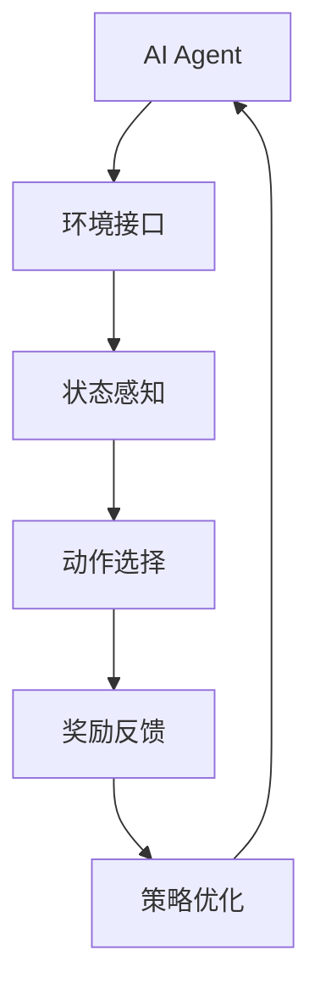
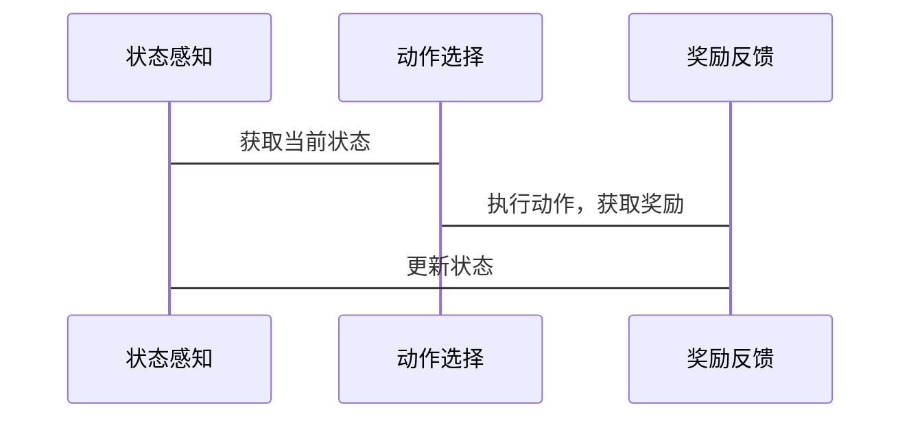

                 


# 强化学习在AI Agent开发中的应用

> 关键词：强化学习、AI Agent、Q-learning、Deep Q-Networks、系统架构设计、项目实战

> 摘要：本文深入探讨了强化学习在AI Agent开发中的应用，从基本概念到高级算法，再到系统架构设计和实际案例，全面解析了强化学习在AI Agent开发中的核心原理和应用实践。

---

# 第一部分：强化学习与AI Agent开发基础

## 第1章：强化学习与AI Agent概述

### 1.1 强化学习的基本概念

#### 1.1.1 强化学习的定义与特点
强化学习是一种机器学习范式，通过智能体在环境中与环境交互，通过试错学习来最大化累积奖励。其特点包括：
- **试错性**：通过不断尝试动作，逐步优化策略。
- **延迟奖励**：奖励可能在多个动作后才给出。
- **环境动态性**：环境的状态和奖励可能随时间变化。

#### 1.1.2 AI Agent的基本概念
AI Agent（智能体）是能够感知环境并采取行动以实现目标的实体。AI Agent可以是软件程序、机器人或其他智能系统。AI Agent的核心目标是通过感知和行动来优化其目标函数。

#### 1.1.3 强化学习与AI Agent的关系
强化学习为AI Agent提供了一种通过与环境交互来学习策略的方法。AI Agent通过强化学习算法，可以在动态环境中自适应地优化其行为策略。

### 1.2 强化学习的核心概念

#### 1.2.1 状态、动作、奖励的定义
- **状态（State）**：环境在某一时刻的观测。
- **动作（Action）**：智能体在给定状态下的行为。
- **奖励（Reward）**：智能体执行动作后获得的反馈，用于指导学习。

#### 1.2.2 策略与值函数的定义
- **策略（Policy）**：智能体选择动作的概率分布。
- **值函数（Value Function）**：评估一个状态或动作对目标的贡献。

#### 1.2.3 马尔可夫决策过程（MDP）
MDP是一种数学框架，用于描述强化学习问题。它包括状态、动作、转移概率和奖励函数。

### 1.3 强化学习的典型应用
- **游戏AI**：如AlphaGo、Dota AI。
- **机器人控制**：如自动驾驶、工业机器人。
- **推荐系统**：如个性化推荐、用户行为预测。

## 第2章：强化学习的核心概念与联系

### 2.1 强化学习的核心原理
- **状态转移的概率性**：环境的状态转移是不确定的。
- **动作选择的策略性**：策略决定动作选择的概率。
- **奖励函数的设计**：奖励函数引导学习方向。

### 2.2 核心概念对比表
| 比较项       | 状态   | 动作   | 策略   | 值函数 |
|--------------|--------|--------|--------|--------|
| 定义         | 当前环境的观测 | 智能体采取的行为 | 决策策略 | 评估状态或动作的值 |
| 作用         | 为智能体提供环境信息 | 智能体的选择行为 | 决定如何选择动作 | 评估当前状态的好坏 |

### 2.3 ER实体关系图
```mermaid
erd
  entity 状态 {
    <属性> 状态ID
    <属性> 状态描述
  }
  entity 动作 {
    <属性> 动作ID
    <属性> 动作描述
  }
  entity 奖励 {
    <属性> 奖励值
    <属性> 奖励描述
  }
  状态 --|{n}--> 状态转移
  动作 --|{n}--> 奖励
```

## 第3章：强化学习的数学模型与算法原理

### 3.1 Q-learning算法原理

#### 3.1.1 Q-learning的基本原理
Q-learning是一种基于值函数的强化学习算法，通过更新Q表（Q-value table）来学习最优策略。

#### 3.1.2 Q-learning的数学模型
Q值更新公式：
$$ Q(s, a) = Q(s, a) + \alpha [r + \gamma \max Q(s', a') - Q(s, a)] $$
其中，$\alpha$是学习率，$\gamma$是折扣因子。

#### 3.1.3 Q-learning的算法流程图
```mermaid
graph TD
    A[开始] --> B[初始化Q表]
    B --> C[选择动作a]
    C --> D[执行动作a，获得奖励r]
    D --> E[更新Q(s, a)]
    E --> F[判断是否终止]
    F --> G[终止？是则结束，否则回到C]
    G --> H[结束]
```

### 3.2 Deep Q-Networks（DQN）算法

#### 3.2.1 DQN的基本原理
DQN通过深度神经网络近似Q函数，解决高维状态空间的Q值计算问题。

#### 3.2.2 DQN的网络结构
- 输入层：接收状态s。
- 隐藏层：多个神经网络层。
- 输出层：输出所有动作的Q值。

#### 3.2.3 DQN的数学公式
动作选择概率：
$$ \pi(a|s) = \text{softmax}(\frac{Q(s, a)}{\epsilon}) $$
目标网络更新：
$$ Q_{\text{target}}(s', a') = r + \gamma \max Q_{\text{main}}(s', a') $$

#### 3.2.4 DQN的Python代码实现
```python
import numpy as np
import tensorflow as tf

class DQN:
    def __init__(self, state_size, action_size):
        self.state_size = state_size
        self.action_size = action_size
        self.model = self.build_model()
        self.target_model = self.build_model()
        self.model.compile(optimizer='adam', loss='mse')
        self.target_model.compile(optimizer='adam', loss='mse')

    def build_model(self):
        model = tf.keras.Sequential()
        model.add(tf.keras.layers.Dense(64, activation='relu', input_dim=self.state_size))
        model.add(tf.keras.layers.Dense(64, activation='relu'))
        model.add(tf.keras.layers.Dense(self.action_size, activation='linear'))
        return model

    def update_target_model(self):
        self.target_model.set_weights(self.model.get_weights())
```

### 3.3 算法实现的Python代码示例

#### 3.3.1 Q-learning的代码实现
```python
import numpy as np

class QLearning:
    def __init__(self, state_size, action_size, alpha=0.1, gamma=0.9):
        self.state_size = state_size
        self.action_size = action_size
        self.Q = np.zeros((state_size, action_size))
        self.alpha = alpha
        self.gamma = gamma

    def choose_action(self, state):
        return np.argmax(self.Q[state])

    def update_Q(self, state, action, reward, next_state):
        self.Q[state, action] += self.alpha * (reward + self.gamma * np.max(self.Q[next_state]) - self.Q[state, action])
```

---

# 第四部分：AI Agent开发的系统架构与设计

## 第4章：AI Agent开发的系统架构与设计

### 4.1 系统架构设计

#### 4.1.1 领域模型的mermaid类图
```mermaid
classDiagram
    class 状态 {
        状态ID
        状态描述
    }
    class 动作 {
        动作ID
        动作描述
    }
    class 奖励 {
        奖励值
        奖励描述
    }
    状态 -->|转移| 状态
    动作 -->|执行| 状态
    状态 -->|奖励| 奖励
```

#### 4.1.2 系统架构的mermaid架构图


### 4.2 系统交互设计

#### 4.2.1 交互流程的mermaid序列图


---

# 第五部分：项目实战与最佳实践

## 第5章：项目实战与最佳实践

### 5.1 环境安装与配置
安装必要的库：
```bash
pip install numpy tensorflow keras
```

### 5.2 系统核心实现源代码
```python
# 强化学习算法实现
class AI-Agent:
    def __init__(self, state_size, action_size):
        self.state_size = state_size
        self.action_size = action_size
        self.model = self.build_model()
        self.target_model = self.build_model()

    def build_model(self):
        model = tf.keras.Sequential()
        model.add(tf.keras.layers.Dense(64, activation='relu', input_dim=self.state_size))
        model.add(tf.keras.layers.Dense(64, activation='relu'))
        model.add(tf.keras.layers.Dense(self.action_size, activation='linear'))
        return model

    def update_target_model(self):
        self.target_model.set_weights(self.model.get_weights())
```

### 5.3 代码功能解读与分析
- **初始化**：构建主网络和目标网络。
- **模型构建**：使用深度神经网络近似Q函数。
- **更新目标网络**：定期同步主网络权重到目标网络。

### 5.4 实际案例分析与详细讲解
案例：开发一个简单的游戏AI代理。
步骤：
1. 安装库并导入模块。
2. 定义环境接口。
3. 初始化AI Agent。
4. 执行动作并更新模型。
5. 测试与优化。

### 5.5 最佳实践与注意事项
- **环境设计**：确保环境的稳定性和可重复性。
- **奖励机制**：设计合理的奖励函数，引导智能体学习正确的策略。
- **算法选择**：根据问题类型选择合适的算法，如Q-learning或DQN。

### 5.6 项目小结
通过实战，我们掌握了强化学习算法在AI Agent中的具体实现，了解了系统架构设计的重要性，并积累了实际开发经验。

---

# 第六部分：总结与展望

## 第6章：总结与展望

### 6.1 本章总结
本文全面介绍了强化学习在AI Agent开发中的应用，从基础概念到算法实现，再到系统架构设计和项目实战，帮助读者系统地掌握相关知识。

### 6.2 未来展望
随着技术进步，强化学习在AI Agent中的应用将更加广泛，未来的研究方向包括：
- 更高效的算法优化。
- 更复杂的多智能体协作。
- 更智能的自适应学习策略。

---

# 作者：AI天才研究院/AI Genius Institute & 禅与计算机程序设计艺术 /Zen And The Art of Computer Programming

---

以上是《强化学习在AI Agent开发中的应用》的完整目录和内容概览。通过逐步分析和详细讲解，读者可以系统地学习强化学习在AI Agent开发中的应用，从理论到实践，全面掌握相关知识和技能。

