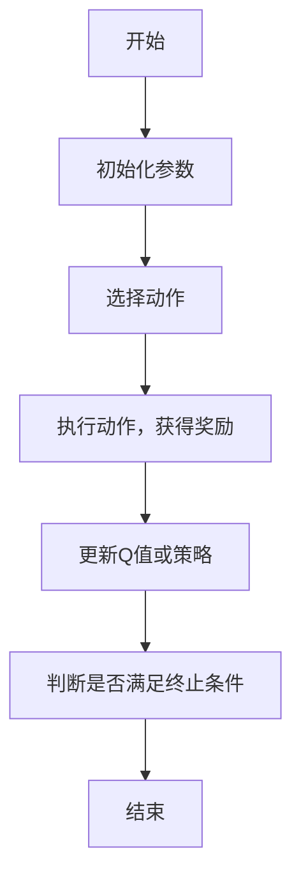

                 


# 强化学习在AI Agent自主探索中的应用

## 关键词：强化学习, AI Agent, 自主探索, 算法原理, 应用案例

## 摘要

强化学习是一种通过智能体与环境交互来优化策略的机器学习方法，广泛应用于游戏、机器人、自动驾驶等领域。本文详细探讨了强化学习在AI Agent自主探索中的应用，从基本概念到算法原理，再到实际应用，系统地分析了其核心技术和实现方法。

---

# 第一部分：强化学习与AI Agent概述

## 第1章：强化学习与AI Agent的基本概念

### 1.1 强化学习的定义与背景

#### 1.1.1 从机器学习到强化学习的演进
机器学习分为监督学习和无监督学习，而强化学习是一种通过试错与环境交互来优化目标的策略。与监督学习不同，强化学习不需要标注数据，而是通过奖励机制来指导学习过程。

#### 1.1.2 强化学习的核心概念与特点
- **状态（State）**：智能体所处的环境情况。
- **动作（Action）**：智能体的选择行为。
- **奖励（Reward）**：智能体行为的结果反馈。
- **策略（Policy）**：智能体选择动作的规则。
- **价值函数（Value Function）**：评估状态或动作的价值。

#### 1.1.3 AI Agent的定义与分类
- **AI Agent**：能够感知环境并采取行动以实现目标的智能体。
- 分为基于值的方法（如Q-learning）和基于策略的方法（如Policy Gradient）。

### 1.2 强化学习的数学模型与公式

#### 1.2.1 状态空间的定义
状态空间是智能体可能遇到的所有状态的集合，可以是离散的或连续的。

#### 1.2.2 动作空间的定义
动作空间是智能体在每个状态下可以执行的所有动作的集合。

#### 1.2.3 奖励函数的定义与作用
奖励函数用于衡量智能体行为的价值，通常定义为$R(s, a, s')$，其中$s$是当前状态，$a$是动作，$s'$是下一个状态。

#### 1.2.4 状态转移概率的数学表达
状态转移概率$P(s' | s, a)$表示在状态$s$下采取动作$a$后转移到状态$s'$的概率。

#### 1.2.5 动作选择的策略函数
策略函数$\pi(a | s)$表示在状态$s$下选择动作$a$的概率。

---

## 第2章：强化学习的数学模型与算法原理

### 2.1 强化学习的基本原理

#### 2.1.1 状态-动作-奖励的三元组
智能体通过与环境交互，感知状态，选择动作，获得奖励，逐步优化策略。

#### 2.1.2 Q-learning算法的数学推导
Q-learning算法的目标是学习状态-动作对的Q值：
$$Q(s, a) = Q(s, a) + \alpha [r + \gamma \max Q(s', a') - Q(s, a)]$$
其中，$\alpha$是学习率，$\gamma$是折扣因子。

#### 2.1.3 策略梯度方法的数学推导
策略梯度方法的目标是最大化累积奖励，梯度计算如下：
$$\nabla J(\theta) = \mathbb{E}[ \nabla \log \pi(a|s) Q(s,a) ]$$

### 2.2 强化学习的算法流程图



---

## 第3章：AI Agent的设计与实现

### 3.1 AI Agent的核心组件

#### 3.1.1 状态表示
状态表示是智能体感知环境的关键，常见的有向量表示和神经网络表示。

#### 3.1.2 动作选择
动作选择基于当前状态和策略函数，可以是随机选择或策略网络输出。

#### 3.1.3 奖励机制
奖励机制定义了智能体行为的价值，影响学习过程的方向。

#### 3.1.4 策略优化
通过不断更新策略函数，使智能体在环境中获得更高的累积奖励。

### 3.2 AI Agent的实现流程

#### 3.2.1 环境建模
环境建模是强化学习的基础，需要定义状态、动作和奖励函数。

#### 3.2.2 策略选择
选择合适的策略方法，如Q-learning或Policy Gradient。

#### 3.2.3 算法实现
实现强化学习算法，包括状态转移、动作选择和奖励更新。

#### 3.2.4 性能评估
通过实验评估智能体的表现，调整参数以优化性能。

---

## 第4章：强化学习在AI Agent中的应用案例

### 4.1 游戏AI

#### 4.1.1 游戏环境建模
定义游戏的状态、动作和奖励函数。

#### 4.1.2 策略选择与优化
使用DQN算法在游戏环境中训练AI Agent。

#### 4.1.3 案例分析
以经典游戏为例，展示强化学习在游戏AI中的应用。

### 4.2 机器人控制

#### 4.2.1 环境建模
定义机器人在环境中的状态和动作。

#### 4.2.2 策略优化
通过强化学习优化机器人的控制策略。

#### 4.2.3 案例分析
以机器人导航为例，展示强化学习的应用。

---

## 第5章：强化学习的系统架构设计

### 5.1 系统功能设计

#### 5.1.1 领域模型
使用Mermaid绘制领域模型类图，展示系统的核心组件。

#### 5.1.2 系统架构设计
使用Mermaid绘制系统架构图，展示各组件之间的关系。

#### 5.1.3 系统接口设计
定义系统的主要接口，如状态获取接口和动作执行接口。

### 5.2 系统交互设计

#### 5.2.1 序列图
使用Mermaid绘制系统交互序列图，展示智能体与环境的交互过程。

---

## 第6章：项目实战：强化学习在AI Agent中的应用

### 6.1 环境安装与配置

#### 6.1.1 安装Python
安装Python和必要的库，如TensorFlow和Keras。

#### 6.1.2 安装强化学习库
安装OpenAI Gym或其他强化学习框架。

### 6.2 核心实现

#### 6.2.1 状态表示
定义状态空间和动作空间。

#### 6.2.2 动作选择
实现策略函数或Q值更新函数。

#### 6.2.3 奖励更新
实现奖励函数和状态转移逻辑。

### 6.3 代码实现

#### 6.3.1 Q-learning算法实现
```python
import numpy as np

class QLearning:
    def __init__(self, state_space, action_space):
        self.q_table = np.zeros((state_space, action_space))
    
    def choose_action(self, state):
        return np.argmax(self.q_table[state])
    
    def update_q(self, state, action, reward, next_state):
        self.q_table[state, action] = self.q_table[state, action] + 0.1 * (reward + 0.9 * max(self.q_table[next_state]) - self.q_table[state, action])
```

### 6.4 实验与结果分析

#### 6.4.1 实验设计
设置实验参数，如学习率和折扣因子。

#### 6.4.2 实验结果
展示智能体在不同环境中的表现，如收敛速度和最终奖励。

#### 6.4.3 结果分析
分析算法性能，提出优化建议。

---

## 第7章：强化学习的优化与扩展

### 7.1 算法优化

#### 7.1.1 网络架构优化
使用更深的神经网络结构提高学习效率。

#### 7.1.2 异常处理
处理强化学习中的常见问题，如探索-利用矛盾。

### 7.2 应用扩展

#### 7.2.1 多智能体协作
研究多智能体协作的强化学习方法。

#### 7.2.2 跨环境适应
研究智能体在不同环境中的适应能力。

---

## 第8章：总结与展望

### 8.1 总结

#### 8.1.1 核心内容回顾
总结强化学习在AI Agent中的核心概念和算法。

#### 8.1.2 实践价值
强调强化学习在实际应用中的重要性。

### 8.2 展望

#### 8.2.1 未来研究方向
探讨强化学习的前沿领域，如元学习和自适应学习。

#### 8.2.2 技术发展趋势
分析强化学习在AI Agent中的发展趋势和挑战。

---

## 作者信息

作者：AI天才研究院/AI Genius Institute & 禅与计算机程序设计艺术 /Zen And The Art of Computer Programming

---

通过以上详细目录和内容安排，确保文章结构清晰、内容详实，涵盖强化学习的各个方面，帮助读者全面理解强化学习在AI Agent自主探索中的应用。

