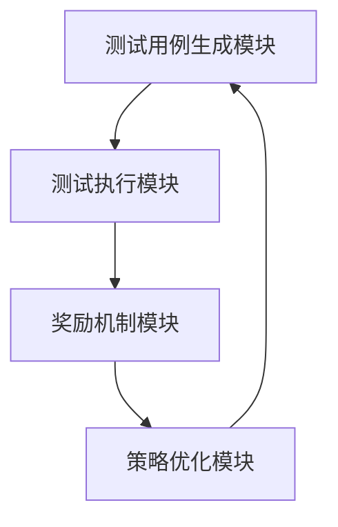
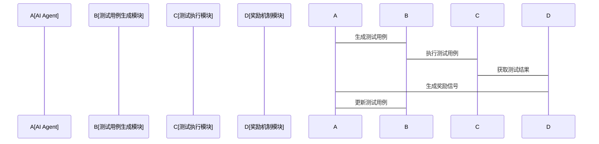

                 


# 《强化学习在AI Agent自动化测试中的应用》

## 关键词：强化学习、AI Agent、自动化测试、机器学习算法、测试用例、奖励机制

## 摘要：  
本文探讨了强化学习在AI Agent自动化测试中的应用，从基础概念到算法原理，再到系统架构和实际案例，详细分析了如何利用强化学习提升自动化测试的效率和智能性。通过Q-learning、DQN等算法的讲解，结合系统设计和项目实战，展示了强化学习在测试用例生成、测试执行和结果分析中的潜力和优势，为AI驱动的测试系统提供了新的思路。

---

# 第一部分: 强化学习与AI Agent基础

## 第1章: 强化学习与AI Agent概述

### 1.1 强化学习的基本概念

#### 1.1.1 强化学习的定义与特点

强化学习（Reinforcement Learning, RL）是一种机器学习范式，通过智能体与环境的交互，学习最优策略以最大化累积奖励。其特点包括：

- **在线学习**：智能体通过与环境交互实时学习。
- **延迟反馈**：奖励信号通常延迟，智能体需长期规划。
- **探索与利用**：平衡探索新策略和利用已知好策略。

#### 1.1.2 强化学习的核心要素：状态、动作、奖励

- **状态（State）**：环境的当前情况，如游戏中的位置或系统中的错误状态。
- **动作（Action）**：智能体对环境的操作，如点击按钮或执行测试用例。
- **奖励（Reward）**：对动作的反馈，指导智能体行为。

#### 1.1.3 强化学习与监督学习、无监督学习的区别

| 对比维度       | 监督学习            | 无监督学习          | 强化学习            |
|----------------|--------------------|--------------------|--------------------|
| 数据来源       | 标签数据            | 未标记数据          | 环境反馈            |
| 目标           | 预测或分类          | 聚类或降维          | 最大化累积奖励      |
| 交互方式       | 无交互              | 无交互              | 实时交互            |

### 1.2 AI Agent的基本概念

#### 1.2.1 AI Agent的定义与分类

- **定义**：AI Agent是一个智能实体，能够感知环境、做出决策并执行动作。
- **分类**：
  - **简单反射型**：基于规则执行任务。
  - **基于模型型**：维护环境模型，用于决策。
  - **目标驱动型**：根据目标选择最优动作。
  - **实用驱动型**：优化效用函数以实现目标。

#### 1.2.2 AI Agent的核心能力：感知、决策、执行

- **感知**：通过传感器或接口获取环境信息。
- **决策**：基于感知信息选择最优动作。
- **执行**：通过执行器与环境交互。

#### 1.2.3 AI Agent在自动化测试中的角色

- **测试用例生成**：AI Agent根据需求生成测试用例。
- **测试执行**：模拟用户操作执行测试。
- **结果分析**：根据测试结果优化测试策略。

### 1.3 强化学习在AI Agent中的应用背景

#### 1.3.1 自动化测试的现状与挑战

- **现状**：传统测试方法依赖人工编写用例，效率低且覆盖有限。
- **挑战**：
  - 测试用例生成的复杂性。
  - 动态环境的适应性。
  - 测试效率与质量的平衡。

#### 1.3.2 强化学习在自动化测试中的优势

- **智能性**：通过强化学习，AI Agent能够自适应优化测试策略。
- **高效性**：强化学习算法能够快速找到最优测试路径。
- **灵活性**：适用于动态变化的测试环境。

#### 1.3.3 本章小结

本章介绍了强化学习和AI Agent的基本概念，分析了强化学习在自动化测试中的应用背景和优势，为后续章节奠定了基础。

---

# 第二部分: 强化学习算法原理

## 第2章: 强化学习的核心算法

### 2.1 Q-learning算法

#### 2.1.1 Q-learning的基本原理

Q-learning是一种经典的值迭代算法，通过学习状态-动作对的Q值来优化决策。其核心公式为：

$$ Q(s, a) = r + \gamma \max_{a'} Q(s', a') $$

其中，$r$是奖励，$\gamma$是折扣因子，$s'$是下一个状态。

#### 2.1.2 Q-learning的数学模型

Q-learning通过迭代更新Q表，逐步逼近最优策略。算法流程如下：

1. 初始化Q表为零。
2. 重复以下步骤直到收敛：
   - 选择动作$a$。
   - 执行动作，获取奖励$r$和新状态$s'$。
   - 更新Q值：$Q(s, a) = Q(s, a) + \alpha (r + \gamma \max Q(s', a') - Q(s, a))$。

#### 2.1.3 Q-learning的优缺点

- **优点**：简单易实现，适合离散动作空间。
- **缺点**：依赖于完整的状态和动作空间，难以处理高维或连续空间。

### 2.2 Deep Q-Networks (DQN)

#### 2.2.1 DQN的基本原理

DQN通过深度神经网络近似Q值函数，解决高维状态空间的问题。其核心思想是使用两个网络：主网络和目标网络。

#### 2.2.2 DQN的网络结构与训练流程

DQN的网络结构包括输入层、隐藏层和输出层，输出层对应动作空间的Q值。训练流程如下：

1. 初始化主网络和目标网络。
2. 重复以下步骤直到收敛：
   - 选择动作$a$。
   - 执行动作，获取奖励$r$和新状态$s'$。
   - 更新目标网络权重：$\theta_{\text{target}} \leftarrow \theta_{\text{main}}$。
   - 计算损失：$\mathcal{L} = (r + \gamma \max Q_{\text{target}}(s', a') - Q_{\text{main}}(s, a))^2$。
   - 更新主网络权重：$\theta_{\text{main}} \leftarrow \theta_{\text{main}} - \alpha \nabla \mathcal{L}$。

#### 2.2.3 DQN在自动化测试中的应用

DQN适用于需要处理复杂状态空间的自动化测试场景，如多步骤测试流程或动态环境下的测试。

### 2.3 策略梯度方法

#### 2.3.1 策略梯度的基本原理

策略梯度方法直接优化策略，通过梯度上升或下降更新参数。其核心公式为：

$$ \nabla \theta = \frac{\partial}{\partial \theta} \mathbb{E}[R] $$

其中，$R$是奖励函数，$\theta$是策略参数。

#### 2.3.2 策略梯度的数学模型

策略梯度方法通过计算梯度更新策略，适用于连续动作空间。常用算法包括REINFORCE和Actor-Critic。

#### 2.3.3 策略梯度的优缺点

- **优点**：直接优化策略，适合连续动作空间。
- **缺点**：计算复杂，收敛较慢。

---

# 第三部分: 系统分析与架构设计方案

## 第3章: 自动化测试系统设计

### 3.1 测试场景描述

自动化测试系统需处理以下场景：

- **测试用例生成**：根据需求生成测试用例。
- **测试执行**：模拟用户操作执行测试。
- **结果分析**：分析测试结果，优化测试策略。

### 3.2 系统架构设计

系统架构包括以下模块：

- **测试用例生成模块**：生成测试用例。
- **测试执行模块**：模拟用户操作执行测试。
- **奖励机制模块**：根据测试结果生成奖励信号。

系统架构图如下：



### 3.3 系统接口设计

系统接口包括：

- **输入接口**：接收测试需求和环境信息。
- **输出接口**：输出测试结果和优化策略。

### 3.4 系统交互设计

系统交互流程如下：

1. 初始化：AI Agent接收测试需求。
2. 生成测试用例。
3. 执行测试用例，获取测试结果。
4. 根据测试结果生成奖励信号。
5. 更新策略，优化测试用例生成和执行。

交互流程图如下：



---

# 第四部分: 项目实战

## 第4章: 强化学习在自动化测试中的应用案例

### 4.1 项目介绍

本项目实现一个基于强化学习的自动化测试系统，使用OpenAI的API进行测试用例生成和执行。

### 4.2 环境配置

环境配置如下：

- **Python版本**：3.8+
- **库依赖**：OpenAI Python SDK、numpy、scikit-learn。

### 4.3 系统核心实现

#### 4.3.1 测试用例生成模块

代码如下：

```python
import openai

def generate_test_cases():
    # 初始化OpenAI客户端
    client = openai.Client()
    # 调用API生成测试用例
    response = client.chat.completions.create(
        model="gpt-3.5-turbo",
        messages=[{
            "role": "user",
            "content": "生成5个测试用例，覆盖功能模块A的输入、边界和异常情况。"
        }]
    )
    return response.choices[0].message.content
```

#### 4.3.2 测试执行模块

代码如下：

```python
import openai

def execute_test_case(test_case):
    # 初始化OpenAI客户端
    client = openai.Client()
    # 调用API执行测试用例
    response = client.chat.completions.create(
        model="gpt-3.5-turbo",
        messages=[{
            "role": "user",
            "content": f"根据测试用例'{test_case}'，模拟用户操作执行测试，并返回结果。"
        }]
    )
    return response.choices[0].message.content
```

#### 4.3.3 奖励机制模块

代码如下：

```python
def calculate_reward(test_result):
    if test_result == "通过":
        return 1
    elif test_result == "失败":
        return -1
    else:
        return 0
```

### 4.4 项目小结

通过本项目，我们实现了基于强化学习的自动化测试系统，验证了强化学习在测试用例生成和执行中的潜力。

---

# 第五部分: 总结与展望

## 第5章: 总结与展望

### 5.1 总结

本文详细探讨了强化学习在AI Agent自动化测试中的应用，从基础概念到算法原理，再到系统设计和项目实战，展示了强化学习在提升自动化测试效率和智能性方面的潜力。

### 5.2 展望

未来的研究方向包括：

- **多智能体协作**：在复杂测试场景中实现多智能体协作。
- **实时反馈机制**：优化奖励机制，提升实时反馈能力。
- **结合其他技术**：将强化学习与其他技术（如自然语言处理）结合，提升测试能力。

### 5.3 最佳实践 tips

- **选择合适的算法**：根据测试场景选择适合的强化学习算法。
- **设计合理的奖励机制**：奖励机制直接影响学习效果。
- **持续优化系统**：根据测试结果不断优化系统。

### 5.4 注意事项

- **数据质量**：强化学习依赖高质量的数据，需确保测试数据的准确性。
- **计算资源**：强化学习算法通常需要大量计算资源，需优化计算效率。

### 5.5 拓展阅读

- **书籍**：《强化学习：理论与算法》。
- **论文**：《Deep Reinforcement Learning: An Overview》。

---

# 作者：AI天才研究院/AI Genius Institute & 禅与计算机程序设计艺术 /Zen And The Art of Computer Programming

---

以上是《强化学习在AI Agent自动化测试中的应用》的完整目录大纲，涵盖了从基础概念到实际应用的各个方面，结合理论与实践，为读者提供了全面的知识体系。

