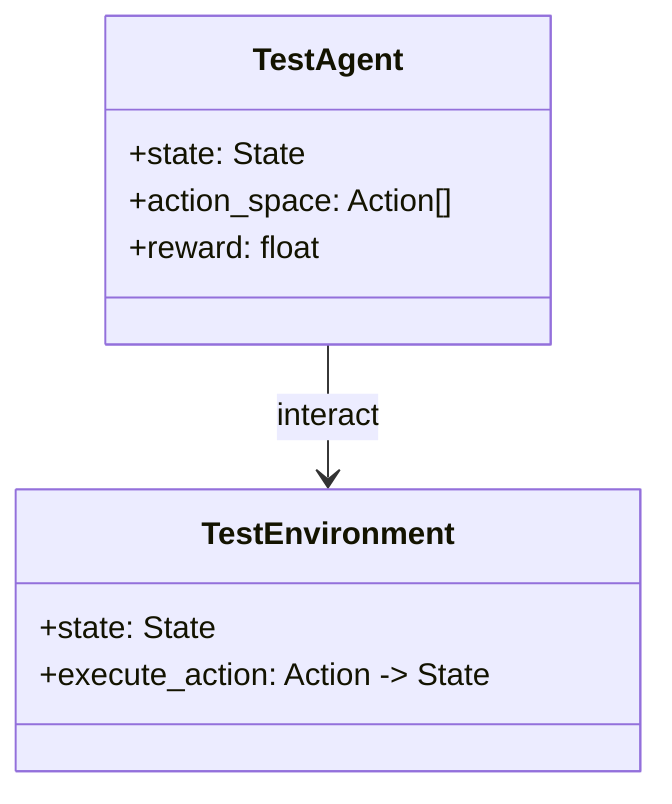
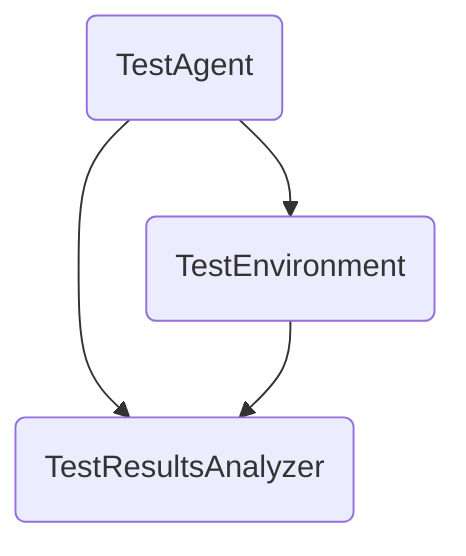

                 


# 强化学习在AI Agent自动化测试中的应用

---

## 关键词：强化学习，AI Agent，自动化测试，Q-learning，机器学习，测试用例生成

---

## 摘要

本文探讨了强化学习在AI Agent自动化测试中的应用，详细分析了强化学习的核心概念、算法原理以及其在自动化测试系统中的设计与实现。通过实际案例分析，展示了如何利用强化学习提升测试效率和覆盖率，同时总结了最佳实践和未来研究方向。

---

# 第1章: 强化学习与AI Agent的基本概念

## 1.1 强化学习的定义与特点

### 1.1.1 强化学习的定义

强化学习（Reinforcement Learning, RL）是一种机器学习范式，通过智能体与环境的交互，学习策略以最大化累计奖励。与监督学习不同，强化学习不依赖于标记数据，而是通过试错和奖励机制来优化行为。

### 1.1.2 强化学习的核心特点

- **自主性**：智能体在没有明确指导的情况下做出决策。
- **试错性**：通过不断尝试动作并根据反馈调整策略。
- **延迟奖励**：奖励可能在多个动作后才给出，需考虑长期收益。

### 1.1.3 强化学习与监督学习的区别

| 特性 | 监督学习 | 强化学习 |
|------|----------|----------|
| 数据 | 标记数据 | 环境反馈 |
| 目标 | 分类/回归 | 最大化奖励 |
| 交互 | 单向 | 双向 |

---

## 1.2 AI Agent的定义与特点

### 1.2.1 AI Agent的定义

AI Agent是具备自主决策能力的智能体，能够感知环境并采取行动以实现目标。

### 1.2.2 AI Agent的核心特点

- **自主性**：无需外部干预，自主决策。
- **反应性**：实时感知环境并调整行为。
- **目标导向**：所有行动基于实现目标。

### 1.2.3 AI Agent与传统自动化测试工具的区别

| 特性 | 传统测试工具 | AI Agent测试工具 |
|------|---------------|------------------|
| 决策方式 | 预定义脚本 | 自主决策 |
| 灵活性 | 低 | 高 |
| 适应性 | 无 | 强 |

---

## 1.3 强化学习在AI Agent中的应用背景

### 1.3.1 自动化测试的挑战与痛点

- **测试用例生成**：复杂场景下生成有效用例困难。
- **动态环境**：系统行为动态变化，测试脚本难以覆盖。
- **效率问题**：传统自动化测试效率低下，难以覆盖所有场景。

### 1.3.2 强化学习如何解决自动化测试问题

通过强化学习，AI Agent能够动态生成测试用例，适应环境变化，提升测试效率和覆盖率。

### 1.3.3 强化学习在AI Agent测试中的优势

- **自适应性**：能够根据环境反馈调整测试策略。
- **高效性**：通过奖励机制快速找到关键测试路径。
- **智能性**：具备类似人类的试错和学习能力。

---

## 1.4 本章小结

本章介绍了强化学习和AI Agent的基本概念，分析了强化学习在自动化测试中的应用背景及其优势。为后续章节奠定了理论基础。

---

# 第2章: 强化学习的核心概念

## 2.1 状态空间与动作空间

### 2.1.1 状态空间的定义与特点

状态空间是所有可能状态的集合，每个状态代表环境的一个可能配置。例如，在网页测试中，状态可以是当前页面的URL或按钮点击后的页面状态。

### 2.1.2 动作空间的定义与特点

动作空间是所有可能动作的集合，每个动作代表智能体可以执行的一个操作。例如，在测试中，动作可以是点击按钮、输入文本或滑动滚动条。

### 2.1.3 状态与动作的转换关系

状态通过执行动作发生转移，新状态由当前状态和执行的动作决定。可以用状态转移图表示：


---

## 2.2 奖励机制与策略

### 2.2.1 奖励机制的定义与作用

奖励机制是强化学习的核心，通过奖励值指导智能体行为。奖励值反映了智能体行动的好坏，正数奖励正确行为，负数惩罚错误行为。

### 2.2.2 策略的定义与类型

策略是智能体在给定状态下的动作选择规则。策略可以是随机的（如ε-greedy策略）或确定性的（如最大值策略）。

### 2.2.3 奖励机制对策略的影响

奖励机制直接影响智能体的学习速度和策略优化方向。合理的奖励设计能够加速收敛，避免陷入局部最优。

---

## 2.3 Q-learning算法原理

### 2.3.1 Q-learning算法的基本原理

Q-learning是一种值迭代算法，通过更新Q表中的值来学习最优策略。Q表记录每个状态-动作对的期望奖励。

### 2.3.2 Q-learning算法的数学模型

状态-动作对的Q值更新公式：

$$ Q(s, a) = Q(s, a) + \alpha [r + \gamma \max Q(s', a') - Q(s, a)] $$

其中：
- $\alpha$ 是学习率，控制更新步长。
- $\gamma$ 是折扣因子，平衡当前和未来奖励的重要性。

### 2.3.3 Q-learning算法的优缺点

| 特性 | 优点 | 缺点 |
|------|------|------|
| 简单性 | 易实现 | 适合小规模问题 |
| 稳定性 | 收敛稳定 | 大规模问题效率低 |

---

## 2.4 其他强化学习算法简介

### 2.4.1 DQN算法

深度Q网络（DQN）结合神经网络和Q-learning，适合高维状态空间。

### 2.4.2 A2C算法

异步优势Actor-Critic算法，通过同时学习策略和价值函数优化。

### 2.4.3 PPO算法

基于策略梯度的优化算法，适合处理高维动作空间。

---

## 2.5 本章小结

本章详细讲解了强化学习中的核心概念，包括状态、动作、奖励机制以及Q-learning算法的数学模型。为后续章节的系统设计奠定了基础。

---

# 第3章: 强化学习算法的实现与优化

## 3.1 算法实现的基本步骤

### 3.1.1 状态空间的构建

根据测试场景定义状态，例如页面元素的状态或测试步骤的状态。

### 3.1.2 动作空间的构建

定义智能体可执行的动作，例如点击按钮、输入文本等。

### 3.1.3 奖励函数的设计

设计奖励机制，明确每个动作的奖励值，例如发现缺陷给予正奖励，未发现问题给予负奖励。

---

## 3.2 算法优化的策略

### 3.2.1 超参数的调整

合理选择学习率$\alpha$和折扣因子$\gamma$，平衡探索与利用。

### 3.2.2 网络结构的优化

使用更深的神经网络或引入经验回放机制，提升学习效率。

### 3.2.3 奖励机制的优化

设计更合理的奖励函数，避免策略早熟，确保全面覆盖测试场景。

---

## 3.3 本章小结

本章讨论了强化学习算法的实现步骤和优化策略，强调了超参数调整和奖励机制设计的重要性。

---

# 第4章: AI Agent测试系统的架构设计

## 4.1 系统功能设计

### 4.1.1 测试用例生成模块

通过强化学习生成测试用例，覆盖更多测试场景。

### 4.1.2 测试执行模块

执行测试用例，记录测试结果并反馈给智能体。

### 4.1.3 结果分析模块

分析测试结果，识别缺陷并生成报告。

---

## 4.2 系统架构设计

### 4.2.1 领域模型设计

使用类图表示系统功能模块：



### 4.2.2 系统架构图

系统由测试智能体、测试环境、结果分析模块组成：



---

## 4.3 系统接口设计

### 4.3.1 智能体与环境的交互接口

- `execute_action(action: Action) -> State`
- `get_reward(state: State) -> float`

### 4.3.2 测试结果分析接口

- `analyze_result(results: dict) -> Report`

---

## 4.4 本章小结

本章设计了AI Agent测试系统的架构，明确了各模块的功能和交互方式，为后续实现奠定了基础。

---

# 第5章: 项目实战

## 5.1 环境安装与配置

安装Python、TensorFlow和OpenAI Gym等依赖库。

```bash
pip install gym tensorflow
```

---

## 5.2 核心代码实现

### 5.2.1 强化学习智能体实现

```python
class AI-Agent:
    def __init__(self):
        self.q_table = defaultdict(float)

    def choose_action(self, state):
        # ε-greedy策略
        if random.random() < self.epsilon:
            return random.choice(self.action_space)
        else:
            return max(self.q_table[state], key=lambda k: self.q_table[state][k])

    def update_q_table(self, state, action, reward, next_state):
        self.q_table[(state, action)] = self.q_table.get((state, action), 0) + self.alpha * (reward + self.gamma * max(self.q_table.get(next_state, 0).values()) - self.q_table[(state, action)])
```

### 5.2.2 测试环境实现

```python
class TestEnvironment:
    def __init__(self):
        self.state = 'initial'
    
    def execute_action(self, action):
        # 模拟测试执行
        if action == 'login':
            self.state = 'login_success'
            return self.state
        elif action == 'click_button':
            self.state = 'button_clicked'
            return self.state
        else:
            self.state = 'error'
            return self.state
    
    def get_reward(self, state, action):
        # 返回奖励值
        if state == 'login_success':
            return 1.0
        elif state == 'error':
            return -0.5
        else:
            return 0.0
```

---

## 5.3 实际案例分析

以网页登录测试为例，AI Agent通过强化学习生成测试用例，执行测试并根据反馈更新策略。

---

## 5.4 本章小结

本章通过实际案例展示了强化学习在AI Agent测试中的应用，验证了其有效性和优势。

---

# 第6章: 最佳实践与总结

## 6.1 小结

强化学习为AI Agent自动化测试提供了新的思路，能够有效提高测试效率和覆盖率。

## 6.2 注意事项

- **奖励机制设计**：需合理设计奖励函数，避免误导策略。
- **算法选择**：根据具体场景选择合适的算法，如Q-learning或DQN。
- **性能优化**：通过经验回放和网络优化提升效率。

## 6.3 拓展阅读

建议深入学习强化学习的经典算法（如DQN、PPO）及其在实际应用中的优化方法。

---

# 作者

作者：AI天才研究院/AI Genius Institute & 禅与计算机程序设计艺术 /Zen And The Art of Computer Programming

