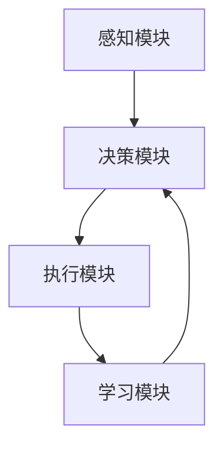

                 


# 《强化学习在AI Agent行为优化中的应用》

## 关键词：强化学习, AI Agent, 行为优化, 深度强化学习, Q-learning, 策略优化

## 摘要：
本文深入探讨强化学习在AI Agent行为优化中的应用，涵盖理论基础、核心算法、系统架构和项目实战。通过详细讲解Q-learning、DQN、PPO等算法，结合实际案例，展示如何优化AI代理的行为，帮助读者掌握强化学习的核心原理和应用技巧。

---

# 第一部分：强化学习基础

## 第1章：强化学习基本概念

### 1.1 强化学习的定义与特点
- **1.1.1 什么是强化学习**  
  强化学习（Reinforcement Learning, RL）是一种机器学习范式，通过智能体与环境交互，学习策略以最大化累积奖励。  
  $$ R = \sum_{t=1}^{T} r_t $$  

- **1.1.2 强化学习的核心特点**  
  - 延时反馈：奖励在多个步骤后才给出。  
  - 探索与利用：平衡探索新策略和利用已知好策略。  
  - 非平稳性：环境状态可能随时间变化。  

- **1.1.3 强化学习与监督学习的区别**  
  监督学习有标签数据，强化学习通过奖励信号调整策略。

### 1.2 强化学习的基本要素
- **1.2.1 状态空间**  
  状态（State）是环境对智能体的反馈，定义为一个向量。  
  $$ s_t \in S $$  
  典型状态：棋盘上的棋子位置。

- **1.2.2 行动空间**  
  行动（Action）是智能体可执行的操作，分为离散和连续两种。  
  $$ a_t \in A $$  
  例如：游戏中的移动方向。

- **1.2.3 奖励函数**  
  奖励（Reward）是对智能体行为的评价，定义为$ r(s_t, a_t) $。  
  $$ r_t = f(s_t, a_t) $$  
  例如：游戏中的得分变化。

- **1.2.4 策略与价值函数**  
  - 策略（Policy）：决定下一步行动的规则。  
  - 价值函数（Value Function）：评估当前状态的价值。  
  $$ V(s) = \max_a Q(s, a) $$  

### 1.3 强化学习的应用场景
- **1.3.1 游戏AI**  
  如AlphaGo，通过强化学习在围棋中击败人类。  
- **1.3.2 机器人控制**  
  使用强化学习训练机器人完成复杂动作。  
- **1.3.3 自动驾驶**  
  强化学习用于车辆路径规划和决策。  
- **1.3.4 财经交易**  
  利用强化学习优化投资策略。

## 第2章：强化学习的数学基础

### 2.1 状态转移概率
- **2.1.1 马尔可夫决策过程**  
  状态转移仅依赖当前状态，不考虑历史。  
  $$ P(s', r | s, a) $$  

- **2.1.2 贝叶斯定理**  
  用于计算条件概率。  
  $$ P(A|B) = \frac{P(B|A)P(A)}{P(B)} $$  

- **2.1.3 动态规划算法**  
  用于计算最优值函数。  
  $$ V^*(s) = \max_a \sum_{s'} P(s'|s,a) V^*(s') $$  

### 2.2 值函数与策略优化
- **2.2.1 值函数的定义**  
  $$ V(s) = \mathbb{E}[R | s] $$  

- **2.2.2 策略优化的数学表达**  
  最大化累积奖励。  
  $$ \theta^* = \arg\max_\theta \mathbb{E}_{\tau \sim \pi_\theta} [R(\tau)] $$  

- **2.2.3 动态规划算法**  
  值迭代、策略迭代等方法。

### 2.3 Q-learning算法
- **2.3.1 Q-learning的基本原理**  
  学习Q值函数，表示状态-动作对的期望奖励。  
  $$ Q(s, a) = r + \gamma \max_{a'} Q(s', a') $$  

- **2.3.2 Q-learning的数学公式**  
  更新规则：  
  $$ Q(s, a) \leftarrow Q(s, a) + \alpha [r + \gamma \max Q(s', a') - Q(s, a)] $$  

- **2.3.3 Q-learning的收敛性分析**  
  在离散状态和动作空间下，Q-learning收敛于最优策略。

## 第3章：强化学习的核心算法

### 3.1 值函数方法
- **3.1.1 策略评估**  
  评估当前策略的价值函数。  
  $$ V_\pi(s) = \mathbb{E}_{\pi}[R | s] $$  

- **3.1.2 策略迭代**  
  交替进行策略评估和改进。  
  $$ \pi_{k+1}(a|s) = \arg\max_a Q_\pi(s,a) $$  

- **3.1.3 值迭代**  
  直接计算最优值函数。  
  $$ V^{(k+1)}(s) = \max_a \sum_{s'} P(s'|s,a) V^{(k)}(s') $$  

### 3.2 策略优化方法
- **3.2.1 极大化期望奖励**  
  直接优化策略以最大化累积奖励。  
  $$ \theta^* = \arg\max_\theta \mathbb{E}[R] $$  

- **3.2.2 蒙特卡洛方法**  
  使用采样策略进行优化。  
  $$ \nabla_\theta \mathbb{E}[R] = \sum_{t=1}^T \nabla_\theta \log \pi_\theta(a_t|s_t) r_t $$  

- **3.2.3 梯度下降法**  
  使用梯度下降优化策略参数。  
  $$ \theta \leftarrow \theta + \alpha \nabla_\theta J(\theta) $$  

### 3.3 Q-learning和深度强化学习
- **3.3.1 Q-learning的局限性**  
  适用于离散动作和状态空间。  

- **3.3.2 深度强化学习（Deep RL）**  
  使用深度神经网络近似Q值函数或策略。  
  - DQN：使用经验回放和目标网络。  
  - PPO：基于策略梯度的方法，适用于高维动作空间。  

- **3.3.3 DQN算法示例**  
  ```python
  class DQN:
      def __init__(self, state_dim, action_dim, gamma=0.99, epsilon=0.1):
          self.state_dim = state_dim
          self.action_dim = action_dim
          self.gamma = gamma
          self.epsilon = epsilon
          # 网络结构
          self.mainQN = self.build_net()
          self.targetQN = self.build_net()
          # 优化器
          self.optimizer = tf.keras.optimizers.Adam(learning_rate=0.001)

      def build_net(self):
          model = tf.keras.Sequential([
              tf.keras.layers.Dense(64, activation='relu', input_dim=self.state_dim),
              tf.keras.layers.Dense(64, activation='relu'),
              tf.keras.layers.Dense(self.action_dim, activation='linear')
          ])
          return model

      def get_action(self, state):
          if np.random.random() < self.epsilon:
              return np.random.randint(self.action_dim)
          else:
              Q = self.mainQN.predict(state)
              return np.argmax(Q[0])
  ```

---

# 第二部分：AI Agent的系统架构

## 第4章：AI Agent系统架构

### 4.1 系统组成部分
- **4.1.1 感知模块**  
  接收环境反馈，处理数据。  
- **4.1.2 决策模块**  
  执行强化学习算法，输出动作。  
- **4.1.3 执行模块**  
  执行动作，与环境交互。  
- **4.1.4 学习模块**  
  更新策略或Q值函数。  

### 4.2 系统设计原则
- **4.2.1 模块化设计**  
  各模块相对独立，便于维护。  
- **4.2.2 数据流设计**  
  确保数据高效流通。  
- **4.2.3 接口设计**  
  定义模块间交互接口。  

### 4.3 系统架构图


### 4.4 系统实现接口
- **4.4.1 环境接口**  
  定义环境的状态、动作和奖励接口。  
- **4.4.2 策略接口**  
  提供选择动作的接口。  
- **4.4.3 学习接口**  
  提供更新参数的接口。  

---

# 第三部分：项目实战

## 第5章：强化学习项目实战

### 5.1 项目背景与目标
- **5.1.1 项目背景**  
  使用强化学习训练一个AI代理，在迷宫中寻找出口。  

- **5.1.2 项目目标**  
  实现一个基于Q-learning的迷宫导航算法。  

### 5.2 环境配置
- **5.2.1 状态空间**  
  位置坐标$(x, y)$。  
- **5.2.2 动作空间**  
  上、下、左、右四个方向。  
- **5.2.3 奖励函数**  
  到达终点得+1，否则得-0.1。  

### 5.3 算法实现
- **5.3.1 Q-learning实现**  
  ```python
  class QLearning:
      def __init__(self, state_dim, action_dim, gamma=0.99, alpha=0.1):
          self.gamma = gamma
          self.alpha = alpha
          self.Q = np.zeros((state_dim, action_dim))

      def get_action(self, state):
          if np.random.random() < 0.1:
              return np.random.randint(action_dim)
          else:
              q_values = self.Q[state]
              return np.argmax(q_values)

      def update_Q(self, state, action, reward, next_state):
          self.Q[state, action] += self.alpha * (reward + self.gamma * np.max(self.Q[next_state]) - self.Q[state, action])
  ```

- **5.3.2 训练过程**  
  ```python
  # 初始化
  agent = QLearning(state_dim=4, action_dim=4)
  rewards = []

  # 训练循环
  for episode in range(1000):
      state = env.reset()
      episode_reward = 0
      while True:
          action = agent.get_action(state)
          next_state, reward, done = env.step(action)
          agent.update_Q(state, action, reward, next_state)
          episode_reward += reward
          if done:
              break
      rewards.append(episode_reward)
  ```

### 5.4 实验结果与分析
- **5.4.1 训练曲线**  
  显示累积奖励随训练轮次的变化。  
- **5.4.2 收敛性分析**  
  Q-learning算法在迷宫问题中表现出良好的收敛性。  

### 5.5 项目小结
- **5.5.1 成功经验**  
  合理设计奖励函数，选择合适算法。  
- **5.5.2 改进方向**  
  引入深度强化学习，提高复杂场景的适应性。  

---

# 第四部分：总结与展望

## 第6章：总结与展望

### 6.1 总结
- **6.1.1 强化学习的核心原理**  
  通过最大化累积奖励优化策略。  
- **6.1.2 系统架构的设计要点**  
  模块化设计，高效数据流。  

### 6.2 应用案例分析
- **6.2.1 游戏AI**  
  如AlphaGo，展示了强化学习的强大能力。  
- **6.2.2 自动驾驶**  
  强化学习用于路径规划和决策优化。  

### 6.3 未来展望
- **6.3.1 多智能体协作**  
  研究多智能体间的协作与竞争。  
- **6.3.2 实时决策优化**  
  提高强化学习算法的实时性。  
- **6.3.3 通用人工智能**  
  探索强化学习在更广泛领域中的应用。  

---

# 作者

作者：AI天才研究院/AI Genius Institute & 禅与计算机程序设计艺术 /Zen And The Art of Computer Programming

