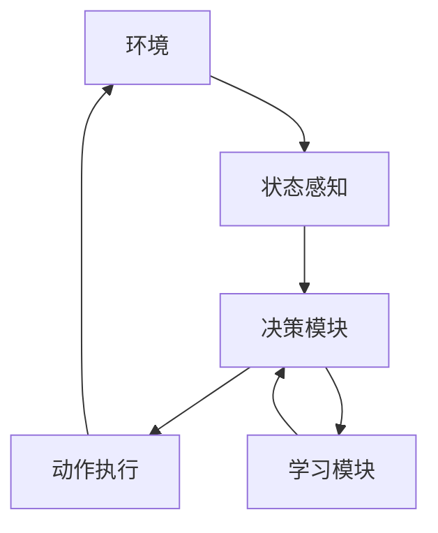

                 


# 强化学习在AI Agent长期规划优化中的应用

> 关键词：强化学习，AI Agent，长期规划优化，马尔可夫决策过程，策略梯度，Actor-Critic架构

> 摘要：本文深入探讨了强化学习在AI Agent长期规划优化中的应用，从基本概念到核心算法，再到系统设计与项目实战，全面解析了如何通过强化学习实现AI Agent的长期规划优化。文章内容涵盖强化学习的数学模型、算法原理、系统架构设计以及实际案例分析，旨在为读者提供一份全面的技术指南。

---

# 第一部分: 强化学习与AI Agent基础

---

## 第1章: 强化学习与AI Agent概述

### 1.1 强化学习的基本概念

#### 1.1.1 强化学习的定义与特点
强化学习（Reinforcement Learning，RL）是一种机器学习范式，通过智能体与环境的交互来学习最优策略。其核心在于通过试错（trial-and-error）机制，智能体通过不断探索和利用环境，逐步优化其行为策略，以最大化累积的奖励。

**特点：**
1. **目标导向性**：智能体的目标是通过最大化累积奖励来实现长期目标。
2. **环境动态性**：环境的状态和奖励可能随智能体的动作而变化。
3. **非监督性**：与监督学习不同，强化学习没有明确的标签数据，而是通过奖励信号来指导学习。

#### 1.1.2 AI Agent的基本概念
AI Agent（智能体）是指在环境中能够感知并自主行动以实现目标的实体。AI Agent可以是软件程序、机器人或其他智能系统，其核心能力包括感知、推理、规划和行动。

**AI Agent的分类：**
1. **反应式Agent**：仅基于当前感知做出反应，不考虑历史信息。
2. **基于模型的Agent**：维护对环境的内部表示，能够进行规划和推理。
3. **价值导向的Agent**：基于价值函数（如Q值）来优化决策。

#### 1.1.3 强化学习在AI Agent中的应用
强化学习为AI Agent提供了强大的决策优化能力，尤其适用于复杂动态环境中的长期规划问题。例如：
- **游戏AI**：在围棋、电子游戏中实现超人水平。
- **机器人控制**：实现自主导航和复杂任务。
- **推荐系统**：通过用户行为反馈优化推荐策略。

---

### 1.2 强化学习的核心概念

#### 1.2.1 状态、动作与奖励
- **状态（State）**：环境在某一时刻的观测。
- **动作（Action）**：智能体在给定状态下选择的行为。
- **奖励（Reward）**：智能体执行动作后获得的反馈，用于指导优化决策。

#### 1.2.2 马尔可夫决策过程（MDP）
MDP是强化学习的核心数学模型，定义了一个离散时间的动态过程。其组成部分包括：
- **状态空间（State Space）**：所有可能的状态集合。
- **动作空间（Action Space）**：所有可能的动作集合。
- **转移概率（Transition Probability）**：从当前状态和动作转移到下一个状态的概率。
- **奖励函数（Reward Function）**：给定当前状态和动作后获得的奖励。

**马尔可夫性质**：未来状态仅依赖于当前状态和动作，与历史无关。

#### 1.2.3 策略与价值函数
- **策略（Policy）**：智能体选择动作的概率分布，记为$\pi(a|s)$。
- **价值函数（Value Function）**：衡量一个状态或状态-动作对的“价值”，包括Q值和V值。

---

## 第2章: 强化学习的核心算法与数学模型

### 2.1 Q-learning算法原理

#### 2.1.1 Q-learning的基本原理
Q-learning是一种经典的值函数方法，通过更新Q表（Q-table）来学习最优策略。Q值定义为状态-动作对的期望累积奖励。

**Q值更新公式：**
$$ Q(s, a) = Q(s, a) + \alpha \left(r + \gamma \max_{a'} Q(s', a') - Q(s, a) \right) $$

- $\alpha$：学习率，控制更新步长。
- $\gamma$：折扣因子，平衡当前奖励与未来奖励的重要性。

#### 2.1.2 Q-learning的实现步骤
1. 初始化Q表为零。
2. 与环境交互，获取当前状态。
3. 根据当前状态选择动作（$\epsilon$-贪心策略）。
4. 执行动作，获得奖励和下一个状态。
5. 更新Q表。
6. 重复步骤2-5，直到收敛。

#### 2.1.3 Q-learning的Python实现示例
```python
import numpy as np

class QLearning:
    def __init__(self, state_space, action_space, alpha=0.1, gamma=0.99):
        self.state_space = state_space
        self.action_space = action_space
        self.alpha = alpha
        self.gamma = gamma
        self.Q = np.zeros((state_space, action_space))

    def update(self, state, action, reward, next_state):
        self.Q[state, action] += self.alpha * (reward + self.gamma * np.max(self.Q[next_state, :]) - self.Q[state, action])
```

---

### 2.2 策略梯度方法

#### 2.2.1 策略梯度的基本原理
策略梯度（Policy Gradient）直接优化策略参数，通过梯度上升方法最大化累积奖励。核心思想是计算策略的梯度，并沿着梯度方向更新参数。

**策略梯度更新公式：**
$$ \theta_{t+1} = \theta_t + \alpha \nabla_\theta J(\theta) $$

其中，$J(\theta)$是目标函数，通常定义为累积奖励的期望。

#### 2.2.2 基于梯度的优化方法
常用算法包括：
- **REINFORCE算法**：适用于离散动作空间。
- **Actor-Critic架构**：结合策略优化和价值评估。

---

### 2.3 Actor-Critic架构

#### 2.3.1 Actor-Critic的原理
Actor-Critic结合了策略梯度和值函数的优势，通过同时学习策略（Actor）和价值函数（Critic）来优化决策。

**核心公式：**
- 动作概率：$\pi_\theta(a|s) = \text{softmax}(Q_\phi(s, a))$
- 优势函数：$A_\phi(s, a) = Q_\phi(s, a) - V_\phi(s)$

#### 2.3.2 Actor-Critic的实现步骤
1. 初始化Actor和Critic网络参数。
2. 与环境交互，收集经验。
3. 更新Critic网络，学习值函数。
4. 更新Actor网络，优化策略。
5. 重复步骤2-4，直到收敛。

---

## 第3章: 长期规划优化的系统设计与实现

### 3.1 系统分析与架构设计

#### 3.1.1 问题场景介绍
考虑一个AI Agent在复杂环境中的长期规划问题，例如自动驾驶中的路径规划。Agent需要在动态变化的环境中做出最优决策，同时考虑未来可能的状态和动作。

#### 3.1.2 系统功能设计
- **状态感知模块**：收集环境信息。
- **决策模块**：基于强化学习算法选择动作。
- **奖励模块**：计算累积奖励并反馈给智能体。
- **学习模块**：更新策略或值函数。

#### 3.1.3 系统架构图


---

### 3.2 项目实战：AI Agent在路径规划中的应用

#### 3.2.1 环境安装与配置
```bash
pip install gym numpy
```

#### 3.2.2 核心代码实现
```python
import gym
import numpy as np

class AI-Agent:
    def __init__(self, env):
        self.env = env
        self.state_space = env.observation_space.shape[0]
        self.action_space = env.action_space.n
        # 初始化Q表
        self.Q = np.zeros((self.state_space, self.action_space))

    def epsilon_greedy_policy(self, state, epsilon=0.1):
        if np.random.random() < epsilon:
            return np.random.randint(self.action_space)
        else:
            return np.argmax(self.Q[state])

    def update_Q(self, state, action, reward, next_state):
        self.Q[state, action] += self.alpha * (reward + self.gamma * np.max(self.Q[next_state]) - self.Q[state, action])

    def train(self, episodes=1000, alpha=0.1, gamma=0.99):
        self.alpha = alpha
        self.gamma = gamma
        for episode in range(episodes):
            state = self.env.reset()
            done = False
            while not done:
                action = self.epsilon_greedy_policy(state)
                next_state, reward, done, _ = self.env.step(action)
                self.update_Q(state, action, reward, next_state)
                state = next_state

    def test(self):
        state = self.env.reset()
        while True:
            action = np.argmax(self.Q[state])
            next_state, reward, done, _ = self.env.step(action)
            state = next_state
            if done:
                break
```

#### 3.2.3 代码解读与分析
1. **初始化**：创建AI-Agent实例，并初始化Q表。
2. **$\epsilon$-贪心策略**：平衡探索与利用。
3. **Q值更新**：基于当前状态、动作、奖励和下一个状态更新Q表。
4. **训练循环**：在多个 episodic 中训练智能体，逐步优化Q表。
5. **测试**：使用优化后的Q表进行测试，验证智能体的决策能力。

---

## 第4章: 最佳实践与未来展望

### 4.1 最佳实践 tips
1. **选择合适的算法**：根据问题特性选择Q-learning、策略梯度或Actor-Critic。
2. **调参优化**：合理设置学习率$\alpha$和折扣因子$\gamma$。
3. **经验回放**：通过存储历史经验提高学习效率。
4. **多任务学习**：结合其他技术（如深度学习）提升性能。

### 4.2 小结
本文系统地介绍了强化学习在AI Agent长期规划优化中的应用，从基础概念到核心算法，再到系统设计与实战，为读者提供了一套完整的解决方案。

### 4.3 注意事项
- **环境复杂性**：复杂环境可能需要更高级的算法和网络架构。
- **计算资源**：深度强化学习需要强大的计算能力。
- **收敛性**：部分算法可能需要较长的训练时间才能收敛。

### 4.4 拓展阅读
- 《Deep Reinforcement Learning》
- 《Reinforcement Learning: Theory and Algorithms》
- 《Actor-Critic Methods: A Unified Framework》

---

# 作者：AI天才研究院 & 禅与计算机程序设计艺术

---

通过本文的系统讲解，读者可以深入了解强化学习在AI Agent长期规划优化中的应用，掌握从理论到实践的完整流程，为实际项目提供有力的技术支持。

