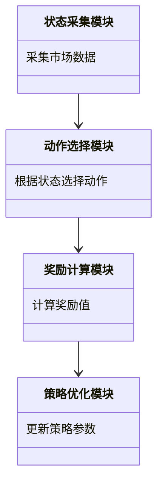
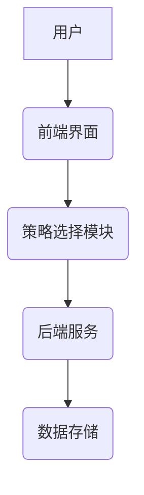
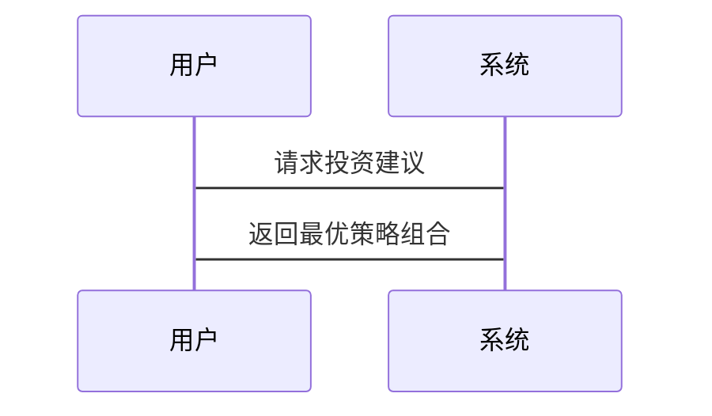

                 

# 强化学习在多策略投资组合中的应用

> 关键词：强化学习，投资组合管理，多策略优化，风险控制，算法实现，系统设计

> 摘要：本文探讨了强化学习在多策略投资组合中的应用，分析了强化学习的核心概念与算法原理，并结合实际案例展示了如何利用强化学习构建和优化多策略投资组合。文章详细阐述了从理论到实践的全过程，包括系统设计、项目实现及最佳实践。

---

# 第一部分: 强化学习与多策略投资组合概述

## 第1章: 强化学习与投资组合管理概述

### 1.1 强化学习的基本概念

#### 1.1.1 强化学习的定义与特点

**强化学习（Reinforcement Learning，RL）**是一种机器学习范式，其中智能体通过与环境交互来学习策略，以最大化累计奖励。其特点包括：

- **目标导向**：智能体通过学习策略来实现特定目标。
- **试错学习**：智能体通过与环境交互，不断试错以优化策略。
- **延迟奖励**：奖励通常不是即时的，需要通过一系列动作才能获得。

#### 1.1.2 强化学习的核心要素

- **状态（State）**：环境中的当前情况。
- **动作（Action）**：智能体采取的行为。
- **奖励（Reward）**：智能体行为的评价指标。
- **策略（Policy）**：智能体选择动作的规则。
- **值函数（Value Function）**：衡量当前状态下策略的优劣。

#### 1.1.3 强化学习与投资组合管理的联系

强化学习可以通过模拟投资环境，学习最优的投资策略，尤其在多策略投资组合中，可以通过多个策略的协同优化来提升整体收益和风险控制。

---

### 1.2 多策略投资组合的定义与特点

#### 1.2.1 多策略投资组合的定义

多策略投资组合是指同时采用多种投资策略（如股票、债券、期货等）构建的投资组合，旨在通过策略的多样化降低风险并提高收益。

#### 1.2.2 多策略投资组合的优势

- **风险分散**：通过多种策略的结合，降低单一策略的风险。
- **收益增强**：不同策略在不同市场条件下表现各异，综合收益可能更高。
- **适应性强**：能够应对市场环境的变化，灵活调整策略权重。

#### 1.2.3 多策略投资组合的构建方法

1. **资产配置**：确定各策略的权重。
2. **策略选择**：选择适合的多种投资策略。
3. **风险控制**：通过动态调整策略权重控制整体风险。

---

### 1.3 强化学习在投资组合管理中的应用前景

#### 1.3.1 强化学习在投资组合管理中的优势

- **动态优化**：能够实时根据市场变化调整策略。
- **全局优化**：可以同时优化多个策略的权重和组合。
- **复杂决策**：适用于复杂的投资环境和决策过程。

#### 1.3.2 多策略投资组合管理的挑战

- **高维状态空间**：多策略组合增加了状态空间的维度。
- **策略协同优化**：需要协调多个策略的相互作用。
- **市场不确定性**：市场波动和不确定性增加了学习难度。

#### 1.3.3 强化学习在多策略投资组合中的潜在应用

- **动态资产配置**：根据市场变化动态调整各策略的权重。
- **风险控制**：通过强化学习优化风险-收益 trade-off。
- **策略组合优化**：学习最优的策略组合和权重分配。

---

## 第2章: 强化学习的核心概念与数学模型

### 2.1 强化学习的基本原理

#### 2.1.1 状态空间与动作空间

- **状态空间（State Space）**：所有可能的状态的集合。
- **动作空间（Action Space）**：所有可能的动作的集合。

#### 2.1.2 奖励函数与价值函数

- **奖励函数（Reward Function）**：定义智能体在特定状态下采取某动作后的奖励值。
- **价值函数（Value Function）**：衡量当前状态下策略的优劣。

#### 2.1.3 策略与值函数的关系

- **策略（Policy）**：描述智能体在状态下选择动作的概率分布。
- **值函数**：衡量策略在状态下的预期收益。

### 2.2 多策略投资组合的核心概念

#### 2.2.1 投资组合的收益与风险

- **收益**：投资组合的预期收益。
- **风险**：投资组合的波动性和潜在损失。

#### 2.2.2 多策略投资组合的优化目标

- **最大化收益**：在给定风险下最大化收益。
- **最小化风险**：在给定收益下最小化风险。

#### 2.2.3 多策略投资组合的风险分散机制

- **策略多样性**：通过多种策略分散风险。
- **权重调整**：动态调整各策略的权重以应对市场变化。

### 2.3 强化学习与多策略投资组合的联系

#### 2.3.1 强化学习在多策略投资组合中的应用场景

- **动态权重调整**：根据市场变化动态调整各策略的权重。
- **策略组合优化**：学习最优的策略组合和权重分配。

#### 2.3.2 多策略投资组合对强化学习的特殊要求

- **高维状态空间**：需要处理多策略组合的高维状态。
- **复杂决策过程**：需要考虑多个策略的协同优化。

#### 2.3.3 强化学习在多策略投资组合中的优势

- **全局优化**：能够同时优化多个策略的权重和组合。
- **动态适应**：能够实时根据市场变化调整策略。

---

## 第3章: 强化学习算法原理

### 3.1 Q-learning算法

#### 3.1.1 Q-learning的基本原理

Q-learning是一种经典的强化学习算法，通过更新Q值函数来学习最优策略。其更新公式为：

$$ Q(s, a) = Q(s, a) + \alpha (r + \gamma \max Q(s', a') - Q(s, a)) $$

其中：
- \( \alpha \)：学习率。
- \( \gamma \)：折扣因子。

#### 3.1.2 Q-learning的数学模型

Q-learning通过状态-动作价值函数 \( Q(s, a) \) 来表示智能体在状态 \( s \) 下采取动作 \( a \) 的价值。其目标是通过不断更新 \( Q(s, a) \) 来逼近最优策略。

#### 3.1.3 Q-learning的优缺点

- **优点**：简单易实现，适用于离散动作空间。
- **缺点**：在高维或连续状态空间中表现不佳。

---

### 3.2 Deep Q-learning算法

#### 3.2.1 Deep Q-learning的基本原理

Deep Q-learning通过深度神经网络近似Q值函数，适用于高维或连续状态空间。其网络结构包括输入层、隐藏层和输出层。

#### 3.2.2 Deep Q-learning的数学模型

Deep Q-learning通过神经网络参数 \( \theta \) 近似Q值函数：

$$ Q(s, a; \theta) \approx Q^*(s, a) $$

其目标是最小化均方误差：

$$ \min_{\theta} \mathbb{E}[(Q(s, a; \theta) - y)^2] $$

其中，\( y = r + \gamma \max Q(s', a'; \theta') \)。

#### 3.2.3 Deep Q-learning的优缺点

- **优点**：适用于高维和连续状态空间。
- **缺点**：训练不稳定，需要处理目标网络和经验回放等问题。

---

### 3.3 多策略强化学习算法

#### 3.3.1 多策略强化学习的基本原理

多策略强化学习通过同时优化多个策略，实现策略的多样化和协同优化。

#### 3.3.2 多策略强化学习的数学模型

多策略强化学习的目标是最优化各策略的权重和组合，通常通过以下目标函数实现：

$$ \min_{\theta} \sum_{i=1}^N w_i (r_i - r_{\text{target}})^2 $$

其中，\( w_i \) 是策略 \( i \) 的权重，\( r_i \) 是策略 \( i \) 的收益，\( r_{\text{target}} \) 是目标收益。

#### 3.3.3 多策略强化学习的优缺点

- **优点**：能够同时优化多个策略的组合，实现风险分散和收益增强。
- **缺点**：算法复杂度高，需要处理多策略的协同优化问题。

---

## 第4章: 多策略投资组合优化的强化学习框架

### 4.1 多策略投资组合优化的数学模型

#### 4.1.1 投资组合优化的目标函数

$$ \min_{w} w^T \Sigma w + \lambda (R_w - R_p)^2 $$

其中：
- \( w \)：策略权重向量。
- \( \Sigma \)：策略之间的协方差矩阵。
- \( \lambda \)：惩罚系数。
- \( R_w \)：组合收益。
- \( R_p \)：目标收益。

#### 4.1.2 约束条件

$$ \sum_{i=1}^N w_i = 1 $$

$$ w_i \geq 0 \quad \forall i $$

---

### 4.2 强化学习框架的设计

#### 4.2.1 状态空间设计

状态空间包括市场指标、策略表现等。

#### 4.2.2 动作空间设计

动作空间包括调整策略权重等。

#### 4.2.3 奖励函数设计

奖励函数可以定义为投资组合的超额收益或风险调整后的收益。

---

## 第5章: 系统分析与架构设计

### 5.1 问题场景介绍

---

### 5.2 项目介绍

---

### 5.3 系统功能设计

#### 5.3.1 系统模块划分

1. 状态采集模块。
2. 动作选择模块。
3. 奖励计算模块。
4. 策略优化模块。

#### 5.3.2 领域模型（类图）

#### 5.3.3 系统架构设计

#### 5.3.4 系统接口设计

1. 数据接口：获取市场数据和策略表现。
2. 策略接口：选择动作和调整策略权重。
3. 奖励接口：计算奖励值。

#### 5.3.5 系统交互设计

---

## 第6章: 项目实战

### 6.1 环境安装

---

### 6.2 核心实现

#### 6.2.1 状态空间实现

---

#### 6.2.2 动作选择实现

---

#### 6.2.3 奖励计算实现

---

### 6.3 实际案例分析

---

### 6.4 代码实现

---

## 第7章: 总结与展望

### 7.1 应用前景

---

### 7.2 总结

---

### 7.3 注意事项

---

### 7.4 拓展阅读

---

---

# 作者

**作者：AI天才研究院/AI Genius Institute & 禅与计算机程序设计艺术 /Zen And The Art of Computer Programming**

