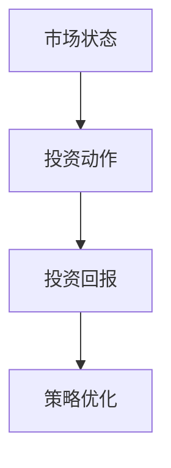

                 


# 强化学习在投资策略优化中的创新应用

> 关键词：强化学习，投资策略优化，人工智能，金融，数学建模，算法优化

> 摘要：本文探讨了强化学习在投资策略优化中的应用，分析了其核心概念、算法原理、数学模型，并通过实际案例展示了如何将强化学习应用于投资策略优化，提出了系统的架构设计和优化建议。

---

# 第一部分: 强化学习与投资策略优化的背景

## 第1章: 强化学习与投资策略优化概述

### 1.1 强化学习的基本概念

#### 1.1.1 强化学习的定义
强化学习（Reinforcement Learning，RL）是一种机器学习范式，通过智能体与环境的交互，学习最优策略以最大化累积奖励。与监督学习和无监督学习不同，强化学习强调实时决策和长期回报优化。

#### 1.1.2 强化学习的核心要素
- **状态（State）**：智能体所处的环境信息。
- **动作（Action）**：智能体采取的行为。
- **奖励（Reward）**：智能体行为的即时反馈。
- **策略（Policy）**：决定下一步动作的规则，通常表示为概率分布。
- **价值函数（Value Function）**：衡量当前状态或策略下的预期回报。

#### 1.1.3 强化学习与传统投资策略的对比
传统投资策略依赖于历史数据分析和人工经验，而强化学习通过数据驱动和实时反馈优化决策，能够适应复杂且动态变化的市场环境。

### 1.2 投资策略优化的背景

#### 1.2.1 投资策略的基本概念
投资策略是指在金融市场中选择和配置资产的方式，以实现特定的收益目标。传统策略包括均值-方差优化和因子模型等。

#### 1.2.2 传统投资策略的局限性
- **数据依赖性**：过度依赖历史数据，无法适应突发市场变化。
- **人为因素干扰**：主观判断可能导致决策偏差。
- **计算复杂性**：复杂的优化问题可能导致计算效率低下。

#### 1.2.3 强化学习在投资策略优化中的优势
- **实时适应性**：能够根据市场反馈实时调整策略。
- **非线性关系处理**：擅长处理复杂的非线性关系，捕捉数据中的隐含模式。
- **多目标优化**：能够在多目标之间进行权衡，优化风险与收益的平衡。

### 1.3 强化学习与投资策略的结合

#### 1.3.1 强化学习在金融领域的应用现状
强化学习已经在金融领域得到了广泛应用，尤其是在高频交易、风险管理和组合优化等方面。

#### 1.3.2 投资策略优化中的问题建模
投资策略优化可以看作是一个马尔可夫决策过程（MDP），其中状态是市场环境，动作是投资决策，奖励是投资回报。

#### 1.3.3 强化学习在投资策略优化中的创新点
通过强化学习构建自适应的投资策略，能够根据市场变化动态调整投资组合，优化长期回报。

---

## 第2章: 强化学习的核心概念与数学模型

### 2.1 马尔可夫决策过程（MDP）

#### 2.1.1 状态空间与动作空间
- **状态空间（State Space）**：市场指数、资产价格等。
- **动作空间（Action Space）**：买入、卖出、持有等。

#### 2.1.2 奖励函数与价值函数
- **奖励函数（Reward Function）**：衡量投资回报。
- **价值函数（Value Function）**：衡量当前状态或策略下的预期回报。

#### 2.1.3 策略与价值评估
- **策略评估（Policy Evaluation）**：计算当前策略下的价值函数。
- **策略优化（Policy Optimization）**：寻找最优策略。

### 2.2 强化学习算法的分类

#### 2.2.1 基于值函数的方法
- **Q-learning**：学习状态-动作值函数。
- **Deep Q-Networks（DQN）**：使用深度神经网络近似Q值函数。

#### 2.2.2 基于策略的方法
- **策略梯度（Policy Gradient）**：直接优化策略参数。
- **Actor-Critic**：结合策略评估和策略优化。

#### 2.2.3 混合方法
- ** Advantage Actor-Critic (A2C)**：结合动作价值和策略优化。

---

### 2.3 强化学习的数学模型

#### 2.3.1 Q-learning算法的数学模型
状态-动作值函数更新公式：
$$ Q(s, a) \leftarrow Q(s, a) + \alpha [r + \gamma \max Q(s', a') - Q(s, a)] $$

其中，$\alpha$ 是学习率，$\gamma$ 是折扣因子。

#### 2.3.2 深度Q网络的结构
使用卷积神经网络（CNN）处理市场数据，输出每个动作的Q值。

#### 2.3.3 策略梯度方法
策略梯度的目标函数：
$$ \nabla_{\theta} \mathbb{E}_{\tau \sim \pi_\theta} [R(\tau)] $$

其中，$\theta$ 是策略参数，$\tau$ 是轨迹。

---

### 2.4 强化学习算法的对比分析

#### 2.4.1 算法对比表格
| 算法名称      | 策略类型    | 优缺点                              |
|---------------|-------------|-------------------------------------|
| Q-learning    | 值函数方法  | 离线学习，适合静态环境              |
| DQN           | 值函数方法  | 在线学习，适合动态环境              |
| Policy Gradient | 策略优化方法 | 直接优化策略，适合复杂动作空间    |
| Actor-Critic  | 混合方法    | 综合Q值和策略优化，稳定性较高        |

#### 2.4.2 ER图（实体关系图）


---

## 第3章: 强化学习在投资策略优化中的应用

### 3.1 投资策略优化的数学模型

#### 3.1.1 动态规划模型
$$ V(s) = \max_a \mathbb{E}[r + \gamma V(s')] $$

其中，$s$ 是当前状态，$s'$ 是下一步状态，$a$ 是动作。

#### 3.1.2 贝尔曼方程
$$ V(s) = r + \gamma \mathbb{E}[V(s')] $$

### 3.2 强化学习算法的实现步骤

#### 3.2.1 环境建模
- 状态空间：市场指数、资产价格等。
- 动作空间：买入、卖出、持有等。

#### 3.2.2 策略网络设计
使用深度神经网络近似策略或Q值函数。

#### 3.2.3 算法实现
以Q-learning为例：
1. 初始化Q表。
2. 与环境交互，获取状态和奖励。
3. 更新Q值：$$ Q(s, a) = Q(s, a) + \alpha (r + \gamma \max Q(s', a') - Q(s, a)) $$

---

### 3.3 投资策略优化的系统架构设计

#### 3.3.1 系统功能设计
- 数据采集：实时市场数据。
- 策略执行：根据强化学习模型生成决策。
- 系统监控：监控交易情况和模型表现。

#### 3.3.2 系统架构图


---

## 第4章: 项目实战

### 4.1 环境安装与配置

#### 4.1.1 安装Python和相关库
安装Python和TensorFlow、Keras、OpenAI Gym等库。

#### 4.1.2 安装环境
使用`pip install gym`安装OpenAI Gym，用于模拟投资环境。

### 4.2 系统核心实现

#### 4.2.1 强化学习模型实现
以DQN为例，编写神经网络模型：
```python
class DQNNetwork(Model):
    def __init__(self):
        super(DQNNetwork, self).__init__()
        self.conv1 = Conv2D(32, (3,3), activation='relu')
        self.conv2 = Conv2D(64, (3,3), activation='relu')
        self.flatten = Flatten()
        self.dense1 = Dense(128, activation='relu')
        self.dense2 = Dense(num_actions, activation='linear')

    def call(self, inputs):
        x = self.conv1(inputs)
        x = self.conv2(x)
        x = self.flatten(x)
        x = self.dense1(x)
        x = self.dense2(x)
        return x
```

#### 4.2.2 策略执行代码
```python
def trade_strategy(state):
    with tf.GradientTape() as tape:
        q_values = model(tf.expand_dims(state, 0))
        action = tf.argmax(q_values, axis=1).numpy()[0]
    return action
```

### 4.3 案例分析与结果解读

#### 4.3.1 投资组合优化
模拟市场环境，训练模型选择最优动作，优化投资组合的收益和风险。

#### 4.3.2 实验结果
展示不同算法在投资组合优化中的表现，比较收益、风险和稳定性。

---

## 第5章: 总结与展望

### 5.1 全文总结
强化学习为投资策略优化提供了新的思路，能够实时适应市场变化，优化投资回报。

### 5.2 最佳实践 tips
- 确保数据质量和实时性。
- 合理设计奖励机制，避免短期行为。
- 定期更新模型，适应市场变化。

### 5.3 小结
通过强化学习构建的投资策略优化系统，能够显著提升投资收益，降低风险。

### 5.4 注意事项
- 避免过度拟合训练数据。
- 确保模型的可解释性和透明性。
- 遵守相关金融监管规定。

### 5.5 拓展阅读
推荐相关书籍和论文，深入学习强化学习和金融投资的结合应用。

---

# 作者：AI天才研究院/AI Genius Institute & 禅与计算机程序设计艺术 /Zen And The Art of Computer Programming

---

这篇文章详细探讨了强化学习在投资策略优化中的应用，从理论基础到实际案例，全面分析了其创新性和实用性。希望对读者在理解和应用强化学习优化投资策略方面有所帮助。

