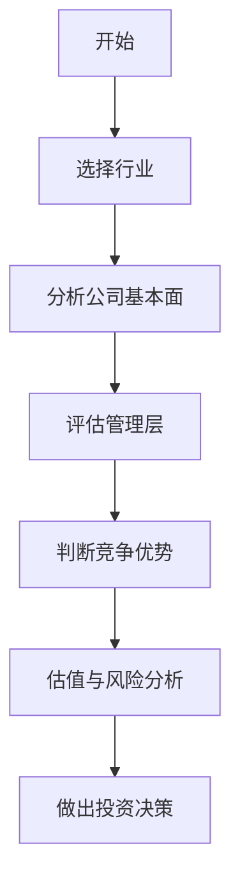
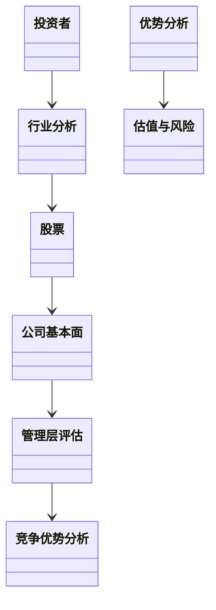

                 

# 彼得·林奇的实地调研投资法

---

## 关键词：
彼得·林奇, 投资方法, 实地调研, 投资策略, 股票分析, 市场研究

---

## 摘要：
本文将详细介绍彼得·林奇的实地调研投资法，从基本概念、核心理念、算法原理到系统分析和实际案例，全面解析这一投资方法的核心要素和操作步骤。通过结构化的分析和实际案例，帮助读者深入理解如何通过实地调研进行有效的投资决策。

---

# 第一部分：投资的基本概念与背景

## 第1章：投资的基本概念与背景

### 1.1 投资的基本概念

#### 1.1.1 什么是投资
投资是将资金投入某一领域，期望在未来获得收益或资本增值的行为。投资的对象可以是股票、债券、房地产等多种资产。

#### 1.1.2 投资的基本原则
1. **分散投资**：不要将所有资金投入单一资产，以降低风险。
2. **长期视角**：投资应以长期增值为目标，避免短期波动的影响。
3. **价值投资**：寻找具有长期增长潜力的优质资产。

#### 1.1.3 投资的分类与特点
1. **股票投资**：通过购买公司股份成为股东，分享公司利润。
2. **债券投资**：购买政府或企业发行的债券，定期获得利息收益。
3. **房地产投资**：通过购买房产或地产进行投资。

---

## 第2章：彼得·林奇的背景与成就

### 2.1 彼得·林奇的生平简介

#### 2.1.1 个人背景
彼得·林奇（Peter Lynch）是美国著名的投资经理，曾管理富达麦哲伦基金（Fidelity Magellan Fund），取得了卓越的投资业绩。

#### 2.1.2 投资哲学
林奇的投资哲学强调基本面分析和实地调研，主张通过深入研究公司基本面来选择具有成长潜力的股票。

#### 2.1.3 成功案例
林奇管理的麦哲伦基金在任期内取得了年均29%的回报率，远超市场平均水平。

---

## 第3章：实地调研投资法的核心理念

### 3.1 投资的核心概念与问题背景

#### 3.1.1 投资的核心概念
1. **公司基本面**：包括收入、利润、资产负债表等财务指标。
2. **行业分析**：研究行业发展趋势和竞争格局。
3. **管理层评估**：分析公司管理层的能力和决策风格。

#### 3.1.2 投资中的主要问题
1. **如何选择具有成长潜力的公司？**
2. **如何评估公司的竞争优势？**
3. **如何避免投资陷阱？**

#### 3.1.3 问题的解决思路
通过实地调研，深入了解公司的经营状况、行业地位和管理层能力，结合估值指标进行投资决策。

---

## 第4章：实地调研投资法的算法原理

### 4.1 实地调研法的算法流程

#### 4.1.1 算法流程图

#### 4.1.2 算法的数学模型
1. **市盈率（P/E）计算**：
$$ P/E = \frac{\text{股价}}{\text{每股收益}} $$
2. **市净率（P/B）计算**：
$$ P/B = \frac{\text{股价}}{\text{每股净资产}} $$

---

## 第5章：系统分析与架构设计方案

### 5.1 投资系统的功能设计

#### 5.1.1 领域模型 Mermaid 类图

---

## 第6章：项目实战与案例分析

### 6.1 实地调研的实战步骤

#### 6.1.1 实地调研的准备
1. **行业研究**：选择具有增长潜力的行业。
2. **目标公司筛选**：根据估值指标初步筛选目标公司。

#### 6.1.2 现场调研的实施
1. **管理层访谈**：与公司高管交流，了解公司战略和经营状况。
2. **实地考察**：参观公司厂区、办公环境，观察运营效率。

#### 6.1.3 数据分析与决策
1. **财务指标分析**：计算公司各项财务指标，评估公司盈利能力。
2. **竞争优势评估**：分析公司在行业中的竞争优势。

---

## 第7章：总结与扩展阅读

### 7.1 投资策略的小结
彼得·林奇的实地调研投资法强调基本面分析和实地调研，通过深入研究公司基本面和行业趋势，选择具有成长潜力的优质股票进行投资。

### 7.2 最佳实践 tips
1. **持续学习**：不断更新行业知识和投资技巧。
2. **风险控制**：合理分散投资，避免过度集中。

### 7.3 拓展阅读
推荐阅读彼得·林奇的《彼得·林奇的成功投资：聪明的全球投资者》和《股市真经》。

---

## 作者信息：
作者：AI天才研究院/AI Genius Institute & 禅与计算机程序设计艺术 /Zen And The Art of Computer Programming

