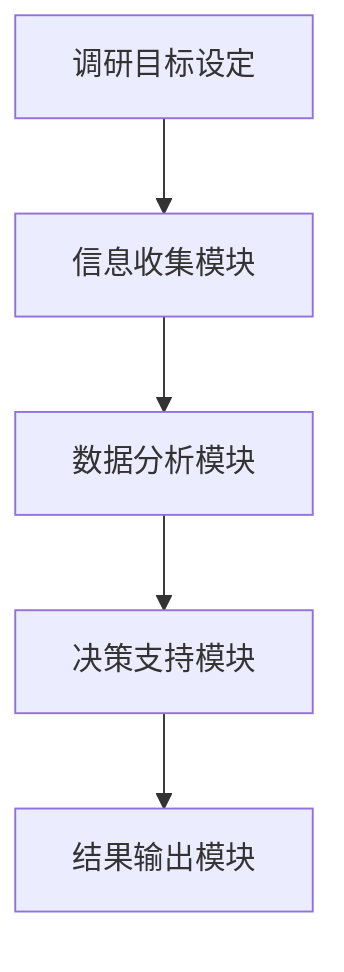
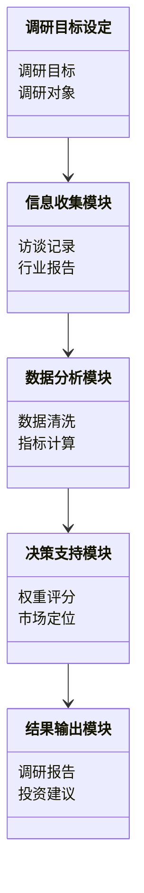
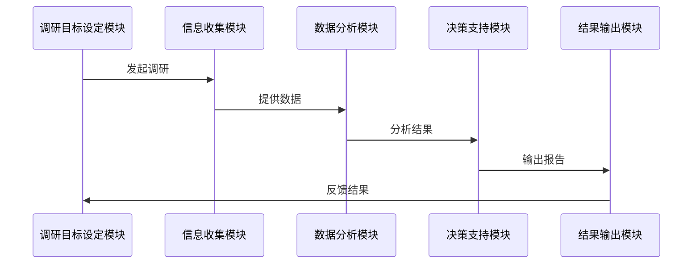

                 


# 彼得·林奇的实地调研方法论

> 关键词：实地调研，投资分析，彼得·林奇，数学模型，系统架构

> 摘要：本文系统地介绍了彼得·林奇的实地调研方法论，从定义、核心要素、信息收集与分析方法、数学模型构建、系统架构设计到项目实战，全面剖析了实地调研的理论与实践。文章通过具体案例分析和数学模型的应用，深入探讨了如何利用实地调研方法论进行有效的投资决策。

---

## 第1章: 实地调研的定义与重要性

### 1.1 实地调研的核心概念

#### 1.1.1 实地调研的定义
实地调研是一种通过直接观察、访谈和数据收集，深入了解目标公司或项目的运营状况、市场定位、管理团队等关键因素的方法。这种方法强调“第一手”的信息获取，以确保分析的准确性和深度。

#### 1.1.2 实地调研在投资分析中的作用
实地调研在投资分析中扮演着至关重要的角色，尤其是在判断公司的基本面和潜在风险方面。通过实地调研，投资者可以更全面地评估公司的运营效率、管理能力、市场竞争力以及财务健康状况。

#### 1.1.3 实地调研与其他调研方法的对比
以下是几种常见的调研方法对比：

| 调研方法 | 定义 | 优点 | 缺点 |
|----------|------|------|------|
| 实地调研 | 通过现场观察和访谈获取信息 | 数据真实可靠 | 成本高，时间长 |
| 电话调研 | 通过电话访谈获取信息 | 成本低，效率高 | 信息深度有限 |
| 问卷调研 | 通过问卷调查获取数据 | 范围广，数据量大 | 回馈率低，信息准确性差 |
| 数据分析 | 通过现有数据进行统计分析 | 数据量大，覆盖范围广 | 数据可能存在偏差 |

### 1.2 彼得·林奇实地调研方法论的背景

#### 1.2.1 彼得·林奇的生平与投资理念
彼得·林奇是美国著名投资经理，以其在富达投资集团管理麦哲伦基金的卓越表现而闻名。他的投资理念强调长期持有优质股票，并通过深入的实地调研来发现具有成长潜力的公司。

#### 1.2.2 实地调研在林奇投资策略中的地位
实地调研是林奇分析投资机会的核心方法之一。他认为，只有通过实地调研，才能全面了解公司的运营状况、管理层素质以及市场竞争力。

#### 1.2.3 实地调研方法论的演变与应用
随着投资环境的变化，实地调研方法也在不断演变。从最初的简单访谈到现在的系统化调研框架，实地调研方法论在实践中得到了广泛应用。

---

## 第2章: 实地调研的核心要素与框架

### 2.1 实地调研的基本要素

#### 2.1.1 调研目标的确定
明确调研目标是实地调研的第一步。目标通常包括评估公司的财务状况、分析市场竞争力、了解管理层风格等。

#### 2.1.2 调研对象的选择标准
选择合适的调研对象是确保调研效率的关键。通常，选择那些具有成长潜力但尚未被市场充分挖掘的公司作为调研对象。

#### 2.1.3 调研时间与频率的规划
实地调研的时间和频率应根据调研目标和公司特点灵活调整。一般来说，重点公司需要定期调研，以确保信息的及时性。

### 2.2 实地调研的框架体系

#### 2.2.1 调研计划的制定
调研计划应包括调研目标、调研对象、调研时间表、调研人员分工等内容。

#### 2.2.2 调研流程的标准化
标准化的调研流程有助于提高调研效率和质量。通常包括信息收集、数据整理、分析评估、报告撰写等环节。

#### 2.2.3 调研结果的评估与反馈
对调研结果进行评估和反馈是改进调研方法的重要环节。通过不断优化调研流程，可以提高调研的准确性和效率。

---

## 第3章: 实地调研的信息收集与分析方法

### 3.1 信息收集的渠道与工具

#### 3.1.1 公司内部信息的获取
通过与公司管理层、员工的访谈，获取公司的内部运营信息。

#### 3.1.2 行业数据与市场信息的收集
利用行业报告、市场分析等外部数据，补充公司内部信息的不足。

#### 3.1.3 竞争对手分析的方法
通过分析竞争对手的市场份额、产品特点等，评估公司在行业中的竞争优势。

### 3.2 信息分析的核心方法

#### 3.2.1 数据的清洗与预处理
在分析数据之前，需要对数据进行清洗和预处理，确保数据的准确性和一致性。

#### 3.2.2 关键指标的识别与评估
识别影响公司价值的关键指标，并对其进行深入评估。例如，盈利能力、成长能力、财务健康状况等。

#### 3.2.3 信息综合分析的步骤
综合分析步骤包括数据整理、指标评估、趋势分析、风险评估等。

---

## 第4章: 实地调研的数学模型与决策支持

### 4.1 实地调研的数学模型

#### 4.1.1 基于权重的评分模型
$$ \text{公司评分} = \sum_{i=1}^{n} w_i \times x_i $$
其中，\( w_i \) 为指标权重，\( x_i \) 为指标得分。

#### 4.1.2 基于聚类的市场定位模型
$$ \text{相似度} = \sum_{i=1}^{m} |x_i - y_i| $$
其中，\( x_i \) 和 \( y_i \) 分别为两个公司的指标值。

### 4.2 决策支持系统的构建

#### 4.2.1 数据可视化与分析工具
利用数据可视化工具（如Tableau、Power BI）进行数据展示和分析。

#### 4.2.2 模型的验证与优化
通过实际数据验证模型的准确性，并根据反馈不断优化模型。

#### 4.2.3 决策支持系统的实际应用案例
通过具体案例分析，展示如何利用数学模型和决策支持系统进行投资决策。

---

## 第5章: 实地调研的系统架构与实现

### 5.1 调研系统的总体架构

#### 5.1.1 系统功能模块划分
系统功能模块包括信息收集模块、数据分析模块、决策支持模块、结果输出模块等。

#### 5.1.2 系统架构的Mermaid图示


### 5.2 调研系统的具体实现

#### 5.2.1 项目实战：环境安装与核心代码实现

##### 5.2.1.1 环境安装
需要安装Python、Pandas、NumPy、Matplotlib等库。

##### 5.2.1.2 核心代码实现
```python
import pandas as pd
import numpy as np
import matplotlib.pyplot as plt

# 示例数据
data = {
    '公司': ['A', 'B', 'C'],
    '收入': [100, 200, 150],
    '利润': [20, 30, 25]
}

df = pd.DataFrame(data)

# 计算盈利能力
df['盈利能力'] = df['利润'] / df['收入']

# 可视化
plt.figure(figsize=(10, 6))
plt.bar(df['公司'], df['收入'], label='收入')
plt.bar(df['公司'], df['利润'], label='利润')
plt.legend()
plt.show()
```

#### 5.2.2 系统功能设计

##### 5.2.2.1 领域模型的Mermaid类图


#### 5.2.3 系统架构设计

##### 5.2.3.1 系统架构的Mermaid图示
```mermaid
container 调研系统 {
    调研目标设定模块
    信息收集模块
    数据分析模块
    决策支持模块
    结果输出模块
}
```

#### 5.2.4 系统交互的Mermaid序列图



---

## 第6章: 项目实战与案例分析

### 6.1 项目背景介绍
通过具体案例分析，展示如何利用实地调研方法论进行投资决策。

### 6.2 核心代码实现与应用解读
详细解读代码实现，并分析其在实际应用中的效果。

### 6.3 实际案例分析
通过分析某公司的实地调研案例，展示如何利用调研结果进行投资决策。

### 6.4 项目小结
总结项目实施过程中的经验和教训，提出改进建议。

---

## 第7章: 最佳实践与小结

### 7.1 最佳实践 tips
总结实地调研方法论的最佳实践，包括调研目标的设定、信息收集的技巧、数学模型的选择与优化等。

### 7.2 小结
回顾全文，总结实地调研方法论的核心内容和实际应用价值。

### 7.3 注意事项
提醒读者在实际应用中需要注意的事项，如数据的准确性和调研结果的局限性。

### 7.4 拓展阅读
推荐相关的书籍和资源，供读者进一步学习和研究。

---

## 作者：AI天才研究院/AI Genius Institute & 禅与计算机程序设计艺术 /Zen And The Art of Computer Programming

---

以上是关于彼得·林奇实地调研方法论的完整文章结构和内容，涵盖了从理论到实践的各个方面，结合了技术细节和实际案例，旨在为读者提供全面而深入的指导。

