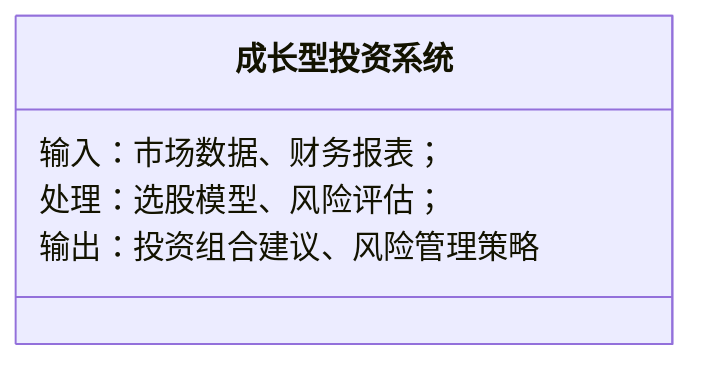

                 


# 彼得·林奇的成长型价值投资方法论

---

## 关键词：
- 彼得·林奇
- 成长型投资
- 价值投资
- 股票筛选
- 投资策略
- 风险控制

---

## 摘要：
本文深入探讨了彼得·林奇的成长型价值投资方法论，结合其投资哲学、选股标准、组合管理和风险管理等方面，系统性地分析了成长型投资的核心原理和实践方法。通过详细讲解彼得·林奇的选股模型、投资策略和风险管理框架，本文为投资者提供了从理论到实践的全面指导。

---

## 第1章：成长型投资的起源与发展

### 1.1 投资学的演变历程
#### 1.1.1 传统投资理论的局限性
- 传统投资理论的缺陷：价格波动、市场情绪影响、短期收益的不可预测性。
- 从“价格驱动”到“价值驱动”的转变。

#### 1.1.2 现代投资组合理论的兴起
- 马科维茨的现代投资组合理论（MPT）。
- 布雷利·戴维斯的成长股投资理念。

#### 1.1.3 成长型投资的萌芽与成长
- 成长型投资的定义与特点。
- 成长型投资与价值型投资的区别。

---

## 第2章：彼得·林奇与成长型价值投资

### 2.1 彼得·林奇的生平简介
#### 2.1.1 早年经历与职业生涯起点
- 出生背景：1940年出生于美国波士顿。
- 职业生涯起点：在富达投资的早期经历。

#### 2.1.2 在富达投资的辉煌历程
- 管理基金规模的增长。
- 投资理念的核心：寻找具有持续增长潜力的企业。

#### 2.1.3 彼得·林奇的投资哲学与风格
- “找到最好的公司，然后长期持有”。
- 重视基本面分析和公司治理。

---

## 第3章：成长型价值投资的核心理念

### 3.1 成长型投资的定义与特征
#### 3.1.1 成长型投资的核心概念
- 成长型投资的定义：投资于具有持续增长潜力的公司。
- 成长型投资的关键特征：收入增长、净利润增长、ROE（净资产收益率）。

#### 3.1.2 成长型与价值型投资的对比
- 价值型投资：低估值、高分红。
- 成长型投资：高增长、高潜力。

#### 3.1.3 成长型投资的适用场景与边界
- 适用场景：高增长行业（科技、医疗、消费等）。
- 边界条件：避免高估值陷阱。

---

## 第4章：成长型投资的选股标准与流程

### 4.1 选股的核心要素
#### 4.1.1 行业分析与竞争优势
- 行业前景：行业的成长空间和竞争格局。
- 竞争优势：企业的核心竞争力（技术、成本、品牌等）。

#### 4.1.2 财务指标的筛选与权重
- 收入增长率：过去5年收入年均增长率。
- 净利润增长率：过去5年净利润年均增长率。
- ROE（净资产收益率）：衡量盈利能力的关键指标。

#### 4.1.3 管理层能力和企业治理
- 管理层稳定性与决策能力。
- 公司治理结构的透明度和规范性。

---

### 4.2 彼得·林奇的选股模型
#### 4.2.1 股票筛选的数学模型
$$
\text{成长性评分} = \frac{(\text{收入增长率} + \text{净利润增长率})}{2} \times \text{ROE}
$$

#### 4.2.2 模型的优缺点分析
- 优点：量化分析，易于操作。
- 缺点：忽略行业周期性和市场波动的影响。

---

## 第5章：成长型投资的组合管理与风险控制

### 5.1 投资组合的构建策略
#### 5.1.1 股票配置的比例分配
- 配置比例：成长股占60%，价值股占30%，现金占10%。
- 行业分散：避免过度集中于单一行业。

#### 5.1.2 行业分散与个股集中度
- 行业分散：降低行业周期性风险。
- 个股集中：重点投资于少数优质成长股。

#### 5.1.3 定期再平衡的必要性
- 再平衡周期：每年进行一次再平衡。
- 再平衡方法：根据市场变化调整持仓比例。

---

### 5.2 风险管理与心理控制
#### 5.2.1 风险的定义与度量
- 市场风险：整体市场的波动性风险。
- 特定风险：个股或行业的特定风险。

#### 5.2.2 仓位调整与止损策略
- 仓位调整：根据市场环境和个人风险承受能力调整仓位。
- 止损策略：设定止损点，避免重大损失。

#### 5.2.3 投资者心理的自我控制
- 避免贪婪与恐惧：保持理性，避免追涨杀跌。
- 长期视角：关注企业的长期增长潜力，而非短期波动。

---

## 第6章：成长型投资的长期策略与实践

### 6.1 长期投资的哲学与实践
#### 6.1.1 时间的复利效应
- 复利公式：$A = P(1 + r)^n$。
- 时间对复利效果的影响。

#### 6.1.2 耐心与纪律的重要性
- 长期投资需要耐心和纪律。
- 避免频繁交易，降低成本。

#### 6.1.3 长期投资中的常见误区
- 过度关注短期收益。
- 忽视企业的基本面变化。

---

### 6.2 成长型投资的实战案例
#### 6.2.1 经典投资案例分析
- 苹果公司：从成长股到行业巨头。
- 微软公司：从技术公司到云服务领导者。

#### 6.2.2 案例中的经验与教训
- 选择具有持续创新能力的企业。
- 关注企业的财务健康状况。

#### 6.2.3 案例对当前投资的启示
- 在科技领域寻找高增长潜力的企业。
- 关注企业的ROE和收入增长率。

---

## 第7章：成长型投资的系统分析与架构设计

### 7.1 系统功能设计
#### 7.1.1 领域模型


---

### 7.2 系统架构设计


---

### 7.3 系统交互设计
```mermaid
sequenceDiagram
    用户 -> 系统：提交投资需求
    系统 -> 数据库：查询符合条件的成长股
    系统 -> 用户：返回投资组合建议
    用户 -> 系统：确认投资组合
    系统 -> 用户：定期提供风险管理建议
```

---

## 第8章：项目实战

### 8.1 环境安装
- 安装Python：用于数据分析和建模。
- 安装Pandas、NumPy：用于数据处理。
- 安装Matplotlib：用于数据可视化。

### 8.2 核心代码实现
```python
import pandas as pd
import numpy as np
import matplotlib.pyplot as plt

# 数据加载
df = pd.read_csv('stock_data.csv')

# 选股模型
def成长性评分(收入增长率, 净利润增长率, ROE):
    return (收入增长率 + 净利润增长率) / 2 * ROE

# 筛选成长股
成长股 = df[df['成长性评分'] > 80]
```

---

### 8.3 案例分析
- 以科技行业为例，筛选具有高收入增长率和高ROE的企业。
- 分析企业的财务报表，评估其成长性和安全性。

---

## 第9章：最佳实践与注意事项

### 9.1 最佳实践 tips
- 定期审视投资组合，调整持仓比例。
- 保持对市场的敏感性，关注行业动态。
- 选择具有强大管理团队和良好公司治理的企业。

### 9.2 小结
- 成长型投资是一种长期投资策略，注重企业的内在价值和成长潜力。
- 彼得·林奇的成长型价值投资方法论为投资者提供了系统的选股和投资框架。

### 9.3 注意事项
- 避免过度集中于单一行业或个股。
- 重视风险控制，设定止损点。
- 理性投资，避免被市场情绪左右。

---

## 第10章：拓展阅读

### 10.1 推荐书籍
- 《彼得·林奇的成功投资》
- 《股票作手回忆录》
- 《投资学基础》

### 10.2 在线资源
- 彼得·林奇的演讲视频。
- 投资论坛和社区。

---

## 作者：AI天才研究院/AI Genius Institute & 禅与计算机程序设计艺术 /Zen And The Art of Computer Programming

