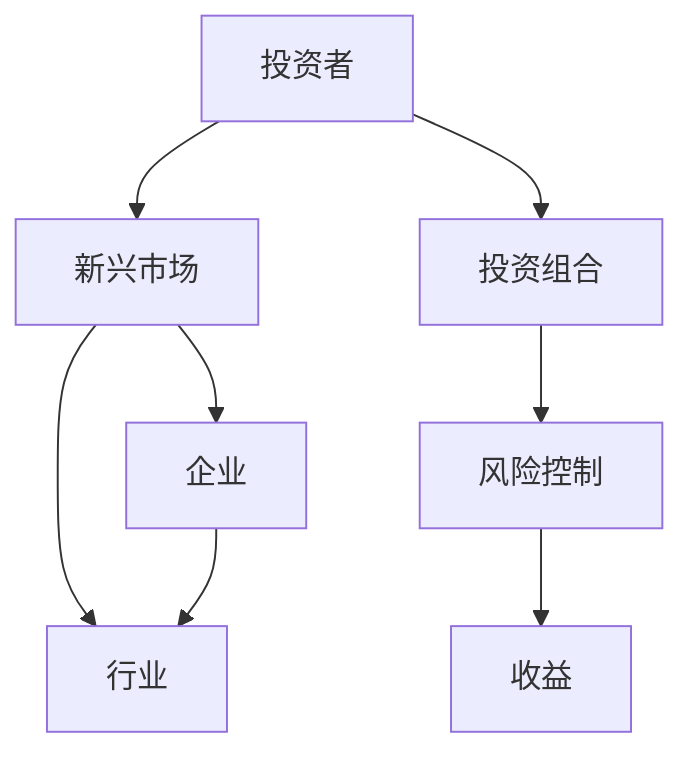
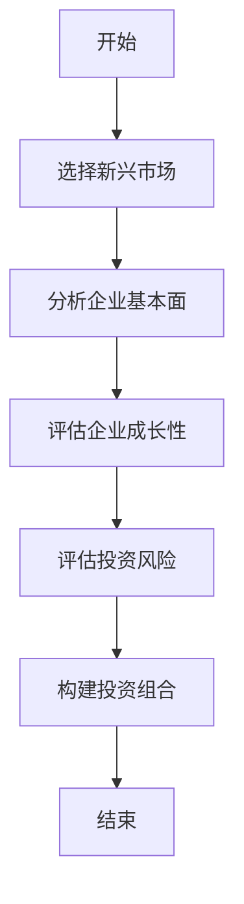
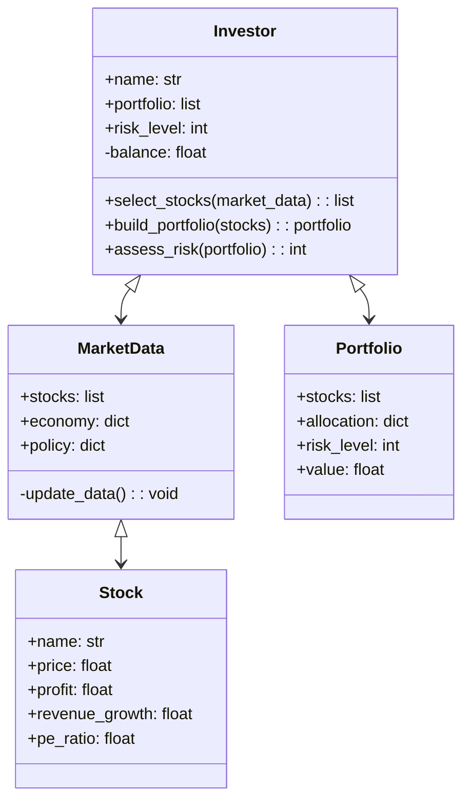

                 


# 彼得·林奇的新兴市场投资策略

> 关键词：彼得·林奇、新兴市场、投资策略、风险管理、价值投资、成长型企业、长期投资

> 摘要：本文深入探讨了彼得·林奇在新兴市场投资中的核心策略，包括他的投资理念、选股标准、风险管理方法以及长期投资的逻辑。通过系统化的分析和实际案例，本文揭示了如何在新兴市场中识别投资机会，构建稳健的投资组合，并在风险可控的前提下实现长期收益。

---

## 第1章: 新兴市场投资的背景与重要性

### 1.1 新兴市场的定义与特点

新兴市场是指那些经济快速增长、市场机制逐步完善、但尚未完全成熟的国家或地区的金融市场。这些市场通常具有以下特点：

- **高速经济增长**：新兴市场的GDP增长通常高于发达市场，这为投资提供了潜在的机会。
- **市场波动性高**：新兴市场的股票、货币等资产价格波动较大，既带来高收益的可能性，也增加了投资风险。
- **市场参与者多样性**：新兴市场中的企业类型多样，包括国有企业、大型跨国公司以及本地初创企业。
- **政策影响显著**：新兴市场的经济和金融市场受政府政策影响较大，政策变化可能对市场产生重大影响。

### 1.2 彼得·林奇的投资理念

彼得·林奇是美国著名的投资专家，以其在波士顿基金（Fidelity Management Inc.）的长期管理经历而闻名。他对新兴市场的投资策略主要基于以下几个核心理念：

- **价值投资**：林奇认为，投资的核心是寻找那些被市场低估的企业。他倾向于投资那些具有强大基本面、良好管理团队和可持续增长潜力的企业。
- **长期投资**：林奇强调长期投资的重要性，认为短期市场波动不应影响投资者的决策。
- **分散投资**：为了避免单一市场的风险，林奇建议投资者将资金分散投资于多个新兴市场，以降低整体风险。

---

## 第2章: 新兴市场投资的核心概念与联系

### 2.1 核心概念原理

新兴市场投资的核心在于识别具有长期增长潜力的企业，并在合理的价格水平下进行投资。以下是新兴市场投资的核心概念：

- **投资机会**：新兴市场的高速经济增长为投资者提供了丰富的投资机会，尤其是在科技、消费、制造等领域。
- **风险管理**：新兴市场的波动性较高，投资者需要通过多元化投资和严格的风险评估来降低风险。
- **长期增长潜力**：新兴市场的企业通常具有较高的成长性，尤其是在技术升级、消费升级和政策支持的背景下。

### 2.2 核心概念对比表格

以下是新兴市场与发达市场的对比分析：

| 属性                | 新兴市场                   | 发达市场                   |
|---------------------|---------------------------|---------------------------|
| 经济增长速度         | 高速增长                 | 低速或稳定增长             |
| 市场波动性           | 高                        | 低                        |
| 企业类型           | 多样化，包括初创企业和国有企业 | 成熟企业为主               |
| 投资风险           | 高                        | 低                        |
| 政策影响           | 显著                     | 较小                     |

### 2.3 ER实体关系图架构

以下是新兴市场投资的核心要素关系图：



---

## 第3章: 新兴市场投资的算法原理

### 3.1 算法原理概述

彼得·林奇的新兴市场投资策略可以看作是一种基于基本面分析的投资算法。以下是其核心步骤：

1. **企业基本面分析**：通过分析企业的财务数据（如收入、利润、负债等）来评估其健康状况。
2. **成长性评估**：通过分析企业的增长率、市场份额和竞争优势来判断其长期发展潜力。
3. **风险评估**：通过分析市场波动性、政策风险和行业风险来评估投资风险。
4. **投资组合优化**：根据风险评估结果，调整投资组合以实现风险与收益的最优平衡。

### 3.2 算法流程图

以下是新兴市场投资算法的流程图：



### 3.3 算法实现代码示例

以下是基于基本面分析的企业筛选算法的代码示例：

```python
def select_stocks(market_data):
    selected_stocks = []
    for company in market_data:
        # 判断企业是否盈利
        if company.profit > 0:
            # 判断企业收入是否增长
            if company.revenue_growth > 5:
                # 判断市盈率是否合理
                if company.pe_ratio < 15:
                    selected_stocks.append(company)
    return selected_stocks
```

---

## 第4章: 新兴市场投资的系统分析与架构设计

### 4.1 系统分析

#### 4.1.1 投资决策场景介绍

投资者需要在多个新兴市场中选择具有长期增长潜力的企业，并构建一个风险可控的投资组合。

#### 4.1.2 系统功能设计（领域模型图）

以下是领域模型图：



---

## 第5章: 新兴市场投资的项目实战

### 5.1 环境安装与配置

#### 5.1.1 投资分析工具的安装

建议使用以下工具进行投资分析：

- **数据分析工具**：Python、R、Excel
- **投资组合管理工具**：Mint、Personal Capital、YCharts
- **风险管理工具**：Excel插件、Python库（如pandas、numpy）

#### 5.1.2 数据源的获取与处理

可以从以下渠道获取新兴市场的数据：

- **金融数据提供商**： Bloomberg、FactSet、Morningstar
- **开源数据集**：Kaggle、Quandl
- **政府统计数据**：国际货币基金组织（IMF）、世界银行

---

### 5.2 核心实现源代码

以下是投资组合优化的代码示例：

```python
import numpy as np
import pandas as pd

def portfolio_optimization(stocks, risk_level):
    # 计算收益和风险
    returns = pd.DataFrame({stock: [np.random.normal(0, 1) for _ in range(100)] for stock in stocks})
    returns['mean'] = returns.mean(axis=1)
    returns['std'] = returns.std(axis=1)
    
    # 构建投资组合
    weights = np.random.dirichlet([1,1,1], size=1)
    portfolio_returns = np.dot(weights, returns)
    portfolio_risk = np.sqrt(np.dot(weights.T, np.dot(returns.cov(), weights)))
    
    # 判断是否满足风险要求
    if portfolio_risk < risk_level:
        return weights
    else:
        return None

# 示例调用
stocks = ['Tech', 'Consumer', 'Manufacturing']
risk_level = 0.1
result = portfolio_optimization(stocks, risk_level)
print(result)
```

---

### 5.3 实际案例分析

假设我们投资于中国的科技企业，以下是具体分析步骤：

1. **选择企业**：选择具有高成长性的科技企业，如腾讯、阿里巴巴、百度等。
2. **评估基本面**：分析企业的收入、利润、负债等财务指标。
3. **评估成长性**：分析企业的市场份额、技术优势和未来增长潜力。
4. **构建投资组合**：根据风险评估结果，调整投资组合的权重。

---

## 第6章: 新兴市场投资的最佳实践与小结

### 6.1 最佳实践tips

- **长期投资**：避免短期市场波动的干扰，坚持长期投资。
- **分散投资**：通过分散投资降低风险。
- **持续学习**：密切关注新兴市场的动态，及时调整投资策略。

### 6.2 项目小结

本文通过系统化的分析，揭示了彼得·林奇在新兴市场投资中的核心策略。从基本概念到实际操作，本文为投资者提供了一套完整的投资框架。

### 6.3 注意事项与风险提示

- **市场波动风险**：新兴市场的波动性较高，投资者需要做好心理准备。
- **政策风险**：新兴市场的政策变化可能对市场产生重大影响。
- **信息不对称风险**：投资者需要依赖高质量的数据和信息进行决策。

---

## 第7章: 拓展阅读与深入学习

### 7.1 拓展阅读推荐

- **《彼得·林奇的投资笔记》**：深入理解彼得·林奇的投资理念。
- **《新兴市场投资指南》**：系统介绍新兴市场的投资策略。
- **《风险管理的艺术》**：学习如何在投资中管理风险。

### 7.2 工具推荐

- **数据可视化工具**：Tableau、Power BI
- **编程语言**：Python、R
- **投资分析工具**：Morningstar、FactSet

---

作者：AI天才研究院/AI Genius Institute & 禅与计算机程序设计艺术 /Zen And The Art of Computer Programming

