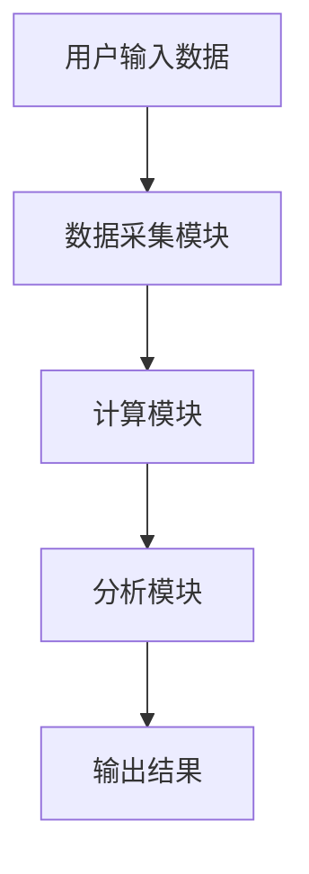
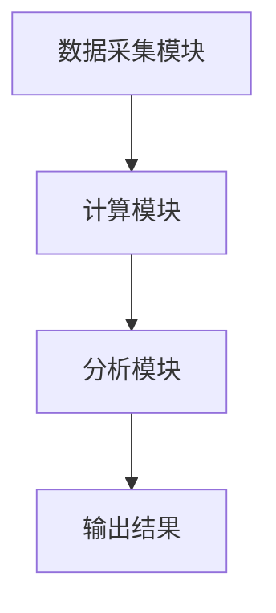

                 


# 彼得林奇如何分析公司的客户获取成本

> 关键词：客户获取成本（CAC）、客户生命周期价值（CLV）、投资分析、边际成本、彼得·林奇投资策略

> 摘要：本文深入分析了彼得·林奇如何评估公司的客户获取成本（CAC），探讨了CAC的核心概念、计算方法、行业对比，以及如何通过边际成本优化和客户生命周期价值（CLV）来评估客户获取策略的效率和效果。文章结合了数学模型、系统架构设计和实际案例，为读者提供了从理论到实践的完整指导。

---

# 第一部分: 客户获取成本分析的背景与核心概念

# 第1章: 客户获取成本（CAC）的定义与重要性

## 1.1 客户获取成本的核心概念

### 1.1.1 什么是客户获取成本
客户获取成本（CAC，Customer Acquisition Cost）是指公司为获取一个新客户所花费的总成本。这包括营销费用、销售团队的工资、广告支出、渠道佣金等所有与客户获取相关的支出。

$$CAC = \frac{营销费用 + 销售费用}{新客户数量}$$

这个公式表明，CAC的高低不仅取决于支出总额，还与获取客户的能力密切相关。一个高效的销售团队或有效的营销策略可以显著降低CAC。

### 1.1.2 客户获取成本的重要性
CAC是评估公司客户获取策略效率的重要指标。低CAC意味着公司获取客户的成本较低，通常意味着营销和销售策略的有效性较高。高CAC可能表明公司在获取客户方面效率低下，或者投入了过多资源。

### 1.1.3 客户获取成本与公司价值的关系
CAC与公司价值密切相关。如果一个公司的CAC低于其客户生命周期价值（CLV），则意味着公司可以通过获取客户创造长期价值。反之，如果CAC高于CLV，公司可能在客户获取上投入过多，难以盈利。

---

## 1.2 客户获取成本的计算公式

### 1.2.1 CAC的定义公式
CAC的计算公式可以进一步细化为：

$$CAC = \frac{营销费用 + 销售费用}{新客户数量}$$

其中：
- 营销费用：公司用于广告、市场推广、SEO等的支出。
- 销售费用：销售团队的工资、奖金、培训费用等。
- 新客户数量：公司在一定时间内获取的新客户数。

### 1.2.2 CAC的计算步骤
1. **确定时间范围**：选择一个具体的时期，例如一个季度或一年。
2. **统计营销费用**：将所有用于吸引客户的支出加总。
3. **统计销售费用**：将销售团队的相关支出加总。
4. **计算新客户数量**：统计在该时间段内获取的新客户数。
5. **计算CAC**：将营销和销售费用的总和除以新客户数量。

### 1.2.3 CAC的行业差异

| 行业         | CAC特点                     |
|--------------|-----------------------------|
| 高科技       | 高，依赖营销和技术支持       |
| 传统零售     | 中等，依赖线下渠道           |
| 互联网服务   | 中低，依赖线上营销和自动化工具 |

---

## 1.3 客户获取成本的影响因素

### 1.3.1 营销渠道的选择
不同的营销渠道（如广告、社交媒体、内容营销）有不同的成本和效率。选择高效的渠道可以显著降低CAC。

### 1.3.2 销售团队的效率
销售团队的效率直接影响CAC。高效的销售团队能够更快地将潜在客户转化为实际客户，从而降低CAC。

### 1.3.3 客户转化率的优化
提高客户转化率是降低CAC的关键。通过优化销售流程和客户体验，可以减少获取客户的成本。

---

## 1.4 本章小结

本章介绍了CAC的核心概念、计算公式及其在公司价值中的重要性。通过分析CAC的行业差异和影响因素，我们可以更好地理解如何优化客户获取策略。

---

# 第2章: 客户获取成本分析的核心要素

## 2.1 客户生命周期价值（CLV）

### 2.1.1 CLV的定义与计算公式
客户生命周期价值（CLV）是指客户在其生命周期内为公司带来的总收益。计算公式为：

$$CLV = 客户平均收入 - CAC$$

其中，客户平均收入是客户在其生命周期内为公司带来的平均收入。

### 2.1.2 CLV与CAC的关系
CLV与CAC的比率是评估客户获取策略的重要指标。理想情况下，CLV应远高于CAC，以确保公司能够从客户获取中获得正收益。

### 2.1.3 CLV的行业差异
不同行业的CLV差异显著。例如，互联网服务行业的CLV可能较低，而高科技行业的CLV可能较高。

---

## 2.2 客户获取成本的边际成本分析

### 2.2.1 边际成本的定义
边际成本是指每增加一个额外客户所增加的成本。优化边际成本可以显著降低整体CAC。

### 2.2.2 边际成本与CAC的关系
边际成本的优化是降低CAC的关键。通过分析边际成本，公司可以识别出哪些客户获取渠道最具成本效益。

### 2.2.3 边际成本的优化策略
1. **优化营销渠道**：选择成本效益比高的渠道。
2. **提高销售效率**：通过培训和工具提升销售团队的效率。
3. **自动化营销**：利用自动化工具降低营销成本。

---

## 2.3 客户获取成本的行业对比

### 2.3.1 不同行业的CAC差异
不同行业的CAC差异显著。例如，高科技行业的CAC可能较高，而传统零售行业的CAC可能较低。

### 2.3.2 高科技行业的CAC特点
高科技行业通常依赖技术驱动的营销和销售，因此CAC较高，但CLV也较高。

### 2.3.3 传统行业的CAC特点
传统行业通常依赖线下渠道，CAC较低，但CLV也相对较低。

---

## 2.4 本章小结

本章分析了CLV与CAC的关系，探讨了边际成本的优化策略，并对比了不同行业的CAC特点。通过这些分析，我们可以更好地理解如何优化客户获取策略。

---

# 第3章: 彼得·林奇的客户获取成本分析框架

## 3.1 彼得·林奇的投资理念

### 3.1.1 价值投资的核心思想
彼得·林奇倡导价值投资，即寻找那些被市场低估的公司。他认为，客户获取成本是评估公司价值的重要指标之一。

### 3.1.2 宏观经济与行业分析
林奇强调宏观经济和行业趋势对客户获取成本的影响。例如，经济衰退可能降低营销费用，从而降低CAC。

### 3.1.3 公司基本面分析
林奇通过分析公司的财务报表和运营数据来评估其客户获取成本。例如，他关注销售费用占收入的比例，以评估CAC的合理性。

---

## 3.2 彼得·林奇的分析步骤

### 3.2.1 确定分析目标
林奇首先明确客户获取成本分析的目标，例如评估营销渠道的有效性。

### 3.2.2 数据收集与整理
收集与客户获取相关的数据，包括营销费用、销售费用、新客户数量等。

### 3.2.3 计算CAC与CLV
使用上述公式计算CAC和CLV，并分析它们之间的关系。

### 3.2.4 优化建议
根据分析结果提出优化建议，例如优化营销渠道或提高销售效率。

---

## 3.3 彼得·林奇的分析工具

### 3.3.1 CAC与CLV对比分析
通过对比CAC和CLV，评估客户获取策略的效率。

### 3.3.2 边际成本分析工具
使用边际成本分析工具，识别最具成本效益的客户获取渠道。

---

## 3.4 本章小结

本章介绍了彼得·林奇的投资理念和分析步骤，并探讨了他使用的分析工具。通过这些方法，我们可以更深入地理解客户获取成本的评估和优化。

---

# 第4章: 客户获取成本分析的数学模型与算法

## 4.1 客户获取成本的数学模型

### 4.1.1 CAC的计算公式
$$CAC = \frac{营销费用 + 销售费用}{新客户数量}$$

### 4.1.2 CLV的计算公式
$$CLV = 客户平均收入 - CAC$$

### 4.1.3 边际成本计算公式
$$边际成本 = \frac{Δ总成本}{Δ客户数量}$$

---

## 4.2 客户获取成本的算法实现

### 4.2.1 算法步骤
1. **数据收集**：收集营销费用、销售费用和新客户数量。
2. **计算CAC**：使用CAC公式计算客户获取成本。
3. **计算CLV**：使用CLV公式计算客户生命周期价值。
4. **对比分析**：对比CAC和CLV，评估客户获取策略的效率。

### 4.2.2 算法实现代码

```python
def calculate_cac(market_cost, sales_cost, new_customers):
    return (market_cost + sales_cost) / new_customers

def calculate_clv(customer_revenue, cac):
    return customer_revenue - cac

# 示例数据
market_cost = 100000
sales_cost = 50000
new_customers = 100
customer_revenue = 200

cac = calculate_cac(market_cost, sales_cost, new_customers)
clv = calculate_clv(customer_revenue, cac)

print(f"CAC: {cac}")
print(f"CLV: {clv}")
```

---

## 4.3 本章小结

本章通过数学模型和算法实现，详细讲解了客户获取成本的计算方法。通过代码示例，读者可以更好地理解和应用这些模型。

---

# 第5章: 客户获取成本分析的系统架构设计

## 5.1 系统功能设计

### 5.1.1 系统目标
设计一个客户获取成本分析系统，帮助公司优化客户获取策略。

### 5.1.2 功能模块
1. 数据采集模块：收集营销费用、销售费用和新客户数量。
2. 计算模块：计算CAC和CLV。
3. 分析模块：对比CAC和CLV，提出优化建议。

### 5.1.3 系统功能流程图（Mermaid）



---

## 5.2 系统架构设计

### 5.2.1 系统架构图（Mermaid）



### 5.2.2 接口设计
1. 数据采集接口：接受营销费用、销售费用和新客户数量。
2. 计算接口：计算CAC和CLV。
3. 分析接口：对比CAC和CLV，提出优化建议。

---

## 5.3 本章小结

本章通过系统架构设计，详细讲解了客户获取成本分析的实现方案。通过功能模块和架构图，读者可以更好地理解系统的整体结构。

---

# 第6章: 客户获取成本分析的项目实战

## 6.1 项目环境安装

### 6.1.1 安装Python
安装Python 3.x及以上版本。

### 6.1.2 安装必要的库
安装`pandas`和`numpy`库：

```bash
pip install pandas numpy
```

---

## 6.2 系统核心代码实现

### 6.2.1 数据采集模块

```python
import pandas as pd

def collect_data():
    data = {
        '营销费用': [100000],
        '销售费用': [50000],
        '新客户数量': [100]
    }
    df = pd.DataFrame(data)
    return df
```

### 6.2.2 计算模块

```python
def calculate_cac(market_cost, sales_cost, new_customers):
    return (market_cost + sales_cost) / new_customers

def calculate_clv(customer_revenue, cac):
    return customer_revenue - cac
```

### 6.2.3 分析模块

```python
def analyze_results(clv, cac):
    if clv > cac:
        return "客户获取策略有效，建议继续优化"
    else:
        return "客户获取成本过高，建议优化营销渠道"
```

---

## 6.3 项目总结

通过本项目，读者可以掌握客户获取成本分析的完整流程，从数据采集到结果分析，逐步实现客户获取成本的优化。

---

# 第7章: 总结与展望

## 7.1 本章总结
本文深入分析了彼得·林奇如何评估公司的客户获取成本（CAC），探讨了CAC的核心概念、计算方法、行业对比，以及如何通过边际成本优化和客户生命周期价值（CLV）来评估客户获取策略的效率和效果。文章结合了数学模型、系统架构设计和实际案例，为读者提供了从理论到实践的完整指导。

---

## 7.2 未来展望
未来，随着人工智能和大数据技术的发展，客户获取成本分析将更加精准和智能化。通过机器学习算法，我们可以更准确地预测CAC和CLV，从而优化客户获取策略。

---

# 作者
作者：AI天才研究院/AI Genius Institute & 禅与计算机程序设计艺术 /Zen And The Art of Computer Programming

