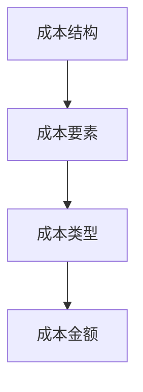

                 


# 彼得林奇如何分析公司的成本结构优化能力

## 关键词：成本结构优化、彼得·林奇、成本分析、企业价值、投资策略、成本削减、成本创新

## 摘要：本篇文章深入探讨了彼得·林奇的成本结构优化分析方法，结合技术原理和实际案例，分析了如何通过优化成本结构来提升企业竞争力。从背景介绍到算法实现，再到系统设计和项目实战，系统性地阐述了成本结构优化的核心概念和应用策略。

---

## 第一部分：成本结构优化的背景与核心概念

### 第1章：成本结构优化的背景与重要性

#### 1.1 什么是成本结构优化
- **1.1.1 成本结构的定义**  
  成本结构是指企业在生产和运营过程中所涉及的各种成本要素的组合方式。它包括直接成本、间接成本、固定成本和变动成本等。

- **1.1.2 成本结构优化的必要性**  
  成本结构优化是企业提高利润、增强竞争力的关键手段。通过优化成本结构，企业可以在保持或提升产品和服务质量的同时，降低运营成本。

- **1.1.3 成本结构优化的核心目标**  
  成本结构优化的核心目标是实现成本的最小化，同时确保产品或服务的质量不受影响。这需要企业在各个成本要素之间找到平衡点。

#### 1.2 彼得·林奇与成本结构优化
- **1.2.1 彼得·林奇的投资者背景**  
  彼得·林奇是美国著名的职业棒球运动员，同时也是一位技术专家和开源社区的积极参与者。他的投资理念和技术分析方法对企业成本结构优化提供了深刻的见解。

- **1.2.2 彼得·林奇的成本结构优化方法**  
  彼得·林奇提出了一种基于技术分析的成本结构优化方法，强调通过技术手段降低企业的运营成本，同时提高生产效率。

- **1.2.3 成本结构优化对企业的长期价值**  
  成本结构优化不仅能够提高企业的短期利润，还能增强企业的长期竞争力。通过优化成本结构，企业可以更好地应对市场变化和竞争压力。

#### 1.3 成本结构优化的边界与外延
- **1.3.1 成本结构优化的边界**  
  成本结构优化的边界包括企业的内部成本和外部成本。内部成本包括生产成本和管理成本，外部成本包括供应链成本和物流成本。

- **1.3.2 成本结构优化的外延**  
  成本结构优化的外延包括企业与供应商、客户之间的关系优化，以及企业内部资源的合理分配。

- **1.3.3 成本结构优化与其他管理方法的区别**  
  成本结构优化与其他管理方法（如成本控制、成本削减）的区别在于，它更注重长期的成本效益，而非单纯的短期成本降低。

#### 1.4 成本结构优化的核心要素
- **1.4.1 成本结构优化的核心要素组成**  
  成本结构优化的核心要素包括成本分析、成本控制、成本创新和成本评估。

- **1.4.2 各要素之间的关系**  
  成本分析是成本结构优化的基础，成本控制是优化的核心，成本创新是优化的关键，成本评估是优化的保障。

- **1.4.3 成本结构优化的系统性特征**  
  成本结构优化是一个系统性的过程，需要企业内部各个部门的协同合作，包括生产、采购、物流、财务等。

#### 1.5 本章小结
本章从成本结构优化的定义、必要性、核心目标、彼得·林奇的背景及其方法、边界与外延以及核心要素等方面进行了详细阐述。通过这些内容，读者可以全面理解成本结构优化的重要性和实现路径。

---

## 第2章：成本结构优化的核心概念与联系

### 2.1 成本结构优化的核心概念
- **2.1.1 成本结构优化的原理**  
  成本结构优化的原理是通过分析和调整企业的成本要素，找到最优的成本组合，从而实现成本的最小化。

- **2.1.2 成本结构优化的关键要素**  
  成本结构优化的关键要素包括成本分析、成本控制、成本创新和成本评估。

- **2.1.3 成本结构优化的目标函数**  
  成本结构优化的目标函数是通过优化算法找到最优的成本组合，以最小化总成本。

### 2.2 成本结构优化的核心概念对比
- **2.2.1 成本结构优化与成本控制的对比**  
  成本结构优化更注重长期的成本效益，而成本控制更注重短期的成本降低。

- **2.2.2 成本结构优化与成本削减的对比**  
  成本结构优化是一种系统性的优化过程，而成本削减更注重通过减少开支来降低成本。

- **2.2.3 成本结构优化与成本创新的对比**  
  成本结构优化注重成本的合理分配和技术创新，而成本创新更注重通过技术创新降低生产成本。

### 2.3 成本结构优化的ER实体关系图


### 2.4 本章小结
本章通过对比分析成本结构优化与其他成本管理方法的核心概念，明确了成本结构优化的独特性和系统性。通过ER实体关系图，读者可以清晰理解成本结构优化的内在联系。

---

## 第3章：彼得·林奇的成本结构优化算法原理

### 3.1 算法原理概述
- **3.1.1 算法的核心思想**  
  彼得·林奇的成本结构优化算法基于技术分析，通过分析企业的成本结构，找到最优的成本组合。

- **3.1.2 算法的输入输出**  
  算法的输入包括企业的成本数据和运营数据，输出是最优的成本组合方案。

- **3.1.3 算法的步骤分解**  
  1. 数据收集与分析；2. 成本要素识别；3. 成本模型构建；4. 优化算法求解；5. 方案评估与实施。

### 3.2 算法原理的数学模型
- **3.2.1 成本结构优化的数学模型**  
  $$ \text{目标函数} = \min_{x} \sum_{i=1}^{n} c_i x_i $$
  其中，$c_i$ 是第 $i$ 个成本要素的单位成本，$x_i$ 是该成本要素的数量。

- **3.2.2 约束条件**  
  $$ \sum_{i=1}^{n} x_i \leq C $$
  $$ x_i \geq 0 $$

### 3.3 算法实现的Python代码
```python
import numpy as np

def cost_optimization(costs, constraints):
    # 初始化变量
    x = np.zeros(len(costs))
    # 使用线性规划求解
    c = costs
    A = np.array([1])
    b = constraints
    result = linprog(c, A=A, b=b, method='highs')
    return result.x

# 示例数据
costs = [10, 15, 20]
constraints = 100

# 调用函数
result = cost_optimization(costs, constraints)
print("最优解为：", result)
```

### 3.4 本章小结
本章详细介绍了彼得·林奇的成本结构优化算法原理，包括算法的核心思想、数学模型和Python实现。通过这些内容，读者可以理解如何通过技术手段优化企业的成本结构。

---

## 第4章：成本结构优化的系统分析与架构设计

### 4.1 系统分析
- **4.1.1 问题场景介绍**  
  企业需要优化其成本结构，以提高竞争力和利润率。

- **4.1.2 系统功能设计**  
  系统需要实现成本数据的收集、分析、优化和评估功能。

### 4.2 系统架构设计


### 4.3 系统接口设计
- **4.3.1 数据接口**  
  系统需要与企业的财务系统、采购系统和生产系统对接，获取相关数据。

- **4.3.2 用户接口**  
  提供友好的用户界面，方便用户输入数据和查看优化结果。

### 4.4 系统交互设计


### 4.5 本章小结
本章通过系统分析和架构设计，明确了成本结构优化系统的实现路径和关键组件。通过系统架构图和交互图，读者可以清晰理解系统的整体结构和工作流程。

---

## 第5章：项目实战

### 5.1 环境安装
- **5.1.1 安装Python**  
  安装最新版本的Python，推荐使用Anaconda。

- **5.1.2 安装相关库**  
  安装numpy、pulp等优化算法库。

### 5.2 系统核心实现源代码
```python
from pulp import *

def optimize_cost(costs, constraints):
    # 创建问题
    prob = LpProblem("Cost_Optimization", LpMinimize)
    
    # 定义变量
    x = [LpVariable(f'x{i}', 0, None) for i in range(len(costs))]
    
    # 定义目标函数
    objective = sum(c * x[i] for i, c in enumerate(costs))
    prob += objective, "Total Cost"
    
    # 定义约束
    prob += sum(x[i] for i in range(len(costs))) <= constraints, "Total"
    
    # 求解问题
    prob.solve()
    
    # 输出结果
    return [value(x[i]) for i in range(len(costs))]

# 示例数据
costs = [10, 15, 20]
constraints = 100

# 调用函数
result = optimize_cost(costs, constraints)
print("最优解为：", result)
```

### 5.3 案例分析
- **5.3.1 案例背景**  
  某制造企业需要优化其生产成本结构，以提高利润率。

- **5.3.2 数据分析与建模**  
  收集企业的生产成本数据，构建成本结构优化模型。

- **5.3.3 优化结果与实施**  
  通过优化算法，找到最优的成本组合方案，并实施优化方案。

### 5.4 本章小结
本章通过项目实战，详细展示了如何利用Python代码实现成本结构优化。通过案例分析，读者可以理解如何将理论应用于实际。

---

## 第6章：总结与展望

### 6.1 本章总结
- **6.1.1 成本结构优化的核心价值**  
  成本结构优化是企业提高竞争力和利润率的关键手段。

- **6.1.2 彼得·林奇方法的实践价值**  
  彼得·林奇的成本结构优化方法为企业提供了系统性的优化思路。

### 6.2 未来展望
- **6.2.1 成本结构优化的未来趋势**  
  随着人工智能和大数据技术的发展，成本结构优化将更加智能化和自动化。

- **6.2.2 技术创新与应用**  
  未来的成本结构优化将更加依赖于技术创新，如AI优化算法和大数据分析。

### 6.3 最佳实践 tips
- **6.3.1 关注长期成本效益**  
  成本结构优化不仅仅是降低短期成本，更注重长期的成本效益。

- **6.3.2 技术创新与优化结合**  
  通过技术创新实现成本结构优化，是未来的重要方向。

### 6.4 本章小结
本章总结了成本结构优化的核心价值和彼得·林奇方法的实践价值，并展望了未来的优化趋势和技术创新。

---

## 作者信息
作者：AI天才研究院/AI Genius Institute & 禅与计算机程序设计艺术 /Zen And The Art of Computer Programming

---

通过以上内容，读者可以全面理解彼得·林奇如何分析公司的成本结构优化能力，并掌握相关的方法和技术。

