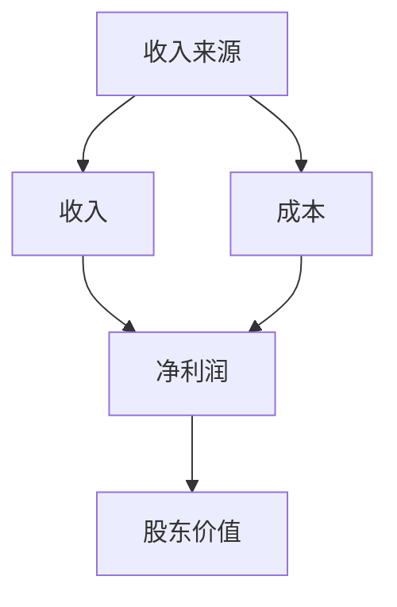
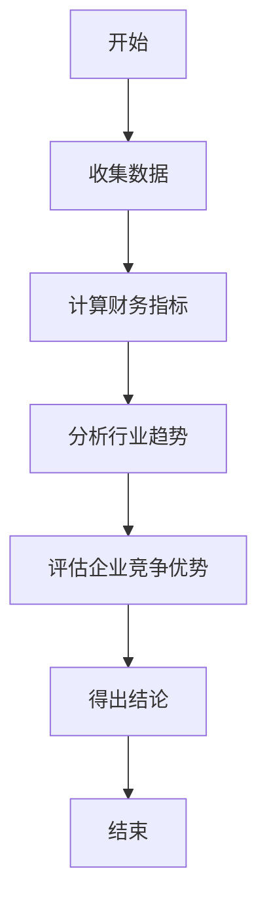
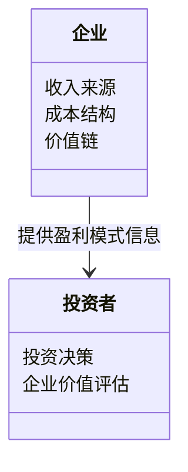
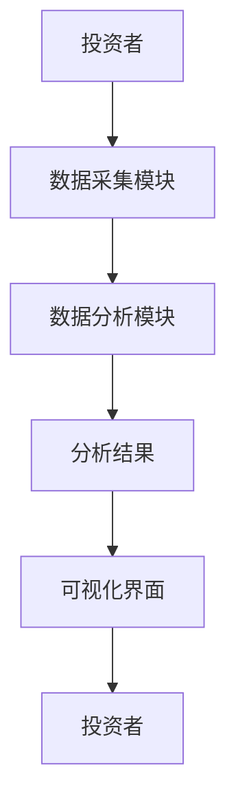

                 


# 彼得林奇如何分析公司的盈利模式

> 关键词：彼得·林奇，盈利模式，投资分析，企业价值，财务分析

> 摘要：本文将深入探讨彼得·林奇如何分析公司的盈利模式。通过详细分析盈利模式的核心要素、数学模型、算法原理、系统架构设计以及实战案例，本文旨在帮助读者掌握盈利模式分析的关键方法，并能够将其应用于实际投资分析中。

---

## 第一部分: 盈利模式分析的背景与核心概念

### 第1章: 盈利模式的基本概念

#### 1.1 盈利模式的定义与构成要素

##### 1.1.1 盈利模式的定义
盈利模式是企业通过提供产品或服务获取收入并实现利润的核心方法。它是企业价值创造的核心，也是投资者评估企业潜力的重要依据。

##### 1.1.2 盈利模式的核心要素
- **收入来源**：企业的主要收入来源，包括产品销售、服务收费等。
- **成本结构**：企业的主要成本构成，包括原材料、人工成本、运营成本等。
- **价值链**：企业从原材料采购到产品或服务交付的整个价值链条。

##### 1.1.3 盈利模式的分类与特点
- **产品型盈利模式**：通过销售产品获得收入，例如制造业和零售业。
- **服务型盈利模式**：通过提供服务获得收入，例如咨询、教育和医疗行业。
- **订阅型盈利模式**：通过定期订阅服务获得收入，例如软件即服务（SaaS）和媒体订阅。

#### 1.2 彼得·林奇与盈利模式分析

##### 1.2.1 彼得·林奇的背景介绍
彼得·林奇（Peter Lynch）是美国著名的投资专家，曾担任富达投资的经理，管理着麦哲伦基金，创造了年均29%的回报率。他以深入分析企业的盈利模式而闻名。

##### 1.2.2 林奇分析法的核心思想
- **关注企业基本面**：林奇强调对企业基本面的深入分析，包括收入、利润、成本和市场地位。
- **寻找可持续的盈利模式**：林奇倾向于投资那些具有稳定且可持续盈利模式的企业。
- **关注行业地位**：林奇认为，企业的行业地位和竞争优势是其盈利模式的重要组成部分。

##### 1.2.3 林奇分析法在投资中的应用
- **选股标准**：林奇通过分析企业的盈利模式，筛选出具有长期增长潜力的企业。
- **行业分析**：林奇关注行业的发展趋势，选择那些处于上升周期的行业。
- **企业基本面分析**：林奇通过分析企业的财务数据，评估其盈利能力、成长性和抗风险能力。

### 第2章: 盈利模式分析的必要性与方法论

#### 2.1 盈利模式分析的重要性

##### 2.1.1 企业价值评估的核心
盈利模式分析是企业价值评估的核心，它直接关系到企业的盈利能力和成长潜力。

##### 2.1.2 投资决策中的盈利模式分析
投资者通过分析企业的盈利模式，可以评估其投资价值和风险。

##### 2.1.3 盈利模式与企业可持续发展的关系
稳定的盈利模式是企业可持续发展的基础，也是投资者长期持有的依据。

#### 2.2 盈利模式分析的方法论

##### 2.2.1 定性分析方法
- **行业分析**：分析行业的竞争格局、发展趋势和市场规模。
- **企业分析**：评估企业的竞争优势、市场地位和管理能力。

##### 2.2.2 定量分析方法
- **财务指标分析**：分析企业的盈利能力、成长能力和抗风险能力。
- **估值分析**：通过市盈率、市净率等指标评估企业的估值水平。

##### 2.2.3 综合分析框架
- **定性与定量结合**：将行业分析、企业分析和财务分析相结合，构建全面的盈利模式分析框架。

---

## 第二部分: 盈利模式的核心要素与分析框架

### 第3章: 盈利模式的核心要素

#### 3.1 收入来源分析

##### 3.1.1 主要收入来源的识别
- **产品销售收入**：企业通过销售产品获得收入。
- **服务收入**：企业通过提供服务获得收入。
- **其他收入**：包括利息、租金、专利授权等收入。

##### 3.1.2 收入来源的多样性与稳定性
- **多样性**：多样化的收入来源可以降低企业的经营风险。
- **稳定性**：稳定的收入来源是企业持续盈利的基础。

##### 3.1.3 收入来源的可持续性评估
- **市场需求分析**：评估市场需求的稳定性和增长潜力。
- **竞争优势分析**：评估企业在市场中的竞争优势。

#### 3.2 成本结构分析

##### 3.2.1 主要成本构成要素
- **原材料成本**：制造业企业的主要成本。
- **人工成本**：包括员工工资和福利。
- **运营成本**：包括租金、 utilities、市场营销等。

##### 3.2.2 成本的可控性与刚性
- **可控成本**：企业可以通过管理控制的成本。
- **刚性成本**：企业无法避免的成本，如折旧和摊销。

##### 3.2.3 成本优化的策略
- **规模效应**：通过扩大生产规模降低单位成本。
- **技术创新**：通过技术创新降低生产成本。

### 第4章: 盈利模式的分析框架

#### 4.1 林奇分析法的核心框架

##### 4.1.1 林奇的选股标准
- **成长性**：选择具有持续增长潜力的企业。
- **估值合理**：选择市盈率和市净率合理的股票。
- **行业地位**：选择在行业中具有竞争优势的企业。

##### 4.1.2 林奇的行业分析方法
- **行业发展趋势**：分析行业的增长潜力和竞争格局。
- **行业周期分析**：分析行业所处的周期阶段，选择处于上升周期的行业。

##### 4.1.3 林奇的企业基本面分析
- **财务报表分析**：分析企业的收入、利润和现金流。
- **管理能力评估**：评估企业管理层的能力和决策水平。

#### 4.2 盈利模式的可视化工具

##### 4.2.1 盈利模式的流程图


##### 4.2.2 盈利模式的表格化分析
| 要素 | 描述 |
|------|------|
| 收入来源 | 产品销售收入、服务收入 |
| 成本结构 | 原材料成本、人工成本 |
| 价值链 | 采购、生产、销售 |

##### 4.2.3 盈利模式的对比分析
- **横向对比**：与同行业其他企业进行对比分析。
- **纵向对比**：与企业历史数据进行对比分析。

---

## 第三部分: 盈利模式分析的数学模型与算法原理

### 第5章: 盈利模式的数学模型

#### 5.1 盈利能力分析的数学公式

##### 5.1.1 净利润率的计算公式
$$ \text{净利润率} = \frac{\text{净利润}}{\text{营业收入}} \times 100\% $$

##### 5.1.2 毛利率的计算公式
$$ \text{毛利率} = \frac{\text{营业收入} - \text{营业成本}}{\text{营业收入}} \times 100\% $$

##### 5.1.3 净资产收益率的计算公式
$$ \text{ROE} = \frac{\text{净利润}}{\text{净资产}} \times 100\% $$

#### 5.2 盈利模式的算法原理

##### 5.2.1 盈利模式分析算法的流程图


##### 5.2.2 盈利模式分析的Python代码实现
```python
import pandas as pd

def analyze_profit_mode(financial_data):
    # 计算利润率
    net_profit_margin = (financial_data['净利润'] / financial_data['营业收入']) * 100
    gross_margin = ((financial_data['营业收入'] - financial_data['营业成本']) / financial_data['营业收入']) * 100
    roe = (financial_data['净利润'] / financial_data['净资产']) * 100
    
    return net_profit_margin, gross_margin, roe

# 示例数据
data = {
    '营业收入': [100, 200, 300],
    '营业成本': [60, 120, 180],
    '净利润': [20, 40, 60],
    '净资产': [50, 100, 150]
}

financial_data = pd.DataFrame(data)
net_profit_margin, gross_margin, roe = analyze_profit_mode(financial_data)
print("净利润率:", net_profit_margin)
print("毛利率:", gross_margin)
print("净资产收益率:", roe)
```

---

## 第四部分: 系统分析与架构设计

### 第6章: 盈利模式分析的系统架构

#### 6.1 项目介绍

##### 6.1.1 项目目标
构建一个基于彼得·林奇分析法的盈利模式分析系统，帮助投资者快速评估企业的盈利模式。

#### 6.2 系统功能设计

##### 6.2.1 领域模型


##### 6.2.2 系统架构设计


---

## 第五部分: 项目实战

### 第7章: 盈利模式分析的实战案例

#### 7.1 环境安装与数据准备

##### 7.1.1 安装Python和相关库
```bash
pip install pandas matplotlib
```

##### 7.1.2 数据准备
```python
import pandas as pd

data = {
    '营业收入': [100, 200, 300],
    '营业成本': [60, 120, 180],
    '净利润': [20, 40, 60],
    '净资产': [50, 100, 150]
}

financial_data = pd.DataFrame(data)
```

#### 7.2 核心实现与代码解读

##### 7.2.1 盈利模式分析函数
```python
def analyze_profit_mode(financial_data):
    net_profit_margin = (financial_data['净利润'] / financial_data['营业收入']) * 100
    gross_margin = ((financial_data['营业收入'] - financial_data['营业成本']) / financial_data['营业收入']) * 100
    roe = (financial_data['净利润'] / financial_data['净资产']) * 100
    return net_profit_margin, gross_margin, roe
```

##### 7.2.2 可视化结果
```python
import matplotlib.pyplot as plt

net_profit_margin, gross_margin, roe = analyze_profit_mode(financial_data)

plt.figure(figsize=(10, 6))
plt.plot(net_profit_margin, label='净利润率')
plt.plot(gross_margin, label='毛利率')
plt.plot(roe, label='净资产收益率')
plt.legend()
plt.title('盈利模式分析')
plt.show()
```

#### 7.3 实际案例分析与详细解读
- **案例分析**：假设我们分析一家制造业企业，计算其净利润率、毛利率和净资产收益率。
- **结果解读**：通过图表和数据分析，评估企业的盈利能力、成长能力和抗风险能力。

---

## 第六部分: 最佳实践与小结

### 第8章: 小结与注意事项

#### 8.1 最佳实践
- **持续学习**：关注行业动态和市场趋势，不断提升自身的分析能力。
- **数据驱动**：依靠数据和事实进行分析，避免主观判断。
- **风险管理**：合理分散投资，降低投资风险。

#### 8.2 注意事项
- **数据的准确性**：确保数据的准确性和完整性。
- **模型的适用性**：根据实际情况调整分析模型。
- **长期视角**：关注企业的长期发展，避免短期波动的影响。

---

## 第七部分: 拓展阅读与深入学习

### 第9章: 拓展阅读

#### 9.1 相关书籍
- 《彼得·林奇的成功投资法则》
- 《巴菲特的选股智慧》

#### 9.2 在线资源
- 彼得·林奇的演讲和采访
- 专业投资网站和论坛

---

## 作者信息

作者：AI天才研究院/AI Genius Institute & 禅与计算机程序设计艺术/Zen And The Art of Computer Programming

---

感谢您的阅读！希望本文能为您提供有价值的见解和方法，帮助您更好地理解和应用彼得·林奇的盈利模式分析方法。

