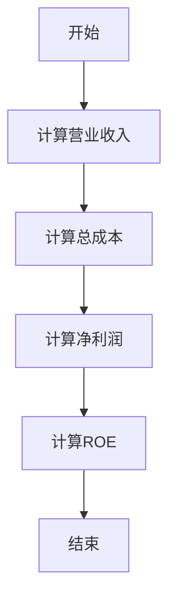
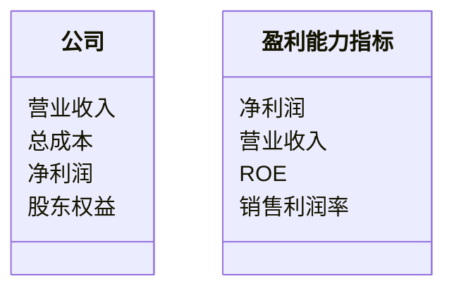
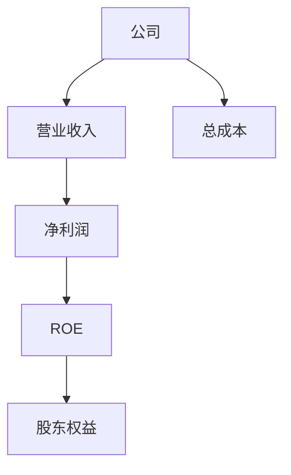

                 


# 彼得林奇如何分析公司的盈利能力

> 关键词：彼得林奇，盈利能力，投资分析，财务报表，股票分析，投资策略

> 摘要：本文将详细介绍彼得林奇如何通过分析公司的盈利能力来评估其投资价值。我们将从投资的基本概念和彼得林奇的背景入手，逐步解析盈利能力分析的核心概念、数学模型、系统架构设计以及实际案例分析。通过本文，读者将能够掌握如何像彼得林奇一样，通过深入分析公司的财务数据和市场表现，做出明智的投资决策。

---

# 第1章：投资的基本概念与彼得林奇的背景

## 1.1 投资的基本概念

### 1.1.1 投资的定义与分类
投资是指将资金投入到某个项目或资产中，以期望在未来获得收益的行为。根据投资对象的不同，可以将投资分为股票、债券、房地产等多种类型。

### 1.1.2 股票投资的核心要素
股票投资的核心要素包括公司的财务状况、行业地位、管理团队、市场前景等。投资者需要综合考虑这些因素，以评估公司的长期发展潜力。

### 1.1.3 投资与投机的区别
投资是基于对公司基本面的深入分析，以长期获得稳定的收益为目标；而投机则是基于市场短期波动，试图通过买卖价差获利，风险较高。

## 1.2 彼得林奇的背景与投资理念

### 1.2.1 彼得林奇的生平简介
彼得·林奇（Peter Lynch）是美国著名的职业投资人，曾任富达投资管理公司的基金经理。他的投资策略以深入研究公司基本面和长期持有优质股票而闻名。

### 1.2.2 彼得林奇的投资哲学
彼得林奇强调长期投资，避免短期市场波动的干扰。他认为，成功的投资取决于对公司基本面的深入了解，包括公司的财务状况、行业地位和管理能力等。

### 1.2.3 彼得林奇的成功案例
彼得林奇在管理基金期间，取得了优异的投资业绩。他通过深入分析公司的盈利能力，成功投资于像可口可乐、家得宝等公司，获得了长期稳定的收益。

## 1.3 股票盈利能力分析的重要性

### 1.3.1 盈利能力分析的定义
盈利能力分析是指通过对公司的财务报表进行分析，评估公司在一定时期内创造利润的能力。

### 1.3.2 盈利能力分析的核心要素
盈利能力分析的核心要素包括营业收入、净利润、净资产收益率（ROE）、销售利润率等指标。

### 1.3.3 盈利能力分析的常见指标
- 净利润：净利润是公司扣除所有成本和税费后的利润。
- 营业收入：营业收入是公司销售产品或服务所获得的收入。
- 净资产收益率（ROE）：ROE是衡量公司使用股东资金效率的重要指标。

---

# 第2章：盈利能力分析的核心概念与联系

## 2.1 盈利能力分析的核心概念

### 2.1.1 净利润的定义与计算
净利润是公司营业收入减去总成本后的利润。公式为：
$$ \text{净利润} = \text{营业收入} - \text{总成本} $$

### 2.1.2 营业收入与成本的关系
营业收入是公司销售产品或服务所获得的收入，而成本则是生产产品或提供服务所发生的费用。两者之差即为利润。

### 2.1.3 利润率的计算公式
利润率是衡量公司盈利能力的重要指标，包括销售利润率和净利润率。

## 2.2 盈利能力分析的属性特征对比

### 2.2.1 不同行业盈利能力的差异
不同行业的盈利能力差异较大。例如，高科技行业通常具有较高的利润率，而传统制造行业利润率相对较低。

### 2.2.2 不同公司规模对盈利能力的影响
公司规模越大，通常具有更强的市场竞争力和成本优势，从而可能获得更高的利润率。

### 2.2.3 时间周期对盈利能力的影响
不同时间周期的盈利能力分析结果可能不同。例如，短期盈利能力可能受到市场波动的影响，而长期盈利能力则取决于公司的核心竞争力。

## 2.3 实体关系图（ER图）架构

### 2.3.1 公司、收入、成本的关系
公司通过销售产品或服务获得收入，同时需要支付生产成本和其他费用。

### 2.3.2 利润、净利润、股东权益的关系
利润是公司营业收入减去成本后的结果，净利润是利润扣除税费后的金额，股东权益则是公司净资产的价值。

### 2.3.3 财务报表的核心实体关系
财务报表包括资产负债表、利润表和现金流量表。利润表的核心是收入和成本的关系，从而计算出利润。

---

# 第3章：盈利能力分析的数学模型与公式

## 3.1 盈利能力分析的数学模型

### 3.1.1 净利润公式
$$ \text{净利润} = \text{营业收入} - \text{总成本} $$

### 3.1.2 净资产收益率（ROE）公式
$$ \text{ROE} = \frac{\text{净利润}}{\text{股东权益}} $$

### 3.1.3 销售利润率公式
$$ \text{销售利润率} = \frac{\text{净利润}}{\text{营业收入}} $$

## 3.2 盈利能力分析的算法流程

### 3.2.1 算法流程图（Mermaid）


## 3.3 盈利能力分析的实例

### 3.3.1 某公司2022年财务数据
假设某公司2022年的营业收入为1000万元，总成本为800万元，股东权益为500万元。

### 3.3.2 净利润计算
$$ \text{净利润} = 1000 - 800 = 200 \text{万元} $$

### 3.3.3 ROE计算与分析
$$ \text{ROE} = \frac{200}{500} = 0.4 \text{或} 40\% $$

---

# 第4章：企业盈利分析系统架构设计

## 4.1 问题场景介绍

### 4.1.1 投资者如何快速分析企业盈利能力
投资者需要通过分析财务报表，评估公司的盈利能力，从而做出投资决策。

### 4.1.2 系统需要解决的核心问题
系统需要解决的核心问题是快速、准确地分析公司的盈利能力，并提供直观的可视化结果。

### 4.1.3 系统的目标与范围
系统的目标是为投资者提供一个基于公司财务数据的盈利能力分析工具，帮助投资者做出明智的投资决策。

## 4.2 系统功能设计

### 4.2.1 领域模型（Mermaid类图）


### 4.2.2 系统架构设计（Mermaid架构图）


---

# 第5章：项目实战——盈利能力分析的代码实现

## 5.1 环境安装与配置

### 5.1.1 Python环境安装
安装Python和必要的库，如Pandas、NumPy等。

### 5.1.2 数据获取与处理
从公开的财务数据源获取公司的财务报表数据，如营业收入、成本、净利润等。

## 5.2 系统核心实现源代码

### 5.2.1 读取数据
```python
import pandas as pd

# 读取财务数据
df = pd.read_csv('financial_data.csv')
```

### 5.2.2 计算盈利能力指标
```python
# 计算净利润
net_profit = df['营业收入'] - df['总成本']

# 计算ROE
roe = net_profit / df['股东权益']

# 计算销售利润率
sales_margin = net_profit / df['营业收入']
```

### 5.2.3 可视化分析
```python
import matplotlib.pyplot as plt

# 绘制ROE柱状图
plt.bar(df['公司'], df['ROE'])
plt.title('ROE Analysis')
plt.xlabel('公司')
plt.ylabel('ROE (%)')
plt.show()
```

## 5.3 实际案例分析与解读

### 5.3.1 某公司财务数据
假设某公司2022年的财务数据如下：
- 营业收入：1000万元
- 总成本：800万元
- 股东权益：500万元

### 5.3.2 计算结果
- 净利润：200万元
- ROE：40%
- 销售利润率：20%

### 5.3.3 结果分析
该公司在2022年的ROE为40%，销售利润率为20%，表明公司的盈利能力较强，股东资金使用效率较高。

---

# 第6章：总结与展望

## 6.1 本章总结
通过本文的分析，读者可以了解到彼得林奇如何通过分析公司的盈利能力来评估其投资价值。我们详细讲解了盈利能力分析的核心概念、数学模型、系统架构设计以及实际案例分析。

## 6.2 投资建议
投资者在进行股票投资时，应该综合考虑公司的财务状况、行业地位和管理能力，避免仅仅依赖某一个指标做出投资决策。

## 6.3 未来展望
未来，随着人工智能和大数据技术的发展，盈利能力分析将更加智能化和自动化，投资者可以利用这些技术工具，进一步提高投资决策的准确性和效率。

---

# 作者：AI天才研究院/AI Genius Institute & 禅与计算机程序设计艺术 /Zen And The Art of Computer Programming

