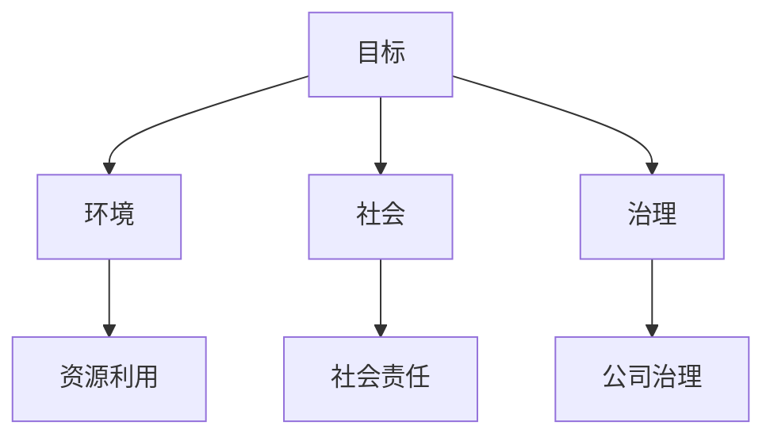
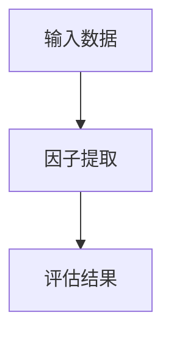
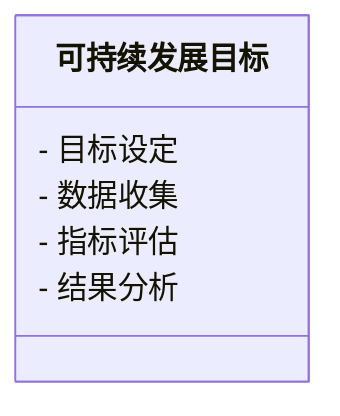

                 


# 彼得林奇如何看待公司的可持续发展目标

## 关键词：彼得·林奇、可持续发展目标、投资理念、企业责任、ESG

## 摘要：本文从彼得·林奇的投资哲学出发，探讨他如何看待公司的可持续发展目标。通过分析可持续发展的核心要素、评估模型和系统架构，结合实际案例，为读者提供深入的见解和实践指导。

---

# 第一部分：可持续发展目标与投资理念概述

## 第1章：可持续发展目标的背景与重要性

### 1.1 可持续发展的定义与内涵

#### 1.1.1 可持续发展的基本定义
可持续发展是指在满足当代需求的同时，不损害后代满足其需求的能力。它强调经济、社会和环境的平衡发展。

#### 1.1.2 可持续发展的核心内涵
可持续发展涵盖了经济、社会和环境三个维度，强调企业在追求利润的同时，应承担社会责任，关注环境保护和员工福利。

#### 1.1.3 可持续发展与企业责任的关系
企业责任是可持续发展的重要组成部分。企业通过履行社会责任，可以提升品牌形象，增强社会信任，从而获得长期的经济利益。

### 1.2 彼得·林奇与可持续投资理念

#### 1.2.1 彼得·林奇的投资哲学
彼得·林奇是著名的投资专家，他强调基本面分析和长期投资。他认为，优秀的企业应具备持续的盈利能力和良好的管理团队。

#### 1.2.2 可持续发展在投资中的重要性
可持续发展目标为企业提供了长期发展的方向，同时也为投资者提供了评估企业价值的重要指标。林奇认为，具备可持续发展理念的企业更有可能实现长期稳定增长。

#### 1.2.3 彼得·林奇对可持续发展的独特见解
林奇认为，可持续发展不仅是企业的社会责任，更是企业核心竞争力的体现。具备可持续发展理念的企业能够更好地应对市场变化和风险。

### 1.3 可持续发展目标对企业的影响

#### 1.3.1 可持续发展目标对企业战略的指导作用
可持续发展目标为企业提供了明确的长期发展方向，帮助企业在复杂多变的环境中制定有效的战略。

#### 1.3.2 可持续发展目标对投资决策的影响
投资者越来越关注企业的可持续发展表现。具备良好可持续发展表现的企业更容易获得投资者的青睐，从而获得更多的资金支持。

#### 1.3.3 可持续发展目标的社会与经济意义
可持续发展目标有助于解决社会问题，促进经济发展。它不仅推动企业创新，还为社会创造了更多的就业机会和经济价值。

---

# 第二部分：可持续发展目标的核心要素与评估体系

## 第2章：可持续发展的核心要素分析

### 2.1 可持续发展的三大支柱

#### 2.1.1 环境（Environmental）要素
环境要素关注企业在生产过程中对环境的影响，包括资源消耗、污染排放和生态保护。

#### 2.1.2 社会（Social）要素
社会要素关注企业在社会中的责任，包括员工权益、社区发展和公平对待。

#### 2.1.3 治理（Governance）要素
治理要素关注企业的管理结构和决策过程，包括董事会构成、内部控制和透明度。

### 2.2 可持续发展目标的属性特征对比

#### 2.2.1 不同可持续发展目标的特征对比
| 目标维度 | 环境（Environmental） | 社会（Social） | 治理（Governance） |
|----------|----------------------|----------------|--------------------|
| 关注点   | 环境保护              | 社会责任        | 公司治理          |
| 示例     | 减少碳排放            | 提供员工福利    | 董事会结构合理    |

#### 2.2.2 可持续发展目标与传统目标的差异
可持续发展目标注重长期利益和全局性，而传统目标更关注短期利润和局部效益。

#### 2.2.3 可持续发展目标的核心要素表格对比
| 核心要素 | 定义                  | 关键指标        |
|----------|-----------------------|----------------|
| 环境     | 资源利用和污染控制    | 能耗、排放      |
| 社会     | 员工权益和社会责任    | 福利、公平性    |
| 治理     | 董事会结构和透明度    | 股权结构、决策流程 |

### 2.3 可持续发展目标的ER实体关系图



---

# 第三部分：可持续发展目标的评估与分析方法

## 第3章：可持续发展目标的评估模型

### 3.1 可持续发展目标的评估框架

#### 3.1.1 评估框架的构建
评估框架应包括目标设定、数据收集、指标评估和结果分析四个阶段。

#### 3.1.2 评估指标的选择
选择评估指标时，应考虑其相关性、可衡量性和可操作性。

#### 3.1.3 评估方法的比较
常用评估方法包括定性分析、定量分析和混合分析。定量分析更适合技术性评估，而定性分析更适合社会因素的评估。

### 3.2 可持续发展目标的算法原理

#### 3.2.1 因子分析模型



因子分析模型通过提取关键因子，对企业的可持续发展表现进行综合评估。公式如下：

$$ F = \sum_{i=1}^{n} w_i x_i $$

其中，$F$ 表示因子得分，$w_i$ 表示第$i$个因子的权重，$x_i$ 表示第$i$个因子的值。

#### 3.3 算法的代码实现

```python
import numpy as np
from sklearn.decomposition import FactorAnalysis

# 示例数据
X = np.array([[1, 2, 3],
              [4, 5, 6],
              [7, 8, 9]])

# 因子分析模型
fa = FactorAnalysis(n_components=2)
fa.fit(X)

# 提取因子得分
factor_scores = fa.transform(X)
print(factor_scores)
```

---

## 第4章：可持续发展目标的系统分析与架构设计

### 4.1 系统分析

#### 4.1.1 问题场景介绍
企业需要通过可持续发展目标，优化资源配置，降低环境影响，提升社会责任履行能力。

#### 4.1.2 系统功能设计



### 4.2 系统架构设计


---

## 第5章：项目实战

### 5.1 环境安装
安装必要的库和工具，如Python、Pandas、Scikit-learn等。

### 5.2 核心实现

```python
import pandas as pd
from sklearn.metrics import accuracy_score

# 示例数据
data = pd.DataFrame({
    '环境影响': [0.2, 0.3, 0.1],
    '社会责任': [0.8, 0.7, 0.9],
    '治理能力': [0.6, 0.5, 0.7]
})

# 评估模型
target = data['环境影响']
features = data[['社会责任', '治理能力']]

# 训练模型
from sklearn.linear_model import LinearRegression
model = LinearRegression()
model.fit(features, target)

# 预测结果
predictions = model.predict(features)
print('预测值:', predictions)
print('真实值:', target.values)
print('准确率:', accuracy_score(target, predictions))
```

### 5.3 案例分析

#### 5.3.1 案例介绍
以某制造企业为例，分析其可持续发展表现。

#### 5.3.2 数据分析
通过因子分析模型，评估企业的环境、社会和治理表现。

#### 5.3.3 结果解读
根据评估结果，提出改进建议，如优化能源利用、提升员工福利和加强公司治理。

### 5.4 项目小结

---

## 第六部分：最佳实践与总结

### 6.1 小结
可持续发展目标是企业长期发展的关键。通过科学的评估和系统的实施，企业可以实现经济效益与社会责任的双赢。

### 6.2 注意事项
在实施可持续发展目标时，企业应结合自身特点，制定切实可行的策略。

### 6.3 拓展阅读
推荐阅读《彼得·林奇的投资哲学》和《可持续发展报告》。

---

# 作者：AI天才研究院/AI Genius Institute & 禅与计算机程序设计艺术 /Zen And The Art of Computer Programming

---

希望这篇博客能够为读者提供清晰的思路和实用的指导，帮助您更好地理解彼得·林奇如何看待公司的可持续发展目标。

