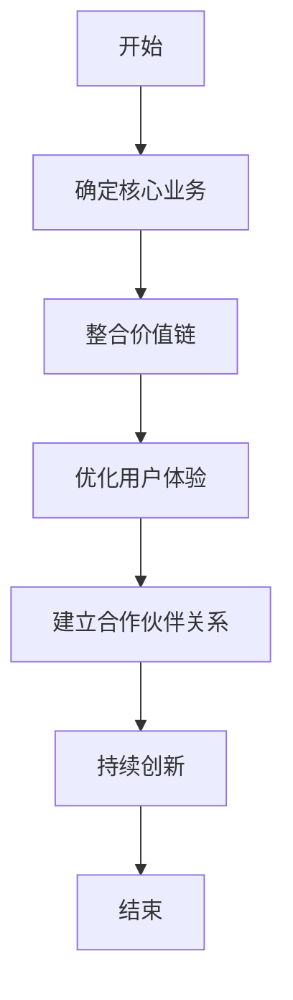
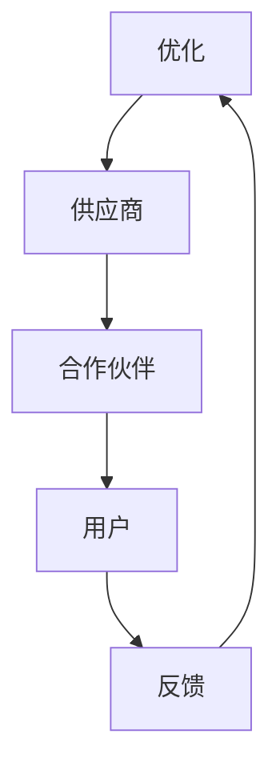
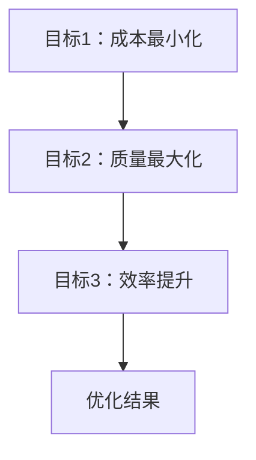
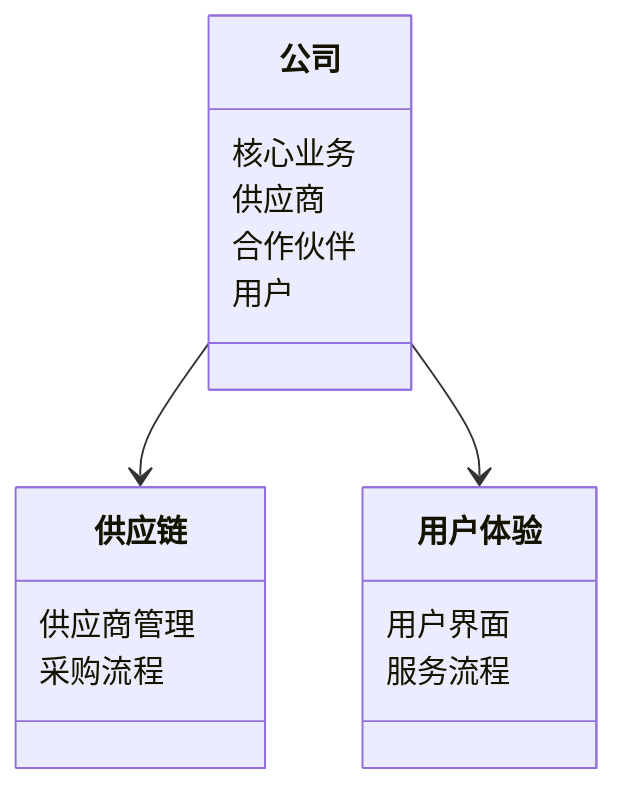
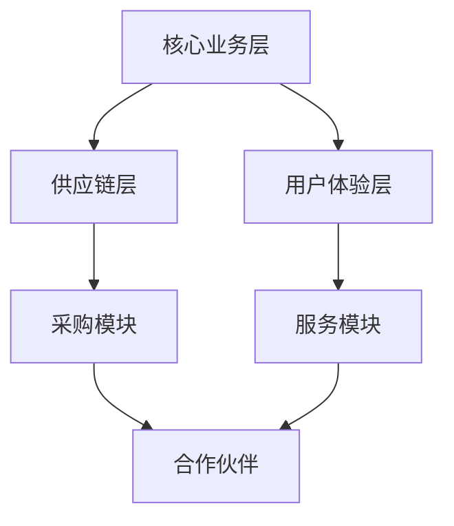
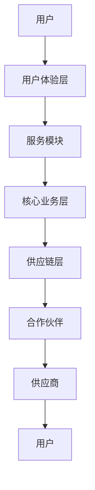

                 


# 彼得林奇如何看待公司的生态系统构建能力

## 关键词
- 彼得·林奇
- 公司生态系统
- 投资理念
- 可持续发展
- 竞争优势

## 摘要
彼得·林奇作为全球著名投资专家，他的投资理念深刻影响了企业价值的评估与构建。本文从彼得·林奇的投资者视角，分析公司生态系统构建能力的重要性，探讨如何通过生态系统构建提升公司的核心竞争力，实现可持续发展。

---

# 第一部分: 彼得林奇投资理念与公司生态系统构建概述

## 第1章: 彼得林奇与公司生态系统构建的背景

### 1.1 彼得林奇投资理念概述
#### 1.1.1 彼得林奇的生平与投资成就
彼得·林奇是全球最著名的投资专家之一，曾任富达麦哲伦基金经理，创造了年均22%的投资回报率。他强调长期投资、深入研究和价值发现，其投资理念对现代企业构建生态系统提供了重要启示。

#### 1.1.2 彼得林奇的投资哲学与方法
彼得·林奇强调企业基本面分析，关注企业的财务健康、管理团队和竞争优势。他认为，投资成功的关键在于选择那些具有持续竞争优势和成长潜力的公司。

#### 1.1.3 从投资者视角看公司生态系统构建
彼得·林奇认为，公司的生态系统构建能力是其核心竞争优势的重要体现。通过构建强大的生态系统，公司能够整合资源、优化价值链，并为股东创造更大的价值。

### 1.2 公司生态系统构建的背景与意义
#### 1.2.1 当前商业环境的变化与挑战
随着全球经济一体化和科技的快速发展，市场竞争日益激烈，企业需要通过构建生态系统来应对复杂多变的商业环境。

#### 1.2.2 生态系统构建在公司战略中的地位
生态系统构建已成为公司战略的核心部分，它不仅涉及公司内部资源的整合，还包含与外部合作伙伴的关系建立。

#### 1.2.3 生态系统构建对投资价值的影响
一个健康的生态系统能够提升公司的抗风险能力、市场占有率和盈利能力，从而增强其投资价值。

### 1.3 本章小结
本章从彼得·林奇的投资理念出发，分析了公司生态系统构建的背景和意义，强调了生态系统构建对投资价值的重要性。

---

# 第二部分: 公司生态系统构建的核心要素与分析

## 第2章: 生态系统构建的核心概念与框架

### 2.1 生态系统构建的核心要素
#### 2.1.1 核心业务能力
公司必须具备强大的核心业务能力，这是构建生态系统的基石。彼得·林奇认为，没有核心业务优势的公司难以在生态系统中占据主导地位。

#### 2.1.2 价值链整合
通过整合上下游价值链，公司能够优化资源配置，降低运营成本，提升整体效率。彼得·林奇强调，价值链整合是生态系统构建的关键。

#### 2.1.3 创新与技术驱动
技术创新是生态系统构建的重要驱动力。彼得·林奇认为，只有不断创新，才能在生态系统中保持竞争优势。

#### 2.1.4 用户体验与价值主张
用户体验是生态系统构建的重要组成部分。彼得·林奇认为，只有满足用户需求，提供独特的价值主张，才能在生态系统中获得长期成功。

### 2.2 生态系统构建的特征与属性对比
#### 2.2.1 层次化特征
生态系统构建通常分为多个层次，包括核心层、扩展层和外围层。每个层次都有其独特的功能和作用。

#### 2.2.2 网络化特征
生态系统构建依赖于广泛的网络化合作，包括供应商、合作伙伴、客户等。彼得·林奇认为，网络化合作是生态系统构建的重要特征。

#### 2.2.3 可持续性特征
生态系统构建需要具备可持续性，能够长期为公司创造价值。彼得·林奇强调，短期的利益并不能支撑长期的成功。

#### 2.2.4 对比分析表
下表对比了公司生态系统构建与传统商业模式在核心要素、竞争优势和价值创造方面的差异。

| 对比维度 | 生态系统构建 | 传统商业模式 |
|----------|--------------|---------------|
| 核心要素 | 价值链整合、创新、用户体验 | 产品销售、成本控制、利润最大化 |
| 竞争优势 | 网络效应、资源整合能力 | 价格优势、产品质量 |
| 价值创造 | 长期可持续价值 | 短期利润 |

### 2.3 生态系统构建的ER实体关系图
以下是公司生态系统构建的ER实体关系图：

```mermaid
erd
  id: CompanyEcoSystem
  title: 公司生态系统构建 ER 实体关系图
  entity_1:
    name: 公司
    fields: [公司ID, 公司名称, 核心业务]
  entity_2:
    name: 供应商
    fields: [供应商ID, 供应商名称, 供应产品]
  entity_3:
    name: 合作伙伴
    fields: [合作伙伴ID, 合作伙伴名称, 合作类型]
  entity_4:
    name: 用户
    fields: [用户ID, 用户名称, 用户类型]
  relationship_1:
    name: 提供
    from: 公司
    to: 供应商
  relationship_2:
    name: 与...合作
    from: 公司
    to: 合作伙伴
  relationship_3:
    name: 为...提供服务
    from: 公司
    to: 用户
```

---

## 第3章: 生态系统构建的算法与数学模型

### 3.1 生态系统构建的算法概述
#### 3.1.1 生态系统构建的基本算法
彼得·林奇认为，构建生态系统需要从核心业务出发，逐步扩展到价值链的各个环节。以下是一个简单的生态系统构建算法：



#### 3.1.2 网络分析与协同优化
生态系统构建需要进行网络分析，确保各个模块之间的协同优化。以下是一个网络分析的流程图：



#### 3.1.3 多目标优化算法
生态系统构建需要在多个目标之间进行优化，例如成本、质量、效率等。以下是一个多目标优化的算法示例：



### 3.2 生态系统构建的数学模型
#### 3.2.1 核心业务模型
核心业务模型可以通过以下数学公式表示：

$$
\text{核心业务价值} = \text{核心业务能力} \times \text{资源整合能力}
$$

#### 3.2.2 价值链协同模型
价值链协同模型可以通过以下公式表示：

$$
\text{协同效应} = \sum (\text{供应商价值} + \text{合作伙伴价值}) 
$$

#### 3.2.3 用户价值模型
用户价值模型可以通过以下公式表示：

$$
\text{用户价值} = \text{用户体验} \times \text{用户满意度}
$$

### 3.3 算法实现与代码示例
以下是生态系统构建算法的Python代码示例：

```python
# 生态系统构建算法示例
def build_ecosystem(core_business, suppliers, partners, users):
    # 确定核心业务
    core = core_business
    # 整合价值链
    value_chain = suppliers + partners
    # 优化用户体验
    user_value = sum(users)
    # 建立合作伙伴关系
    partnerships = [s + p for s, p in zip(suppliers, partners)]
    # 持续创新
    innovation = sum(value_chain) + user_value
    return innovation

# 示例调用
core_business = 100
suppliers = [50, 60]
partners = [70, 80]
users = [10, 20]
result = build_ecosystem(core_business, suppliers, partners, users)
print("生态系统构建完成，创新成果为：", result)
```

---

## 第4章: 生态系统构建的系统分析与架构设计

### 4.1 系统分析与功能设计
#### 4.1.1 问题场景介绍
公司在当前市场环境下，需要通过构建生态系统来提升竞争力。彼得·林奇认为，生态系统构建能够帮助公司整合资源、优化流程，并为用户提供更好的服务。

#### 4.1.2 系统功能设计
以下是公司生态系统构建的系统功能设计类图：



### 4.2 系统架构设计
以下是公司生态系统构建的系统架构图：



### 4.3 系统接口设计
以下是公司生态系统构建的接口设计：

- 核心业务接口：`core_business_interface()`
- 供应链接口：`supply_chain_interface()`
- 用户体验接口：`user_experience_interface()`

### 4.4 系统交互流程图
以下是公司生态系统构建的交互流程图：



---

## 第5章: 生态系统构建的项目实战

### 5.1 项目介绍
以下是公司生态系统构建的项目介绍：

- **项目名称**：公司生态系统构建项目
- **项目目标**：通过构建生态系统，提升公司核心竞争力
- **项目范围**：整合价值链、优化用户体验、建立合作伙伴关系
- **项目计划**：分阶段实施，每阶段进行评估和优化

### 5.2 核心实现
以下是公司生态系统构建的核心实现代码：

```python
# 公司生态系统构建项目核心代码
def core_business():
    return "核心业务价值"

def supply_chain():
    return "供应链价值"

def user_experience():
    return "用户体验价值"

def build_ecosystem():
    return core_business() + supply_chain() + user_experience()

# 示例调用
result = build_ecosystem()
print("生态系统构建完成，核心价值为：", result)
```

### 5.3 代码应用解读与分析
上述代码通过函数的方式实现了公司生态系统构建的核心功能，包括核心业务、供应链和用户体验的整合。通过逐步调用，最终实现生态系统的构建。

### 5.4 实际案例分析
以下是公司生态系统构建的实际案例分析：

- **案例公司**：某科技公司
- **案例背景**：该公司通过构建生态系统，整合了供应链、合作伙伴和用户体验，实现了销售额的快速增长。
- **案例分析**：通过生态系统构建，该公司在竞争激烈的市场中占据了领先地位，成为行业标杆。

### 5.5 项目小结
本章通过具体案例和代码实现，展示了公司生态系统构建项目的实施过程和关键点，强调了生态系统构建对企业发展的重要性。

---

## 第6章: 生态系统构建的最佳实践与小结

### 6.1 最佳实践
- **注重核心业务能力**：构建生态系统需要从核心业务出发
- **整合价值链**：优化供应链和合作伙伴关系
- **关注用户体验**：提升用户满意度和忠诚度
- **持续创新**：保持生态系统的活力和竞争力

### 6.2 小结
本章总结了公司生态系统构建的重要性和实现方法，强调了彼得·林奇投资理念对生态系统构建的启示。

### 6.3 注意事项
- 生态系统构建需要长期投入
- 注意风险管理，避免过度依赖单一合作伙伴
- 定期评估生态系统健康状况，及时调整策略

### 6.4 拓展阅读
- 《彼得·林奇的投资哲学》
- 《公司生态系统构建的实践与创新》
- 《生态系统驱动的商业模式转型》

---

## 作者：AI天才研究院/AI Genius Institute & 禅与计算机程序设计艺术/Zen And The Art of Computer Programming

---

**全文小结**：通过本篇文章，我们从彼得·林奇的投资理念出发，深入分析了公司生态系统构建的核心要素、算法原理和系统架构，结合实际案例和代码实现，展示了生态系统构建的重要性和实现方法。未来，随着商业环境的不断变化，生态系统构建能力将成为公司持续发展的关键能力。

