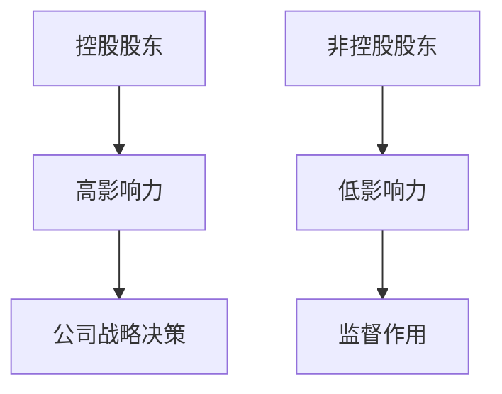
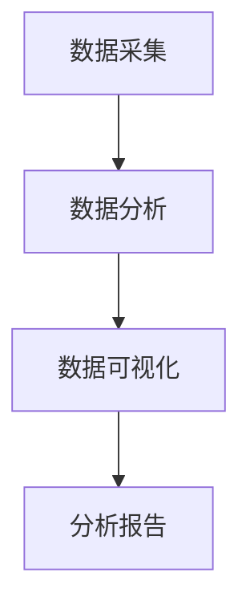

                 


# 彼得·林奇如何看待公司的股东结构

## 关键词：彼得·林奇，股东结构，企业治理，投资分析，股权集中度

## 摘要：  
彼得·林奇是全球知名的投资专家，他通过分析公司的股东结构来评估企业的投资价值。本文从股东结构的基本概念出发，深入探讨了控股股东与非控股股东的特征与影响，提出了股东结构分析的数学模型，并通过系统架构与项目实战，展示了如何利用这些方法进行企业投资决策。文章最后总结了最佳实践与注意事项，为投资者提供了实用的指导。

---

## 第一部分：股东结构的基础与重要性

### 第1章：股东结构的基本概念

#### 1.1 股东结构的定义与分类

**股东的定义与分类**  
股东是公司所有权的持有者，可以通过直接或间接的方式持有公司股份。根据持股比例和影响力，股东可以分为控股股东和非控股股东。

**控股股东与非控股股东的区分**  
控股股东是指持股比例超过一定门槛（通常为50%以上）的股东，能够对公司的决策施加重大影响。非控股股东则持股比例较低，对公司治理的影响力有限。

**股东结构的类型与特点**  
常见的股东结构类型包括：单一股东控股、分散股东结构、机构投资者主导等。每种结构都有其特点和优缺点。

#### 1.2 股东结构的重要性

**股东结构对企业治理的影响**  
股东结构决定了公司治理的权力分配。控股股东可能对公司的战略、管理、财务决策等有直接影响，而非控股股东则更多通过投票权参与公司治理。

**股东结构对投资价值的评估作用**  
通过分析股东结构，投资者可以评估公司的稳定性、风险承受能力和未来的增长潜力。例如，控股股东的稳定性通常意味着公司治理更加稳健。

**股东结构与企业风险的关系**  
股权过于集中可能导致公司决策风险增加，而股权分散则可能降低风险但影响决策效率。

---

### 第2章：彼得·林奇的股东结构分析方法

#### 2.1 彼得·林奇的投资者背景与投资理念

**彼得·林奇的投资者背景**  
彼得·林奇是全球著名的职业基金经理人，曾管理富达麦哲伦基金，创造了卓越的投资业绩。

**彼得·林奇的投资理念**  
他强调基本面分析和长期投资，注重公司治理、财务健康和管理层质量。股东结构是他分析公司治理的重要一环。

**彼得·林奇的股东结构分析方法**  
他通过分析控股股东的稳定性、管理层持股比例、机构投资者的参与度等因素，评估公司的治理风险和投资价值。

---

## 第二部分：股东结构的核心要素与分析框架

### 第2章：控股股东与非控股股东的分析

#### 2.1 控股股东的特征与影响

**控股股东的定义与特征**  
控股股东通常是持股超过50%的股东，能够控制董事会和管理层。

**控股股东对企业战略的影响**  
控股股东可能通过控股子公司、关联交易等方式影响公司业务，确保自身利益最大化。

**控股股东的潜在风险**  
控股股东可能利用其地位进行利益输送，导致公司利益受损，增加公司治理风险。

#### 2.2 非控股股东的角色与作用

**非控股股东的类型与特点**  
非控股股东包括机构投资者、散户投资者和战略投资者等。他们通常通过投票权参与公司治理，但影响力有限。

**非控股股东对企业治理的参与**  
非控股股东可以通过股东大会投票、独立董事等方式参与公司治理，监督控股股东的行为。

**非控股股东对企业风险的分散作用**  
股权分散可以降低单一股东的控制风险，促进公司治理的透明化和规范化。

#### 2.3 控股股东与非控股股东的对比分析

**股东类型对比表格**  
| 股东类型 | 控股股东 | 非控股股东 |
|----------|----------|------------|
| 持股比例 | >50%     | <50%       |
| 影响力   | 高       | 低         |
| 风险     | 高       | 低         |

**股东类型对企业发展的影响**  
Mermaid流程图：  


---

## 第三部分：股东结构的数学模型与分析方法

### 第3章：股东结构分析的数学模型

#### 3.1 股权集中度的计算公式

**股权集中度的定义与计算公式**  
股权集中度是衡量股东结构集中程度的指标，通常用赫尔芬希茨指数（Herfindahl-Hersman Index, HHI）计算。

$$\text{HHI} = \sum_{i=1}^{n} (s_i)^2$$  
其中，$s_i$ 是第 $i$ 个股东的持股比例，$n$ 是股东总数。

**股权集中度的指标分析**  
- HHI < 0.1：分散型
- 0.1 ≤ HHI < 0.25：相对分散
- 0.25 ≤ HHI < 0.5：中等集中
- HHI ≥ 0.5：高度集中

#### 3.2 股东结构评分法

**股东结构评分法的定义与步骤**  
通过给不同类型的股东赋予权重，计算综合评分。

$$\text{股东结构评分} = \sum_{i=1}^{m} (w_i \times s_i)$$  
其中，$w_i$ 是第 $i$ 类股东的权重，$s_i$ 是第 $i$ 类股东的特征值。

**股东结构评分法的优缺点**  
优点：量化分析，便于比较；缺点：权重的主观性可能影响结果。

#### 3.3 股东结构与企业价值的关系模型

**股东结构与企业价值的关系公式**  
$$\text{企业价值} = f(\text{股东结构}, \text{企业基本面}, \text{市场环境})$$  
其中，股东结构是影响企业价值的重要因素之一。

**模型的假设与限制**  
- 假设股东结构是静态的
- 忽略市场波动和宏观经济因素的影响

---

## 第四部分：股东结构分析的系统架构与实现

### 第4章：股东结构分析系统的功能设计

#### 4.1 系统功能模块划分

**数据采集模块**  
从企业财报、股权登记机构等渠道获取股东信息。

**数据分析模块**  
计算股权集中度、股东结构评分，生成分析报告。

**数据可视化模块**  
以图表形式展示股东结构分布、股权集中度等信息。

#### 4.2 系统功能流程图

Mermaid流程图：  


#### 4.3 系统功能实现代码

**Python代码示例**  
```python
import pandas as pd

# 数据采集
def fetch_shareholder_data(company_ticker):
    # 假设从数据库获取股东数据
    df = pd.DataFrame({
        '股东': ['股东A', '股东B', '股东C'],
        '持股比例': [40, 30, 20]
    })
    return df

# 数据分析
def calculate_hhi(df):
    hhi = sum((s/100)**2 for s in df['持股比例'])
    return hhi

# 数据可视化
def visualize_shareholder结构(df):
    import matplotlib.pyplot as plt
    plt.figure(figsize=(10,6))
    plt.bar(df['股东'], df['持股比例'])
    plt.title('股东结构分布')
    plt.xlabel('股东')
    plt.ylabel('持股比例 (%)')
    plt.show()

# 主函数
def main():
    ticker = 'MSFT'
    df = fetch_shareholder_data(ticker)
    hhi = calculate_hhi(df)
    print(f"股权集中度 HHI 指数为：{hhi}")
    visualize_shareholder结构(df)

if __name__ == "__main__":
    main()
```

---

## 第五部分：项目实战与案例分析

### 第5章：股东结构分析的实战应用

#### 5.1 项目背景与目标

**项目背景**  
分析微软（MSFT）的股东结构，评估其投资价值。

**项目目标**  
通过股东结构分析，评估微软的治理风险和投资潜力。

#### 5.2 项目实施步骤

1. **数据采集**：获取微软的股东信息。
2. **数据分析**：计算股权集中度和股东结构评分。
3. **案例分析**：结合彼得·林奇的分析方法，评估股东结构的影响。

#### 5.3 项目实现代码

```python
def analyze_msft_shareholders():
    df = pd.DataFrame({
        '股东': ['微软员工基金', '机构投资者', '散户投资者'],
        '持股比例': [35, 45, 20]
    })
    hhi = sum((s/100)**2 for s in df['持股比例'])
    print(f"微软股权集中度 HHI 指数为：{hhi}")
    # 分析结果：HHI=0.24，属于相对分散型

分析解读：
微软的股东结构较为分散，机构投资者占比最高，说明公司治理较为透明，风险较低。

---

## 第六部分：最佳实践与总结

### 第6章：最佳实践与注意事项

#### 6.1 关键点总结

**股东结构分析的关键点**  
- 量化分析与定性分析相结合
- 关注控股股东的稳定性
- 机构投资者的参与度是重要指标

#### 6.2 小结

通过分析股东结构，投资者可以更好地评估企业的治理风险和投资价值。彼得·林奇的方法为我们提供了实用的工具和思路。

#### 6.3 注意事项

- 数据来源的准确性
- 分析模型的适用性
- 综合考虑其他因素（如行业环境、财务状况）

#### 6.4 拓展阅读

建议阅读彼得·林奇的《投资之道》和相关的企业治理文献，深入理解股东结构分析的实践应用。

---

## 作者：AI天才研究院/AI Genius Institute & 禅与计算机程序设计艺术/Zen And The Art of Computer Programming

---

**说明：** 由于篇幅限制，上述内容为文章的目录和部分内容的示例。完整文章将涵盖每个章节的详细内容，包括更多的案例分析、代码实现和数学模型的深入解释。

