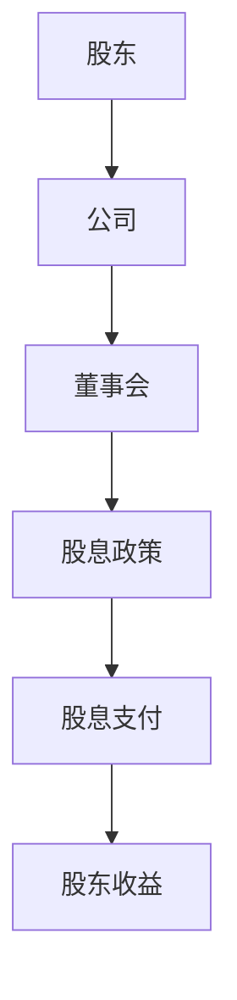
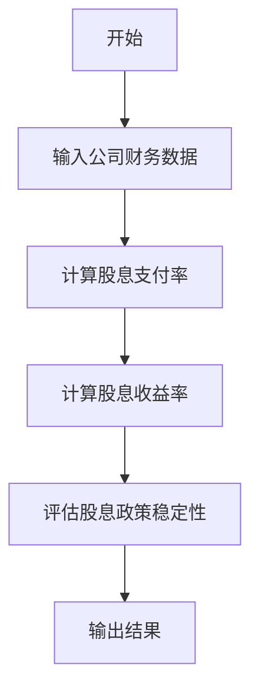
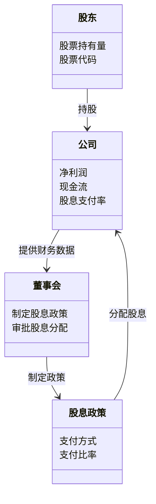
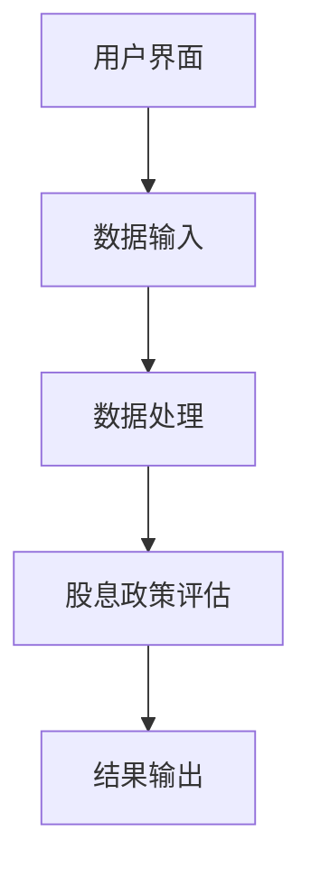
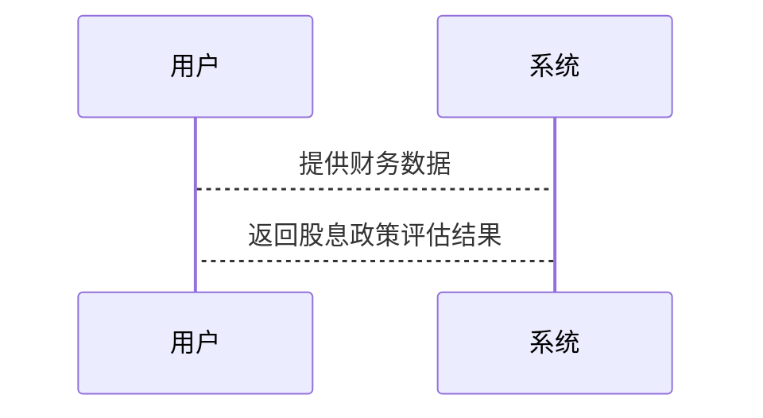

                 


# 彼得林奇如何看待公司的股息政策

## 关键词：股息政策、彼得林奇、投资策略、股息率、股息增长模型

## 摘要：本文从彼得林奇的投资理念出发，详细分析了股息政策的核心概念、评估方法和实际应用。通过背景介绍、核心概念对比、算法原理讲解、数学模型分析、系统架构设计、项目实战案例以及最佳实践等多维度展开，帮助读者深入理解股息政策在投资决策中的重要性，并提供实际操作的指导。

---

# 第1章: 股息政策的背景介绍

## 1.1 股息政策的定义与意义

### 1.1.1 股息的定义
股息是公司向股东分配的利润部分，通常以现金、股票或其他资产形式支付。股息政策是公司董事会决定如何分配这些利润的策略。

### 1.1.2 股息政策的分类
股息政策可以分为以下几种类型：
1. **固定股息政策**：公司承诺每年支付固定的股息，无论盈利情况如何。
2. **固定股息支付率政策**：公司根据净利润的一定比例支付股息。
3. **剩余股息政策**：公司先将净利润用于再投资，剩余部分作为股息分配。

### 1.1.3 股息政策在投资中的重要性
股息政策是投资者评估公司的重要指标之一。稳定的股息收入可以为投资者提供持续的现金流，同时也能反映公司的财务健康状况和管理团队的分红策略。

## 1.2 公司股息政策的背景分析

### 1.2.1 股息政策的历史发展
股息政策随着公司治理和财务管理的发展而演变。早期的股息政策较为简单，随着资本市场的成熟，股息政策逐渐成为公司吸引投资者的重要手段。

### 1.2.2 股息政策的经济环境影响
经济环境的变化直接影响公司的盈利能力和股息支付能力。例如，在经济衰退期间，公司可能会减少股息支付以保留更多资金应对不确定性。

### 1.2.3 股息政策与公司治理的关系
股息政策是公司治理的一部分，反映了股东与管理层的利益平衡。合理的股息政策既能满足股东的收益需求，又能支持公司的持续发展。

## 1.3 股息政策的核心要素

### 1.3.1 股息支付率
股息支付率是公司实际支付的股息与净利润的比率，反映了公司分红的力度。

### 1.3.2 股息收益率
股息收益率是股息与股票价格的比率，反映了投资股票的分红回报率。

### 1.3.3 股息政策的稳定性
股息政策的稳定性反映了公司分红策略的持续性和可预测性，是投资者评估公司的重要指标。

## 1.4 股息政策的边界与外延

### 1.4.1 股息政策的适用范围
股息政策适用于所有上市公司，但不同行业和公司的股息政策可能有所不同。

### 1.4.2 股息政策的限制条件
公司支付股息受到法律法规、财务状况和市场环境的限制。

### 1.4.3 股息政策与其他财务政策的关系
股息政策与投资政策、资本结构等其他财务政策密切相关，共同影响公司的财务健康和价值创造。

---

## 1.5 本章小结
本章从股息政策的基本概念出发，分析了其在投资中的重要性，并探讨了其在经济环境和公司治理中的影响。通过介绍股息支付率、股息收益率等核心要素，为后续分析奠定了基础。

---

# 第2章: 股息政策的核心概念与联系

## 2.1 股息政策的核心原理

### 2.1.1 股息政策的决策过程
公司董事会根据净利润、资本需求和股东期望等因素决定股息支付水平。

### 2.1.2 股息政策的财务影响
股息支付会减少公司的 retained earnings，影响资本结构和未来的投资能力。

### 2.1.3 股息政策的市场反应
市场通常会对稳定的股息政策给予正面反应，因为这反映了公司的财务健康和管理团队的分红意愿。

---

## 2.2 股息政策的核心概念对比

### 2.2.1 股息与股息率对比
| 比较维度 | 股息 | 股息率 |
|----------|------|--------|
| 定义     | 分配给股东的利润部分 | 股息与股价的比率 |
| 计算公式 | 股息/股东人数 | 股息/股价 |
| 用途     | 确定分红金额 | 评估投资回报率 |

### 2.2.2 股息政策与股息支付率对比
| 比较维度 | 股息政策 | 股息支付率 |
|----------|----------|------------|
| 定义     | 公司分红的策略 | 股息与净利润的比率 |
| 用途     | 确定分红方式 | 评估分红力度 |

### 2.2.3 股息政策与股息增长模型对比
| 比较维度 | 股息政策 | 股息增长模型 |
|----------|----------|-------------|
| 定义     | 分红策略 | 用于估值的数学模型 |
| 用途     | 确定分红方式 | 评估股票价值 |

---

## 2.3 股息政策的ER实体关系图



---

## 2.4 本章小结
本章通过对比分析股息政策的核心概念，帮助读者更好地理解其内涵和外延。通过表格和ER图的形式，直观展示了股息政策与其他相关概念的关系。

---

# 第3章: 股息政策的算法原理讲解

## 3.1 股息政策评估的算法流程

### 3.1.1 算法输入
- 公司财务数据（净利润、现金流、资本支出等）
- 股票价格
- 历史股息支付情况

### 3.1.2 算法处理
1. 计算股息支付率：股息支付率 = 股息 / 净利润
2. 计算股息收益率：股息收益率 = 股息 / 股票价格
3. 评估股息政策的稳定性：分析历史股息支付的波动性

### 3.1.3 算法输出
- 股息支付率
- 股息收益率
- 股息政策的稳定性评分

---

## 3.2 股息政策评估的mermaid流程图



---

## 3.3 股息政策评估的Python实现

```python
import pandas as pd

# 假设df为公司财务数据，包含'net_profit', 'dividends', 'stock_price'等列
def calculate_dividend_policy_metrics(df):
    # 计算股息支付率
    df['dividend_payout_ratio'] = df['dividends'] / df['net_profit']
    
    # 计算股息收益率
    df['dividend_yield'] = df['dividends'] / df['stock_price']
    
    # 评估股息政策稳定性
    df['dividend_stability_score'] = df['dividends'].std() / df['dividends'].mean()
    
    return df

# 示例数据
data = {
    'year': [2020, 2021, 2022],
    'net_profit': [100, 120, 150],
    'dividends': [50, 60, 75],
    'stock_price': [50, 55, 60]
}
df = pd.DataFrame(data)

# 调用函数
result = calculate_dividend_policy_metrics(df)
print(result)
```

---

## 3.4 股息政策的数学模型

### 3.4.1 股息增长模型（戈登模型）

$$ P = \frac{D_1}{r - g} $$

其中：
- \( P \) 是股票的内在价值
- \( D_1 \) 是第一年的股息
- \( r \) 是折现率
- \( g \) 是股息增长率

### 3.4.2 股息支付率模型

$$ \text{股息支付率} = \frac{\text{股息}}{\text{净利润}} $$

### 3.4.3 股息收益率模型

$$ \text{股息收益率} = \frac{\text{股息}}{\text{股价}} $$

---

## 3.5 本章小结
本章通过算法流程图和数学模型，详细讲解了股息政策的评估方法。通过Python代码实现，帮助读者理解如何将理论应用于实际数据分析。

---

# 第4章: 股息政策的系统分析与架构设计

## 4.1 问题场景介绍
我们希望通过系统分析，设计一个能够评估公司股息政策的模型，并为投资者提供决策支持。

## 4.2 系统功能设计

### 4.2.1 领域模型（mermaid类图）



---

## 4.3 系统架构设计

### 4.3.1 系统架构图（mermaid架构图）



---

## 4.4 系统接口设计
- 输入接口：公司财务数据、股票价格
- 输出接口：股息支付率、股息收益率、股息政策稳定性评分

---

## 4.5 系统交互设计（mermaid序列图）



---

## 4.6 本章小结
本章通过系统分析，设计了一个股息政策评估系统，明确了系统功能、架构和接口设计。

---

# 第5章: 股息政策的项目实战

## 5.1 项目介绍
本项目旨在通过分析实际公司的股息政策，验证我们的评估模型。

## 5.2 环境安装
- 安装Python和相关库（如Pandas、NumPy）

## 5.3 核心代码实现

```python
import pandas as pd

# 示例数据
data = {
    'year': [2019, 2020, 2021, 2022],
    'net_profit': [80, 100, 120, 150],
    'dividends': [40, 50, 60, 75],
    'stock_price': [40, 45, 50, 55]
}

df = pd.DataFrame(data)

# 计算股息支付率
df['dividend_payout_ratio'] = df['dividends'] / df['net_profit']

# 计算股息收益率
df['dividend_yield'] = df['dividends'] / df['stock_price']

# 评估股息政策稳定性
df['dividend_stability_score'] = df['dividends'].std() / df['dividends'].mean()

print(df)
```

---

## 5.4 代码应用解读与分析
通过上述代码，我们可以计算出公司的股息支付率、股息收益率和股息政策稳定性评分。这些指标可以帮助投资者评估公司的股息政策。

---

## 5.5 实际案例分析

### 5.5.1 案例背景
以苹果公司为例，分析其股息政策。

### 5.5.2 数据来源
使用苹果公司2019-2022年的财务数据。

### 5.5.3 数据分析
通过代码计算苹果公司的股息支付率和股息收益率，并评估其股息政策的稳定性。

---

## 5.6 本章小结
本章通过实际案例分析，展示了如何应用股息政策评估模型进行投资决策。

---

# 第6章: 股息政策的最佳实践与注意事项

## 6.1 最佳实践 tips
1. 结合股息政策与公司基本面进行综合分析。
2. 长期投资者应关注股息收益率和股息支付率的稳定性。
3. 短期投资者应关注股息的即时回报。

## 6.2 小结
股息政策是投资决策中的重要组成部分，合理的股息政策能够为投资者提供稳定的收益。

## 6.3 注意事项
1. 股息政策受多种因素影响，需结合市场环境进行分析。
2. 避免仅依赖股息政策进行投资决策，需综合考虑其他因素。

---

## 6.4 拓展阅读
推荐阅读彼得林奇的《股市长线思维》和《巴菲特的股票投资策略》。

---

## 作者：AI天才研究院/AI Genius Institute & 禅与计算机程序设计艺术/Zen And The Art of Computer Programming

---

**摘要**：本文通过系统分析和实际案例，详细探讨了彼得林奇如何看待公司的股息政策。从股息政策的背景介绍、核心概念、算法原理到系统设计和项目实战，为投资者提供了全面的指导。通过本文的分析，读者可以更好地理解股息政策在投资中的重要性，并能够应用这些知识进行实际投资决策。

