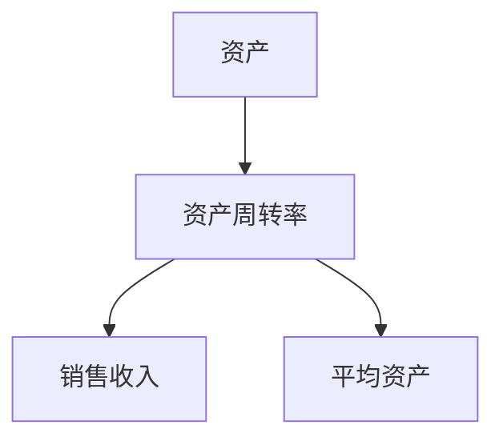

                 

# 彼得林奇如何看待公司的资产利用率

> 关键词：彼得·林奇，资产利用率，投资分析，财务指标，公司估值

> 摘要：本文深入探讨了彼得·林奇如何分析公司的资产利用率，从定义和重要性到计算方法、系统分析，再到实际案例和最佳实践，为投资者提供了全面的指导。

---

## 第一部分: 资产利用率的背景与重要性

### 第1章: 资产利用率的定义与背景

#### 1.1 资产利用率的核心概念

##### 1.1.1 资产利用率的定义
资产利用率（Asset Turnover）是指公司每单位资产所产生的销售收入。它是衡量公司资产使用效率的重要指标，公式为：
$$ \text{资产周转率} = \frac{\text{销售收入}}{\text{平均资产}} $$

##### 1.1.2 资产利用率在投资中的作用
资产利用率是评估公司运营效率的关键指标。高资产利用率意味着公司能够高效地将资产转化为收入，通常反映公司在管理和使用资产方面的有效性。

##### 1.1.3 资产利用率的边界与外延
资产利用率的边界包括公司资产负债表中的各项资产，如流动资产和固定资产。外延则涉及资产结构优化、行业差异和财务造假风险。

#### 1.2 彼得·林奇对资产利用率的关注

##### 1.2.1 彼得·林奇的投资理念
彼得·林奇强调基本面分析，认为资产利用率是评估公司管理效率和未来增长潜力的关键因素。

##### 1.2.2 资产利用率在林奇分析中的地位
林奇认为资产利用率是衡量公司效率的核心指标，通常与公司估值密切相关。

##### 1.2.3 资产利用率与公司估值的关系
资产利用率高的公司通常具有更高的市场估值，因为它们能够更有效地将资产转化为利润。

### 第2章: 资产利用率的核心概念与联系

#### 2.1 资产利用率的计算公式

##### 2.1.1 资产周转率公式
$$ \text{资产周转率} = \frac{\text{销售收入}}{\text{平均资产}} $$

##### 2.1.2 公式属性对比
| 公式属性 | 描述 |
|----------|------|
| 分子     | 销售收入 |
| 分母     | 平均资产 |
| 单位     | 次/年 |

#### 2.2 资产利用率与财务指标的关系

##### 2.2.1 资产利用率与ROE的关系
资产利用率与ROE（净资产收益率）正相关，高资产利用率通常意味着更高的ROE。

##### 2.2.2 资产利用率与ROA的关系
$$ \text{ROA} = \frac{\text{净利润}}{\text{平均资产}} $$

##### 2.2.3 资产利用率与净利润率的关系
高资产利用率通常意味着更高的净利润率，因为公司能够更有效地将资产转化为收入。

#### 2.3 资产利用率的ER实体关系图

---

## 第二部分: 资产利用率的分析方法

### 第3章: 资产利用率的计算与分析

#### 3.1 资产利用率的计算步骤

##### 3.1.1 收集公司财务数据
收集公司的销售收入和平均资产数据，通常来自公司财报。

##### 3.1.2 计算资产周转率
使用公式计算资产周转率，并对比行业平均水平。

##### 3.1.3 对比行业平均水平
分析公司资产周转率是否处于行业领先地位。

#### 3.2 资产利用率的比率分析

##### 3.2.1 高资产利用率公司的特征
高资产利用率通常意味着公司管理效率高，盈利能力强。

##### 3.2.2 低资产利用率公司的特征
低资产利用率可能表明公司存在资产闲置或管理不善的问题。

##### 3.2.3 资产利用率与资产质量的关系
高资产质量通常与高资产利用率相关，因为优质资产更容易产生高收益。

### 第4章: 资产利用率的系统分析

#### 4.1 资产结构分析

##### 4.1.1 资产结构优化
优化资产结构，减少低效资产，增加高效资产，以提高资产利用率。

##### 4.1.2 资产结构与效率的差异
不同行业的资产结构差异较大，需结合行业特点进行分析。

#### 4.2 资产效率分析

##### 4.2.1 资产配置优化
通过调整资产配置，提高资产的整体利用率。

##### 4.2.2 资产效率提升策略
包括技术升级、流程优化和管理改进等。

#### 4.3 资产低效识别

##### 4.3.1 低效资产的表现
低效资产可能导致资产周转率低，影响公司整体效率。

##### 4.3.2 低效资产的解决方案
包括资产处置、重组和更新换代等。

---

## 第三部分: 资产利用率的项目实战

### 第5章: 资产利用率的项目实战分析

#### 5.1 零售行业资产利用率分析

##### 5.1.1 某零售公司资产周转率计算
假设某零售公司2022年的销售收入为10亿元，平均资产为5亿元，则资产周转率为：
$$ \text{资产周转率} = \frac{10}{5} = 2 \text{次/年} $$

##### 5.1.2 行业比较与分析
假设行业平均资产周转率为1.8次/年，该公司的资产周转率高于行业平均水平，表明资产利用效率较高。

##### 5.1.3 投资结论
该公司资产利用率高，可能具有较高的投资价值。

---

## 第四部分: 资产利用率的总结与建议

### 第6章: 资产利用率的总结与最佳实践

#### 6.1 总结

##### 6.1.1 资产利用率的核心作用
资产利用率是衡量公司效率的重要指标，直接影响公司估值和投资价值。

##### 6.1.2 资产利用率的行业差异
不同行业的资产利用率差异较大，需结合行业特点进行分析。

##### 6.1.3 资产利用率的财务风险
高资产利用率可能掩盖资产质量问题，需结合其他财务指标综合分析。

#### 6.2 最佳实践

##### 6.2.1 关注资产质量
高资产质量是高资产利用率的基础，需关注资产的健康状况。

##### 6.2.2 行业比较的重要性
通过行业比较，识别公司资产利用率的相对位置，做出更准确的投资决策。

##### 6.2.3 财务造假的风险
警惕资产利用率过高的公司，可能存在虚增收入或虚减资产的风险。

---

## 作者：AI天才研究院/AI Genius Institute & 禅与计算机程序设计艺术 /Zen And The Art of Computer Programming

---

**小结：** 通过本文的详细分析，读者可以全面了解彼得·林奇如何看待公司的资产利用率，从理论到实践，从计算到分析，再到实际案例，帮助投资者更好地理解资产利用率的分析方法，并在实际投资中加以应用。

