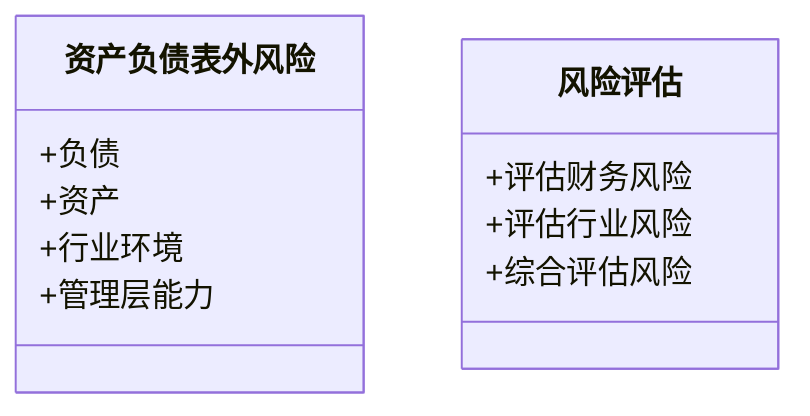
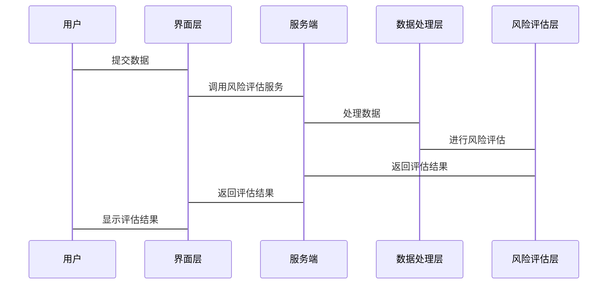

                 


# 彼得林奇如何看待公司的资产负债表外风险

## 关键词：彼得·林奇, 资产负债表外风险, 投资分析, 风险评估, 系统架构

## 摘要：本文从彼得·林奇的投资视角出发，深入分析资产负债表外风险的核心概念、评估方法和实际应用。通过理论与实践结合，帮助读者全面理解资产负债表外风险的影响及其应对策略。

---

# 第一章: 引言

## 1.1 本书的目的与意义

### 1.1.1 为什么关注资产负债表外风险

资产负债表外风险是企业在经营过程中可能面临的重要风险之一，这些风险通常不在企业的财务报表中直接体现，但却可能对企业的财务健康和投资价值产生重大影响。通过分析这些风险，投资者可以更全面地评估企业的财务状况和投资价值。

### 1.1.2 彼得·林奇的投资视角

彼得·林奇作为全球著名投资大师，以其独特的投资风格和对企业的深刻洞察闻名。他特别注重对企业财务状况的分析，尤其是那些不在资产负债表中直接反映的风险因素。通过研究这些风险，投资者可以更好地评估企业的潜在风险和投资机会。

### 1.1.3 本书的核心内容与价值

本文将从彼得·林奇的投资理念出发，系统地分析资产负债表外风险的核心概念、评估方法和应对策略。通过理论与实践相结合，帮助读者全面理解资产负债表外风险的影响，并掌握如何在实际投资中规避和应对这些风险。

---

## 1.2 本书的结构与阅读方法

### 1.2.1 如何阅读本书

建议读者从引言开始，逐步阅读每一章的内容。每章都包含详细的理论分析和实际案例，帮助读者更好地理解和应用所学知识。此外，书末还提供了扩展阅读材料，供读者深入研究。

### 1.2.2 本书的章节安排

本书共分为六章，内容涵盖资产负债表外风险的定义、彼得·林奇的投资视角、风险评估方法、系统架构设计、实战案例分析以及总结与展望。

### 1.2.3 读者的背景与预期

本文适合有一定投资知识的读者，尤其是对彼得·林奇投资理念感兴趣的投资爱好者和专业投资者。通过阅读本文，读者将能够更好地理解资产负债表外风险的评估方法，并在实际投资中加以应用。

---

# 第二章: 背景介绍

## 2.1 资产负债表外风险的定义与背景

### 2.1.1 什么是资产负债表外风险

资产负债表外风险是指那些不在企业资产负债表中直接反映，但可能对企业财务状况和经营成果产生重大影响的风险。这些风险通常包括法律风险、声誉风险、市场风险等。

### 2.1.2 资产负债表外风险的分类

资产负债表外风险可以分为以下几类：
1. **法律风险**：因法律诉讼、合规问题等可能对企业造成的财务损失。
2. **声誉风险**：因企业声誉受损可能影响其市场地位和业务发展的风险。
3. **市场风险**：因市场波动可能对企业经营成果造成的影响。
4. **流动性风险**：企业因资金流动性不足可能面临的财务危机。

### 2.1.3 资产负债表外风险的特征

- 隐含性：这些风险通常不直接体现在财务报表中，具有隐蔽性。
- 复杂性：涉及多个领域，如法律、市场、声誉等，具有交叉性。
- 突发性：某些风险可能在短时间内迅速爆发，具有不可预测性。

---

## 2.2 彼得·林奇与资产负债表外风险

### 2.2.1 彼得·林奇的投资理念

彼得·林奇强调对企业基本面的深入分析，尤其是对财务报表的细致审查。他认为，企业的财务状况是评估其投资价值的关键因素。

### 2.2.2 林奇如何看待财务报表

林奇认为，财务报表是评估企业财务健康状况的重要工具。他特别关注企业的负债情况、现金流和盈利能力。

### 2.2.3 林奇对资产负债表外风险的关注点

林奇在其投资分析中，特别关注那些可能影响企业财务健康但不在财务报表中直接反映的因素，如企业的法律纠纷、市场环境变化等。

---

## 2.3 资产负债表外风险的背景

### 2.3.1 当前经济环境下的风险特征

在当前全球经济环境下，企业面临的风险更加复杂多样。例如，全球化的背景下，企业的供应链可能受到国际政治经济环境的影响。

### 2.3.2 全球化与资产负债表外风险

全球化使得企业面临更多跨国经营的风险，如汇率波动、国际贸易摩擦等，这些都可能成为资产负债表外风险的重要来源。

### 2.3.3 数字化对企业财务的影响

数字化转型使得企业的数据管理、网络安全等方面面临新的风险。这些风险可能对企业声誉、财务状况产生重大影响。

---

# 第三章: 核心概念与联系

## 3.1 资产负债表外风险的核心要素

### 3.1.1 财务风险

财务风险是指企业在财务方面可能面临的不确定性，如债务违约、现金流断裂等。

### 3.1.2 法律风险

法律风险是指因法律诉讼、合规问题等可能对企业造成的财务损失。

### 3.1.3 声誉风险

声誉风险是指因企业声誉受损可能影响其市场地位和业务发展的风险。

---

## 3.2 资产负债表外风险与其他风险的关系

### 3.2.1 财务风险与经营风险

财务风险与经营风险密切相关。例如，企业的高负债可能导致财务风险增加，进而影响其经营稳定性。

### 3.2.2 资产负债表外风险与市场风险

市场风险是指因市场波动可能对企业经营成果造成的影响。这种风险可能与企业的市场地位、产品竞争力等有关。

### 3.2.3 资产负债表外风险与流动性风险

流动性风险是指企业因资金流动性不足可能面临的财务危机。这种风险可能与企业的融资渠道、资产结构等有关。

---

## 3.3 彼得·林奇视角下的风险评估框架

### 3.3.1 林奇的财务报表分析方法

林奇特别关注企业的负债情况、现金流和盈利能力。他认为，这些指标能够反映企业的财务健康状况。

### 3.3.2 林奇如何识别资产负债表外风险

林奇通过对企业所在行业的分析，识别可能影响企业财务状况的外部风险因素。

### 3.3.3 林奇的风险评估模型

林奇的风险评估模型包括对企业财务状况、行业环境和管理层能力的综合分析。

---

# 第四章: 算法原理讲解

## 4.1 资产负债表外风险评估的算法框架

### 4.1.1 算法概述

本算法旨在通过对企业财务数据和外部环境的综合分析，评估资产负债表外风险。

### 4.1.2 算法输入与输出

- **输入**：企业的财务数据、行业环境数据。
- **输出**：资产负债表外风险的评估结果。

### 4.1.3 算法步骤

1. 收集企业财务数据。
2. 分析企业所在行业环境。
3. 评估资产负债表外风险。

---

## 4.2 算法实现

### 4.2.1 算法步骤

1. 数据收集：收集企业的财务数据和行业环境数据。
2. 数据分析：分析企业的财务状况和行业风险。
3. 风险评估：综合评估资产负债表外风险。

### 4.2.2 代码实现

```python
def assess_outside_risk(finance_data, industry_data):
    # 分析财务数据
    financial_risk = calculate_financial_risk(finance_data)
    # 分析行业数据
    industry_risk = calculate_industry_risk(industry_data)
    # 综合评估风险
    total_risk = financial_risk + industry_risk
    return total_risk
```

---

## 4.3 算法原理的数学模型

### 4.3.1 财务风险模型

$$ financial\_risk = \frac{负债}{资产} \times 100 $$

### 4.3.2 行业风险模型

$$ industry\_risk = \frac{行业波动率}{市场波动率} \times 100 $$

### 4.3.3 总体风险模型

$$ total\_risk = financial\_risk + industry\_risk $$

---

# 第五章: 系统分析与架构设计

## 5.1 系统功能设计

### 5.1.1 领域模型



### 5.1.2 系统架构

```mermaid
container 客户端 {
    service 界面层 {
        component 数据输入
        component 风险评估请求
    }
    service 服务端 {
        component 数据处理
        component 风险评估服务
    }
}
```

### 5.1.3 系统接口设计

- 数据输入接口：用于接收企业的财务数据和行业环境数据。
- 风险评估接口：用于调用风险评估服务，返回风险评估结果。

### 5.1.4 系统交互设计



---

# 第六章: 项目实战

## 6.1 环境安装

- 需要安装Python和相关库（如pandas、numpy）。

## 6.2 系统核心实现源代码

```python
def calculate_financial_risk(finance_data):
    # 计算财务风险
    return (finance_data['负债'] / finance_data['资产']) * 100

def calculate_industry_risk(industry_data):
    # 计算行业风险
    return (industry_data['行业波动率'] / industry_data['市场波动率']) * 100

def assess_outside_risk(finance_data, industry_data):
    financial_risk = calculate_financial_risk(finance_data)
    industry_risk = calculate_industry_risk(industry_data)
    total_risk = financial_risk + industry_risk
    return total_risk
```

## 6.3 代码应用解读与分析

通过上述代码，我们可以计算企业的财务风险和行业风险，并综合评估资产负债表外风险。

## 6.4 实际案例分析

以某企业为例，假设其财务数据和行业环境数据已知，我们可以调用上述函数进行风险评估。

## 6.5 项目小结

通过本项目，我们掌握了资产负债表外风险的评估方法，并能够将其应用于实际投资分析中。

---

# 第七章: 总结

## 7.1 最佳实践 tips

- 在投资分析中，应综合考虑财务风险和行业风险。
- 定期评估企业的资产负债表外风险，及时调整投资策略。

## 7.2 小结

本文从彼得·林奇的投资视角出发，系统地分析了资产负债表外风险的核心概念、评估方法和应对策略。通过理论与实践相结合，帮助读者全面理解资产负债表外风险的影响，并掌握如何在实际投资中规避和应对这些风险。

## 7.3 注意事项

- 风险评估结果仅供参考，实际投资需结合更多因素。
- 定期更新数据，保持评估结果的有效性。

## 7.4 拓展阅读

建议读者阅读彼得·林奇的其他著作，深入理解他的投资理念。

---

# 作者：AI天才研究院/AI Genius Institute & 禅与计算机程序设计艺术/Zen And The Art of Computer Programming

