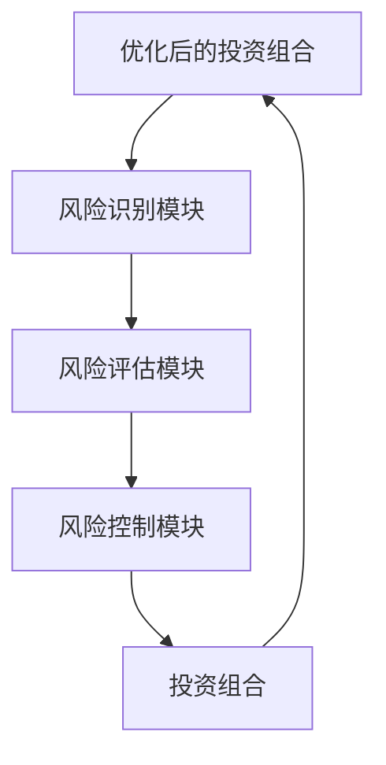

                 


# 彼得林奇如何看待公司的风险管理策略

> 关键词：风险管理，彼得林奇，投资策略，价值投资，安全边际

> 摘要：本文将探讨彼得林奇如何将风险管理融入其投资策略中。通过分析风险识别、风险评估、风险控制的核心要素，结合具体的数学模型和实际案例，深入解读彼得林奇的风险管理哲学。我们将从风险管理的基本概念出发，逐步分析其在投资组合管理中的应用，最后结合系统架构设计和项目实战，总结风险管理策略的最佳实践。

---

## 第一部分: 背景介绍

### 第1章: 风险管理的核心概念

#### 1.1 问题背景与问题描述
- **1.1.1 风险管理的基本概念**  
  风险管理是通过识别、评估和控制潜在的不确定性，以实现目标的过程。在投资领域，风险管理是确保投资组合免受重大损失的关键。  
  **问题背景**：投资市场的不确定性使得风险管理成为投资者必须面对的核心问题。投资者需要在追求收益的同时，控制可能的损失。  
  **问题描述**：如何在复杂的投资环境中，准确识别风险，制定有效的控制策略，以实现长期稳健的回报？

- **1.1.2 彼得林奇投资理念与风险管理的关联**  
  彼得林奇是价值投资的代表人物，他的投资理念强调安全边际和长期稳健的回报。他将风险管理视为投资决策的核心，认为只有在可控风险范围内，才能实现长期收益。  
  **关联点**：  
  - 风险厌恶与投资组合优化  
  - 安全边际与风险管理的结合  
  - 分散投资与风险控制  

- **1.1.3 风险管理在企业中的重要性**  
  企业风险管理不仅仅是投资组合的问题，还涉及公司战略、运营和财务决策。彼得林奇的管理理念对企业的风险管理策略具有重要的借鉴意义。  
  **重要性**：  
  - 保障企业长期稳健发展  
  - 提升投资者信心  
  - 降低经营中的不确定性  

#### 1.2 问题解决与边界外延
- **1.2.1 风险管理的目标与范围**  
  - **目标**：通过风险识别、评估和控制，实现投资收益的最大化。  
  - **范围**：涵盖投资组合的各个阶段，包括资产配置、个股选择和交易执行。  
- **1.2.2 风险管理的核心要素与组成**  
  - **核心要素**：风险识别、风险评估、风险控制  
  - **组成**：资产配置、分散投资、安全边际  
- **1.2.3 风险管理的边界与限制**  
  - **边界**：风险管理不能消除风险，只能降低其影响。  
  - **限制**：在复杂的投资环境中，风险管理的效果受到市场波动和投资者行为的影响。

---

## 第二部分: 核心概念与联系

### 第2章: 彼得林奇的风险管理策略

#### 2.1 彼得林奇投资理念的核心要素
- **2.1.1 价值投资与风险管理的关系**  
  价值投资强调以低于内在价值的价格买入优质资产。彼得林奇认为，风险管理的核心是识别那些具有安全边际的股票。  
  **关系**：  
  - 安全边际是风险管理的核心工具。  
  - 价值投资通过安全边际降低投资风险。  

- **2.1.2 彼得林奇的选股标准与风险管理**  
  彼得林奇注重企业的基本面分析，寻找那些具有稳定收益和良好管理的公司。他将这些因素作为风险管理的重要指标。  
  **选股标准**：  
  - 低市盈率  
  - 高股息率  
  - 强大的财务状况  

- **2.1.3 风险厌恶与投资组合的优化**  
  彼得林奇的投资组合优化策略强调分散投资，通过持有多种股票降低特定风险。他将风险厌恶与收益最大化相结合，构建稳健的投资组合。  
  **优化策略**：  
  - 分散投资：通过持有不同行业的股票降低行业风险。  
  - 定期再平衡：根据市场变化调整投资组合。  

#### 2.2 风险管理的核心原则
- **2.2.1 分散投资与风险控制**  
  分散投资是彼得林奇风险管理的核心策略。他通过持有多种股票，降低单一股票对投资组合的影响。  
  **实现方式**：  
  - 持股分散：避免过度集中于某一行业或公司。  
  - 定期调整：根据市场变化优化投资组合。  

- **2.2.2 安全边际与风险管理**  
  安全边际是彼得林奇风险管理的核心工具。他通过购买价格低于内在价值的股票，确保投资的安全性。  
  **计算公式**：  
  $$ 安全边际 = 内在价值 - 市场价格 $$  
  **应用**：  
  - 选择具有较大安全边际的股票。  
  - 定期评估安全边际的变化。  

- **2.2.3 风险与收益的平衡**  
  彼得林奇强调在风险可控的前提下追求收益。他通过长期持有优质股票，实现收益与风险的平衡。  
  **平衡策略**：  
  - 长期投资：通过时间分散市场波动风险。  
  - 价值投资：通过安全边际降低下行风险。  

---

## 第三部分: 算法原理

### 第3章: 风险管理的算法实现

#### 3.1 风险识别与评估的算法流程
- **3.1.1 风险识别的步骤**  
  1. 收集市场数据：包括股票价格、财务指标等。  
  2. 分析财务状况：评估公司的盈利能力、资产负债情况等。  
  3. 识别潜在风险：根据财务指标和市场趋势，识别可能的风险因素。  

- **3.1.2 风险评估的数学模型**  
  使用风险价值（VaR）模型评估投资组合的风险。  
  $$ VaR = \mu + z \cdot \sigma $$  
  其中，$\mu$ 是平均回报率，$z$ 是标准正态分布的分位数，$\sigma$ 是标准差。  

- **3.1.3 风险控制的优化算法**  
  使用均值-方差优化算法，构建最优投资组合。  
  $$ \min \sigma^2 \quad \text{subject to} \quad \mu \geq \text{目标收益} $$  

#### 3.2 算法实现与代码解读
- **3.2.1 风险评估函数的实现**  
  ```python
  def calculate VaR(returns, confidence_level):
      sorted_returns = sorted(returns)
      z = norm.ppf(confidence_level)
      mu = np.mean(returns)
      sigma = np.std(returns)
      VaR = mu + z * sigma
      return VaR
  ```

- **3.2.2 优化算法的实现**  
  ```python
  def optimize_portfolio(returns, weights):
      covariance_matrix = returns.cov()
      objective = Minimize portfolio_variance(weights, covariance_matrix)
      constraints = [{'type': 'eq', 'fun': lambda w: sum(w) - 1}]
      result = minimize(objective, weights, constraints)
      return result.x
  ```

---

## 第四部分: 系统分析与架构设计

### 第4章: 系统架构设计

#### 4.1 系统功能设计
- **4.1.1 风险识别模块**  
  - 收集市场数据：股票价格、财务指标等。  
  - 分析财务状况：评估公司的盈利能力、资产负债情况等。  

- **4.1.2 风险评估模块**  
  - 使用VaR模型评估投资组合的风险。  
  - 计算安全边际。  

- **4.1.3 风险控制模块**  
  - 优化投资组合。  
  - 定期再平衡投资组合。  

#### 4.2 系统架构图


---

## 第五部分: 项目实战

### 第5章: 项目实战与案例分析

#### 5.1 项目环境安装
- **安装必要的库**：  
  ```bash
  pip install numpy pandas matplotlib
  ```

#### 5.2 核心实现代码
- **风险评估函数**  
  ```python
  import numpy as np
  from scipy.stats import norm

  def calculate VaR(returns, confidence_level):
      sorted_returns = sorted(returns)
      z = norm.ppf(confidence_level)
      mu = np.mean(returns)
      sigma = np.std(returns)
      VaR = mu + z * sigma
      return VaR
  ```

- **优化算法实现**  
  ```python
  from scipy.optimize import minimize

  def optimize_portfolio(returns, weights):
      covariance_matrix = returns.cov()
      def portfolio_variance(weights, covariance_matrix):
          return (weights.T @ covariance_matrix @ weights).item()
      objective = lambda weights: portfolio_variance(weights, covariance_matrix)
      constraints = [{'type': 'eq', 'fun': lambda w: sum(w) - 1}]
      result = minimize(objective, weights, constraints)
      return result.x
  ```

#### 5.3 案例分析与解读
- **案例分析**：假设一个投资组合包含10只股票，计算VaR并优化投资组合。  
- **代码解读**：通过代码实现风险评估和优化，展示如何在实际中应用彼得林奇的风险管理策略。

---

## 第六部分: 最佳实践

### 第6章: 最佳实践与小结

#### 6.1 项目小结
- 彼得林奇的风险管理策略强调安全边际和分散投资。  
- 通过数学模型和算法实现，可以更好地量化风险并优化投资组合。  

#### 6.2 注意事项
- 风险管理不能完全消除风险，只能降低其影响。  
- 定期监控和调整投资组合是关键。  

#### 6.3 拓展阅读
- 《彼得林奇的投资哲学》  
- 《风险管理与投资组合优化》  

---

作者：AI天才研究院/AI Genius Institute & 禅与计算机程序设计艺术 /Zen And The Art of Computer Programming

