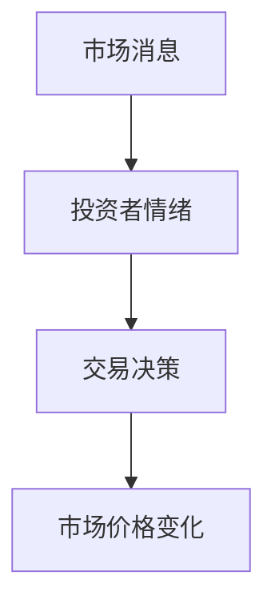

                 

# 彼得·林奇如何看待市场消息

> 关键词：彼得·林奇，市场消息，投资分析，技术分析，基本面分析

> 摘要：本文从彼得·林奇的投资哲学出发，详细探讨了他如何看待市场消息，包括市场消息的分类与分析方法、技术分析与基本面分析在投资决策中的应用，以及如何结合这些方法做出明智的投资决策。

---

# 第一部分: 投资分析与市场消息解读基础

## 第1章: 投资分析的基本概念与彼得·林奇的投资哲学

### 1.1 投资的基本概念
投资是一种将资金投入特定资产以期获得收益的行为。投资者通过购买股票、债券或其他金融资产，期望在资产价值增长或收益分配中获利。投资的基本概念包括风险与收益的平衡、资产配置以及市场参与者的角色。

**核心概念对比表：**

| 概念       | 描述                                           |
|------------|-----------------------------------------------|
| 股票       | 代表公司所有权的证券                           |
| 债券       | 债务工具，承诺按期支付利息和本金               |
| 投资组合   | 多种资产的组合，以分散风险和提高收益           |
| 风险       | 投资可能遭受损失的可能性                       |

### 1.2 彼得·林奇的投资哲学
彼得·林奇是美国著名的投资经理，以其在富达投资管理公司的成就闻名。他的投资哲学强调长期投资、深入研究和避免短期市场波动的干扰。

#### 1.2.1 彼得·林奇的生平简介
彼得·林奇在富达公司管理麦哲伦基金期间，取得了卓越的业绩，被称为“最伟大的基金经理”。他的成功在于他对市场的深刻理解以及对投资组合的精心管理。

#### 1.2.2 林奇的投资理念与方法
林奇强调基本面分析和长期投资，认为市场消息往往被过度解读，投资者应关注公司的基本面，而非短期市场波动。

### 1.3 市场消息对投资的影响
市场消息是影响投资者决策的重要因素，包括公司公告、宏观经济数据、行业动态和政策法规等。

**市场消息对投资者决策的影响分析图：**

林奇认为市场消息并非总是可靠的，投资者应结合长期趋势和公司基本面进行分析。

---

## 第2章: 市场消息的分类与分析方法

### 2.1 市场消息的分类
市场消息可以分为公司公告、宏观经济数据、行业动态和政策法规四大类。

#### 2.1.1 公司公告
公司公告包括业绩报告、并购消息和管理层变动等，这些消息直接影响公司的市场价值。

#### 2.1.2 宏观经济数据
宏观经济数据如GDP增长率和通胀数据，影响整体市场环境。

#### 2.1.3 行业动态
行业动态如新技术的应用和政策变化，影响特定行业的表现。

#### 2.1.4 政策法规
政策法规如税收政策和监管变化，对市场产生深远影响。

### 2.2 市场消息的分析方法
分析市场消息的方法包括定量分析和定性分析。

#### 2.2.1 定量分析法
定量分析通过数学模型评估市场消息的影响，例如使用回归分析预测市场反应。

#### 2.2.2 定性分析法
定性分析侧重于消息的性质和潜在影响，例如政策变化对行业的影响。

---

## 第3章: 技术分析与市场消息

### 3.1 技术分析的基本概念
技术分析通过分析历史价格和成交量数据预测未来市场走势，常用工具包括K线图和移动平均线。

#### 3.1.1 技术分析的优缺点
优点：提供短期市场趋势的信号；缺点：忽视公司基本面因素。

### 3.2 市场消息对技术分析的影响
市场消息如公司公告可能引发价格波动，技术分析师需结合消息分析价格走势。

---

## 第4章: 基本面分析与市场消息

### 4.1 基本面分析的基本概念
基本面分析侧重于评估公司的财务状况和行业地位，常用指标包括市盈率和ROE。

#### 4.1.1 基本面分析的优缺点
优点：提供长期投资依据；缺点：需要大量数据和深入研究。

### 4.2 市场消息对基本面分析的影响
市场消息如宏观经济数据影响公司的盈利能力和行业前景。

---

## 第5章: 综合分析与市场消息

### 5.1 综合分析的基本概念
综合分析结合技术分析和基本面分析，提供全面的投资决策依据。

### 5.2 综合分析在市场消息中的应用
通过综合分析，投资者可以更好地理解市场消息的影响，制定合理的投资策略。

---

## 第6章: 项目实战与最佳实践

### 6.1 环境安装与数据准备
投资者需安装必要的金融分析软件，收集相关市场数据。

### 6.2 核心实现与代码示例
使用Python编写代码，结合市场消息和数据分析进行投资决策。

### 6.3 案例分析与详细解读
通过具体案例分析，展示如何结合市场消息进行投资决策。

### 6.4 最佳实践与注意事项
投资者应结合市场消息和公司基本面进行分析，避免过度依赖单一方法。

---

## 第7章: 小结与展望

彼得·林奇的投资哲学强调基本面分析和长期投资，市场消息的解读需结合公司基本面和长期趋势。投资者应避免过度解读短期消息，注重深入研究和长期策略。

---

# 作者：AI天才研究院  
# Zen And The Art of Computer Programming

