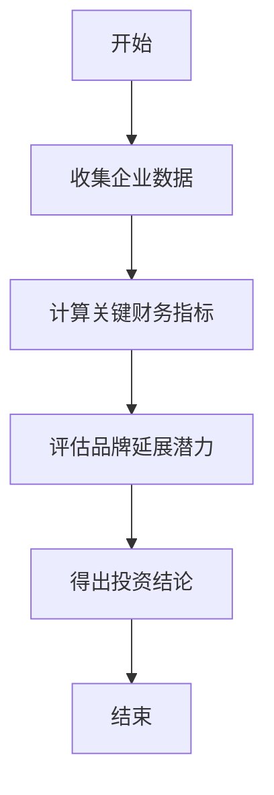

                 


---

# 彼得林奇如何评估公司的品牌延展策略

## 关键词：彼得·林奇，品牌延展策略，投资策略，企业成长，财务指标

## 摘要：  
本文将详细探讨彼得·林奇如何评估公司的品牌延展策略。通过分析品牌延展的核心概念、评估维度、算法原理以及实际案例，本文将揭示彼得·林奇独特的投资逻辑，并为企业在品牌延展过程中提供有价值的启示。

---

# 第一部分: 品牌延展策略的背景与核心概念

## 第1章: 品牌延展策略的定义与重要性

### 1.1 品牌延展策略的定义

- **品牌延展的定义**  
  品牌延展是指企业在现有品牌的基础上，将其扩展到新的产品、市场或领域，以实现更大的市场影响力和利润增长。

- **品牌延展的重要性**  
  品牌延展能够帮助企业拓展市场、提高品牌知名度、降低市场进入成本，并为公司创造新的增长点。

- **彼得·林奇与品牌延展**  
  彼得·林奇作为投资大师，特别关注那些能够通过品牌延展实现持续增长的企业。他认为，成功的品牌延展策略是企业长期成长的重要驱动力。

### 1.2 彼得·林奇的投资理念

- **成长股投资**  
  彼得·林奇专注于投资那些具有持续增长潜力的公司，尤其是那些能够通过品牌延展实现业务扩张的企业。

- **品牌延展的核心要素**  
  林奇认为，品牌延展的关键在于企业的市场地位、财务健康状况和管理团队的战略能力。

- **品牌延展与企业成长的关系**  
  品牌延展不仅是企业成长的结果，也是企业成长的推动力。通过品牌延展，企业能够进入新的市场，吸引更多的消费者。

### 1.3 品牌延展策略的背景分析

- **市场环境的影响**  
  当前市场环境下，品牌延展策略的重要性日益凸显。企业需要通过品牌延展来应对激烈的市场竞争。

- **品牌延展的行业差异**  
  不同行业的品牌延展策略有所不同。例如，科技公司更注重技术创新，而消费品公司则更关注市场推广。

---

## 第2章: 品牌延展策略的核心要素

### 2.1 品牌延展的分类与特征

- **品牌延展的分类**  
  - **横向延展**：扩展到新的产品类别或市场。
  - **纵向延展**：深入现有市场，推出更高端或更低端的产品。
  - **联合延展**：与其他品牌合作，推出联合产品。

- **品牌延展的特征对比**  
  | 特征 | 横向延展 | 纵向延展 | 联合延展 |
  |------|----------|----------|----------|
  | 风险 | 高       | 中       | 中高     |
  | 成本 | 高       | 低       | 中       |
  | 周期 | 长       | 中       | 中       |

### 2.2 彼得·林奇评估品牌延展的维度

- **市场地位与品牌影响力**  
  林奇关注企业的市场占有率、品牌知名度和消费者忠诚度。

- **财务表现与盈利能力**  
  他通过分析企业的财务数据，如ROE（净资产收益率）、ROA（资产回报率）等指标，评估品牌延展的可行性。

- **管理团队与战略规划**  
  林奇认为，优秀的管理团队和清晰的战略规划是品牌延展成功的关键。

### 2.3 品牌延展策略的ER实体关系图

```mermaid
er
actor: 投资者
actor -|> strategy: 品牌延展策略
actor -|> company: 企业
strategy -|> brand_extension: 品牌延展
company -|> financial_data: 财务数据
company -|> market_position: 市场地位
```

---

## 第3章: 品牌延展策略的算法原理与数学模型

### 3.1 算法原理概述

- **基于财务指标的评估模型**  
  通过分析企业的ROE、ROA等指标，评估品牌延展的盈利能力。

- **基于市场表现的评估模型**  
  结合企业的市场份额和品牌影响力，评估品牌延展的市场潜力。

- **基于管理能力的评估模型**  
  通过分析管理团队的能力和战略规划，评估品牌延展的可行性。

### 3.2 算法流程图



### 3.3 数学模型与公式

- **ROE公式**  
  $$ROE = \frac{\text{净利润}}{\text{平均股东权益}}$$

- **ROA公式**  
  $$ROA = \frac{\text{净利润}}{\text{平均总资产}}$$

- **品牌延展潜力评估公式**  
  $$\text{品牌延展潜力} = \text{ROE} \times \text{市场份额} \times \text{品牌影响力}$$

---

## 第4章: 项目实战

### 4.1 实际案例分析

- **案例：可口可乐的品牌延展**  
  可口可乐通过推出新口味饮料和跨界合作，成功实现了品牌延展。

- **案例：星巴克的品牌延展**  
  星巴克通过开设新门店和推出咖啡周边产品，拓展了品牌影响力。

### 4.2 代码实现

```python
# 示例代码：计算ROE和ROA
def calculate_roe(net_profit, avg_equity):
    return net_profit / avg_equity

def calculate_roa(net_profit, avg_assets):
    return net_profit / avg_assets

# 示例数据
net_profit = 100  # 净利润
avg_equity = 500  # 平均股东权益
avg_assets = 800  # 平均总资产

# 计算ROE和ROA
roe = calculate_roe(net_profit, avg_equity)
roa = calculate_roa(net_profit, avg_assets)

print(f"ROE: {roe:.2f}, ROA: {roa:.2f}")
```

### 4.3 代码解读

- **代码功能**  
  该代码用于计算企业的ROE和ROA，帮助评估品牌延展的潜力。

- **输入参数**  
  净利润、平均股东权益和平均总资产是计算的关键参数。

- **输出结果**  
  ROE和ROA的值可以帮助投资者评估企业的盈利能力。

---

## 第5章: 总结与展望

### 5.1 总结

- 彼得·林奇通过关注企业的市场地位、财务表现和管理能力，评估品牌延展的潜力。
- 品牌延展是企业成长的重要驱动力，投资者需要结合多种因素进行综合评估。

### 5.2 注意事项

- 投资者在评估品牌延展时，应关注企业的财务健康状况和市场环境。
- 品牌延展并非一蹴而就，需要长期的投入和管理。

### 5.3 拓展阅读

- 《彼得·林奇的投资哲学》
- 《品牌管理与品牌延展》

---

# 作者：AI天才研究院 & 禅与计算机程序设计艺术

---

通过以上思考过程，我们可以清晰地看到彼得·林奇如何评估公司的品牌延展策略。从定义到算法，从案例到代码，我们逐步深入分析了这一过程，并为读者提供了丰富的细节和实用的工具。

