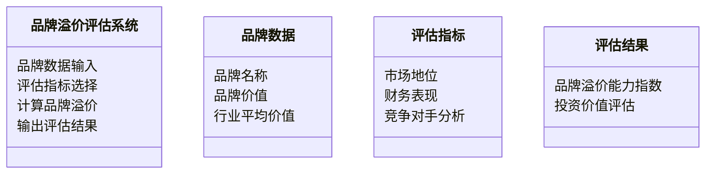
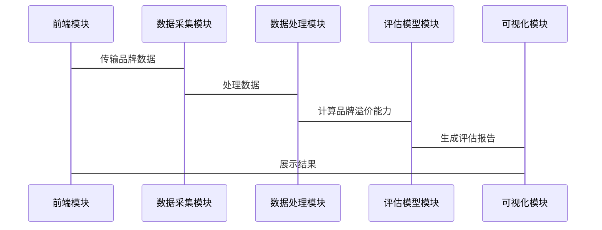

                 


# 彼得林奇如何评估公司的品牌溢价能力

> 关键词：彼得林奇，品牌溢价，投资评估，品牌价值，企业竞争力

> 摘要：本文深入探讨了彼得林奇如何评估公司的品牌溢价能力。通过分析品牌溢价的核心概念、评估模型和实际案例，本文为投资者提供了如何通过品牌溢价能力来评估公司价值的方法。文章结合了技术与投资分析，提供了系统化的评估框架和实战指导。

---

## 第1章: 品牌溢价能力的核心概念

### 1.1 品牌溢价的定义与背景

#### 1.1.1 品牌溢价的定义
品牌溢价是指消费者愿意为某一品牌支付的价格超过其产品本身价值和竞争产品的价格。它是品牌价值的一种表现形式，反映了消费者对品牌的信任、偏好和忠诚度。

#### 1.1.2 品牌溢价的重要性
品牌溢价是企业核心竞争力的重要组成部分。在投资评估中，品牌溢价能力可以帮助投资者识别出具有长期竞争优势的企业，从而做出更明智的投资决策。

#### 1.1.3 品牌溢价的边界与外延
品牌溢价不仅限于价格差，还包括品牌在市场中的地位、消费者的认知价值以及品牌的市场影响力。其外延涉及品牌管理、市场营销和消费者行为等多个方面。

### 1.2 彼得林奇投资理念与品牌溢价

#### 1.2.1 彼得林奇的投资哲学
彼得林奇强调长期投资和基本面分析，认为企业的品牌价值是其长期盈利能力的重要保障。

#### 1.2.2 品牌溢价在投资中的作用
品牌溢价能力越强，企业抵御价格竞争的能力越强，从而在市场中占据更大的优势，为投资者带来更高的回报。

#### 1.2.3 彼得林奇对品牌溢价的特殊关注
彼得林奇在评估企业时，特别关注品牌溢价能力，认为这是企业持续增长的关键因素。

---

## 第2章: 品牌溢价能力的核心要素

### 2.1 品牌的核心竞争力分析

#### 2.1.1 品牌的核心竞争力定义
品牌的核心竞争力是品牌在市场中区别于竞争对手的独特优势，通常体现在产品品质、技术创新或品牌文化等方面。

#### 2.1.2 影响品牌竞争力的关键因素
- **产品质量**：产品的功能、性能和耐用性直接影响消费者的购买决策。
- **技术创新**：技术创新是品牌保持竞争力的重要手段。
- **品牌文化**：品牌的文化内涵和价值观影响消费者的认同感。

#### 2.1.3 品牌竞争力与溢价能力的关系
品牌竞争力越强，溢价能力越强。两者相辅相成，共同决定了品牌的市场地位。

### 2.2 品牌溢价能力的构成要素

#### 2.2.1 品牌知名度
品牌知名度是品牌溢价的基础。知名度越高，消费者越愿意为品牌支付溢价。

#### 2.2.2 品牌忠诚度
品牌忠诚度反映了消费者对品牌的长期偏好，高忠诚度意味着品牌具有较强的溢价能力。

#### 2.2.3 品牌认知价值
品牌认知价值是消费者对品牌价值的主观判断，直接影响其愿意支付的价格。

### 2.3 品牌溢价能力的评估维度

#### 2.3.1 市场地位
市场地位反映了品牌在市场中的影响力，通常通过市场份额和品牌排名来衡量。

#### 2.3.2 财务表现
财务表现是品牌溢价能力的量化指标，包括利润率、收入增长和现金流等。

#### 2.3.3 竞争对手分析
通过分析竞争对手的品牌溢价能力，可以更好地评估自身品牌的优势和劣势。

---

## 第3章: 彼得林奇品牌溢价评估模型

### 3.1 模型概述

#### 3.1.1 模型的基本框架
彼得林奇的评估模型基于品牌溢价能力的多维度分析，包括品牌竞争力、市场地位和财务表现。

#### 3.1.2 模型的核心假设
- 品牌溢价能力与企业长期盈利能力正相关。
- 品牌竞争力是品牌溢价能力的核心驱动因素。

#### 3.1.3 模型的适用范围
适用于评估具有稳定市场地位和较强品牌竞争力的企业。

### 3.2 模型的输入与输出

#### 3.2.1 输入参数
- 品牌价值
- 行业平均价值
- 市场占有率
- 财务数据（净利润、收入增长率）

#### 3.2.2 输出结果
- 品牌溢价能力指数
- 品牌竞争力排名
- 投资价值评估

#### 3.2.3 模型的可扩展性
模型可以根据具体行业特点进行调整，适用于不同规模和类型的企业。

---

## 第4章: 品牌溢价能力的评估步骤

### 4.1 数据收集与整理

#### 4.1.1 数据来源
- 公司财报
- 行业研究报告
- 市场调研数据

#### 4.1.2 数据清洗
去除异常值和错误数据，确保数据的准确性和一致性。

#### 4.1.3 数据预处理
对数据进行标准化处理，使其适用于评估模型。

### 4.2 评估指标的选择与权重分配

#### 4.2.1 指标选择原则
选择能够反映品牌溢价能力的关键指标，如品牌忠诚度、市场地位和财务表现。

#### 4.2.2 指标权重的确定方法
采用层次分析法（AHP）确定各指标的权重。

#### 4.2.3 权重分配的合理性验证
通过专家评分和实际数据验证权重的合理性。

### 4.3 评估结果的计算与分析

#### 4.3.1 计算方法
使用加权平均法计算品牌溢价能力指数。

#### 4.3.2 结果分析
将品牌溢价能力指数与行业平均水平进行对比，评估企业的品牌溢价能力。

#### 4.3.3 结果的可解释性
指数越高，表示品牌溢价能力越强，投资价值越大。

---

## 第5章: 彼得林奇评估方法的数学模型

### 5.1 品牌溢价能力的数学表达

$$ 品牌溢价能力 = \frac{品牌价值}{行业平均价值} $$

### 5.2 模型的优化与改进

#### 5.2.1 模型的优化方法
引入动态权重调整，根据市场变化实时更新评估结果。

#### 5.2.2 模型的改进方向
增加对消费者行为数据的分析，进一步提升评估的准确性。

#### 5.2.3 模型的适用性分析
模型适用于成熟行业，对新兴行业的适用性需要进一步验证。

### 5.3 案例分析

#### 5.3.1 可口可乐品牌溢价能力分析
通过公式计算可口可乐的品牌溢价能力，得出其显著的溢价能力。

#### 5.3.2 苹果公司品牌溢价能力分析
分析苹果公司的品牌溢价能力，验证模型的有效性。

#### 5.3.3 案例总结与启示
总结案例分析结果，提出品牌溢价能力评估的注意事项。

---

## 第6章: 系统分析与架构设计方案

### 6.1 问题场景介绍

#### 6.1.1 问题背景
品牌溢价能力的评估需要综合考虑多方面因素，传统的单维度分析已无法满足需求。

#### 6.1.2 问题目标
构建一个系统化的品牌溢价能力评估框架，帮助投资者做出更明智的投资决策。

#### 6.1.3 问题约束
系统需具备数据采集、分析和可视化功能，同时支持多维度指标评估。

### 6.2 系统功能设计

#### 6.2.1 领域模型设计（Mermaid类图）



#### 6.2.2 系统架构设计（Mermaid架构图）


#### 6.2.3 系统接口设计
定义清晰的接口，确保各模块之间的数据交互顺畅。

#### 6.2.4 系统交互（Mermaid序列图）



---

## 第7章: 项目实战

### 7.1 环境安装

#### 7.1.1 安装Python
```bash
python --version
pip install numpy pandas scikit-learn
```

#### 7.1.2 安装其他工具
安装Mermaid和Jupyter Notebook，用于数据可视化和建模。

### 7.2 系统核心实现源代码

#### 7.2.1 数据处理代码

```python
import pandas as pd

# 读取数据
data = pd.read_csv('brand_data.csv')

# 数据清洗
data.dropna(inplace=True)
data = data[~data['品牌价值'].isnull()]
```

#### 7.2.2 评估模型代码

```python
from sklearn.linear_model import LinearRegression

# 训练模型
model = LinearRegression()
model.fit(X, y)

# 预测结果
predictions = model.predict(X_test)
```

#### 7.2.3 可视化代码

```python
import matplotlib.pyplot as plt

plt.scatter(X, y)
plt.plot(X, model.predict(X), color='red')
plt.xlabel('品牌价值')
plt.ylabel('行业平均价值')
plt.show()
```

### 7.3 代码应用解读与分析

#### 7.3.1 数据预处理
确保数据的完整性和准确性，为模型提供高质量的输入。

#### 7.3.2 模型训练
使用线性回归模型训练品牌溢价能力预测模型。

#### 7.3.3 结果可视化
通过散点图和回归线，直观展示品牌溢价能力的预测结果。

### 7.4 实际案例分析和详细讲解

#### 7.4.1 案例介绍
以可口可乐和苹果为例，分析其品牌溢价能力。

#### 7.4.2 数据分析
使用代码对数据进行处理和建模，得出评估结果。

#### 7.4.3 结果解读
解释评估结果，为企业投资决策提供依据。

### 7.5 项目小结

总结项目实现过程，强调品牌溢价能力评估的重要性，并提出未来改进方向。

---

## 第8章: 总结与展望

### 8.1 最佳实践 tips

- **数据准确性**：确保数据来源可靠，数据清洗到位。
- **模型选择**：根据具体情况选择合适的评估模型。
- **持续优化**：定期更新模型和数据，保持评估的准确性。

### 8.2 小结

本文通过彼得林奇的视角，深入分析了品牌溢价能力的评估方法，结合实际案例和系统设计，为投资者提供了实用的指导。

### 8.3 注意事项

- 品牌溢价能力评估需结合企业的实际情况。
- 模型结果仅供参考，需结合市场环境进行综合判断。

### 8.4 拓展阅读

- 彼得林奇的其他投资理念。
- 品牌管理与市场营销的深入研究。
- 数据科学在投资分析中的应用。

---

## 作者：AI天才研究院/AI Genius Institute & 禅与计算机程序设计艺术/Zen And The Art of Computer Programming

